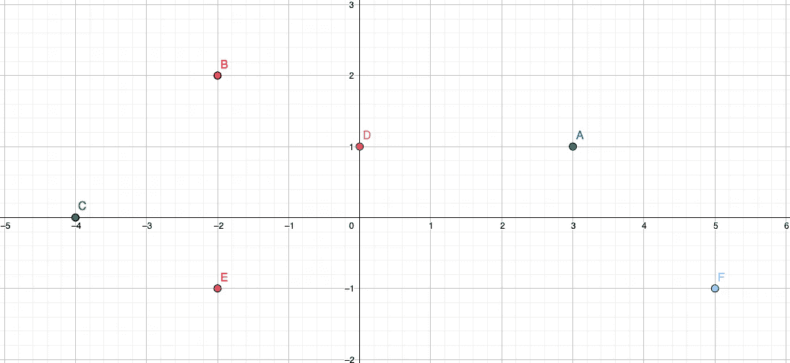

# 如何在 Go 中构建最小/最大堆

> 原文：<https://levelup.gitconnected.com/how-to-build-a-min-max-heap-in-go-5090617a3142>

## 包括一个单元测试的示例面试问题


从 [Unsplash](https://images.unsplash.com/photo-1547637589-f54c34f5d7a4?ixid=MnwxMjA3fDB8MHxwaG90by1wYWdlfHx8fGVufDB8fHx8&ixlib=rb-1.2.1&auto=format&fit=crop&w=1650&q=80)

对于任何软件工程师来说，EAP 都是一个基本的数据结构。不一定是因为你会在工作中用到它，更有可能是因为你需要知道它，以便*得到*一份工作。玩笑归玩笑，我认为对软件工程师来说，熟悉常见的数据结构和算法是很重要的。它们让你思维敏捷，让你成为一个全面的问题解决者。

> 学习 DS & Algorithms 与物理学家或数学家转型成为一名真正优秀的程序员有着相同的好处——不同类型的问题解决技能总是会相互补充！

话虽如此，让我们深入了解一下 Go 中的最小/最大堆。我们将首先通过构造一个堆来理解堆。然后我们会看到为什么堆可以帮助我们用 **K 个最接近原点的点**面试问题来最优地解决某些问题。我们开始吧！

# 在 Go 中创建最小/最大堆

堆是一种数据结构，基本上是二叉树的一种特殊形式。一个重要的行为是堆可以在树的根处维护对象列表*的最小值或最大值。堆可以通过您自己声明的节点对象来表示，或者在数组中表示。这是一个巨大的好处，因为我们可以在没有任何额外内存的情况下执行常见的堆操作。*

## heapify 算法

heapify 操作接受一个随机排序的数组，并给它一个堆的结构。这是什么意思？记住，堆可以被形象地想象成一棵二叉树。我们用索引来表示树中每个节点的左右子节点。下面是我们对每个节点使用的公式:

```
**Root** is at index 0 of the array.
**Left child** of index i is at (2*i + 1).
**Right child** of index i is at (2*i + 2).
**Parent** of index i is at (i-1)/2.**Example**:
Input: []int{4, 12, 3, 6, 5}
Max-Heap: []int{12,6,3,4,5}
        12
       /  \
      6    3
     / \
    4   5
```

请注意，我们实际上并没有对数组进行排序，但是我们给了数组一个堆的属性。**这也不是唯一的堆**，因为我们可以有不同的排序，只要每个父堆的值大于其子堆的值。

现在我们可以转到 heapify 算法。Heapify 会递归地将数组组织成一个堆结构。像对待递归一样，最重要的是关注规则和条件— *尽管画出递归栈对理解也非常有用。*

这个例子是一个最小堆。Heapify 将接受一个指向数组的指针。我们传递一个对数组的引用，因为如果我们不这样做，Go 将在递归堆栈中创建本地副本，我们希望对输入数组的稳定状态进行操作。第二个参数`i`将是我们想要填充的当前索引。

首先，我们将一个新变量`smallest`赋给当前索引，同时根据堆公式分配我们的左右子节点。然后，我们有条件地检查左边的子元素是否在堆的边界内。如果是这样，我们有额外的条件来检查左边孩子的值是否小于`smallest`的值。如果是，我们设置`smallest`等于左边的孩子。

我们对正确的孩子重复同样的过程。

如果我们发现需要对数组进行`heapify`操作，例如`smallest != i`，那么我们交换数组元素`smallest`和当前索引`i`。最后，我们将递归调用`heapify`，为`smallest`传递新值。

> 每个 heapify 操作需要 O(logN)时间，因为我们必须在最坏的情况下筛选树的高度。根据您调用 heapify 的方式，您可以从 O(NlogN)或 O(N)时间复杂度的数组构建一个堆，我们将在下面看到。

如果这仍然令人困惑，这里有一个有用的视频。

## 从数组构建堆

现在我们有了 heapify 算法，我们必须构建一个 helper 方法来调用我们的输入数组。有两种方法可以堆一个数组。要么从堆的根(数组的开头)开始，一直到叶节点，要么从叶节点(数组的结尾)开始，一直到根。

然而，基于数组的堆的最后一个非叶节点是堆的长度除以 2 减 1，这是我们设置的 startIdx。我们从这里开始，因为叶节点不违反堆的属性，它们隐式地大于/小于它们不存在的子节点。

**以这种方式堆化保证我们堆化数组的时间复杂度为 O(N)**,而不是 O(NlogN)。如需进一步解释，请查看以下 StackOverflow 帖子:

[](https://stackoverflow.com/questions/9755721/how-can-building-a-heap-be-on-time-complexity) [## 构建一个堆怎么可能是 O(n)时间复杂度？

### 我认为这个主题中埋藏了几个问题:如何实现 buildHeap，使其在 O(n)时间内运行？怎么…

stackoverflow.com](https://stackoverflow.com/questions/9755721/how-can-building-a-heap-be-on-time-complexity) 

## 从堆中弹出最小/最大元素

我们可以在堆上执行额外的操作，但是我将只解释 pop 函数，因为我们将在示例编码问题中使用它。从堆中弹出将根据你拥有的是最小堆还是最大堆，给出数组中最小或最大的元素。

我们只需要确保在得到根元素后，我们把它从数组中移除并重新填充。

# 一个示例面试问题+单元测试

现在我们已经有了如何给定一个数组构造一个堆的基础，让我们把它应用到一个编码面试问题中。最常见的 K 个问题非常普遍，被大多数面试准备网站标记为中等难度。

## k 个离原点最近的点

给定一个点的 2D 数组，求每个点的欧几里德距离，并返回 k 个离原点最近的点。



回到几何学，你可以用公式`dist = sqrt((x2-x1)² + (y2-y1)²)`求出两点之间的距离。

因为我们在寻找离原点的距离，x1 和 y1 都是零。此外，我们只能得到整数，并保证没有两点到原点的距离是相同的。考虑到这些条件，我们只要利用简化的公式`dist = x² + y²`就可以求出各点的距离。

下面是我们为解决这个问题而调整的代码:

## 单元测试

为了更好地理解这篇文章，让我们添加一些简单的单元测试。总是知道如何测试你的代码和试图破坏它的例子是很重要的。只有三个测试，这远远不够详尽，所以试着自己想出几个测试用例吧！这些测试是在我非常喜欢的 Go 中以表格驱动的测试格式构建的。

如果你做到了这一步，为你提高了编码技能并为下一次技术面试做了更好的准备而感到欣慰。如果您有任何问题，请在下面留下您的评论，非常感谢您的阅读！