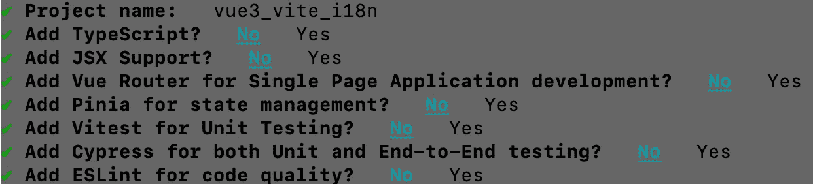
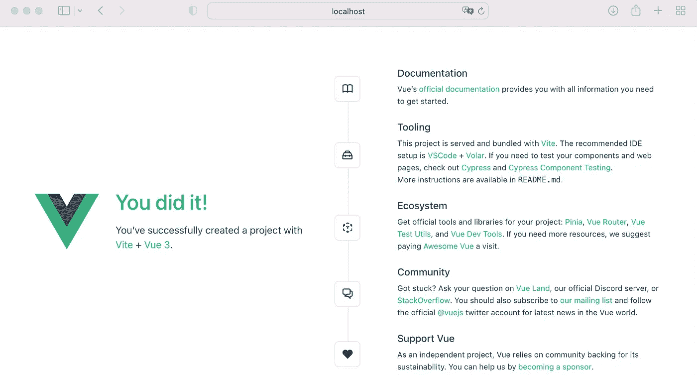

# 如何搭建多语言 Vue 3 + Vite App

> 原文：<https://levelup.gitconnected.com/how-to-build-a-multi-language-vue-3-vite-app-b91c34c46097>


照片由[尼克·费因斯](https://unsplash.com/@jannerboy62?utm_source=unsplash&utm_medium=referral&utm_content=creditCopyText)在 [Unsplash](https://unsplash.com/s/photos/flags?utm_source=unsplash&utm_medium=referral&utm_content=creditCopyText) 上拍摄

# 介绍

Vue 是构建单页面应用程序最广泛使用的框架之一，目前在版本 3 中可用。当您希望您的应用程序被不同国家的用户使用时，一个常见的任务是以不同的语言提供您的应用程序的内容。在 Vue 中，当利用 [*Vue I18n*](https://vue-i18n.intlify.dev) 插件时，这相当容易。但是，如果您还想将语言环境消息存储在单独的文件中，您需要一种在构建过程中预编译这些文件的机制。

# 在本指南中

用 [Vite](https://vitejs.dev/) 设置一个 Vue 3 项目。随后， *Vue I18n* (第 9 版)和[*unpluk in-Vue-I18n*](https://github.com/intlify/bundle-tools/tree/main/packages/unplugin-vue-i18n)*插件三言两语的描述，为了让 app 国际化而安装。该应用程序的一些部分随后被示例性地本地化，以说明如何使用 Vue 的组合 API 和`<script setup>`语法来配置和使用 *Vue I18n* 插件。*

# *先决条件*

*   *对如何使用 Vue 3 + Vite、组合 API 和`<script setup>`语法有基本的了解*
*   *你的机器上已经安装了 node.js*

# *新 Vue 项目*

*在所需的工作目录下打开您的终端，通过执行[文档](https://vuejs.org/guide/quick-start.html#with-build-tools)中描述的以下命令，用 Vite 初始化一个新的 Vue 3 应用程序:*

```
*npm init vue@latest*
```

*你可能会被要求安装官方的 Vue 项目搭建工具`create-vue@latest`。通过键入`y`确认安装，并点击*进入*。接下来，将提示您选择项目名称和可选特性。我将使用`vue3_vite_i18n`作为项目名称。在本指南的上下文中，不需要其他功能。所以，用`No`全部回答。*

**

*创建-vue 设置*

*现在，在您的终端中执行以下命令，导航到项目根文件夹，安装所有依赖项并启动开发服务器:*

```
*cd vue3_vite_i18n
npm install
npm run dev*
```

*然后浏览`[http://127.0.0.1:5173](http://127.0.0.1:5173.)`查看安装是否成功。*

**

*清洁 Vue 3 应用程序*

# *安装 i18n 插件*

*接下来，安装版本 9 的 *Vue I18n* 插件:*

```
*npm install vue-i18n@9*
```

*该插件为您提供了许多本地化 Vue 应用程序的特性，在版本 9 或更高版本中，您也可以使用 Vue 的组合 API 和`<script setup>`语法。*

*此时，您已经可以使用存储在 JavaScript 对象中的语言环境消息来本地化您的应用程序了。但是，更常见的是将区域设置消息存储在单独的文件中。这些文件必须在构建过程中预编译，这可以通过 *unplugin-vue-i18n* 插件来完成。*

*按如下方式安装插件:*

```
*npm install @intlify/unplugin-vue-i18n*
```

# *创建区域设置*

*举一个简单的例子，说明如何用安装的插件本地化 Vue 3 应用程序，我们将提供德语和英语的默认`HelloWorld.vue`组件的`<h1>`和`<h3>`内容。我们想要的是，在单独的语言环境资源文件中托管内容，即一个用于英语内容，一个用于德语内容。*

*在您的项目根目录中创建一个新文件夹`locales/`，它将保存区域资源文件。在`locales/`中创建两个新文件`en.json`和`de.json`。*

*语言环境消息的基本形式是键值对，但也可以是嵌套的或列表格式的(参见[文档](https://vue-i18n.intlify.dev/guide/essentials/syntax.html))。此外， *Vue I18n* 还支持 HTML 格式，这允许我们在区域设置消息中使用 HTML 元素。*

*复制`<HelloWorld.vue>`组件中`<h1>`元素之间的内容，并将其设置为`en.json`文件中*标题*键值。*

*接下来，复制`HelloWorld.vue`组件中`<h3>`元素之间的内容，并将其设置为`en.json`文件中*描述*键的值。该消息包含对于每个区域设置都相同的引用。如果将来某个引用发生了变化，我们将不得不在每个地区手工替换它。幸运的是， *Vue I18n* 插件允许我们将所有地区相同的内容从地区信息中分离出来。我们将利用这个特性并设置占位符，而不是硬编码的引用。对外部资源的最终引用将在本指南后面的`HelloWorld.vue`组件中定义。*

*因此，用占位符`{}`和变量名替换引用，分别为`{viteRef}`和`{vueRef}`。`en.json`文件现在看起来如下:*

*德国`de.json`的对等物具有相同的结构:*

# ***配置***

*在`vite.config.js`中，必须指定语言环境资源文件的路径，以便进行预编译。因此，将`VueI18nPlugin`添加到插件列表中，并在第 10 到 12 行的 *include* 选项下提供语言环境资源文件的路径(不要忘记导入语句):*

*接下来，在`main.js`中，我们需要创建一个 *I18n* 的实例，并在安装 app 之前用`app.use()`安装它。在创建实例时，我们可以设置不同的选项——在下面的`main.js`文件中可以看到一些选项:*

*使用第一个选项`legacy`，您可以控制是否使用组合 API。设置`legacy: false`启用合成 API。`globalInjection: true`允许我们在每个组件中使用所谓的全局 *composer 实例*的属性和方法，而无需通过`useI18n()`函数导入。此外，可以使用`locale`设置默认语言环境，以及当所选语言环境不可用时的备用语言环境(`fallbackLocale`)。可用`availableLocales`设置所有可用语言环境的列表。然后可以用`messages`设置语言环境消息，用于本地化应用程序。 *unplugin-vue-i18n* 插件允许我们用一个单独的 import 语句一次导入所有可能的语言环境资源文件*

# ***用途***

*我们现在将来自`<h1>`和`<h3>`的静态内容本地化到`HelloWorld.vue`组件的模板中。这可以通过利用 *Vue I18n* 的翻译 API`$t`来完成。要本地化`<h1>`，将`{{ msg }}`替换为*

*在它的基本形式中，`$t`需要您想要插入的本地消息的键。在这种情况下`title`。然后，插件将显示当前在全局 *I18n* 实例的`locale`变量中设置的地区信息。*

*现在，通过将第 11 行从`<HelloWorld msg="You did it!">`改为`<HellWorld />`，您可以删除组件的脚本元素中定义的属性，以及传递给`App.vue`组件中的组件的属性。*

*`<h3>`将被一个称为插补的所谓[所取代。这允许我们为本地消息`description`中的命名占位符`{{viteRef}}`和`{vueRef}`赋值。占位符的值将在`HelloWorld.vue`组件的`<script setup>`中定义:](https://vue-i18n.intlify.dev/guide/essentials/syntax.html#named-interpolation)*

*在模板中，我们用以下内容替换`<h3>`:*

*由于消息包含 HTML 元素，我们在`<h3>`元素上使用了`v-html`指令。否则 HTML 元素将作为播放文本输出。在指令的值中，我们用期望的键调用翻译 API `$t`，即`description`。第二个参数是包含两个占位符值的对象。*

*最终的`HelloWorld.vue`组件如下所示:*

*当现在重新构建项目时，使用在`createI18n`函数中定义的默认语言环境，但是用户不能更改。*

# ***区域设置选择***

*HTML `<select>`元素将被用来让用户选择一个不同的地区。因此，在`components/`目录中创建一个新组件`LocaleSelect.vue`，其内容如下:*

*通过`v-model`指令将`<select>`元素的值绑定到全局 *I18n* 实例的`locale`变量。在当前设置中，全局 *I18n* 实例通过`$i18n`变量在每个组件的模板中可用。根据`createI18n`功能中`availableLocales`定义的可用区域设置，使用`v-for`指令生成`<select>`选项。因为`<select>`元素的值被绑定到`locale`变量，所以区域设置会自动更改为用户选择的选项。*

*现在将`LocaleSelect.vue`组件导入到`HelloWorld.vue`组件中，并将`<LocaleSelect />`插入模板中。最终的`HelloWorld.vue`组件如下所示:*

# *运行最终应用程序*

*使用重新生成项目*

```
*npm run dev*
```

*并浏览`http://127.0.0.1:5173`。*

**

*如您所见，区域设置适应于`<select>`元素的选定选项。*

*通过这种实现，所有的语言环境都将被捆绑在主块中。如果你想异步加载特定的语言环境，请阅读我的下一篇文章[如何在 Vue 3 + Vite](/how-to-load-i18n-locales-asynchronously-in-vue-3-vite-9e7301c52f19) 中异步加载 i18n 语言环境，了解如何实现延迟加载 vor *Vue I18n* 。*

# *摘要*

*Vue I18n 插件允许你相当容易地国际化你的 Vue 3 应用程序。此外，插件的第 9 版允许你使用 Vue 的组合 API 和`<script setup>`语法。当在单独的文件中组织语言环境时， *unplugin-vue-i18n* 插件会在使用 Vite 的构建过程中预编译它们。*

# *源代码*

*GitHub: [vue3_vite_i18n](https://github.com/robinkloeckner/vue3_vite_i18n)*

*感谢您的阅读:-)*

# *分级编码*

*感谢您成为我们社区的一员！在你离开之前:*

*   *👏为故事鼓掌，跟着作者走👉*
*   *📰查看[升级编码出版物](https://levelup.gitconnected.com/?utm_source=pub&utm_medium=post)中的更多内容*
*   *🔔关注我们:[Twitter](https://twitter.com/gitconnected)|[LinkedIn](https://www.linkedin.com/company/gitconnected)|[时事通讯](https://newsletter.levelup.dev)*

*🚀👉 [**加入升级人才集体，找到一份神奇的工作**](https://jobs.levelup.dev/talent/welcome?referral=true)*