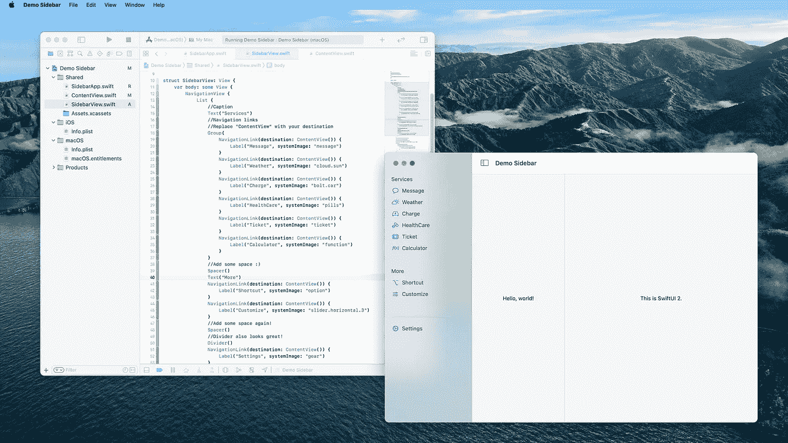
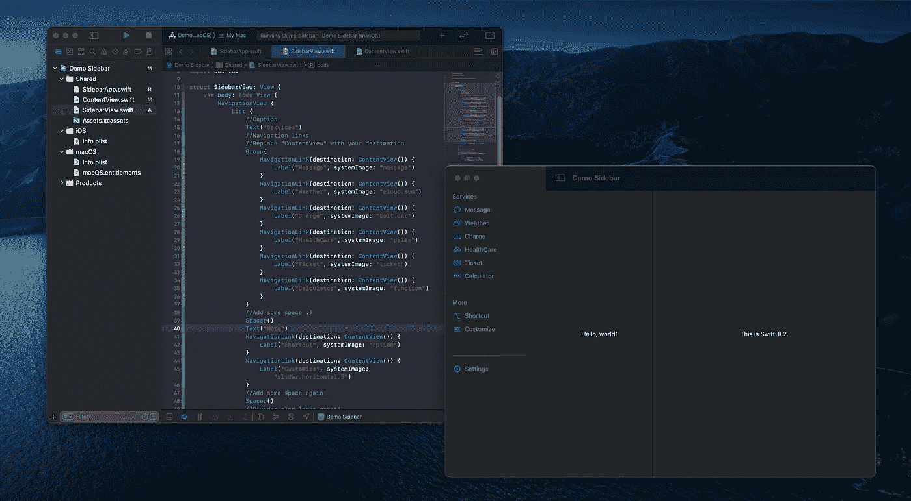

# 如何:为 SwiftUI 2 (2020)构建本机切换侧栏

> 原文：<https://levelup.gitconnected.com/how-to-build-a-native-toggle-sidebar-to-swiftui-2-2020-3f9081410f0f>

如果你正在寻找制作苹果跨平台或 macOS 应用程序，这里有一个快速演示给你。

[](https://github.com/1998code/SwiftUI2-MacSidebar) [## 1998 code/swift ui 2-MAC 侧边栏

### 在 SwiftUI 2 中用 easy sidebar 构建一个 macOS 应用。解散 GitHub 是超过 5000 万开发者的家园…

github.com](https://github.com/1998code/SwiftUI2-MacSidebar) 

# swift ui 2-MAC 侧边栏

一个简单的侧边栏构建 macOS 应用程序的快速演示。

# 环境:

苹果 macOS 11 大苏尔

# 工具:

Xcode 12 beta 3(最小值:Xcode 12 beta 1)

# 发展:

多平台 SwiftUI

# 屏幕上显示程序运行的图片



灯光模式



深色模式

如果你不想克隆项目，你也可以只添加切换工具条功能。

```
func toggleSidebar() { NSApp.keyWindow?.firstResponder?.tryToPerform(#selector(NSSplitViewController.toggleSidebar(_:)), with: nil)}
```

并添加工具栏导航按钮的操作。

```
.toolbar{
ToolbarItem(placement: .navigation){
Button(action: toggleSidebar, label: {
Image(systemName: "sidebar.left") })
}}
```

# 👏仅此而已。恭喜你。