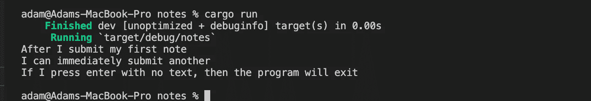

# 如何用 Rust 构建笔记命令行界面(CLI ):第 1 部分

> 原文：<https://levelup.gitconnected.com/how-to-build-a-note-taking-command-line-application-with-rust-part-1-34b9cd5be6b9>


一名矿工拿着一把生锈的鹤嘴锄在 2021 年前后发现了金块——如果你能认出位置，就能获得额外的网络积分

**更新:** [**第 2 部分现已推出**](/how-to-build-a-note-taking-command-line-application-with-rust-part-2-ec738dd97c48)

上周我写了我的第一个 Rust 应用程序。在克服了一些最初的语法障碍后，我对这门语言感觉很好。这篇文章是一系列文章的第一篇，将介绍如何用 Rust 构建笔记应用程序。

最终目标是给读者足够的知识来构建自己的类似于 [engram](https://github.com/adamjberg/engram) 的笔记应用。

内容期望读者有一些现有的编程知识，但可以是完全陌生的。本系列的每一部分都将产生一个实用的应用程序，它将在以后的文章中构建。

我强烈建议把你看到的代码打出来，而不是复制粘贴整个代码块。这是获得更好理解的最有效的方法之一。

# **入门**

使用下面的命令安装 rust，该命令可以从他们的[入门页面](https://www.rust-lang.org/learn/get-started)中找到

## **安装防锈**

```
curl --proto '=https' --tlsv1.2 -sSf https://sh.rustup.rs | sh
```

**创建新的 Rust 项目**

```
cargo new notes
```

`[cargo](https://doc.rust-lang.org/cargo/)` [是锈包管理者](https://doc.rust-lang.org/cargo/)。它支持几个命令，本文将介绍其中的几个。`cargo new`在当前目录下创建一个名为`notes`(或者你指定的其他名字)的新项目(和文件夹)。

`src/main.rs`包括一个非常简单的“Hello World”应用程序。

`Cargo.toml`被称为*舱单。*参见[货物手册](https://doc.rust-lang.org/cargo/reference/manifest.html)深入了解此处支持的内容。我们只需要在这里做一个小小的调整来添加一个依赖项，所以不要太担心理解所有的东西。

`.gitignore`方便地忽略了 git 默认的`target`文件夹。

## 运行 hello world 应用程序

```
cargo run
```

`[cargo run](https://doc.rust-lang.org/cargo/commands/cargo-run.html)` [命令](https://doc.rust-lang.org/cargo/commands/cargo-run.html)构建并运行当前包。在本教程中进行更改后，您将使用它来运行和测试这些更改。运行一次后，您会看到更多的文件和文件夹出现。

`Cargo.lock`这是一个自动生成的文件，它精确地指定了正在使用的库的版本。关于 [Cargo.toml vs. Cargo.lock 的更多细节，请参考货物手册](https://doc.rust-lang.org/cargo/guide/cargo-toml-vs-cargo-lock.html)。

`target`这个文件夹是存储所有构建文件的地方。您几乎可以忽略这一点，因为`cargo`工具会根据需要处理它。


默认 rust 工作区在 VS 代码中打开

# **准备数据模型**

## **创建一个 sqlite3 数据库**

数据库几乎是任何应用程序的核心。大多数新功能需要存储一些新数据或以某种方式检索现有信息。由于这些原因，这通常是你在构建新东西时首先要考虑的事情。特别是，我试图构建的“模式”是什么。

出于本教程的目的，我们的模式非常简单。我们想要一个有一个列和一个列的表。`id`存储特定音符的唯一标识符。这是大多数数据库的必填字段，因为它允许您直接引用现有项目。`body`列将存储我们正在保存的笔记的内容。你可以在这里选择其他你觉得更好的术语。一些可能的选择:`content`、`message`、`text`或`title`。当然有可能在事后改变这一点，但是随着时间的推移，越来越多的代码引用这些特定的术语，这变得越来越困难，所以试着选择一个你可以忍受的术语并坚持下去。

我现在看到的大多数教程主要关注的是在服务器上存储数据，并通过某种 API 同步数据。这个系列最终会实现，但是像我们正在构建的 notes 应用程序离线工作是非常重要的。尽早设置这一限制可以让我们考虑离线构建，而不是试图将其捆绑到现有的云应用上。

`[sqlite3](https://www.sqlite.org/index.html)` [是一个流行的数据库库](https://www.sqlite.org/index.html)，它将数据库存储在文件系统的一个文件中。这对用户来说很简单，因为他们不需要运行单独的数据库服务器，如果需要，数据库文件可以传递给其他系统。

## **创建注释表**

第一步是创建一个表来存放我们的应用程序数据。我们将使用`rusqlite`库来处理我们到 sqlite 数据库的连接。你可以通过修改你的`Cargo.toml`来安装它。

**Cargo.toml**

```
[package]
name = "notes"
version = "0.1.0"
edition = "2021"# See more keys and their definitions at [https://doc.rust-lang.org/cargo/reference/manifest.html](https://doc.rust-lang.org/cargo/reference/manifest.html)**[dependencies.rusqlite]
version = "0.26.1"
features = ["bundled"]**
```

这将添加`rusqlite`作为一个依赖项，它将在您下次尝试构建时安装。`features = [“bundled”]`告诉包编译`SQLite`。这在寻找系统库非常困难的 Windows 上特别有用。

添加后，您现在可以访问您的`main.rs`中的`rusqlite`,用以下代码替换现有代码:

```
**use rusqlite::{Connection, Result};****fn main() -> Result<(), Box<dyn std::error::Error>> {
  let conn = Connection::open("notes.db")?;
  conn.execute(
    "create table if not exists notes (
      id integer primary key,
      body text not null unique
    )",
    [],
  )?;

  Ok(())
}**
```

现在你可以运行`cargo run`，一旦它构建完成，notes 程序将运行并立即退出。然后，您应该会在当前目录中看到一个名为`notes.db`的文件。如果您安装了 DB 浏览器，您可以打开这个文件并看到一个带有`id`和`body`列的`notes`表。

如果您再次运行该程序，应该不会发生任何事情。我们正在运行的 [SQL](https://www.w3schools.com/sql/) 命令:

```
create table if not exists notes (
  id integer primary key,
  body text not null unique
)
```

指定仅在表不存在时创建该表。当我们打开与`let conn = Connection::open(“notes.db”)?;`的连接时，我们将`rusqlite`库指向同一个数据库文件，它能够确定这个表已经被创建。

## **【可选】为 SQLite 安装 DB 浏览器**

我发现能够直观地确认事情是否按预期运行很有帮助。此时，您可以下载一个数据库浏览器，它允许您查看新创建的`notes.db`文件的内容。

您可以[下载 SQLite 的 DB 浏览器](https://sqlitebrowser.org/dl/)。安装完成后，打开它并点击`Open Database`。


notes.db 在 SQLite 的 db 浏览器中打开

现在我们已经创建了一个表并设置了模式，我们可以继续添加第一个注释了。

# **CRUD —创建、读取、更新、删除**

当在任何程序中开发新功能时，我通常独立地处理 CRUD 首字母缩略词的每个组成部分。对我来说最有意义的构建顺序是:

1.  创造
2.  阅读
3.  删除
4.  更新

教程的这一部分将只涉及创建方面。下一个会检查其他的。

# **创建**

创造是第一位的，因为没有它，其他一切都没有意义。在很多情况下，一旦可以创建应用程序，它就可以工作了。很明显，您希望能够完成其他任务，但是他们的缺席不会影响您创建新项目。在我们的 notes 示例中，您将看到，即使您刚刚添加了 create 功能，您仍然有一个将 notes 正确存储到本地数据库的程序。如果这是您能够完成的全部工作，您仍然可以使用类似 DB Browser for SQLite 的工具打开 sqlite3 数据库，并在那里浏览旧的笔记。

在我们这里的小例子中，CRUD 的其他部分并不多，但是当构建一个更大的图形用户界面时，演示和测试 create 功能是很有用的。你可能会意识到你想要它工作起来或者看起来不一样，在这里抓住这一点会节省你的时间。

## **要求**

对于笔记的创建，我只是希望能够在终端中键入我的笔记，然后按回车键。为了从命令行收集输入，我们将使用内置的`[std::io](https://doc.rust-lang.org/std/io/index.html)`包。

```
**use std::io;**
use rusqlite::{Connection, Result};fn main() -> Result<(), Box<dyn std::error::Error>> {
  let conn = Connection::open("notes.db")?;
  conn.execute(
    "create table if not exists notes (
      id integer primary key,
      body text not null unique
    )",
    [],
  )?; **let mut buffer = String::new();
  io::stdin().read_line(&mut buffer)?;
  conn.execute("INSERT INTO notes (body) values (?1)", [buffer])?;** Ok(())
}
```

我们可以用`cargo run`再次运行我们的应用程序，现在你应该看到它没有立即退出。你可以输入任何你喜欢的信息，但是“你好，世界”是标准的“这东西能用吗”信息。一旦你按下回车键，程序就会退出。


提交第一条注释后的输出示例

如果你安装了上面的 DB 浏览器，你现在可以点击`Browse Data`，你会看到一行`id:` 1 和`body:`“hello world”(或者你刚刚输入的任何内容)。


显示“hello world”注释的数据库浏览器

这很好，但程序的目的是让我们快速捕捉许多音符。我们需要一些方法来使程序在第一个注释提交后不会立即退出。

为了实现这一点，我们将使用一个`loop`——特别是一个`while`循环。

```
use std::io;use rusqlite::{Connection, Result};fn main() -> Result<(), Box<dyn std::error::Error>> {
  let conn = Connection::open("notes.db")?;
  conn.execute(
    "create table if not exists notes (
      id integer primary key,
      body text not null unique
    )",
    [],
  )?; **let mut running = true;
  while running == true {
    let mut buffer = String::new();
    io::stdin().read_line(&mut buffer)?;
    let trimmed_body = buffer.trim();
    if trimmed_body == "" {
      running = false;
    } else {
      conn.execute("INSERT INTO notes (body) values (?1)", [trimmed_body])?;
    }
  }** Ok(())
}
```

为了实现这一点，我们引入了一个名为`running`的`boolean`变量。当我们启动程序时，我们希望继续接受输入，所以我们将其初始化为`true`。

`let trimmed_body = buffer.trim();`删除输入行末尾的任何空白。这是必要的，因为`read_line`返回带有新行字符`\n`的字符串。这在你可能看到它的大多数地方是看不见的，但是为了使`trimmed_body == “”`相等检查工作是需要的。作为一个额外的好处，`.trim()`确保任何尾随空白在我们存储到数据库之前被删除。

我们现在可以用`cargo run`再次运行，你现在应该能够输入一个又一个音符，而不用退出程序。一旦你写完笔记，你可以输入一个空行，程序将退出。



在一次运行中创建多个音符

# 包装东西

正如开头提到的，这篇文章是一个更长系列的开始，这个系列将介绍如何使用 Rust 为命令行构建和设计 notes 应用程序。在过去的一年中，我使用了一个简单的 notes 应用程序作为我用来试验新技术的项目。到目前为止，我已经使用上述类似的方法使用 [Swift iOS](https://apps.apple.com/ca/app/engram/id1568952668) 、 [React Native for Android](https://play.google.com/store/apps/details?id=com.xyzdigital.engram) 、 [React](https://engram.xyzdigital.com/signup) 和 Vanilla JavaScript 构建了笔记应用程序(亲切地称为 [engram](https://engramhq.xyz) )。

我现在正在记录这个过程，因为事实证明它非常成功地让我学到了我需要知道的东西。

如果你在本教程的任何部分遇到任何问题，请留下评论，我可以更新内容使其更加清晰。如果你喜欢它的发展方向，请务必在 medium 或 Twitter 上关注我，以便在未来的部分发布时获得通知。