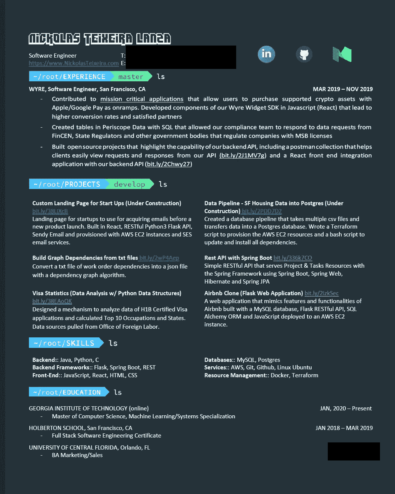
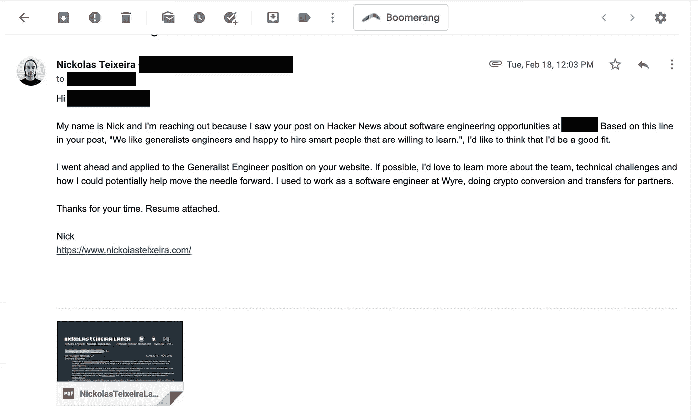
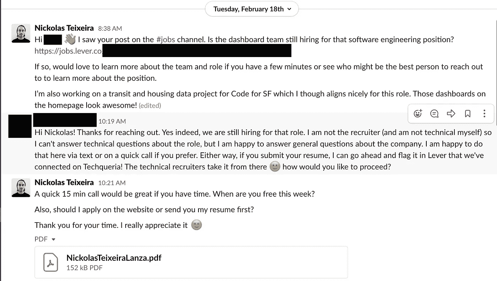
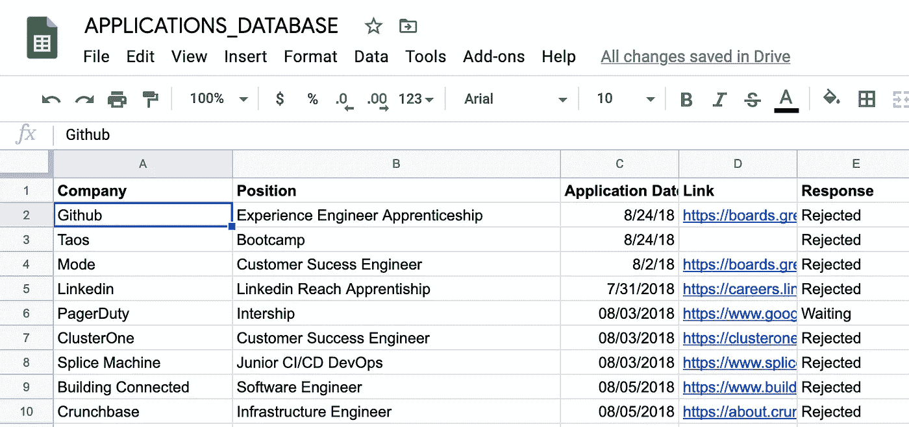
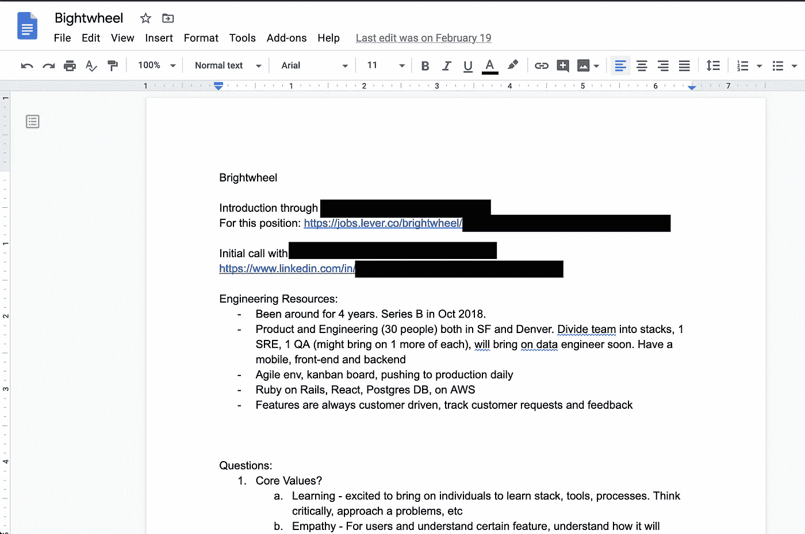

# 如何建立一个不依赖推荐的软件工程面试管道

> 原文：<https://levelup.gitconnected.com/how-to-build-a-pipeline-of-software-engineering-interviews-without-relying-on-referrals-9345d8bc598c>

被公司雇佣的最好方法总是热情的介绍。但是，如果你是软件工程的新手(我只有不到两年的专业经验)，并且没有一大群可以推荐你进入公司的人，该怎么办呢？或者，如果疫情上映了，你的求职变得更加困难了呢？

我的求职与疫情重叠，但我最近被一家名为 [Solv](https://www.solvhealth.com/) 的公司聘为软件工程师，从事软件预约当天医生预约和紧急护理访问的软件工程师工作。下面，我整理了我使用的资源和我创建的流程，以最大限度地提高在疫情期间被聘为软件工程师的机会。

如果你有兴趣了解软件工程面试的类型以及如何在技术上准备它们，请参考我以前的帖子，[训练营后软件工程工作类型以及如何有希望获得一个](https://blog.usejournal.com/post-bootcamp-software-engineering-job-types-and-how-to-hopefully-get-one-149e606e3677)。

## **如何建立你的面试渠道**

首先，我要说的是，通过推荐来源进入一家公司的技术面试渠道比冷冰冰地申请要容易得多。如果你有多家公司的多种推荐来源，并且你对自己的技术面试技巧很有信心，那么我希望你能尽快找到工作。但是，随着越来越多的软件工程师被解雇并寻找工作，以及经济的快速转变，竞争变得更加激烈。如果你在这个不确定的经济环境中处于职业转换的位置，并且没有+10K 追随者来帮助传播消息，那么继续阅读吧！

## **我的申请流程**

恭喜你。你最近开始了你的软件工程生涯，并在寻找一份新工作。或者你想开始面试，以防万一。只要记住在困难时期削减成本的老会计方法:后进先出。如果你像我一样，只有不到两年的工作经验，在经济低迷时期，你的工作有潜在的风险，所以学习建立面试渠道的技巧是个好主意。

> 你如何从零开始建立一个软件工程面试管道？

每个人都指着上面的资源对你说，“去吧，老虎！你坐在那里想“我怎样才能把自己和其他人区分开来?”？“建立一个软件工程面试管道是一项工作，如果你做得好，这简直就是一份全职工作。

## 让你的简历与众不同

为了优化你被关注的机会，你需要一份精致、独特的简历。

> 制作一份独一无二、可读性强的简历，吸引招聘人员或招聘经理的眼球，让他们想更多地了解你。

我说的独特是什么意思？

*   **总体来说:**简历应该没有错别字，简单易懂，读起来有趣。
*   **不同的设计**:我当时找的是软件工程和后端工程的角色，所以把简历转换成包含命令行参数来展示经历、项目等。我还把它涂成模仿我的 [zsh 外壳](https://ohmyz.sh/)。你应该试着根据你申请的职位量身定制设计。
*   **内容**:现在有个人网站也是蛮标准的。作为一名开发人员，你应该有一个，并把链接放在你的简历上。除了工作经验之外，你还应该包括技术项目的链接，这些项目的工作 URL 都有很好的文档记录(获得 404 错误不会给你的工程技能留下好印象)。如果你没有太多的工作经验或者项目，那就多做一些你能加入简历的项目吧！
*   **一致性**:如果你在链接社交简档(个人网站、LinkedIn、天使、Medium 等。)，如果您的所有个人资料中有一个相似的品牌(个人资料图片、复制和设计)会有助于保持一致性。请随意查看我的个人资料示例:

> [个人网站](https://www.nickolasteixeira.com/)、[媒介](https://medium.com/@nickolasteixeira)、 [LinkedIn](https://www.linkedin.com/in/nickolasteixeira/) 、[Angel.co](https://angel.co/u/nickolasteixeira01)

重构你的简历是求职过程中非常重要的一部分。请不要忽略这一步。如果你还没有经历过简历的多次反复或者还没有让别人审阅过，先做这些事情。

在我的简历重复了大约四次之后，我找到了这份我最喜欢的:

我简历的第四次迭代

## **申请求职公告板**

我建议挑选几个主要的工作板块，并在这些板块上投入时间，而不是试图监控 100 个不同的板块。我发现，通过定期花时间在几个板上，我的努力获得了更高的投资回报率。

凭借不到两年的专业软件工程经验，我发现下面的工作板对各个层次的工程师都非常有用:

*   [Angel.co](https://angel.co/)
*   [LinkedIn 求职板](https://www.linkedin.com/jobs/)

最适合我的是申请 LinkedIn 和 Angel.co 上的职位。事实上，我通过 Angel.co 在 Wyre 找到了我的第一份工程工作，通过 LinkedIn 找到了我在 Solv 的第二份工程工作。冷申请工作，你只需要把建立一份好的简历和一个干净的个人网站以及写个人笔记(每个人自己的秘密酱)的时间投入进去。为了进一步证明我的观点，Solv 的招聘广告是一个高级工程师的角色，招聘人员说我得到了一个面试的机会，因为她喜欢我的简历并看到了潜力。

我已经能听到人们在我耳边大喊的各种不同意见:“但是你不应该在网上申请工作。你不会被注意到，所以这是浪费时间。没有人看他们，你必须通过你认识的人。”但是一旦你利用了你的人际网络，并且因为在家工作而不能出去见人，是时候让求职板为你工作了。

我的目标是每周至少申请 100 家公司，或者每天申请 15 家公司。为了让这个过程更有效率，我试图通过把相关的任务分成一天来减少上下文切换。例如，我会在一周的周日和周一完成所有的初始申请。如果这是一个工作日的申请过程，我必须为我面试的每家公司注册一个账户，然后经历他们 1990 年代风格的申请过程，这并不重要，我还是坚持申请了。

最后，曾经有一个[脚本](https://github.com/wnmurphy/angel-list-batch-apply)，可以让你在 Angel.co 上发布差不多 1000 个应用程序，但是它不再工作了，因为 Angel.co 改变了他们的前端代码。如果任何前端工程师想要更新/创建一个新的脚本来批量应用到 jobs，那就太棒了！

## **黑客新闻，谁在招人**

几年前，当我试图过渡到软件工程职业时，我犯的最大错误之一就是不重视黑客新闻。我想既然我是一名工程师，我应该自动化整个招聘过程，而不是做任何手工。我完全错了。

去黑客新闻网站看看 2020 年 5 月的。在一些帖子中，人们会留下他们的电子邮件地址，以便你跟进。这是你给他们发一封私人邮件的机会，试着和他们联系，从他们的经历中学习。如果他们回复了，感谢他们的帮助，询问他们是否可以把你介绍给他们关系网中的任何人，帮你联系一个可以帮你找到你想要的工作的人，或者推荐一些你可能没听说过的资源。下面是一封我会发给一个我不认识但想联系的人的电子邮件示例:

事情是这样的，有些人会向你伸出援手，有些人不会。不要气馁，也不要太依恋任何公司。在这一点上，这是一个数字游戏。我想说我得到了不到 10%的回复率，所以还不算太糟。在这 10%中，我得到了一些第一轮面试，这些面试被证明是很好的实践面试。最终，我找到了一个招聘流程和公司，并被录用了。我只需要解决一个问题，而不是所有问题。

除了周日和周一对 LinkedIn 和 Angel.co 的冷淡申请，我还会回到上一周在黑客新闻上停下来的地方，开始寻找新的帖子，并重复这个循环。

## **加入利基松弛群体**

什么是小众懈怠群体？想想有松弛渠道的专业资源或本地团体。例如，我是几个不同团体的成员，分别是旧金山的[代码](https://codeforsanfrancisco.org/)(我住在旧金山)和 [Techqueria](https://techqueria.org/) (我是巴西裔美国人，所以想与更国际化的社区建立联系)。我在面试过程中也在努力学习 Apache Airflow，并加入了[Apache air flow Slack Channel](https://apache-airflow-slack.herokuapp.com/)。

通常有一个#招聘频道或#面试频道。找到并加入这些渠道。每天回顾那些评论。如果有一个职位与你正在寻找的工作类型相关，在对那个人、公司和职位做了一些功课之后，联系那个人。

通过*作业*，我的意思是:

*   去该公司的网站注册他们的产品。使用他们的产品。
*   去公司的 LinkedIn 页面，看看在招聘频道上发帖的人是做什么的，他们和你有什么共同之处，他们如何能帮助你(或者更好，你如何能帮助他们！).

在你做了功课之后，构思一条个人信息，可以与这个人、公司或角色有关。

这可能是我在冷淡地接触了一个小圈子里的人后收到的最温暖的信息。

**你可以问的适当问题:**

*   公司还在招聘这个职位吗？
*   你是这个职位的最佳人选吗？如果不是你，你愿意和我分享谁是你吗？
*   如果他们是谈论这个角色的最佳人选，请他们花几分钟时间沟通是合适的。如果你给他们一个联系的理由，比如:有一份独特的、易读的、适合这个职位的简历，他们更有可能想和你联系和聊天。

**不适合问的问题:**

*   请不要要求他们推荐这个职位。如果他们不认识你，他们为什么要拿自己的名誉冒险？你对他们来说是陌生人。在他们与你交谈并对你的身份感到满意后，通常他们会告诉你他们认为下一步应该做什么。
*   不要问他们的个人信息

一个警告。如果你事先为小组做出贡献并增加价值，你会从这些小团体中得到更多。例如，几年前，我很幸运地为这个团队增加了价值，为开源项目做出了贡献，并为像我一样寻求职业转型的其他人提供了指导。理想情况下，给予比你得到的多 5-10 倍。它需要一个村庄的人，如果你能随时帮忙，你会建立一个良好的声誉。

在你和他们通完电话或者他们把你介绍给合适的人之后，一定要感谢他们抽出时间。

## **如何管理整个流程**

为这个过程戴上开发人员/自动化的帽子。我管理 Google Drive 中的一切。我曾经在谷歌表单文件中跟踪我所有的申请，但觉得那很乏味。如果你想跟踪他们，下面是一个模板。

几年前的工作申请表样本。

就求职活动而言，我唯一会追踪的是:

*   给招聘人员和工程师打电话
*   我刚刚面试的公司的下一步

任何一家我开始面试的公司，我都会创建一个新文件，并将其命名为公司名称。在那个文件里，我记下了招聘人员、工程经理和其他软件工程师打给我的每一个电话。

以下是通话记录的一个示例:

示例通话记录文档

## **面试过程中的沟通技巧**

*   善待每一个人。这真的很简单，而且对招聘人员和整个工程团队大有帮助。人们想和他们喜欢的人一起工作，所以在后续邮件中说请和谢谢是很重要的。它显示了谦逊和感激，这是我在我喜欢共事的人身上寻找的品质，你可能也是。
*   在 12-24 小时内，如果招聘人员、工程经理和其他所有人主动提出让你通过这个渠道的话，就要跟进他们。
*   准时。准时参加电话/面试。

## **最后的想法**

在你找到一份工作后，一定要回去更新你在 Slack 群组或任何其他在面试过程中帮助过你的沟通媒介中与你聊天的所有人的信息。这意味着你应该记录下所有要感谢的人(这将是你的奥斯卡演讲)。这真的会有很长的路要走，会帮助你建立未来的关系。

最后，在我接受了 Solv 的机会后，我一定要向给我和我的申请机会的招聘人员致以深深的谢意。如果不是她，我永远也不会有机会见到队员。

## **保持连接**

如果你有任何问题或者想和我保持联系，可以在[推特](https://twitter.com/nttl_lttn)上找到我。

# 分级编码

感谢您成为我们社区的一员！ [**订阅我们的 YouTube 频道**](https://www.youtube.com/channel/UC3v9kBR_ab4UHXXdknz8Fbg?sub_confirmation=1) 或者加入 [**Skilled.dev 编码面试课程**](https://skilled.dev/) 。