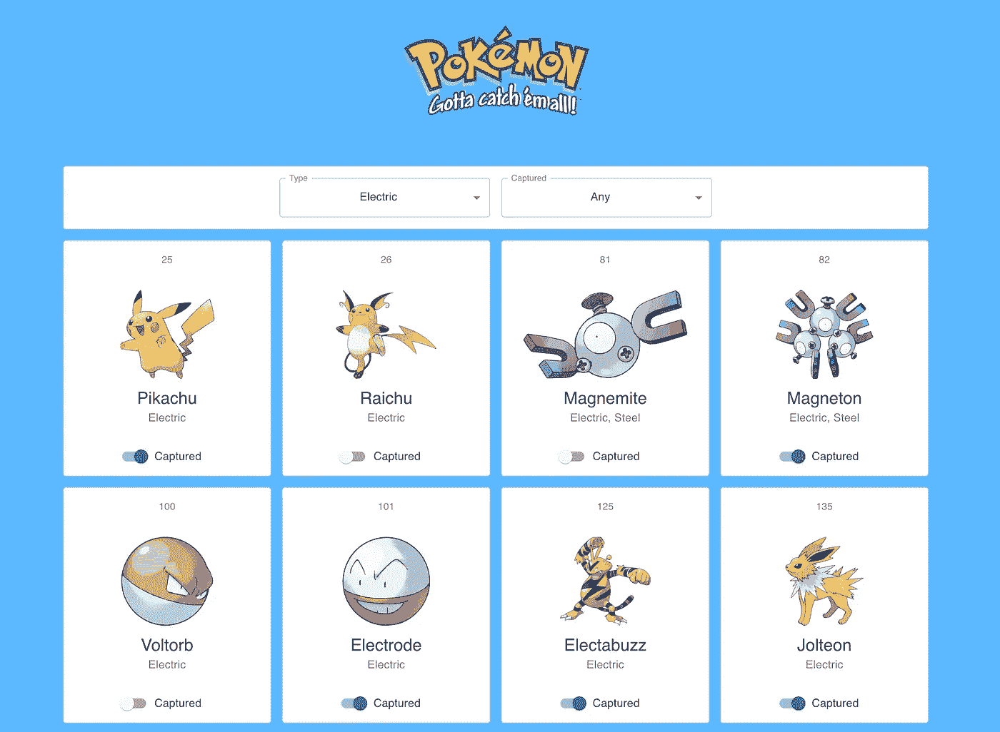
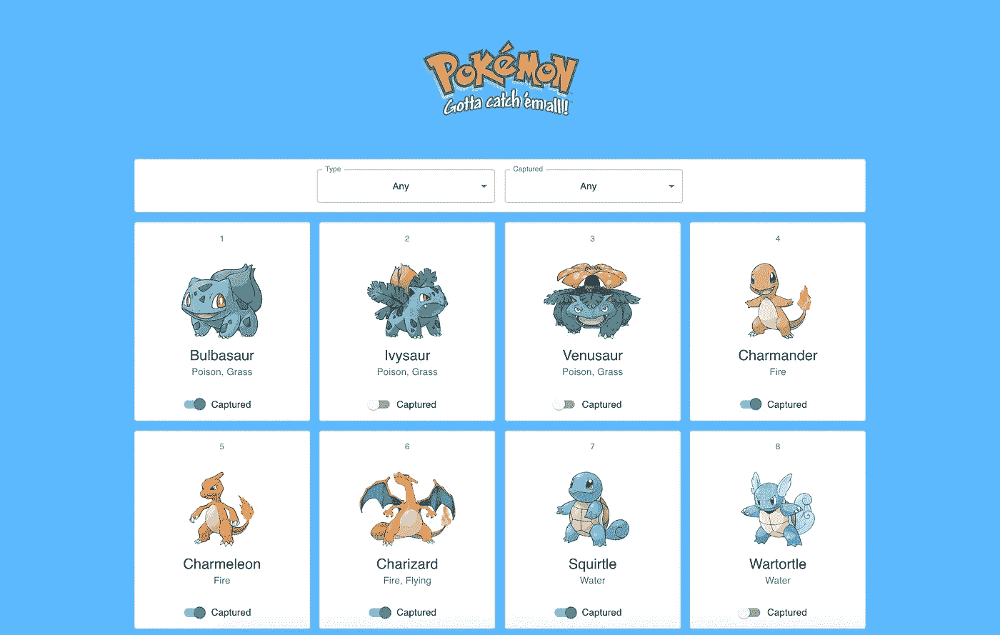
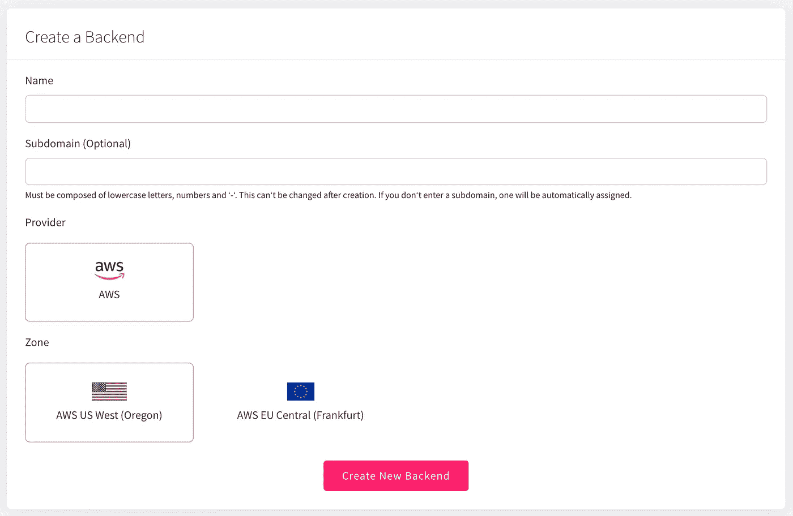
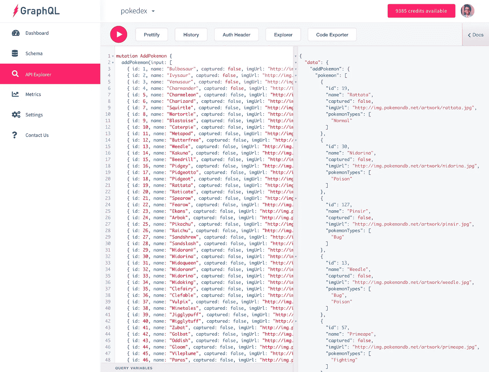
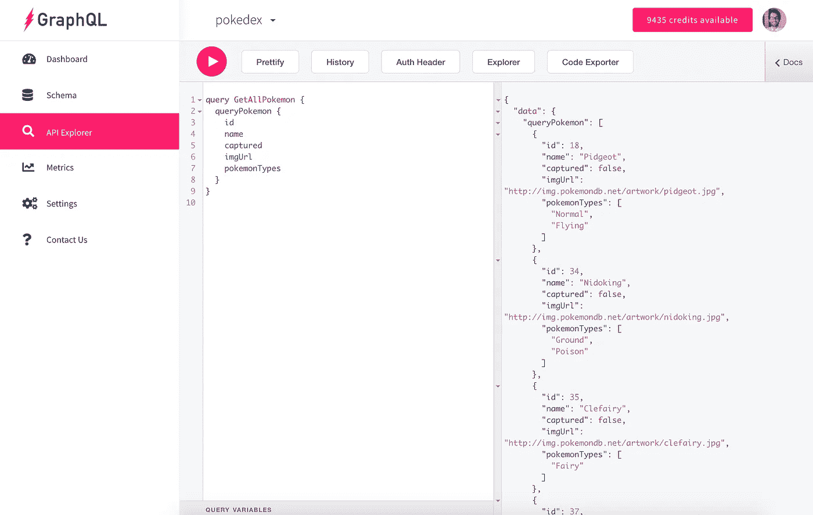
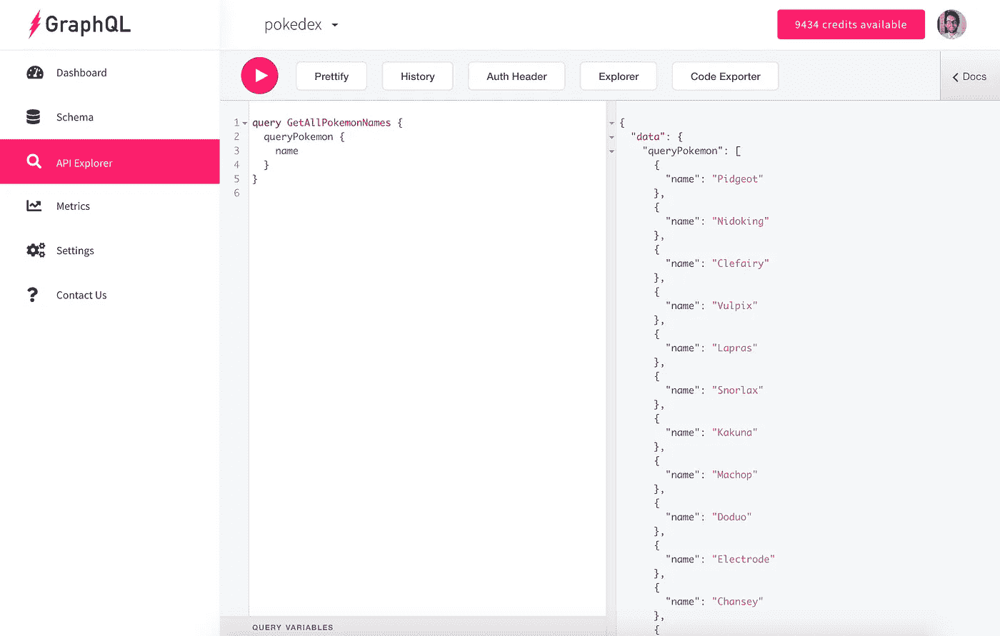
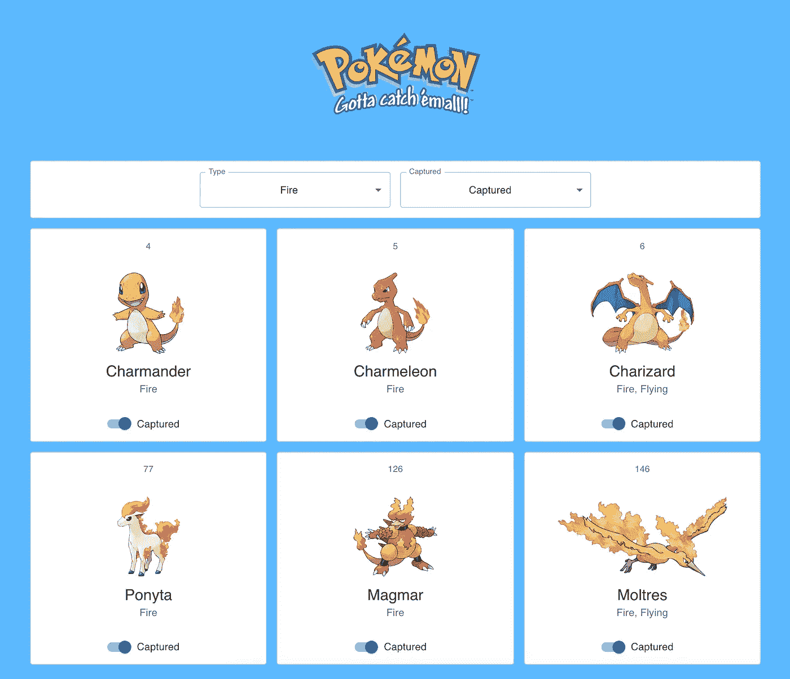
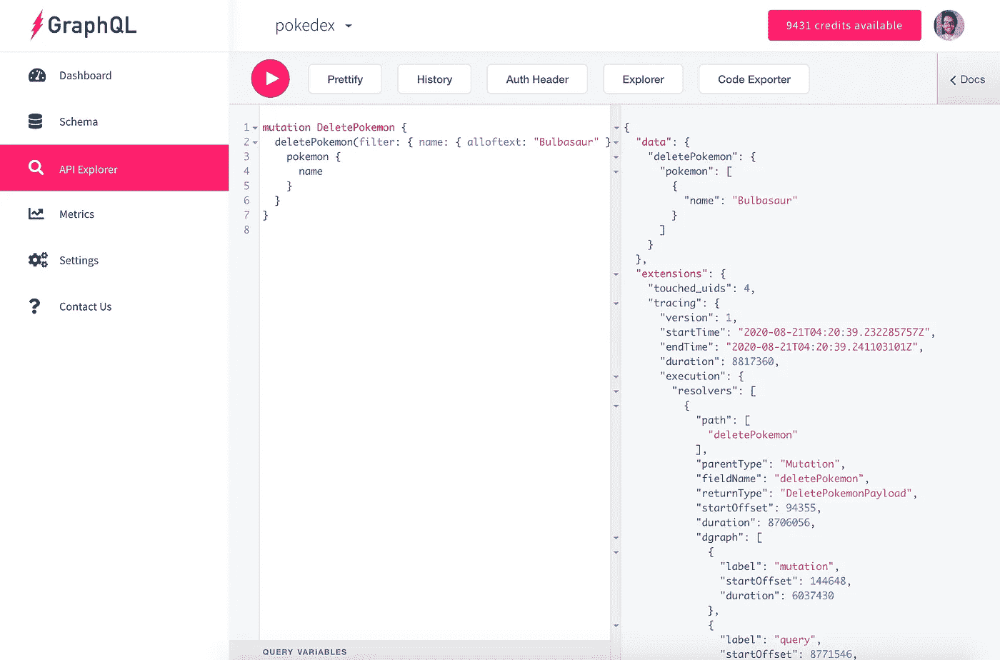

# 如何用斜杠 GraphQL 后端构建一个 Pokédex React 应用

> 原文：<https://levelup.gitconnected.com/how-to-build-a-pok%C3%A9dex-react-app-with-a-slash-graphql-backend-ccc8c650d29b>

## 托管的 GraphQL 后端简化了 Web 开发

神奇宝贝精灵宝可梦应用

前端开发人员希望与他们的 web 应用程序的后端交互尽可能地无痛。从数据库请求数据或更新数据库中存储的记录应该很简单，这样前端开发人员就可以专注于他们最擅长的事情:创建漂亮直观的用户界面。

GraphQL 让使用数据库变得简单。前端开发人员无需依赖后端开发人员创建特定的 API 端点来在查询数据库时返回预先选择的数据字段，而是可以向后端发出简单的请求，并检索他们需要的准确数据——不多也不少。这种灵活性是 GraphQL 如此吸引人的原因之一。

更好的是，你可以使用一个*托管的* GraphQL 后端— [斜线 GraphQL](https://dgraph.io/cloud/) (by [Dgraph](https://dgraph.io/) )。这项服务是全新的，于 2020 年 9 月 10 日公开发布[。使用 Slash GraphQL，我可以创建一个新的后端端点，为我的](https://dgraph.io/blog/post/announcing-slash-graphql/)[图形数据库](https://en.wikipedia.org/wiki/Graph_database)指定我想要的模式，然后— *瞧！* —只需几个步骤即可启动并运行。

托管后端的美妙之处在于，您不需要管理自己的后端基础设施，创建和管理自己的数据库，或者创建 API 端点。所有这些都是为你准备的。

在这篇文章中，我们将浏览 Slash GraphQL 的一些基本设置，然后看看我如何在几个小时内用 React 和 Slash GraphQL 构建了一个[神奇宝贝 Pokédex 应用](http://tylerhawkins.info/pokedex-slash-graphql/build/)！

你可以在 GitHub 上查看所有的代码。

*更新:2021 年 4 月 16 日，斜杠 GraphQL 正式更名为 Dgraph Cloud。以下信息仍然适用，您仍然可以按照描述构建应用程序。*

# 演示应用概述

神奇宝贝精灵宝可梦应用

哪个 90 后的孩子(或成年人，就此而言)没有梦想过抓住所有 150 个原版神奇宝贝？我们的演示应用程序将帮助我们记录成为神奇宝贝大师的进度。

当我们构建我们的应用程序时，我们将涵盖使用 API 的所有 CRUD 操作:创建、读取、更新和删除。

我们将开始在 Slash GraphQL 的 API Explorer 中将我们所有的神奇宝贝添加到在线数据库中。然后，在 Pokédex 应用程序 UI 中，我们将显示从数据库中查询的所有 151 个神奇宝贝。(嘿，我不能漏掉 Mew，对吧？)在屏幕顶部，我们将显示两个下拉菜单，允许我们按神奇宝贝类型和神奇宝贝是否被捕获来过滤显示的结果。每个神奇宝贝旁边还会有一个拨动开关，让我们可以标记神奇宝贝是否被捕获。我们不会通过应用程序的用户界面从我们的数据库中删除任何神奇宝贝，但我会告诉你在你需要清理一些数据的情况下如何做到这一点。

准备好开始我们的旅程了吗？

# Slash GraphQL 入门

## 创建新的后端

一旦你创建了你的[斜线 GraphQL](https://dgraph.io/cloud/) 帐户，你可以有你的 GraphQL 后台运行只需几个步骤:

1.  单击“创建后端”按钮。
2.  给它起个名字。(比如我选了“pokedex”。)
3.  或者，给 API 端点 URL 一个子域名。(还是那句话，我选了“pokedex”。)
4.  或者，选择提供商和区域。(默认在美国西 2 地区使用 AWS。)
5.  单击“创建新后端”按钮确认您的选择。
6.  获取您的后端端点。(我的长这样:[https://pokedex.us-west-2.aws.cloud.dgraph.io/graphql](https://pokedex.us-west-2.aws.cloud.dgraph.io/graphql)。)
7.  单击“创建您的方案”按钮。

就是这样！创建一个新的后端后，您将拥有一个可用的 GraphQL 数据库和 API 端点。

创建新的后端

## 创建模式

既然后端已经启动并运行，我们需要为数据库中的数据类型创建模式。对于 Pokédex 应用程序，我们将有一个`Pokémon`类型和一个`PokémonType`枚举。

在这么少的代码中有很多东西需要解开！`PokémonType`枚举很简单——它是所有神奇宝贝类型的集合，包括火、水、草和电。`Pokémon`类型描述了每个神奇宝贝的数据形状。每个神奇宝贝都有一个 ID，一个名字，一个显示神奇宝贝图片的图片 URL，神奇宝贝的类型，以及一个指示神奇宝贝是否被捕获的状态。

您可以看到每个字段都有一个关联的数据类型。比如，`id`是一个`Int`(整数)，`name`、`imgUrl`是`String`类型，`captured`是一个`Boolean`。感叹号`!`的出现意味着该字段是必填的。最后，添加`@search`关键字使得该字段可以在您的查询和变体中进行搜索。

为了测试使用我们的数据库和新创建的模式，我们可以使用 API Explorer，这是一个简洁的特性，允许我们直接从 Slash GraphQL web 控制台中对数据库运行查询和变更。

# 填充我们的数据库

让我们使用 API Explorer 将我们所有的神奇宝贝插入 Pokédex 数据库。我们将使用以下突变:

为了简洁起见，我只展示了上面片段中的前九个神奇宝贝。请随意查看添加所有神奇宝贝的[完整代码片段。](https://gist.github.com/thawkin3/bc69df149c8e8cb004a9575fc43b1297)

通过 API Explorer 添加所有神奇宝贝

现在，为了快速检查，我们可以查询我们的数据库，以确保我们所有的神奇宝贝都已正确添加。我们将像这样请求我们所有神奇宝贝的数据:

下面是它在 API Explorer 中的样子:

在 API 浏览器中查询所有神奇宝贝

我们也可以编写一个类似的查询，只返回神奇宝贝的名字，如果这是我们需要的所有数据的话。看，GraphQL 的美丽！

在 API 浏览器中查询所有神奇宝贝的名称

# 在应用程序中获取数据

现在我们已经将我们的神奇宝贝添加到了 Pokédex 中，并验证了数据确实存在，让我们将它显示在我们的应用程序中。我们的应用程序是用 [React](https://reactjs.org/) 和 [Material UI](https://material-ui.com/) 为前端构建的，并使用 [create-react-app](https://github.com/facebook/create-react-app) 进行引导。我们不会一步一步地介绍如何构建应用程序，但我们会重点介绍一些关键部分。同样，如果你想复制回购协议或者只是看看，GitHub 上有完整的代码。

当在我们的前端代码中使用 Slash GraphQL 时，我们本质上只是向我们在创建后端时提供的单个 API 端点发出一个 POST 请求。在请求体中，我们提供我们的 GraphQL 代码作为`query`，我们为查询或变异写一个描述性名称作为`operationName`，然后我们可选地提供我们在 GraphQL 代码中引用的任何`variables`的对象。

下面是我们如何按照这种模式在应用程序中获取神奇宝贝的简化版本:

然后，我们获取这些数据，并使用 Array `map`辅助函数在 UI 中显示每个神奇宝贝。

页面顶部的过滤器也连接到我们的 API。当过滤器值改变时，一个新的 API 请求启动，但是这一次使用一组更窄的搜索结果。例如，以下是我们捕捉到的所有火型神奇宝贝:

捕捉火型神奇宝贝

根据类型和捕获状态对神奇宝贝进行 API 请求的 JavaScript 如下所示:

# 更新应用程序中的数据

至此，我们已经充分介绍了如何从 API Explorer 创建神奇宝贝，以及如何通过 JavaScript 在 Pokédex 应用程序中获取神奇宝贝。但是更新神奇宝贝呢？每个神奇宝贝都有一个拨动开关来控制神奇宝贝的捕捉状态。点击开关更新数据库中神奇宝贝的捕获状态，然后相应地更新用户界面。

下面是我们更新神奇宝贝的 JavaScript 代码:

然后，当触发值改变时，我们调用`updatePokemonCapturedStatus`函数。这启动了更新数据库中的值的 API 请求。然后，我们可以乐观地更新 UI，而不等待后端的响应，或者我们可以等待响应，并将单个神奇宝贝的结果合并到我们前端更大的所有神奇宝贝的数据集中。我们也可以简单地再次请求所有的神奇宝贝，并用新的结果替换我们前端存储的神奇宝贝信息，这就是我选择做的。

# 从数据库中删除数据

最后一个 CRUD 操作是“删除”。我们不允许用户从应用的用户界面中删除神奇宝贝；然而，作为应用程序管理员，我们可能需要从我们的数据库中删除任何错误或不需要的数据。为此，我们可以再次使用 API Explorer。

例如，如果我们发现我们的 Pokédex 中有一个额外的妙蛙种子，我们可以删除所有的白头龙:

通过 API 浏览器删除所有妙蛙种子神奇宝贝

然后，我们可以添加一个妙蛙种子回来:

# 包扎

那么，我们学到了什么？到目前为止，我们应该了解如何在 React 应用程序的上下文中使用 Slash GraphQL。我们已经涵盖了所有的 CRUD 操作，以制作一个非常可爱的 Pokédex 应用程序。一路上我们甚至可能抓到了一些神奇宝贝。

希望我们没有…在混乱中伤到自己… [ *读者发出了可以听到的呻吟声*。

我们还没有讨论如何添加身份验证来保护我们的应用程序，或者在发出 GraphQL 请求时如何使用 T2 Apollo 客户端，但是这些都是另一篇文章的重要主题！

作为一名经验丰富的前端开发人员，但没有多少使用 GraphQL 的经验，使用 Slash GraphQL 非常容易。设置起来轻而易举，API Explorer 和文档在帮助我探索各种查询和数据变化方面发挥了重要作用。

斜线 GraphQL，我选你！[ *读者发出更多的呻吟声*