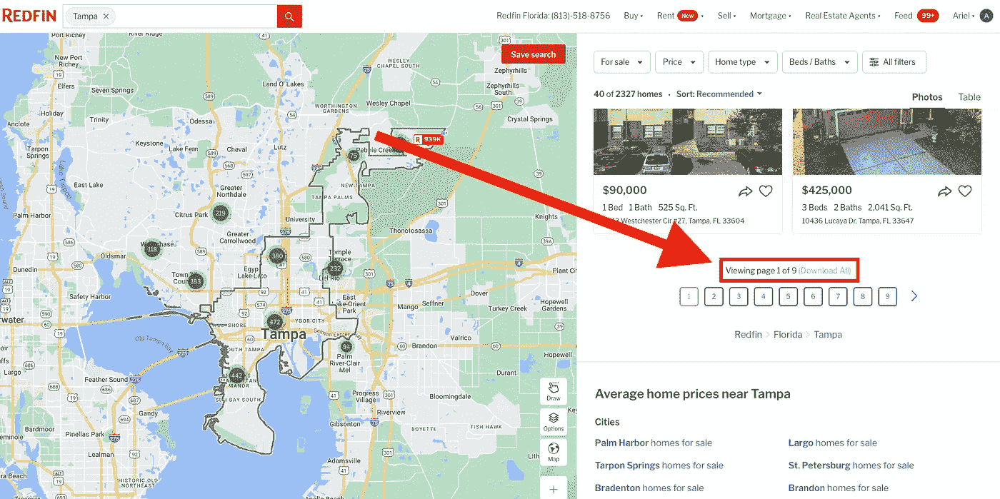
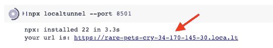
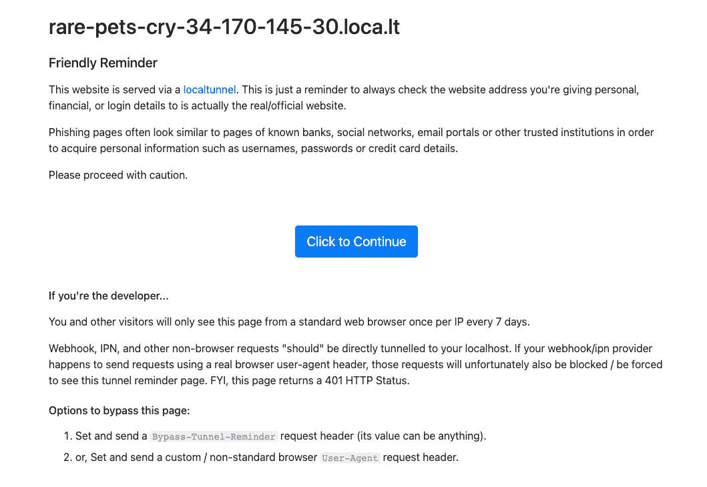
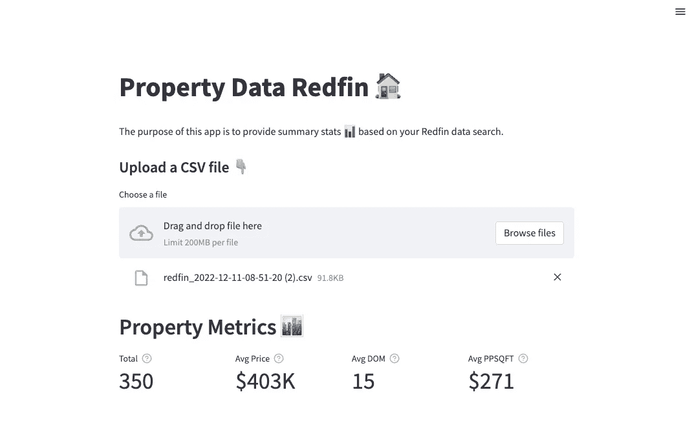
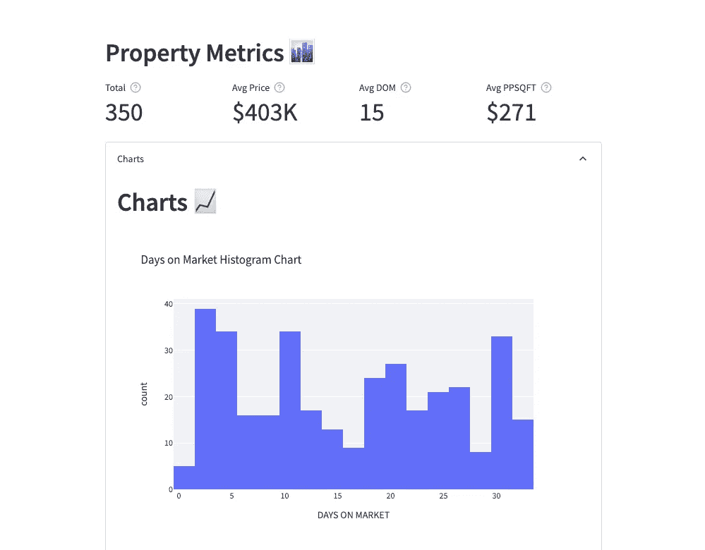
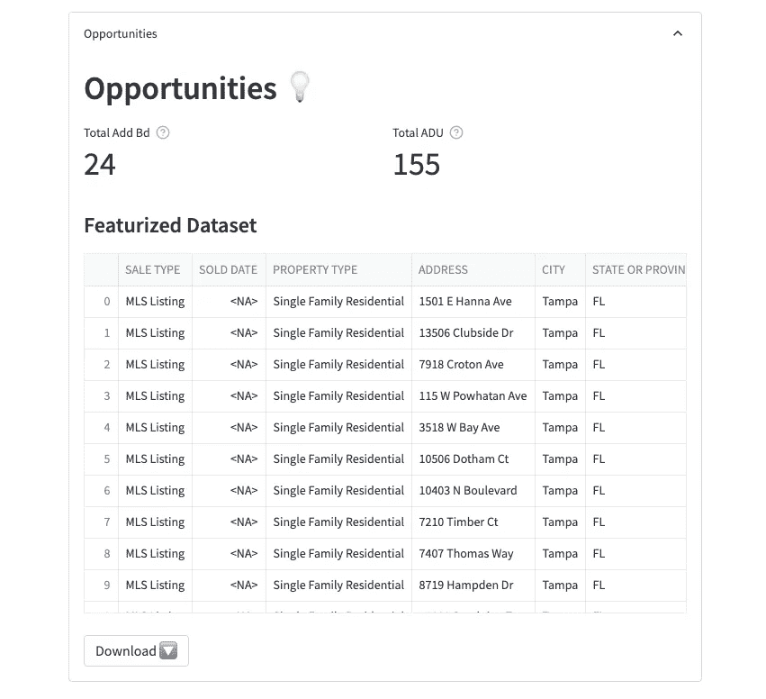

# 如何用 Python 构建房地产 Streamlit 应用程序

> 原文：<https://levelup.gitconnected.com/how-to-build-a-real-estate-streamlit-app-in-python-dd21b7c9ed4d>

## 在几分钟内构建一个 web 应用程序，不需要 Google Colab 的前端经验


格伦·卡斯滕斯-彼得斯在 [Unsplash](https://unsplash.com/s/photos/web-application?utm_source=unsplash&utm_medium=referral&utm_content=creditCopyText) 上拍摄的照片

浏览 Zillow、Redfin 或 Realtor 等网站上的待售房产是从 MLS 获取信息的一种简单方式。

但是我们怎么知道哪种房产最适合我们呢？

房产定价过高吗？它与我们搜索的其他酒店相比如何？是否存在隐藏的机会？

***Redfin 提供了一种从网站直接下载房产列表到 CSV 文件的简单方法。***

搜索一个城市后，您可以向下滚动列表面板来下载列表。



[Redfin.com](https://www.redfin.com/city/18142/FL/Tampa)搜索截图(作者)

现在我们有了一个可以在 Excel 中打开的 CSV 文件。那又怎样？

***我们需要一种简单的方法从清单文件中提取信息。***


照片由[基恩系统公司](https://www.google.com/url?sa=i&url=https%3A%2F%2Fwww.keenesystems.com%2Fblog%2F5-reasons-a-database-is-better-than-a-spreadsheet-for-business&psig=AOvVaw2YAcSFQPn-jQ_86WerNmbc&ust=1671045380862000&source=images&cd=vfe&ved=0CA8QjRxqFwoTCJjZqKmn9_sCFQAAAAAdAAAAABAD)拍摄

好的，我们可以读入 Python Pandas 中的数据，做一些转换，得出见解。但是，如果我们想在可重复的基础上做这件事，并且可以与他人分享呢？

这就是 Streamlit 的用武之地😁。

## 关于细流

> Streamlit 是**一个开源的 Python 库，它使得为机器学习和数据科学**创建和分享漂亮的定制 web 应用变得容易。只需几分钟，您就可以构建和部署强大的数据应用程序。所以让我们开始吧！— [streamlit.io](https://docs.streamlit.io/)


[Redfin.com](https://www.redfin.com/)主页截图(作者)

这篇文章将讲述如何在 Streamlit 中构建一个简单的房地产 web 应用程序来分析来自 Redfin 的房地产列表。

在下面👇是我们将创建的 web 应用程序的一个示例。你也可以在这里检验成品[。](https://redfin.streamlit.app/)

GIPHY(作者)

# 问题陈述

我们有房产地址的档案。我们希望*处理文件*以收集关于属性的汇总统计数据和见解。

这些指标应该包括平均标价、平均上市天数和每平方英尺的平均价格。我们应该能够可视化每个指标的分布。

这将允许我们分析与我们的搜索相关的属性。

***能否找到有机会的物业？***

是的，我们将识别具有*增值机会*的物业。

# 支持视频

跟随我的 Python 教程视频。

YouTube 教程(作者)

# Python 教程

如果您没有现有的 Python 环境，那么我强烈建议首先用**克隆笔记本**(在文章的底部)。

这将允许您在 Google Colab 中运行 Python 代码(免费！).它是一个基于云的环境，让您无需在本地安装 Python 就可以运行代码。

## 一.开始行动

在您的 colab 实例中安装必要的包:`streamlit`和`localtunnel`。

```
!pip install -q streamlit
!npm install localtunnel
```

接下来，创建一个新的单元，将我们的 python 代码写到一个`app.py`文件中。我们的 streamlit 代码将存在于这个文件中。

对于我们的初始代码，让我们`import streamlit`并添加一个标题到我们的应用程序称为 *Hello World！*。

```
%%writefile app.py

import streamlit as st
st.title('Hello world!')
```

创建一个新的单元格来运行 streamlit 中的`app.py`文件。

```
!streamlit run /content/app.py &>/content/logs.txt &
```

创建一个新单元来本地运行我们的应用程序。这将在正常的默认端口 8501 上启动 streamlit。

```
!npx localtunnel - port 8501
```

自定义 URL 将出现在单元格的输出中。单击 URL。



截图(作者)

这将把我们带到一个预防措施网页。选择蓝色按钮*点击继续*。



截图(作者)

我们的应用程序正在运行！应用程序显示我们的标题*你好世界！*。


截图(作者)

> **注意**:每次我们更改应用程序时，我们都需要停止 npx 本地隧道单元，并重新运行之前的单元。

## 二。主页

在我们的`import`部分，导入[熊猫](https://pandas.pydata.org/)进行数据分析。这将允许我们以数据框架的形式处理房产列表的 CSV 文件。

```
import pandas as pd
```

在这里，我们删除了 *Hello world* 标题，并用*属性数据 Redfin* 替换它。你可以通过复制 emojipedia.org 的表情符号来添加表情符号。

通过引用`[st.file_uploader](https://docs.streamlit.io/library/api-reference/widgets/st.file_uploader)`输入小部件，我们可以为用户提供一种上传文件的方式。

上传的文件作为 CSV 文件读入，并转换成熊猫数据帧。

```
#####################################
#            HOME PAGE              #
#####################################
st.title('Property Data Redfin 🏠')
st.markdown('The purpose of this app is to provide summary stats 📊 based on your Redfin data search.')
st.markdown("#### {0} :point_down:".format('Upload a CSV file'))
uploaded_file = st.file_uploader("Choose a file")
if uploaded_file is not None:
    # read csv file
    df = pd.read_csv(uploaded_file)
```

要查看更改，请完成以下操作:

*   停止 *npx 本地隧道*单元的运行
*   重新运行笔记本
*   单击提供的新链接

输出:


截图(作者)

让我们测试一下我们的输入小部件，并查看我们文件的内容。

将熊猫数据帧的前五行写入 streamlit web 应用程序。

```
st.write(df.head()) # write first 5 rows (remove after testing)
```

如果我们上传我们的物业列表文件，我们可以看到前五行出现在 streamlit 应用程序中。

输出:

GIPHY(作者)

## 三。韵律学

现在，让我们向我们的 web 应用程序添加指标，以帮助汇总我们的房产列表文件中的信息。

我们可以使用`[st.metric](https://docs.streamlit.io/library/api-reference/data/st.metric)`数据显示元素以粗体显示指标。用`[st.columns](https://docs.streamlit.io/library/api-reference/layout/st.columns)` 容器将每个指标分割成自己的列。

Pandas 允许我们快速汇总整个列的聚合度量。这里我们使用`mean()`来获得每个指标的平均值。

```
 #####################################
    #              METRICS              #
    #####################################
    st.markdown("## Property Metrics 🏙️")
    col1, col2, col3, col4 = st.columns(4)
    col1.metric('Total',  len(df), 
      help='Number of properties in search')
    col2.metric('Avg Price', "${:,}".format(df['PRICE'].mean()).split(',')[0] + 'K', 
      help='Average sale price of properties in search')
    col3.metric('Avg DOM', int(df['DAYS ON MARKET'].mean()), 
      help='Average days on market of properties in search')
    col4.metric('Avg PPSQFT', "${:,}".format(int(df['$/SQUARE FEET'].mean())), 
      help='Average price per square foot of properties in search')
```

`st.metric`函数中的`help`参数提供了一个工具提示，显示在度量标签的旁边。

输出:



截图(作者)

## 四。图表

Streamlit 在您可以使用的图表工具和库的类型方面非常灵活。

首先我们导入我最喜欢的`[plotly.express](https://plotly.com/python/plotly-express/)`！

```
import plotly.express as px
```

接下来，让我们创建三个图表来查看数据的分布情况:

1.  **上市天数**，柱状图
2.  **价格**，箱线图
3.  **每平方英尺价格** —直方图

在 plotly.express 中，我们可以用一行代码创建每个`fig`。

`fig`对象作为图表元素被传入`[st.plotly_chart](https://docs.streamlit.io/library/api-reference/charts/st.plotly_chart)`以显示在我们的 web 应用程序上。

```
 #####################################
    #             CHARTS                #
    #####################################
    with st.expander('Charts', expanded=True):
      st.markdown("## Charts 📈")
      fig = px.histogram(df, x="DAYS ON MARKET", 
          title="Days on Market Histogram Chart")
      st.plotly_chart(fig, use_container_width=True)

      fig = px.box(df, x="PRICE", title="Price Box Plot Chart")
      st.plotly_chart(fig, use_container_width=True)

      fig = px.histogram(df, x="$/SQUARE FEET", 
          title="Price per SQFT Histogram Chart")
      st.plotly_chart(fig, use_container_width=True)
```

通过在`[st.expander](https://docs.streamlit.io/library/api-reference/layout/st.expander)`中包装我们的图表代码块，我们可以很容易地展开和折叠这个部分。

输出:



截图(作者)

## 动词 （verb 的缩写）特征

从房产列表 CSV 文件中，我们希望快速确定一处房产是否有*机会*为住宅增值。

> [房地产增值初学者指南](https://www.mashvisor.com/blog/value-add-real-estate-guide-beginners/)

我们将两个概念定义为*增值机会*:

1.  **附加卧室** —确定可以增加附加卧室以增加收入的房产。这包括将书房或餐厅改造成卧室。相对于卧室的数量来说，一处房产应该有很大的面积。
2.  **ADU(附加居住单元)** —确定可容纳二级住房单元的独户住宅。这可以包括改造一个地下室或增加一个婆婆套房。

下面的函数接受一个数据帧作为参数。每一个都通过一个`if...else`声明来确定一个资产是否有*增值机会*。该函数返回`true`或`false`。

在`imports`之后的`app.py`文件顶部添加每个函数。

```
#####################################
#            FUNCTIONS              #
#####################################
def additional_bedroom_opportunity(x):
  try:
    # 2bd >= 1300 can usually fit an additional bd
    # 3bd >= 1950 can usually fit an additional bd
    # 4bd >= 2600 can usually fit an additional bd
    if (x['ratio_sqft_bd'] >= 650) and (x['ratio_sqft_bd'] is not None) and (x['BEDS'] > 1) and (x['PROPERTY TYPE'] == 'Single Family Residential'):
      return True
    else:
      return False

  except:
    return False

def adu_potential(x):
  try:
    if (x['ratio_lot_sqft'] >= 5) and (x['ratio_lot_sqft'] is not None) and (x['HOA/MONTH'] is not None) and (x['PROPERTY TYPE'] == 'Single Family Residential'):
      return True
    else:
      return False
  except:
    return False
```

让我们创建一些特征来识别一处房产是否有*增值机会*。

首先，我们计算一下`ratio_sqft_bd`和`ratio_lot_sqft`。然后，我们将 DataFrame 传递给每个函数，为每个属性在其各自的*增值机会*上返回一个`true`或`false`值。

```
 #####################################
    #             FEATURES              #
    #####################################
    df_features = df.copy()
    df_features['ratio_sqft_bd'] = df_features['SQUARE FEET'] / df_features['BEDS']
    df_features['additional_bd_opp'] = df_features.apply(lambda x: 
      additional_bedroom_opportunity(x), axis=1)
    df_features['ratio_lot_sqft'] =  df_features['LOT SIZE'] / df_features['SQUARE FEET']
    df_features['adu_potential'] = df_features.apply(lambda x: 
      adu_potential(x), axis=1)
```

我们需要一种方式向用户显示我们的特征化数据帧。

让我们通过显示数据框架和提供下载来结束我们的应用程序🔽选项。

## 不及物动词桌子

Streamlit 要求我们在下载时转换数据帧并将其编码为`utf-8`。

这是一个将数据帧转换成 CSV 格式的快捷函数。

```
def convert_df(df):
   return df.to_csv(index=False).encode('utf-8')
```

在扩展器中，我们添加了一个*机会*部分。

在这里，我们结合了我们已经使用过的 Streamlit 元素，包括:`st.markdown`、`st.write`和`st.metric`。

我们引用的附加 Streamlit 元素是`[st.download_button](https://docs.streamlit.io/library/api-reference/widgets/st.download_button)`。这是一种非常有用的方式，可以让用户直接从我们的应用程序下载文件。

```
 #####################################
    #              TABLES               #
    #####################################
    with st.expander('Opportunities', expanded=True):
        st.markdown("## Opportunities 💡")
        df_add_bd = df_features.loc[df_features['additional_bd_opp'] == True]
        df_adu = df_features.loc[df_features['adu_potential'] == True]

        col1, col2 = st.columns(2)
        col1.metric('Total Add Bd', len(df_add_bd), 
            help='Number of properties with additonal bedroom opportunity')
        col2.metric('Total ADU', len(df_adu), 
            help='Number of properties with ADU potential')

        st.markdown("#### Featurized Dataset")
        st.write(df_features)

        # convert featurized dataset to csv
        csv = convert_df(df_features)

        st.download_button(
            "Download 🔽",
            csv,
            "property_dataset.csv",
            "text/csv",
            key='download-csv'
        )
```

太棒了。现在我们在 Google Colab 中有了一个使用 Python 的完整的应用程序。



截图(作者)

# 部署应用程序

如果您想部署该应用程序供公众使用，那么您可以遵循 Streamlit 的 *how to* 文档。

[](https://docs.streamlit.io/streamlit-cloud/get-started/deploy-an-app) [## 部署应用程序-简化文档

### Streamlit Cloud 让您只需点击一下即可部署您的应用，大多数应用只需几分钟即可部署完毕。如果你…

docs.streamlit.io](https://docs.streamlit.io/streamlit-cloud/get-started/deploy-an-app) 

我的资产现金流应用程序课程也涵盖了部署。通过本课程，您将 ***学习如何构建一个应用程序来计算一处房产的现金流*** 。

[](https://analyticsariel.teachable.com/p/property-cash-flow-app) [## 房地产现金流应用程序

### 常见问题解答(FAQ)你将终身学习这门课程。我需要什么设备/工具来…

analyticsariel.teachable.com](https://analyticsariel.teachable.com/p/property-cash-flow-app) 

# 结论

查看我的 [YouTube 频道——AnalyticsAriel](https://youtube.com/c/analyticsariel),获得更多关于房地产数据源和数据分析的见解！

# 克隆笔记本

[](https://github.com/analyticsariel/projects/blob/master/web_applications/streamlit_redfin_property_data_app.ipynb) [## 主 analyticsariel/projects 上的 projects/streamlit _ redfin _ property _ data _ app . ipynb

### 此时您不能执行该操作。您已使用另一个标签页或窗口登录。您已在另一个选项卡中注销，或者…

github.com](https://github.com/analyticsariel/projects/blob/master/web_applications/streamlit_redfin_property_data_app.ipynb) 

# 来源

[](https://docs.streamlit.io/streamlit-cloud/get-started) [## 开始-简化文档

### 欢迎使用 Streamlit 云！首先，在开始使用 Streamlit Cloud 之前，您需要有一个…

docs.streamlit.io](https://docs.streamlit.io/streamlit-cloud/get-started)