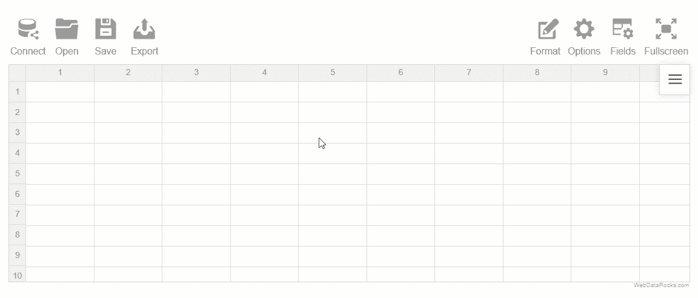
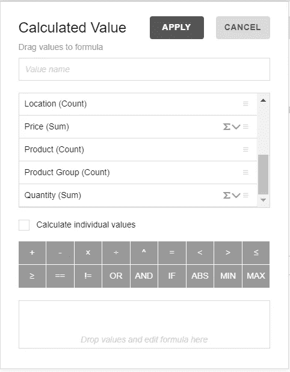
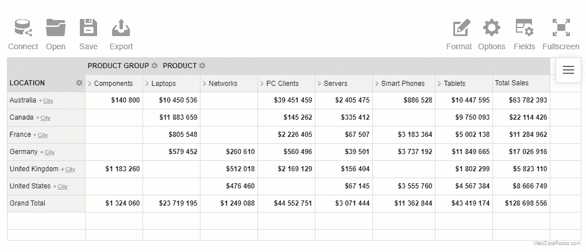
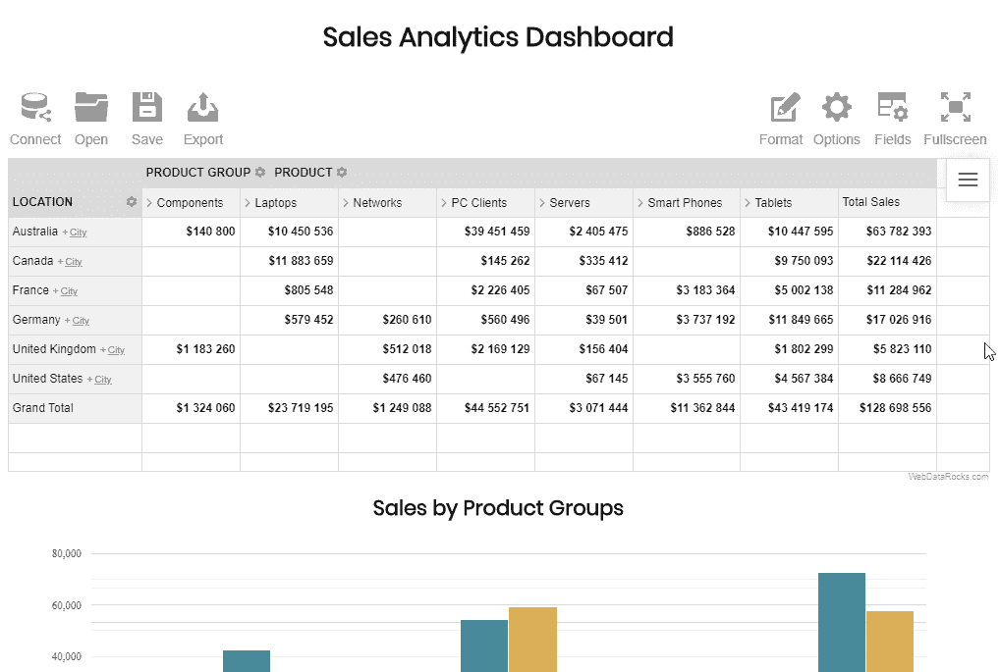
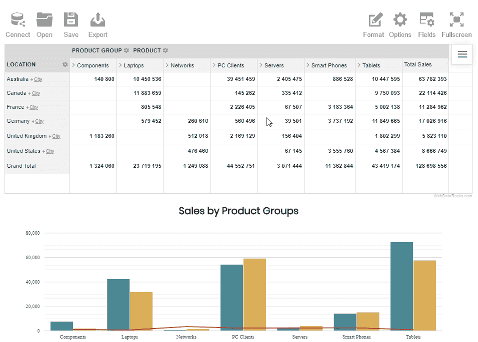

# 如何用免费的 JS 库构建实时仪表板:一步一步的指南

> 原文：<https://levelup.gitconnected.com/how-to-build-a-real-time-dashboard-with-free-js-libraries-a-step-by-step-guide-8993fdb1e78c>

当您使用静态报告为您的数据分析建立基线时，您应该始终记住，它们仅显示您的数据的**静态**视图。

为了实时查看，大多数数据分析师选择仪表板。这是因为它们提供了更多的机会来交互式地探索数据，这意味着您总是可以更深入地了解细节或了解全局。此外，任何团队成员都可以通过任何设备轻松访问它们。

仪表板是一种商业智能工具，有助于创建这些实时报告。它通过在单个页面上显示图表、图形和表格来反映数据的当前趋势并传达关键性能指标。它的主要*目的*是为任何部门的决策者提供对数据最重要方面的洞察。

应该是**灵活**？—是的。

对报告的要求将取决于该报告将用于的领域或公司部门。每个部门可能有无限数量的仪表板用于多个范围。这就是为什么仪表板应该具有足够的可定制性，以满足任何类型的分析(财务、营销、销售等)的不断变化的需求。

此外，由于仪表板由通常来自多个来源的数据驱动，最终用户应该能够将其连接到仪表板，在数据源之间切换，并以可消费的形式呈现数据。整个过程需要完全节省时间。

# 挑战

作为一名开发人员，有一天您可能会接到一个任务，要配置一个仪表板并将其嵌入到业务应用程序中。在您找到合适的工具之后，集成过程中可能会涉及许多繁重的工作:与软件堆栈的兼容性、定制挑战、支持的数据源、整体性能，当然还有预算限制。

# 解决方法是什么？

这就是免费 JavaScript 库的用武之地。

[**WebDataRocks**](https://www.webdatarocks.com/doc/intro/?r=gt1) 是一个允许聚合、过滤和排序数据的报告工具。

[**Google Charts**](https://developers.google.com/chart/) 是一个数据可视化库，提供了大量的图表和图形。

在他们的帮助下，您可以使用任何前端技术(包括 Angular、AngularJS、jQuery 和 React)为任何分析项目构建低成本但有效的解决方案。

这两个工具都是轻量级的，并且非常可定制。

今天我们将关注**创建一个完全个性化的仪表板来监控销售指标**。如果您渴望获得实践经验，请向下滚动到包含有用链接的部分并运行演示。它将通过动态报告和响应图表得到丰富。

我们真诚地希望这篇教程能帮助你更好地理解如何*结合数据透视表的分析特性和图表的表达能力。*

准备好了吗？

开始吧！

## 🔎第一步:定义你的问题和目标

*什么是没有目的的数据分析*？从一开始就设定你的目标是成功分析道路上的一个里程碑。最好对最终用户的长期目标有一个清晰的认识。

作为一个说明性的例子，让我们分析一个虚构的供应链的数据，以了解其每月的销售业绩以及客户的人口统计数据。

## 👨🏻‍💻步骤 2:添加报告工具

**数据透视表**是仪表板的引擎，因为它获取所有原始数据并将其转换为汇总形式。

首先，建立 WebDataRocks 的所有依赖项，并将其样式包含到您的网页的`<head>`中:

其次，创建一个包含数据透视表的容器:

## 💾步骤 3:准备并加载数据

从您的数据库、CRM 或任何其他数据源中提取 **CSV** 或 **JSON** 数据。

将它加载到数据透视表中有三个等价的选项:

*   通过指定数据文件的 URL:

*   通过用户界面连接到数据源:

*   通过定义一个返回 JSON 数据的函数:

## 📋步骤 4:创建报告并汇总数据

首先，设置一个**切片—** 这是报告中最重要的部分，您可以在其中指定将哪些层次结构放入行和列，为您的度量应用各种过滤和选择聚合函数。

为了扩展测量能力，计算值为您服务:

*   将“位置”层次放在行中，将“产品组”放在列中。
*   将“产品”层次结构放在“产品组”下，以便能够展开后者以获得更多详细信息。
*   创建了“销售”计算值，并将其用于衡量。它将帮助您跟踪我们组织的收入。

请参考文末的源代码，了解如何设置切片。

## 📊步骤 5:连接到图表库

既然您已经聚合了数据并在网格上显示了数据，那么通过将 Google Charts 库的可视化 API 加载器包含到您的 web 页面的`<head>`中来连接到 Google Charts 库:

之后，加载特定类型图表的包(在`<head>`或`<body>`部分):

此外，您需要为 Google Charts 添加 WebDataRocks 连接器，它可以处理特定图表类型的所有数据预处理:

最后，为图表添加一个容器:

## 📈**第六步:将图表绑定到数据透视表**

要使图表显示表中的数据，您需要为“reportcomplete”事件在数据透视表中附加一个事件处理程序。

要跟踪 pivot 和 Google Charts 的准备情况，添加两个标志变量:

此外，将`onGoogleChartsLoaded()`函数设置为在“corechart”包成功加载后运行的回调函数:

`onGoogleChartsLoaded()`负责从 pivot 获取数据，并启动实例化图表的函数:

类似地，您需要为饼图和条形图定义函数。

在每个函数的主体中，将图表类型指定为 getData()方法的输入参数，该方法本身会对该图表的数据进行预处理。您还可以传递与当前网格报告不同的数据切片。

作为第二个和第三个参数，传递充当回调和更新处理程序的函数，这意味着一旦数据被加载到数据透视表中或被更新，就会调用这些函数。这样，我们可以让图表对报告中最微小的变化做出反应。

此外，不要忘记设置图表选项，使它们看起来很棒。

## 🎨第七步:应用额外的选项

让我们使我们的仪表板更具表现力，并根据值定制网格单元。

使用`customizeCell`函数，我们将重新定义带有总计的单元格的样式和内容。

现在我们可以清楚地观察我们销售数据的趋势，不是吗？

## 🎉第八步:享受结果

总结所有步骤，今天你已经在实践中学会了如何用最少的代码、最大的灵活性和有效性来构建销售仪表板。现在，您可以与您的团队分享它，并帮助他们从数据中揭示更深层次的见解。

在[现场演示](https://codepen.io/webdatarocks/pen/VRmpXx)中查看完整代码。

您可以随时调整报告并实时获得数据的新视图**—只需拖放层次结构即可切换它们，展开或折叠它们的成员，并钻取记录以查看原始数据并揭示更多见解。您可以随意添加报告过滤器，以关注您最感兴趣的月份。**

****

## **有用的链接**

*   **[**销售仪表盘演示**](https://codepen.io/webdatarocks/pen/VRmpXx)**
*   **[WebDataRocks 快速入门指南](https://www.webdatarocks.com/doc/how-to-start-online-reporting/?r=gt1)**
*   **[谷歌图表快速入门指南](https://developers.google.com/chart/interactive/docs/quick_start/?r=gt1)**
*   **[如何将 WebDataRocks 数据透视表与谷歌图表集成](https://www.webdatarocks.com/doc/integration-with-google-charts/?r=gt1)**
*   **[**git connected 上的 JavaScript 教程**](https://gitconnected.com/learn/javascript) 用于加深您的 JavaScript 知识**

***最初发表于*[*www.webdatarocks.com*](https://www.webdatarocks.com/blog/creating-a-bi-dashboard-with-webdatarocks-and-google-charts/)**

****