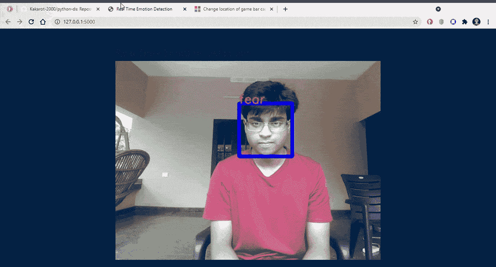
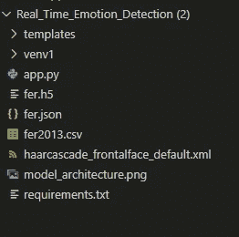
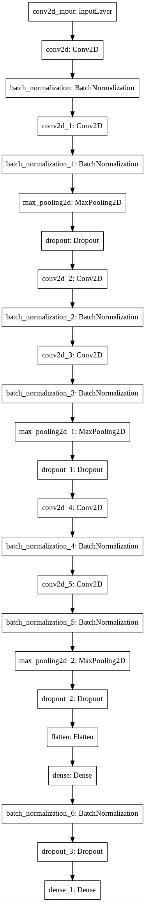
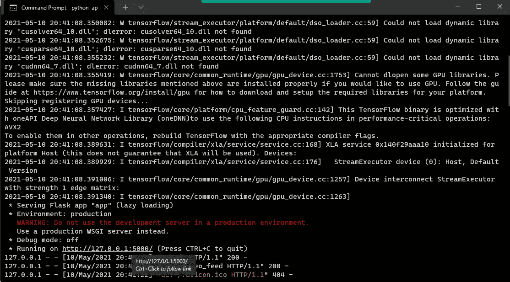

# 如何构建一个实时情绪检测 Web 应用程序💻

> 原文：<https://levelup.gitconnected.com/how-to-build-a-real-time-emotion-detection-web-app-ce7e3ed7b7de>

使用卷积神经网络检测多达 7 种情绪


马修·福涅尔在 [Unsplash](https://unsplash.com/s/photos/code?utm_source=unsplash&utm_medium=referral&utm_content=creditCopyText) 上拍摄的照片

在我们开始之前，请确保您熟悉先决条件。

# 先决条件

*   计算机编程语言
*   张量流+ Keras
*   瓶
*   OpenCV

这是我们完成后 web 应用程序的预览😄

[***这里是该项目的 GitHub 链接。***](https://github.com/Kakarot-2000/Real_Time_Emotion_Detection)



我不太善于表达，是吗？😐

# 1.安装

首先，创建一个工作目录并切换到它。

```
C:\Github>mkdir emotion-detection && cd emotion-detection
C:\Github\emotion-detection>
```

现在，我们需要下载数据集并将其复制到目录中。

[下载链接](https://www.kaggle.com/msambare/fer2013) : fer2013 数据集

接下来，让我们设置一个虚拟环境并安装需求。

```
C:\Github\emotion-detection>virtualenv venv1
C:\Github\emotion-detection>call venv1/Scripts/Activate
(venv1) C:\Github\emotion-detection> 
```

这是我们需要的图书馆的清单。

```
(venv1) C:\Github\emotion-detection>pip install -r requirements.txt
```

这是我们完成后文件夹结构的样子。



## 目录结构:

*   `templates` :包含 HTML 文件的文件夹
*   `app.py`:。包含 web 应用程序代码的 py 文件
*   `emotion_detection.py`:神经网络实现
*   `fer.h5`:保存的模型架构
*   `fer.json`:保存的模型权重

在我们完成安装包之后，我们可以开始训练模型^_^


图片来源:谷歌图片

# **2。训练模型**

创建一个文件`emotion_detection.py`来建立和训练模型。训练之后，我们将保存模型的架构和权重，以便我们可以直接加载它来获得结果。

第一步是导入所有需要的库。

接下来，让我们将数据分成训练集和测试集。在这里，我们有 7 类情绪，因此`num_classes` *是 7。*

接下来，我们对图像执行一些数据扩充以获得更好的结果。

该步骤通过执行诸如旋转、缩放、重新缩放、翻转图像等操作来扩充数据。

厉害！现在是时候建造神经 net‼了

你可以调整参数或者用不同的层数、激活函数等建立你自己的网络。



神经网络体系结构

好吧！下一步是使模型适合数据集。


我们都曾经有过这样的经历😐

***注意:如果你的模型训练时间太长，那么使用允许访问免费 GPU 或 TPU 进行训练的平台(例如:Google Colab，Kaggle)***

在 emotion_detection.py 文件的最后一部分，我们将保存模型的架构和权重。

在运行 emotion_detection.py 之后，我们应该在目录中有了`fer.json`和`fer.h5`。

# 3.构建 web 应用程序

我们将使用 flask 框架构建一个轻量级的 web 应用程序。在此之前，我们需要 OpenCV 的`haarcascade_frontalface_default.xml`来检测人脸。从 GitHub 中克隆 [OpenCV 的仓库](https://github.com/opencv/opencv)并将`.xml`文件复制到工作目录中。

现在我们来编码`app.py`。这里的第一步是导入库。

接下来，我们将把之前训练好的模型加载到`app.py`

网络摄像头馈送输入由 0 表示，因此`cv2.VideoCapture()`的参数为 0。接下来，我们从视频馈送中一个接一个地抓取帧，并转换它们以适应我们的神经网络的输入维度大小。然后，我们对图像帧进行预测，并返回该帧及其周围的文本框，并在框上标记情感！

**检测人脸的代码由** [**丹努什 M**](https://www.c-sharpcorner.com/members/dhanush-m2) **经** [***来源***](https://www.c-sharpcorner.com/article/real-time-emotion-detection-using-python/) **。**

作者: [**丹努什 M**](https://www.c-sharpcorner.com/members/dhanush-m2)

咻！只要再走一步，我们就完成了🔥

# 4.将静态文件(HTML、CSS)添加到模板文件夹

我们需要将 HTML 文件放在 templates 文件夹中，因为 Flask 会自动在那里查找。

就是这样！！现在我们可以运行代码来测试它了！！

*   运行 app.py

```
(venv1) C:\Github\emotion-detection>python app.py
```

*   在浏览器中输入本地主机地址



好了，最后一个迷因😉


向国王致敬👑