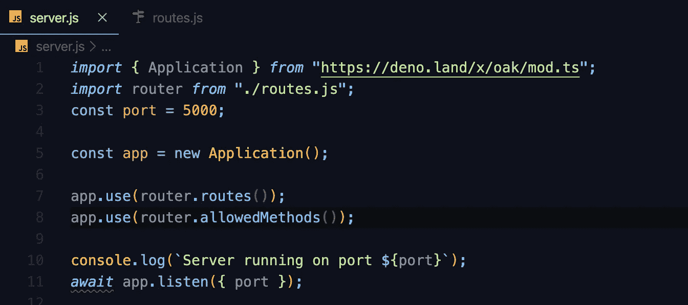
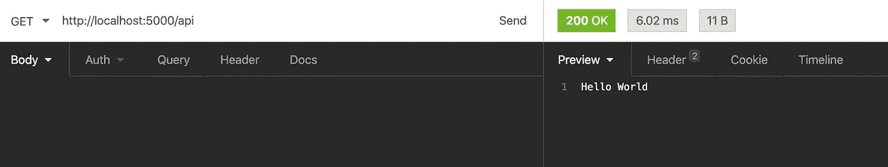
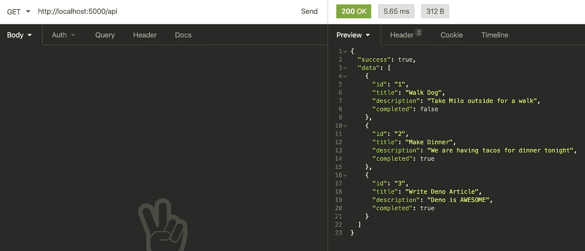

# 如何用 Deno 构建 Rest API

> 原文：<https://levelup.gitconnected.com/how-to-build-a-rest-api-with-deno-3a51fc2a2a2a>


*首先，我想说这不是一篇关于 Deno vs. Node 的文章。这仅仅是为了那些对学习如何开始使用这个新的运行时感兴趣的人。好吧，继续。*

首先，我假设您已经在计算机上安装了 Deno。如果你没有在这里停留一分钟，用你在这里找到的[和](https://deno.land/#installation)中最适合你的命令来安装它。

# 1.设置我们的 server.js 和 router.js 文件

我们要做的第一件事是创建我们的 server.js 文件。与 Node 非常相似，这将是我们的主要切入点。在这里，我们将设置我们的路由器，初始化我们的应用，等等。

在这里，我们的第一行代码将从 [oak](https://deno.land/x/oak) 导入我们的应用程序，oak 是 Deno 的 HTTP 服务器的中间件框架。

```
*import* {Application} *from* 'https://deno.land/x/oak/mod.ts'
```

接下来，我们将使用以下代码初始化我们的应用程序，并确定我们希望它在哪个端口上运行:

```
const port = 5000;
const app = new Application();
console.log(`Server running on port ${port}`);
await app.listen({port})
```

***我知道*** `***await***` ***对于那些习惯编写异步代码的人来说可能看起来有点时髦。但是，对于 Deno，我们有一个顶级的 await，所以我们不需要用异步函数包装任何东西来让它工作，只要它在全局范围内。***

在尝试运行之前，我们还将在这里添加我们的路线。有了 Node 和 express，我们可以运行我们现在拥有的一切，一切都会好的。但是，对于 Deno，我们需要添加一些中间件来运行它。

对于中间件，我们将使用 app.use()，如果你对 Node 很熟悉的话，你应该很熟悉它。

```
app.use(router.routes());app.use(router.allowedMethods()); 
//allowedMethods is going to allow us to use all CRUD operations.
```

我不喜欢让我的路由占用我的服务器文件，所以我将把它们移到它们自己的 routes.js 文件中。在这里，我将从 oak 导入路由器，初始化我们的路由器，编写我们的第一条路由，然后导出路由器，以便我们可以在 server.js 文件中访问它

```
*import* { Router } *from* "https://deno.land/x/oak/mod.ts";const router = new Router();router.get('/api', ({response}) => {
    response.body = 'Hello World!';
});*export* *default* router;
```

好了，现在我们只需要从我们的 routes.js 文件导入我们的路由器，您的 server.js 文件应该看起来有点像这样！



让我们试着运行我们的服务器！现在，对于 Deno，我们将需要网络访问才能使其工作。因此，我们将像这样运行我们的服务器

```
deno run --allow-net server.js
```

我将使用失眠来测试我的终点，但是你可以使用任何你喜欢的方法。当我向`http://localhost:5000/api`发出 get 请求时，我应该得到一个 200 OK 状态码和' *Hello World* '作为我的响应，我做到了！🎉



# 2.控制器

现在我们已经有了一个 ***非常*** 的基本 API 设置，下面我们来写一些函数。我将创建一个单独的控制器文件夹，并在该文件夹中创建一个`todos.ts`文件。是的，我们会涉足一些打字稿，我保证我们会成为更好的开发者。我现在不打算创建一个完整的数据库，所以我们只是将一些数据硬编码到这个文件中。

但是在我们这样做之前，因为我们将在这里使用一点 TypeScript，所以让我们在项目的根目录下创建一个`types.ts`文件，并将下面的代码放在那里。这将是我们的 todo 键值对的样子。

```
export interface Todo{
    id: string;
    title: string;
    description: string;
    completed: boolean;
}
```

好的，回到我们的`todos.ts`文件。在这里，我们将从我们的`types.ts`文件中导入我们刚刚创建的接口。之后，我将在我的 todos 和我的`todos.ts`文件中进行硬编码，现在看起来像这样！

```
*import* { Todo } *from* "../types.ts";let todos: Todo[] = [
  {
    id: '1',
    title: 'Walk Dog',
    description: "Take Milo outside for a walk",
    completed: false
  },
  {
    id: "2",
    title: "Make Dinner",
    description: "We are having tacos for dinner tonight",
    completed: true,
  },
  {
    id: "3",
    title: "Write Deno Article",
    description: "Deno is AWESOME",
    completed: true
  },
];
```

耶！现在，在同一个文件中，我要写我们讨论过的第一个函数。这将获取我们当前的所有待办事项，我们需要导出该功能，以便在路由器中访问它。

```
const getTodos = ({response}: {response: any}) => {
    response.body = {
        success: true,
        data: todos
    }
}export {getTodos}
```

现在，在我们的`routes.js`文件中，我们将像这样导入 getTodos 函数

```
*import* { getTodos } *from* './controllers/todos';
```

还记得我们开始时在 get 端点中使用的箭头函数吗？我们现在要用新的 getTodos 函数来替换它。

```
router.get("/api", getTodos);
```

现在，如果我们转向失眠症(或者您正在使用的任何东西)并再次测试原来的端点，我们应该有一个 200 OK 状态代码，我们的响应体应该有一个包含我们所有待办事项的数组！



好吧！让我们重复同样的过程，为其余的 CRUD 操作添加适当的逻辑，然后嘣！我们现在有了一个用 Deno 构建的全功能 CRUD API！

如果您在这个过程中迷路了，或者只是想看看我的 CRUD 操作的其余部分是什么样子，您可以在这里找到我的 repo