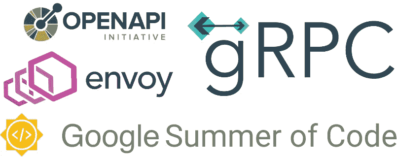
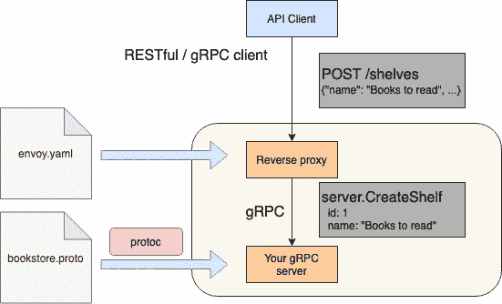
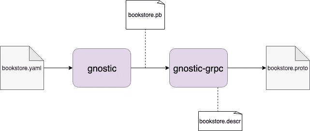

# 如何用 gRPC 构建 REST API，两全其美

> 原文：<https://levelup.gitconnected.com/how-to-build-a-rest-api-with-grpc-and-get-the-best-of-two-worlds-9a4e491f30ae>

## 从 OpenAPI 描述中构建一个具有 REST 支持的 gRPC 服务。



作为这个谷歌代码之夏项目的一部分，我有机会与 Tim 和 Noah(谷歌的两位软件工程师)一起开发一个叫做 [gnostic-grpc](https://github.com/googleapis/gnostic-grpc/) 的工具。该工具将 OpenAPI v3.0 API 描述转换为 gRPC 服务的描述，可以使用 gRPC-JSON 代码转换来实现该 API。gRPC 服务是用协议缓冲区语言描述的。proto)。

有了 gRPC 服务的转换描述，您可以用您选择的任何编程语言生成 API。

如果你需要 gRPC、OpenAPI 和协议缓冲区的介绍，我向[推荐 Tim 的这篇](https://medium.com/apis-and-digital-transformation/openapi-and-grpc-side-by-side-b6afb08f75ed)优秀博客。

以下教程假设您对协议缓冲区和[协议编译器](https://github.com/protocolbuffers/protobuf#protocol-compiler-installation)的设置有基本的了解。

# 教程— gRPC 网关插件

本教程有七个步骤:

1.  生成 gRPC 服务(。proto)来自 OpenAPI 描述。
2.  为 gRPC 服务生成服务器端支持代码。
3.  实现服务器逻辑。
4.  为特使代理生成描述符集。
5.  设置提供 HTTP 代码转换的特使代理。
6.  运行 gRPC 服务器。
7.  用 curl 和 gRPC 客户机测试您的 API。

在本教程的最后，我们的架构看起来像这样:



**先决条件:**

让我们先来看看插件:

```
go get -u github.com/googleapis/gnostic-grpc
```

理想情况下，当您在 examples/end-to-end [目录](https://github.com/googleapis/gnostic-grpc/tree/master/examples/end-to-end)中时，您可以遵循这些步骤。

现在我们得到了我们需要的其他依赖项:

```
go get -u github.com/googleapis/gnostic
go get -u github.com/golang/protobuf/protoc-gen-go
go get -u google.golang.org/grpc
```

gnostic 是一个命令行工具，它将 OpenAPI 描述转换成等价的协议缓冲区表示。gnostic-grpc 是 gnostic 的一个插件。

[Protocol-gen-go](https://github.com/golang/protobuf/tree/master/protoc-gen-go)是 Protocol 编译器的一个插件，用于从协议缓冲区定义中生成 Go 源代码。

最后，我们得到了 [grpc](http://grpc.io) 。

为简单起见，我们在当前终端内部创建了一个临时环境变量:

```
export ANNOTATIONS="third-party/googleapis"
```

**第一步:**

在 examples/end-to-end 目录中执行插件，从给定的 OpenAPI 描述(bookstore.yaml)中获取协议缓冲区定义:

```
gnostic --grpc-out=. bookstore.yaml
```

这个命令生成了 bookstore.proto 文件。这些警告描述了 OpenAPI 描述的哪些部分没有反映在输出文件中。

在幕后，该命令触发 gnostic，它生成 OpenAPI 描述的二进制协议缓冲区表示。这个表示然后被用来构建一个[文件描述符集](https://godoc.org/github.com/golang/protobuf/protoc-gen-go/descriptor#FileDescriptorSet)。FileDescriptorSet 本质上表示。我们想要生成的原型文件。然后我们使用 [protoreflect](https://github.com/jhump/protoreflect) 来生成输出文件。



诺斯替和诺斯替-grpc

**第二步:**

现在我们生成 gRPC 存根:

```
protoc --proto_path=. --proto_path=${ANNOTATIONS} --go_out=plugins=grpc:bookstore bookstore.proto
```

这个命令生成文件 bookstore/bookstore.pb.go。

— proto_path=。告诉协议编译器在当前目录中查找。原型文件。

— proto_path=${ANNOTATIONS}告诉协议编译器在第三方/googleapis 目录中查找。原型文件。注释是定义 gRPC/REST 映射所必需的。

— go_out=plugins=grpc:bookstore 告诉 protoc 编译器使用 grpc 插件生成 go 源代码。输出应该生成到一个名为 bookstore 的目录中。

bookstore.proto 是编译器的输入文件。

**第三步:**

我们在 [bookstore/server.go 中提供了一个服务器逻辑的示例实现。](https://github.com/googleapis/gnostic-grpc/blob/master/examples/end-to-end/bookstore/server.go)之前生成的所有数据结构都在该服务器中使用。

**第四步:**

给定 bookstore.proto 文件，我们可以使用 protocol 生成 FileDescriptorSet:

```
protoc --proto_path=${ANNOTATIONS} --proto_path=. --include_imports --include_source_info --descriptor_set_out=envoy-proxy/proto.pb bookstore.proto
```

这将生成文件 envoy-proxy/proto.pb。正如在另一个教程的第一步中所解释的，FileDescriptorSet 以二进制格式表示一个. proto 文件。本质上它等于 bookstore.descr 我们在步骤 1 的图“gnostic 和 gnostic-grpc”中看到的。

**第五步:**

文件[包含一个带有 gRPC-JSON](https://github.com/googleapis/gnostic-grpc/blob/master/examples/end-to-end/envoy-proxy/envoy.yaml) [代码转换器](https://www.envoyproxy.io/docs/envoy/latest/configuration/http_filters/grpc_json_transcoder_filter)的特使配置。根据配置，端口 51051 将 gRPC 请求代理到运行在 localhost:50051 上的 gRPC 服务器，并使用 gRPC-JSON 代码转换器过滤器来提供 RESTful JSON 映射。即:您可以向 localhost:51051 发出 gRPC 或 RESTful JSON 请求。

使用 docker 获取特使图像:

```
docker pull envoyproxy/envoy-dev:bcc66c6b74c365d1d2834cfe15b847ae13be0eb6
```

文件 [envoy-proxy/Dockerfile](https://github.com/googleapis/gnostic-grpc/blob/master/examples/end-to-end/envoy-proxy/Dockerfile) 使用我们刚刚提取的 envoy 映像作为基础映像，并将 envoy.yaml 和 proto.pb 复制到 docker 容器的文件系统中:

```
FROM envoyproxy/envoy dev:bcc66c6b74c365d1d2834cfe15b847ae13be0eb6
COPY envoy.yaml /etc/envoy/envoy.yaml
COPY proto.pb /tmp/envoy/proto.pb
```

从 docker 文件构建 docker 映像:

```
docker build -t envoy:v1 envoy-proxy
```

使用端口 51051 上创建的映像运行 docker 容器:

```
docker run -d --name envoy -p 9901:9901 -p 51051:51051 envoy:v1
```

**第六步:**

在端口 50051 上运行 gRPC 服务器:

```
go run main.go
```

**第七步:**

现在让我们测试我们的 gRPC/REST API:

在新终端内部，我们创建了一个货架:

```
*curl -X POST \
http://localhost:51051/shelves \
-H 'Content-Type: application/json' \
-d '{
    "name": "Books I need to read",
    "theme": "Non-fiction"
}'*
```

要检查这是否可行，我们需要所有现有的货架:

```
curl -X GET [http://localhost:51051/shelves](http://localhost:8081/shelves)
```

现在，我们为 id 为 1 的 shelve(我们刚刚创建的 shelve)创建一本书:

```
*curl -X POST \
http://localhost:51051/shelves/1/books \
-H 'Content-Type: application/json' \
-d '{
    "author": "Hans Rosling",
    "name": "Factfulness",
    "title": "Factfulness: Ten Reasons We'\''re wrong about the world - and Why Things Are Better Than You Think"
}'*
```

要列出 id 为 1 的书架上的所有书籍，我们可以调用:

```
curl -X GET [http://localhost:51051/shelves/1/books](http://localhost:8081/shelves/1/books)
```

好了，看起来我们的 REST API 正在工作。gRPC 客户端怎么样？

在 grpc-client/client.go 中，我们提供了一个 grpc 客户端的示例实现。客户打印您货架上的所有主题:

```
client := bookstore.NewBookstoreClient(conn) 
ctx, _ := context.WithTimeout(context.Background(), 10*time.Second) res, err := client.ListShelves(ctx, &empty.Empty{}) 
if res != nil {
 fmt.Println("The themes of your shelves:")
 for _, shelf := range res.Ok.ListShelvesResponse.Shelves {
   fmt.Println(shelf.Theme)
 }
}
```

要运行客户端，请执行以下命令:

```
go run grpc-client/client.go
```

请注意，gRPC 客户端也调用 envoy 代理(端口 51051)，而**而不是**直接调用 gRPC 服务器(端口 50051)。但是，在 gRPC 客户端中，您也可以将端口更改为 50051。

# 最后一句话:

综上所述:我们可以看到，我们可以生成大量的代码，我们通常不得不手动编码，这更容易出错。请随意给 gnostic-grpc 投稿。