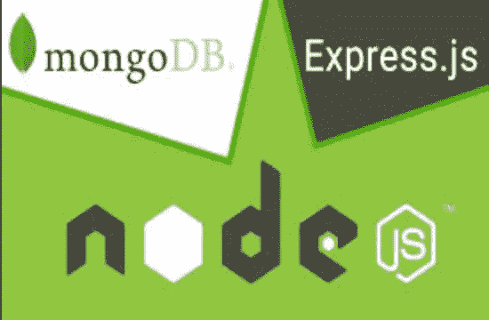
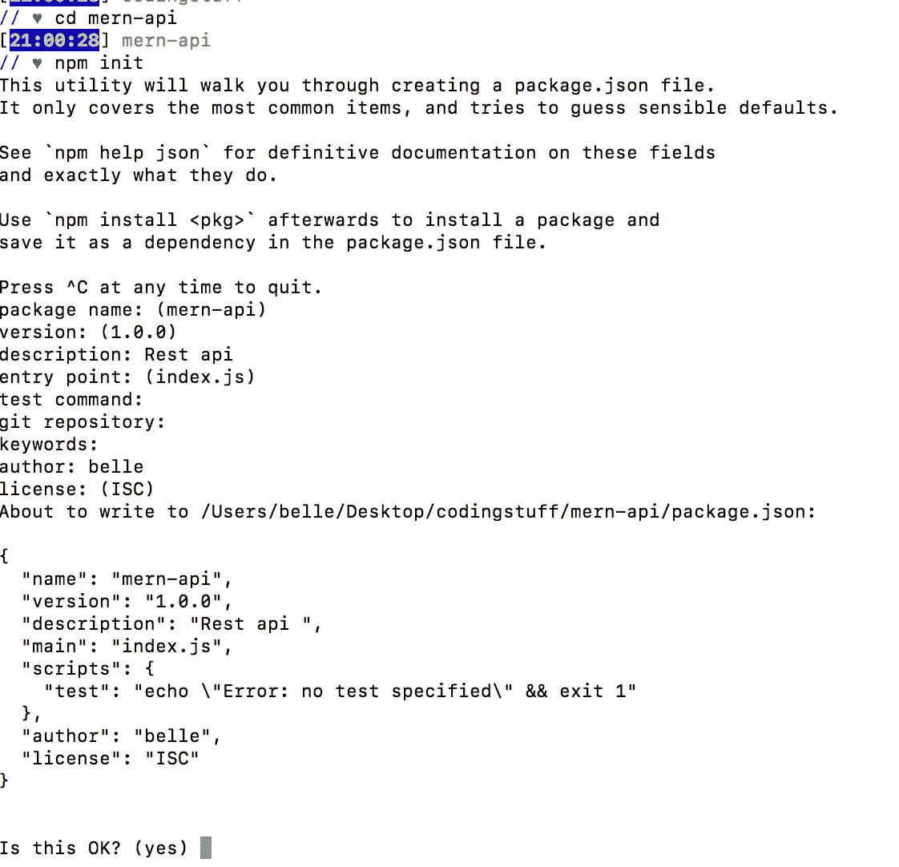
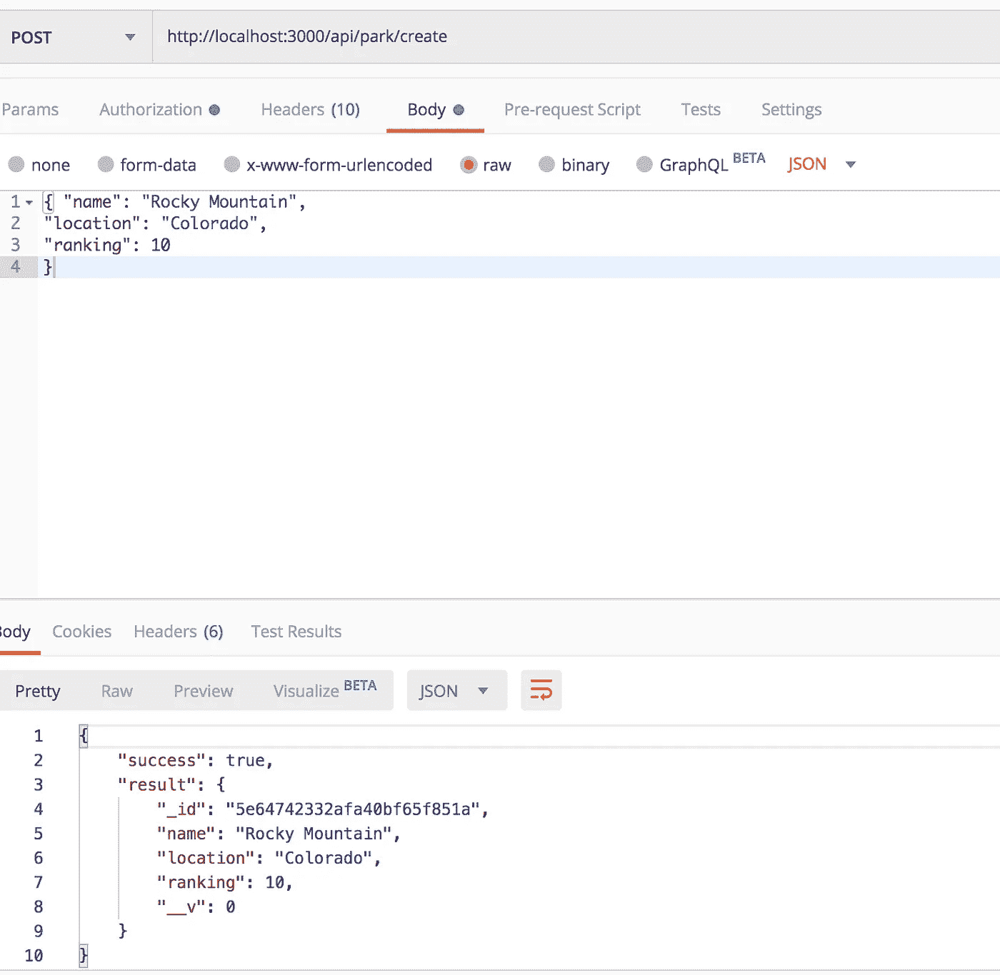
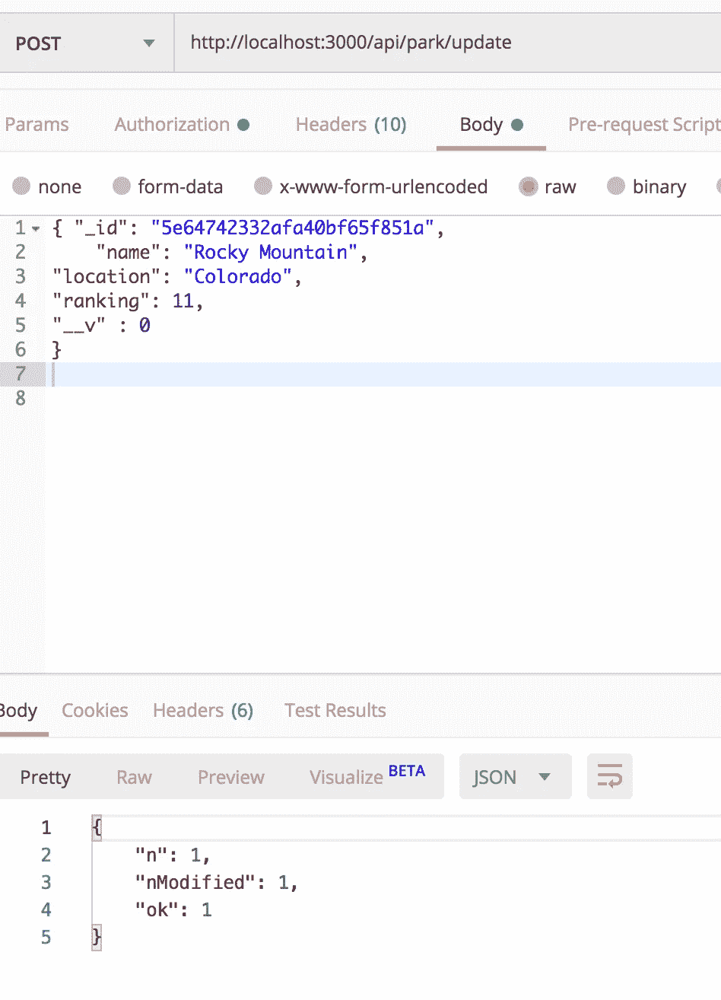
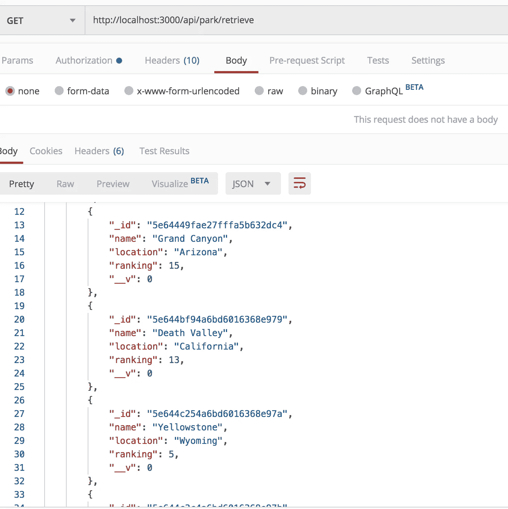
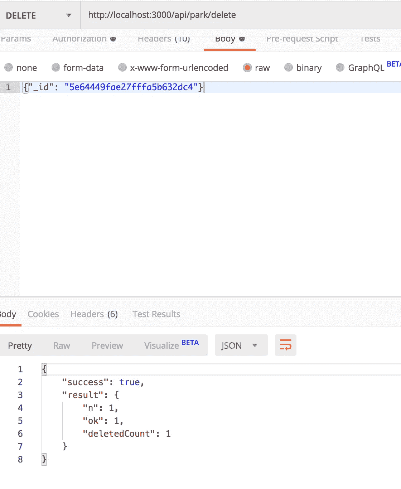

# 如何使用 Node.js、Express 和 MongoDB 构建 RESTful API

> 原文：<https://levelup.gitconnected.com/how-to-build-a-restful-api-using-node-js-express-mongodb-1882a966726c>



如果你是一名网络开发人员，你可能已经听过太多次“MERN”或“卑鄙”的说法了。不，不是饥饿生物噪音，也不是病毒(那是 MRSA)。它也不是一个不满的软件，因为你不接它的电话而生气。

MERN 代表“MongoDB，Express，React，Node”意思是一样的，只是不是“反应”，而是“有角的”“M”、“E”、“N”将作为你的后端,“R”和“A”是前端库。自从我对客户端 JavaScript 越来越熟悉之后，我就一直对深入服务器端很感兴趣。在这篇博客中，我将介绍如何使用 Node.js、Express 和 MongoDB 构建 RESTful API。我已经决定建造一个国家公园 API，因为春天就要来了，我一直有极端的旅游癖。


我喜欢大自然。

对于本教程，您需要进行以下设置:

*   **Node.js** →服务器端 JavaScript
*   **Express.js** →节点 web 框架
*   **MongoDB** →数据库
*   **猫鼬** →数据库结构化系统
*   **邮递员** →用于测试有请求的 API

## 启动 package.json 文件

在终端中，`cd`进入创建 API 的目录。输入`npm init`，这将启动一个新的节点包；该节点需要知道您将使用什么依赖项。应该会提示您以下信息:



在您喜欢的文本编辑器中打开文件(我使用 VSCode)。在终端中，输入`npm i express mongoose`。之后，输入`npm i -D nodemon`安装 nodemon，它允许你运行你的服务器并自动更新你的代码，这样你就不必在每次修改后重启你的服务器。

打开 package.json 文件。在`"scripts"`下应该是什么样子:

```
"scripts": {
"start": "nodemon server.js"}
```

## 创建 server.js 文件

在根目录中创建 server.js 文件。输入以下代码:

```
const express = require('express');
const mongoose = require('mongoose');
const app = express()*//Database**//Middleware**//Controllers**//Routes**//Start Server*
```

我们应该做的第一件事是设置数据库，然后是中间件、控制器、路由，最后是启动服务器。

要创建数据库，请输入以下代码:

```
//Database
mongoose.connect('mongodb://127.0.0.1:27017/parkdb', {useNewUrlParser: true }).then(() => console.log("Connected to database")).catch(*err* => console.log(err))
```

要获得您的 mongoDB url，请在您的终端中键入`mongo`。这里我们使用了一个承诺，让我们知道数据库连接是成功的还是捕获了一个错误。

要在启动服务器之后、输入路由之前设置中间件，请输入以下代码:

```
*//Middleware* app.use(express.urlencoded({ extended: true}))app.use(express.json())
```

在这里，我们设置了一种解析 JSON 的方法，而不会在 Express 中出现任何错误。这段代码允许我们使用 JSON。第一行允许我们使用表单数据。

让我们现在启动我们的服务器。输入以下代码:

```
*//Start Server* app.listen(3000, ()=> console.log("Server started on 3000"))
```

## 创建模型文件夹

我们现在将在回购中创建一个“模型”文件夹。在这个“模型”文件夹中，让我们创建一个名为`ParkModel.js`的文件。这将建立我们的数据库结构。输入以下代码:

```
const mongoose = require('mongoose');
const Schema = mongoose.Schemaconst ParkSchema = new Schema({name: String,
location: String,
ranking: Number})module.exports = mongoose.model('park', ParkSchema)
```

我们的国家公园模式将接受名称、位置和排名。为了实际创建一个模型，我们需要导出模型，这就是我们在最后一行所做的。

## 创建控制器文件夹

接下来，在我们的根目录下创建一个“控制器”文件夹。在“控制器”文件夹中，创建一个名为`ParkControl.js`的文件。在这个文件中，我们将有我们的 CRUD(创建、读取、更新、删除)方法。输入以下代码:

每个方法都接受一个请求(req)和一个响应(res)。

*   **创建**:我们正在根据公园模型创建一个新公园。然后，我们调用`park.save()`将新的公园实例保存到数据库中。接下来，我们称之为承诺，以捕捉错误或让我们知道一个新公园的创建是成功的。
*   **更新**:首先，我们需要通过 ID 找到一个特定的公园。如果公园不存在/找不到 ID，我们会收到一条错误消息。如果公园确实存在，它应该更新公园并返回公园。
*   **检索:**调用 ParkModel 上的`find`。如果找不到公园，我们会收到一条错误消息。否则，公园被归还。
*   **删除:**调用 ParkModel 上的`remove`，传入具体的公园 ID。

## 在 Server.js 文件中输入路线和控制器

回到 server.js 文件，我们现在输入路由和控制器。

```
*//Controllers*const ParkControl = require('./controllers/ParkControl')*//Routes*app.post('/api/park/create', ParkControl.create)
app.post('/api/park/update', ParkControl.update)
app.get('/api/park/retrieve', ParkControl.retrieve)
app.delete('/api/park/delete', ParkControl.delete)
```

## 在邮递员身上测试我们的国家公园 API

让我们打开 Postman 并测试所有的请求，看看我们的 API 是否工作正常。首先，我们将检查我们的" **create** "方法。



洛基山被成功创造出来。

接下来，是更新方法。把排名改成 11，看看行不行。



“1”表示真实。因此，更新是成功的。

我们能找回所有的公园吗？



是的，我们可以。

最后，让我们检查一下我们的删除方法，从数据库中删除“Grand Canyon”。我们只需要传入 ID。



删除大峡谷成功。

这就是了。您已经使用 Node、Express 和 MongoDB 出色地构建了一个完整的 RESTful CRUD API。你现在离成为 JavaScript 皇室又近了一步。