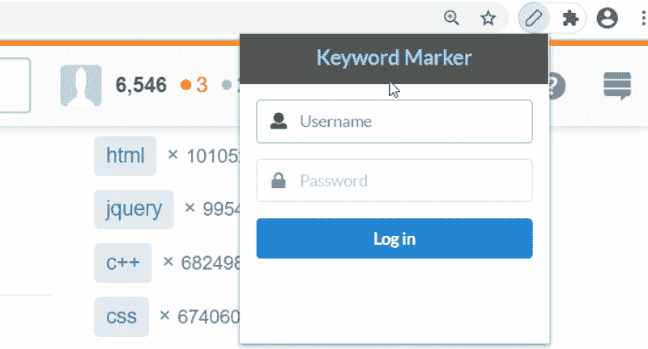
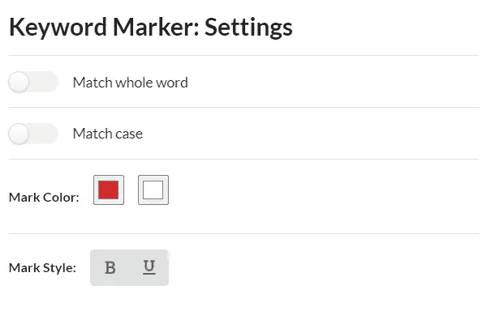

# 如何用 Create React App 和 Redux 快速构建富 Chrome 扩展

> 原文：<https://levelup.gitconnected.com/how-to-build-a-rich-chrome-extension-quickly-with-create-react-app-and-redux-d9b64cf64832>



在本教程中，你将学习如何使用 Create React App 和 Redux 以一种方便且(相对)快速的方式构建一个具有丰富 UI 的成熟 Chrome 扩展。它假设了 [React](https://reactjs.org/) 和 [Redux](https://redux.js.org/) 以及 [ES 6+语法](https://create-react-app.dev/docs/supported-browsers-features#supported-language-features)的基础知识。

# 规格

在本教程中，我们将构建一个扩展，通过颜色和一些可选的样式来标记(突出显示)页面上的特定关键字。它将使用所有可能的扩展组件(背景和内容脚本、弹出页面和其他 UI 元素)以及一些最常用的 Chrome APIs。

提到的*关键字*将在扩展之外指定——在某个远程 web 服务器上，该服务器通过 API 提供带有某种认证的数据。该扩展将允许用户登录到这个远程服务器，并获取与他或她的帐户相关的关键字(以及公共名称)，这些关键字必须显示在适当的 UI 块中。一旦关键字被加载，用户应该可以选择通过打开相应 UI 块中的某个开关来标记它们在活动页面(选项卡)上的出现。当关键字的出现被标记时，扩展应该在相应的 UI 块中显示每个关键字的出现计数。

为了缩小扩展的范围，让这样的“标记”操作(以及下面描述的“取消标记”)只应用于特定的站点，让它们成为 StackOverflow/StackExchange 网络站点。然后，如果“标记”开关被打开并且活动标签被改变，扩展应该自动标记关键字在新页面上的出现，而无需用户交互。当开关关闭时，扩展应该“取消标记”关键字，即放弃由最后的“标记”操作在页面上做出的改变，如果有的话，并且这必须在所有打开的标签上完成，而不仅仅是活动的标签。用户必须能够通过弹出页面访问所描述的功能。

该扩展还将通过浏览器工具栏中的一些专用图标和徽章来指示其当前状态。工具栏图标将指示用户是登录还是注销。用户身份验证的这些状态必须由两个独立的图像来表示。工具栏徽章将显示关键字在活动页面上出现的总次数(如果有)。只有当用户登录并且“标记”开关打开时，它才必须显示(在工具栏图标的顶部)。

此外，该扩展将允许用户自定义关键字搜索和标记风格的专用设置(选项)页面可通过提到的弹出页面访问。关键字搜索必须由两个参数定制:全词匹配和大小写匹配。关键字标记样式将包括:背景和前景颜色以及可选的大胆和下划线。



设置页面外观

这就是我们扩展的规格。我知道，看起来做作，毫无意义)。人们可能希望这个扩展做更多(真正)有用的事情，比如按标签/用户过滤内容等。但这种扩展将被绑定到当前网站的布局，并停止工作，一旦它得到关键的变化。相比之下，指定的扩展不依赖于布局，可能总是适用于任何站点。因此，不必维护它)。

# 必备设置

***注意*** :下面的说明假设您的本地机器上安装了带有 NPM 的 Node v8.10+。

## 创建 React 应用

首先，我们必须[创建](https://create-react-app.dev/docs/getting-started/#creating-an-app)一个新的 Create React App 项目，我们将其命名为`my-ext`，并应用自定义模板`[complex-browserext](https://www.npmjs.com/package/cra-template-complex-browserext)`。这可以通过以下命令来完成:

```
npx create-react-app my-ext --template complex-browserext
```

安装后，我们的项目应该具有以下文件夹结构:

```
my-ext/
  README.md
  package.json
  public/
    index.html
    options.html
    manifest.json
  src/
    background.js
    content.js
    index.js
    options.js
    views/
      Popup/
        App.css
        App.js
        App.test.js
      Options/
        App.css
        App.js
        App.test.js
```

`public/index.html`和`public/options.html`文件分别包含弹出和设置(选项)页面的 HTML 模板，而`src/index.js`和`src/options.js`文件代表各自的 JS 入口点。`src/background.js`和`src/content.js`文件分别代表后台和内容脚本的入口点。所有这些路径/文件名都是在 Create React App config 中硬编码的，因此不能更改。

`src/views/Popup`和`src/views/Options`文件夹应该分别保存弹出页面和设置页面的 React 组件和 CSS 样式。创建 React 应用程序已经为弹出页面和设置页面创建了 React 组件及其 CSS 样式的样板文件。这些文件夹里默认还有 Create React App 创建的测试文件`*.test.js`。由于编写单元测试超出了本教程的范围，我们可以删除所有的测试文件。

## 其他必要条件

除了创建 React 应用程序设置，我们还需要在我们的项目中安装一些库/包。首先，如题所示，我们需要 [Redux](https://www.github.com/reduxjs/redux) 以及它与 React 的联系——[React Redux](https://github.com/reduxjs/react-redux)。此外，由于 Redux 不应该在复杂的 Chrome 扩展中工作(比如我们的扩展)，我们需要一种方法来使它适应我们的环境。为此，我们将使用[redux Chrome Storage](https://github.com/hindmost/reduxed-chrome-storage)库。最后，我们需要一些 UI 设计的框架，这样我们就不必从头开始构建扩展的 UI。我们将使用语义 UI，或者更准确地说是它的 React 集成— [语义 UI React](https://github.com/Semantic-Org/Semantic-UI-React) ，以及它的[默认 CSS 主题](https://github.com/Semantic-Org/Semantic-UI-CSS)。

下面是在一行中安装这些软件包的命令:

```
npm install redux react-redux reduxed-chrome-storage semantic-ui-react semantic-ui-css
```

# 显示

每个扩展都以其清单[开始。Create React App 已经为我们创建了一个清单文件:`public/manifest.json`。但是它只能满足扩展样板的最低需求。由于我们的扩展不仅仅是一个样板文件，我们需要在清单中进行一些添加/修改。](https://developer.chrome.com/extensions/extensions/manifest)

首先，我们必须为我们的扩展声明权限。它将使用`[chrome.storage](https://developer.chrome.com/extensions/storage)` API 来存储/管理状态，使用`[chrome.tabs](https://developer.chrome.com/extensions/tabs)` API 来显示工具栏图标和徽章。为了使用`chrome.storage`，我们需要`storage`的许可。在我们的例子中，使用`chrome.tabs` API 不需要任何许可(因为我们不需要访问标签 url 和其他敏感数据)。所以我们只需要在清单中声明`storage`权限。

由于我们的扩展不会使用`[webRequest](https://developer.chrome.com/extensions/webRequest)` API，我们必须声明(注册)我们的后台脚本为非持久的。虽然这不是一个要求，但是官方文件强烈建议这样做[。](https://developer.chrome.com/extensions/background_pages)

因为我们的扩展应该只对 StackOverflow/StackExchange 站点有效，所以我们必须在`“content_scripts”`字段中为已经存在的(由 Create React App 准备的)条目指定适当的[匹配模式](https://developer.chrome.com/extensions/content_scripts#declaratively)。

此外，我们必须指定扩展的图标以及默认的工具栏图标。扩展的图标代表扩展本身，例如显示在扩展管理页面中。当扩展不能控制它的外观时，默认工具栏图标默认显示在浏览器的工具栏中。

正如规范所建议的，我们扩展中的工具栏图标将显示对应于“注销”和“登录”状态的两个图像之一。我们可以使用第一个(“注销”)作为默认的工具栏图标，第二个作为扩展的图标。所以最终我们只需要两张图片。然而，我们必须为扩展的图标和默认工具栏图标提供每个图像的多种尺寸变量。[扩展图标](https://developer.chrome.com/extensions/manifest/icons)的尺寸变量登记在清单的`“icons”`字段下。[默认工具栏图标](https://developer.chrome.com/extensions/user_interface#icons)的尺寸变量注册在清单中`”browser_action”`或`”page_action”`字段下的`“default_icon”`属性中。因为我们的扩展应该也有一个工具栏徽章，我们将使用`”browser_action”`字段。官方文档建议为扩展的图标提供至少 16x16、32x32、48x48 和 128x128 的尺寸，为默认工具栏图标提供至少 16x16 和 32x32 的尺寸。图标图像的设计超出了本教程的范围。所以这里我只参考自己做的一套现成的图片:`icon-outlined-16.png`、`icon-outlined-32.png`、`icon-filled-16.png`、`icon-filled-32.png`、`icon-filled-48.png`、`icon-filled-128.png`。前两个代表“注销”状态，将用于默认的工具栏图标，剩下的代表“登录”状态，用于扩展的图标。

最后，我们需要指定扩展的名称(让它成为“关键字标记”)以及对它的一些描述。

下面是生成的清单文件:

# API(模拟)

正如规范所建议的，扩展将向远程 API 发出 HTTP 请求，即两种类型的请求:身份验证(登录)和获取与登录用户帐户相关联的名称和关键字。让第一个(身份验证)请求接收带有用户名/密码参数的 JSON，并返回 JSON，其中`“token”`字段设置为某个令牌字符串，布尔`“ok”`字段设置为`true` —如果成功(例如`{“ok”: true, “token”: “token”}`)，如果失败— JSON 的`“ok”`字段设置为`false`，而`“message”`字段设置为某个消息文本(例如`{“ok”: false, “message”: “message”}`)。并让第二个(fetch)请求接收认证令牌作为参数，并返回 JSON，其中将`“ok”`字段设置为`true`并将包含所请求的名称和关键字的`“data”`字段作为子字段(例如`{ “ok”: true, “data”: { “name”: “name”, “keywords”: “keywords”} }` ) —在成功的情况下，以及在失败的情况下—与失败的认证请求中相同的 JSON。

API 后端开发超出了本教程的范围。所以这里我们将使用一个 API 的模拟——一组模拟 API 工作的函数。我们的 API mock 将有两个对应于上述 API 请求的函数:`auth`和`fetchProfile`。下面是它们使用 Promises、`setTimeout`和一些预定义的数据数组的实现:

`src/api/index.js`

***注*** :以上代码仅用于原型制作或调试/测试目的。不要在生产中使用这样的代码！

# 状态管理

我们的扩展的状态必须使用 Redux 来管理。但是在处理 Redux 之前，让我们先定义在状态中存储什么数据。正如规范所建议的，我们需要将以下数据(属性)分为三类:

1.  身份验证和帐户相关数据:身份验证令牌和帐户的名称和关键字。让我们命名各自的状态属性`token`、`name`和`keywords`。`token`必须用于 API 请求，同时用作“已登录”布尔标志:当它被设置为某个字符串值时，表示“已登录”状态，否则，如果它被设置为假值，则表示“已注销”状态。
2.  标记状态数据:“标记”开关布尔标志和关键字出现计数数组。让我们将各自的状态属性命名为`enabled`和`stats`。`stats`数组的内容必须显示在弹出页面中适当的 UI 块中。此外，它将用于显示关键字出现的总次数(可从`stats`数组中减少)。
3.  设置数据:全字匹配、大小写匹配、标记的背景和前景色以及粗体和下划线。让我们为各自的状态属性命名为`matchWhole`、`matchCase`、`color`、`colorBg`、`bold`和`underline`。

下面是我们国家的结构应该是什么样子:

现在我们可以通过编写动作创建者和减少者来为我们的扩展建立一个 Redux 存储。

## 动作创建者

`src/actions/account.js`

`src/actions/marker.js`

`src/actions/settings.js`

`src/actions/index.js`

## 还原剂

`src/reducers/account.js`

src/reducers/marker.js

`src/reducers/settings.js`

`src/reducers/index.js`

# 设置(选项)页面

让我们从设置页面开始制作 UI 页面，因为它应该比弹出页面简单。

Create React App 已经为我们的设置(选项)页面创建了必要的样板文件:`src/options.js` (JS 入口点)`src/views/Options/App.js`(根 React 组件)和`src/views/Options/App.css` (CSS 样式)。

首先，我们必须修改根 React 组件及其 CSS 样式，使它们适合我们的设计。我们将为设置页面使用以下语义 UI 组件:`Form`、`Checkbox`、`Button`和`Divider`。我们还必须将这个 React 组件与适当的状态属性和 Redux 动作创建者连接起来。我们需要`settings`类别的所有属性以及所有与设置相关的动作创建者:`setMatchWhole`、`setMatchCase`、`setColor`、`setColorBg`、`setBold`、`setUnderline`。

下面是生成的根 React 组件及其 CSS 文件:

`src/views/Options/App.js`

`src/views/Options/App.css`

现在我们必须为设置页面设置入口点。由 Create React App 创建的样板文件`src/options.js`，仅将 React 渲染设置为 DOM。除此之外，我们必须使用提到的 Reduxed Chrome 存储库获得 Redux store 的工作本地实例。我们将使用它的[异步/等待用法](https://github.com/hindmost/reduxed-chrome-storage#advanced-way-asyncawait)语法。然后，我们必须通过用 React Redux 提供的特殊`<Provider>`组件包装 React 组件，使实例化的 Redux 存储对上述 React 组件可用/可见。此外，我们必须导入语义 UI 的默认 CSS 主题。

下面是设置页面的结果入口点:

`src/options.js`

# 弹出页面

与设置页面类似，首先我们必须对根 React 组件及其 CSS 样式进行更改，以使它们适合弹出页面的设计。与设置页面不同，弹出页面应该使用更复杂的条件渲染。具体来说，我们必须根据用户是否经过身份验证(登录)来呈现不同的视图。这意味着除了根 React 组件之外，我们还需要两个子组件，分别与经过身份验证和未经身份验证的用户相关联，让我们分别将它们命名为`Authed`和`Unauthed`。

弹出页面的根 React 组件将只使用一个语义 UI 组件— `Header`。此外，我们必须将这个根 React 组件与适当的状态属性和 Redux 动作创建者连接起来。我们需要`account`和`marker`类别的所有属性，以及所有与账户和标记相关的动作创建者:`accountAuth`、`accountProfile`、`accountLogout`、`setEnabled`、`setStats`。

下面是生成的根 React 组件及其 CSS 文件:

`src/views/Popup/App.js`

`src/views/Popup/App.css`

注意，除了根和子组件的样式，我们还为`<body>`元素设置了固定的大小。这是必要的，因为我们的弹出窗口将有不同高度的动态内容。

现在我们必须指定所需的子组件— `Authed`和`Unauthed`。

## 未经验证的用户视图

先说`Unauthed`的成分。它将显示一个带有`username`和`password`字段的登录表单。我们将只在其中使用`Form`和`Message` 语义 UI 组件。当提交表单时，它应该用提供的`username`和`password`调用上面的`auth` API 函数。在`auth()`成功后，它应该分派`accountAuth`动作，然后调用`fetchProfile` API 函数，请求与帐户相关的名称和关键字。在`fetchProfile`成功后，它应该分派`accountProfile`动作，传递提取的数据。除了正面结果之外，我们还必须通过显示返回的错误消息来处理请求失败，以及在 API 请求正在进行时显示一些负载指示器。这意味着我们需要在某个地方存储与当前请求相关的错误消息和加载状态标志。为此，我们将使用一个本地反应状态。错误信息将显示在表单底部的`Message`组件内，并通过`Form`组件的专用属性显示加载指示器。

下面是产生的`Unauthed`组件:

`src/views/Popup/Unauthed.js`

## 经过验证的用户视图

组件将显示与帐户相关的名称(作为标题)和关键字(作为标签列表)，以及顶部的三个按钮——“标记”开关(作为中间的复选框),“注销”动作调用程序和设置页面打开程序。我们将在该组件中使用以下语义 UI 组件:`Container`、`Segment`、`Button`、`Checkbox`、`Header`、`Icon`、`Label`、`Placeholder`。当“标记”开关状态改变时，应调度`setEnabled`动作，并传递相应的布尔值；然后，如果“标记”开关状态为 off，则该状态的`stats`属性应通过调度`setStats`动作并传递`false`来重置。当点击“退出”按钮时，应调度`accountLogout`动作。而当点击“设置”按钮时，我们要调用专用的 Chrome API 方法— [openOptionsPage](https://developer.chrome.com/extensions/runtime#method-openOptionsPage) 。

所以下面是产生的`Authed`组件:

`src/views/Popup/Authed.js`

现在我们只需要设置弹出页面的入口点。我们可以使用已经创建的设置页面的入口点作为模板。我们唯一需要改变的是到根 React 组件的路径(`App`)。

下面是弹出页面的结果入口点:

`src/index.js`

# 内容脚本和标记/取消标记呈现

我们扩展中的内容脚本将直接处理网页，它的职责将包括在必要时在活动页面(tab)上标记和取消标记特定于用户的关键字。我们已经有了 Create React App 为我们创建的内容脚本文件的样板文件:`src/content.js`。目前它是空的，我们必须在这里添加我们的自定义代码。

“标记”和“取消标记”操作的实现意味着直接的 DOM 操作，这超出了本教程的范围。所以我在这里发布了一个现成的`mark`和`unmark`函数的实现，放在一个单独的文件`src/mark/index.js`中。它使用的是`NodeIterator`接口，所以如果你对细节感兴趣，可以查看相应的[文档](https://developer.mozilla.org/en-US/docs/Web/API/NodeIterator)。

`src/mark/index.js`

可以看出，`mark()`函数接收`keywords`、`matchWhole`、`matchCase`和`style`参数(在一个对象内)，如果成功则返回每个关键字出现次数的数组，否则返回`false`。`unmark()`不接收也不返回任何东西。这些函数必须在我们的内容脚本中由某个函数使用，我们称之为`render`，它将根据扩展的当前状态应用标记和取消标记操作。它假设我们必须获得 Redux store 的本地实例。我们可以用和上面 UI 页面一样的方法来做。

一旦 Redux store 实例可用，我们必须调用`render`函数，以便在页面加载时应用标记"/"取消标记"操作(如果有)。此外，每当状态改变时，必须调用`render`函数。所以我们必须添加一个调用`render()`的状态改变监听器。然而，如果给定的页面/标签(内容脚本在其中运行)现在是非活动的(隐藏的),则在状态改变时应用标记“/”取消标记操作是不必要的/不想要的。这意味着`render()`不仅要检查当前状态，还要检查给定的页面/选项卡是否处于活动状态。内容脚本可以通过访问特殊的`[document.hidden](https://developer.mozilla.org/en-US/docs/Web/API/Document/hidden)`属性来检查这种情况。由于我们的内容脚本将有两次对`render()`的调用，所以最好在`render()`之外评估这个条件，并将其结果作为参数传递。

下面是我们的内容脚本应该是什么样子:

`src/content.js`

# 背景脚本和对工具栏图标和徽章的控制

我们扩展中的背景脚本将控制工具栏图标和徽章的外观。我们将使用`chrome.browserAction` API 方法— `[setIcon](https://developer.chrome.com/extensions/browserAction#method-setIcon)`和`[setBadgeText](https://developer.chrome.com/extensions/browserAction#method-setBadgeText)`分别设置工具栏图标和徽章。然而，为了控制它们的外观，我们需要知道扩展的当前状态。它仍然假设我们必须获得 Redux store 的本地实例。这可以通过与上面的内容脚本和 UI 页面类似的方式来完成。一旦 Redux store 实例可用，我们必须添加一个状态更改监听器，以便在状态更改时调用某个函数。这个函数，姑且称之为`displayIcon`，将根据扩展的当前状态显示工具栏图标和徽章。状态的`account.token`属性将决定两个图像中的哪一个必须显示在工具栏图标中，而`marker.stats`属性(减少到一个总值)——工具栏徽章中显示的数字。

因为这里我们只使用状态的两个属性，所以每当状态改变时调用 Chrome API 方法是低效的，因为这样的改变可能不会对所需的属性产生影响。所以最好存储上述两个属性的某种唯一标识组合(“hash”)，以便在状态改变时将它们的当前值与这种“hash”的最后存储值进行比较。我们可以像在内容脚本中一样使用一个容器对象(`{token:…, stats:…}`)来实现这个目的，但是在这种情况下，最好使用一个简单的字符串连接，将`account.token`和`marker.stats`的总值用冒号(`:`)隔开。由于我们的后台脚本是非持久的，所以我们不能将这样的“散列”存储在变量中(因为后者以及所有后台脚本都可能随时从内存中卸载)。所以我们必须将这个“散列”存储在状态中，这意味着我们需要在状态中分配一个额外的属性。姑且称之为`iconHash`，暂且归入`marker`范畴。

以下是`marker`类别中动作创建者和缩减者文件的最终版本。

`src/actions/marker.js`

`src/reducers/marker.js`

后台脚本中的`displayIcon`函数将基于`account.token`和`marker.stats`属性评估一个哈希，并将其与状态中存储的哈希进行比较，如果它们不相等，它将在状态中存储新的哈希并调用上面的 Chrome API 方法。

因为我们的后台脚本是非持久的，所以它的执行没有像持久脚本那样的“启动”点。这意味着我们不能像上面在内容脚本中那样对函数进行“初始”调用。相反，我们必须监听特殊的 Chrome API 事件— `[onStartup](https://developer.chrome.com/extensions/runtime#event-onStartup)`，它在扩展首次启动时触发(在浏览器的会话中)。在它的监听器回调中，我们必须调用我们的`displayIcon`函数。这个事件似乎也是初始化/重置我们的“图标散列”(通过分派`setIconHash`动作)，以及重置用户认证会话(通过分派`accountLogout`动作)的适当时刻(地点)。

对非持久后台脚本的另一个限制是，Chrome API 事件监听器只能以同步方式注册，即在任何异步上下文之外注册。这意味着我们不能在添加状态改变监听器的同一个上下文(异步函数)中注册`onStartup`监听器。所以我们必须在顶层注册`onStartup`监听器。这也意味着我们要么也在顶层移动 Redux store 实例的声明(并在两个侦听器之间共享它)，要么在`onStartup`侦听器的回调中使用另一个本地 Redux store 实例。我推荐使用一种组合的方法，在顶层使用一些共享变量(对于 Redux store 实例)以及一些帮助函数，我们把它命名为`getStore`。如果共享变量未设置，此函数应该只实例化一个 Redux store，否则它应该提前返回后者的值(这是一个 Redux store 实例)。这种方法确保 Redux store 实例在从 helper 函数返回时可用。

下面是我们的后台脚本应该是什么样子:

`src/background.js`

# 跟踪选项卡切换并保持工具栏徽章最新

我们的扩建快完成了。至少现在可以构建并运行它而不出错。然而，如果我们尝试检查它的功能，我们可能会注意到工具栏标记并不总是反映活动页面/选项卡上的实际“标记”统计数据:只有当我们直接在相关页面上启用/禁用“标记”时，标记的内容才会更新，然后当我们切换到其他选项卡时，它会保持不变。这种行为显然不符合我们的规范，必须得到解决。解决此问题意味着后台脚本应该跟踪任何选项卡切换，并从新的活动选项卡(更准确地说，是在此选项卡中运行的内容脚本)请求实际的“标记”统计信息(如果“标记”已启用并适用)。

为了跟踪标签切换，我们必须在后台脚本中监听`[tabs.onActivated](https://developer.chrome.com/extensions/tabs#event-onActivated)`事件。每当它触发时，如果此时“标记”被启用，后台脚本必须要求活动选项卡的内容脚本用其本地“标记”统计信息(存储在本地`stats`变量中)更新状态中的`stats`属性。一旦`stats`属性将被更新，后台脚本将通过它的状态改变监听器(已经编写好了)获取它的值，并通过`displayIcon`函数(同样，已经编写好了)将它显示在工具栏标记中。由于当前活动的选项卡可能为空或包含扩展范围之外的页面，因此可能没有相关的内容脚本，后台脚本必须在请求实际的“标记”统计信息之前重置`stats`属性。

请求“标记”统计意味着向内容脚本发送简单的通知。我们可以通过在那里分配另一个属性并在后台脚本中更改它来再次使用状态。由于我们已经在内容脚本中设置了一个状态更改监听器，它应该能够接收状态中的任何更改，这就是通知它的方式。但关键是所有相关的选项卡都会收到这样的通知，而不仅仅是活动的选项卡(这是我们需要的)。这意味着内容脚本必须验证它的选项卡是预期的目的地，这反过来意味着在内容脚本中要做额外的工作，例如请求关于它的选项卡的信息。

IMO 为了向特定的选项卡发送通知，最好使用专用的`chrome.tabs` API 方法— `[sendMessage](https://developer.chrome.com/extensions/tabs#method-sendMessage)`。它需要两个强制参数:目标选项卡的 ID 和要发送的消息。标签页的 ID 可以从`onActivated`事件回调(其中`sendMessage`必须被调用)的单个参数中获取，该事件回调是一个在`“tabId”`键下包含所需 ID 的对象。关于消息参数，它可以是任何 JSON-ifiable 对象。由于我们只需要通知 destination 选项卡，我们可以使用一个简单的单键容器对象，如下所示:`{id: ‘tabFocusPass’}`。

所以后台脚本中的`onActivated`事件监听器应该首先检查“标记”开关是否打开，如果打开，它应该通过用`false`值调度`setStats`动作来重置“标记”统计，然后将上述消息发送到活动选项卡。

以下是后台脚本中要做的最后修改:

`src/background.js`

向选项卡发送消息还假设监听内容脚本中的`[runtime.onMessage](https://developer.chrome.com/extensions/runtime#event-onMessage)`事件。每当它触发时，它通过其回调的第一个参数提供接收到的消息。所以在`onMessage`回调中，我们必须检查第一个参数，以使`id`具有属性`= ‘tabFocusPass’`。如果是这样，我们必须通过调用`render`函数来应用“标记”/“取消标记”操作(如果有的话)，然后调用`updateStats`函数，该函数应该用本地`stats`变量的值来更新状态中的`stats`属性。最后一件事只有在没有“标记”操作的情况下才应该做，否则`render()`应该调用`updateStats()`本身。

以下是对内容脚本进行的最后修改:

`src/content.js`

# 成就

现在我们的扩建终于完成了。您可以通过运行`npm run build`命令来构建(编译)它。在`/build`文件夹中的结果已经可以在 Chrome 浏览器中以[开发者模式](https://developer.chrome.com/extensions/getstarted)安装和运行了。

[源代码库](https://github.com/hindmost/cra-rich-chrome-ext-example)。

感谢阅读。

## 相关文章:

*   [在事件驱动的 Chrome 扩展中使用 Redux:问题/解决方案](/using-redux-in-event-driven-chrome-extensions-problem-solution-30eed1207a42)
*   [使用 Create React 应用引导复杂的 Chrome/Firefox/Edge 扩展](https://medium.com/swlh/bootstrapping-complex-chrome-firefox-edge-extensions-with-create-react-app-667be8df35d7)