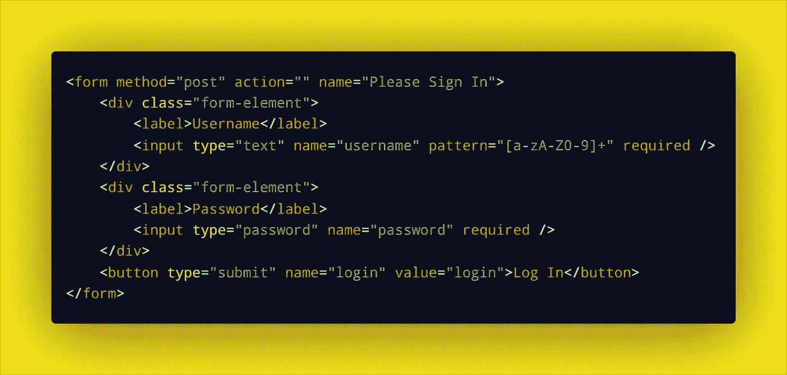
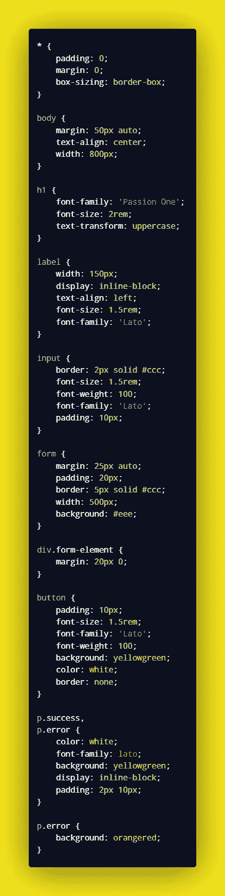
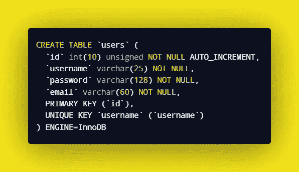
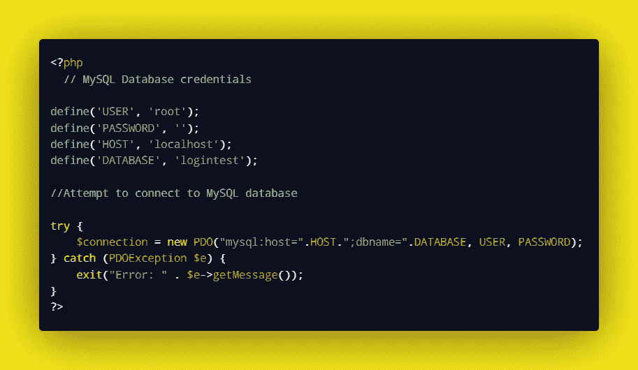
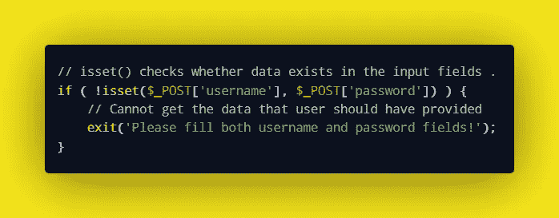
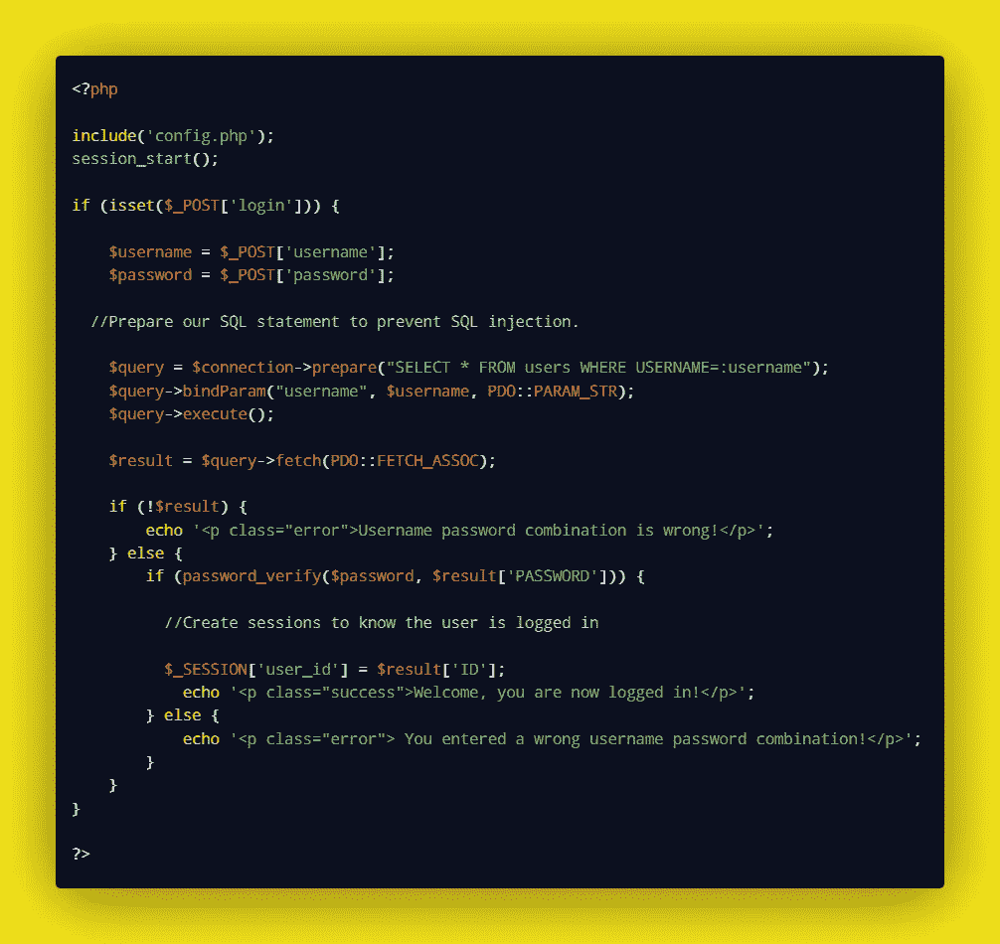
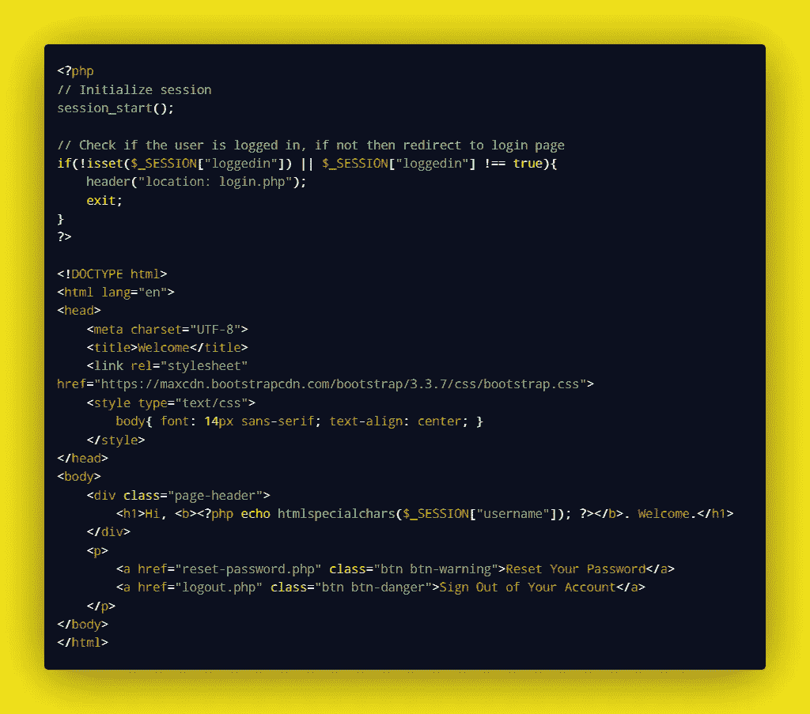
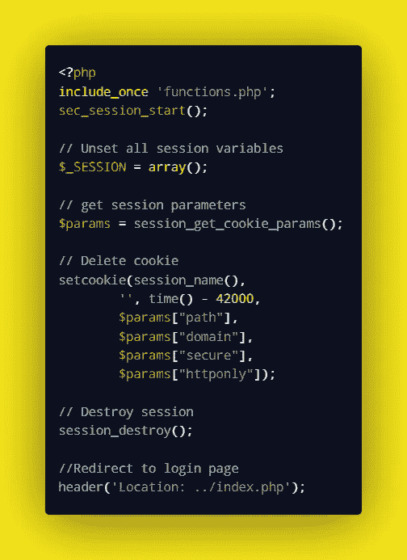

# 如何用 PHP 构建一个安全的登录页面

> 原文：<https://levelup.gitconnected.com/how-to-build-a-secure-login-page-in-php-954f51d08701>

几乎每个移动、桌面和 web 应用程序都要求用户在访问服务之前进行身份验证。在创建登录页面时，一些开发人员更关注设计和视觉元素，却忘记了实现安全措施。

登录系统应该避免安全漏洞，如 SQL 注入或会话劫持。这可以通过在创建登录页面时使用准备好的语句、适当的输入验证、会话管理、密码散列和其他[安全实践](https://wiki.sei.cmu.edu/confluence/display/seccode/Top+10+Secure+Coding+Practices?focusedCommentId=88044413)来实现。

在本文中，您将学习如何创建一个可以在任何应用程序中使用的安全 PHP 登录页面。

让我们将用 PHP 构建安全登录页面的过程分解成几个简单、易于遵循的步骤。

# 创建登录表单

第一步是创建一个 HTML 登录表单，接受用户的登录凭证。你可以使用下面的代码片段，并把它放在一个名为 login.php 的新文件中

# 设置表单样式

接下来，我们对标题和错误消息应用一些额外的 CSS 样式。您可以使用下面的代码片段作为设计表单和输入字段样式的基础。

# 创建用户表

下一步是创建一个数据库，存储所有注册用户的信息。在这里，您需要使用一个数据库管理应用程序来访问 MySQL，比如 [phpMyAdmin](https://www.phpmyadmin.net/) 。

您只需要创建一个 accounts 表，其中有四列用于保存用户 ID、用户名、电子邮件和密码。

您可以使用以下 SQL 语句来生成此表:

# 连接到数据库

创建完用户表后，需要创建一个 PHP 配置脚本来连接 MySQL 数据库。

为此，请将以下代码放在名为 config.php 的新文件中

这里，在测试服务器连接之前，您必须用自己的参数替换连接参数。

用您的数据库名称替换数据库名称“logintest ”,用您的数据库用户名替换用户名“root”。您还必须指定数据库密码(如果有)。

# 实现登录功能

一旦成功连接到数据库，现在就可以实现身份验证逻辑了。

这里，首先检查用户是否使用 isset()方法在登录表单中提供了输入。

如果用户没有填写必填字段就单击登录按钮，则会返回错误。

接下来，我们添加代码片段来检查用户提供的登录凭证是否与数据库中的相匹配。

将这段代码添加到 login.php 文件的顶部。

password_verify 函数还用于将提供的电子邮件和密码与数据库中的进行比较。这有助于防止登录期间的计时攻击。

如果用户名和密码组合不匹配，系统将返回错误。

注意上面代码中的 [PHP 预准备语句](https://www.php.net/manual/en/mysqli.quickstart.prepared-statements.php)是如何用来防止 SQL 注入的。

# 创建欢迎页面

接下来，使用下面的代码片段创建一个欢迎页面，用户在成功登录后将被重定向到该页面。您可以将该文件命名为 welcome.php

在上面的代码示例中， [html specialchars()函数](https://www.inanimatt.com/php-output-escaping.html)用于在浏览器上显示数据之前对数据进行转义。这将对来自用户的可能包含旨在发起攻击的恶意数据的输入进行过滤。

所有特殊字符都会被转义，以确保浏览器不会执行恶意脚本。

# 添加注销脚本

最后，我们创建一个允许用户退出应用程序的脚本。注销脚本应该销毁一个实时会话，并将用户重定向到登录页面。

您可以将下面的代码添加到一个单独的文件中，并将其命名为 logout.php

此时，您可以在浏览器中测试您的登录页面，看看一切是如何工作的。

您还可以考虑实现额外的逻辑，允许用户验证他们的电子邮件地址、重置密码等等。