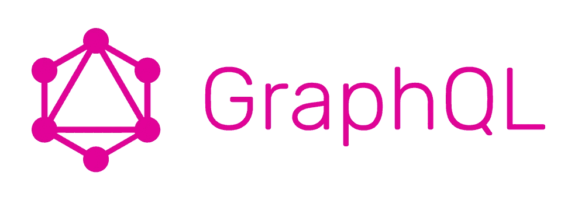

# 如何使用 React 和 GraphQL 构建一个简单的博客

> 原文：<https://levelup.gitconnected.com/how-to-build-a-simple-blog-using-react-and-graphql-4a680b6e3206>


文章最初由[托尼·斯皮罗](https://cosmicjs.com/tony)为[宇宙 JS 博客](https://cosmicjs.com/blog)撰写。感谢 GitConnected 的分享。

在本教程中，我们将使用 React、 [GraphQL](http://graphql.org/) 和 [Cosmic JS](https://cosmicjs.com/) 创建一个简单的博客。这将是基于现代技术构建的最快、最轻量级的博客。让我们开始吧。

# TL；速度三角形定位法(dead reckoning)

[查看演示](https://cosmicjs.com/apps/simple-react-blog/demo)
[在 Cosmic JS 上安装简单的 React 博客](https://cosmicjs.com/apps/simple-react-blog)
[查看 GitHub 上的代码库](https://github.com/cosmicjs/simple-react-blog)



# 入门指南

确保你的机器上安装了 Node.js 和 NPM，如果没有，[访问 Node.js 网站](https://nodejs.org/en/)安装最新版本。

让我们首先为我们的应用程序创建一个文件夹。在您喜欢的终端中运行以下命令:

```
mkdir simple-react-blog
```

现在，让我们添加一个 package.json 文件来导入应用程序的所有依赖项:

```
vim package.json
```

将以下内容添加到我们的 package.json 文件中:

是一个轻应用的轻依赖列表。因此，我们将安装的是:

1.  [Axios](https://www.npmjs.com/package/axios) 让我们基于 promise 的 HTTP 客户端从 [Cosmic JS GraphQL API](https://cosmicjs.com/docs/graphql) 获取内容。
2.  [Next.js](https://github.com/zeit/next.js/) 作为我们 React 通用框架。
3.  [下一条路线](https://www.npmjs.com/package/next-routes)为动态路线。
4.  [Express](https://www.npmjs.com/package/express) 为我们的服务器端 web app 框架。
5.  [反应](https://reactjs.org/)来处理我们的用户界面。

`“scripts”`在开发和生产中已经习惯了我们的应用程序。

运行以下命令来安装我们的依赖项:

```
npm i
```

# 建立我们的博客

接下来，让我们开始构建我们的博客页面。创建一个`pages`文件夹，添加`index.js`文件:

```
vim index.js
```

并将以下内容添加到 index.js 中:

这里发生了一些事情:

1.  我们正在导入我们的基本模块:Axios、lodash 以及其他助手和组件。
2.  我们正在引入一些组件:`Header`和`Footer`，你可以[从 GitHub](https://github.com/cosmicjs/simple-react-blog/tree/master/pages/partials) 上的代码库中引用这些部分。
3.  我们查询 [Cosmic JS GraphQL API](https://cosmicjs.com/docs/graphql) 只返回我们需要的东西:`_id`、`type_slug`、`slug`、`title`、`metadata`和`created_at`。
4.  我们将组件中的主要道具设置为`cosmic`对象。并使用 lodash 解析帖子和全局对象类型。
5.  我们将帖子数组数据和图片 URL 返回到我们的主博客提要中。

# 图表解释

在文件的顶部，您会注意到一个`query`变量。这是我们编写的字符串形式的 GraphQL 查询，我们使用 axios 将它发送给 API。该查询指定了我们想要从 Cosmic JS API 中检索的键。API 通过匹配`bucket_slug`找到正确的数据。然后，对象字符串的键被赋予相关的值，从而允许我们准确地获得我们需要的数据。这是 GraphQL 的核心原则——简单地将键与值进行匹配，并只获取页面所需的数据。

# 单帖子查询

对于我们的单个帖子，我们在道具中添加了一个`post`属性。通过将`query.slug`与对象块匹配来找到 Post:

查看 GitHub 上的[完整文件。](https://github.com/cosmicjs/simple-react-blog/blob/master/pages/post.js)

# 结论

这是[简单反应博客](https://cosmicjs.com/apps/simple-react-blog)的节略版，可以在[宇宙 JS 应用页面](https://cosmicjs.com/apps)下载。完整的代码库包括一个帖子页面视图，以及一个专门用于每个作者帖子的页面。[在 GitHub](https://github.com/cosmicjs/simple-react-blog) 上查看完整的代码库，并通过[将应用](https://cosmicjs.com/apps/simple-react-blog)安装到您的 Cosmic JS 桶中，在您的 Cosmic JS 仪表板上点击几下即可部署该应用。

我希望你喜欢这个教程，如果你有任何问题[在 Twitter 上联系我们](https://twitter.com/cosmic_js)和[加入我们的 Slack 社区](https://cosmicjs.com/community)。Cosmic JS 在 [React](https://github.com/cosmicjs/react-starter) 、 [Node.js](https://github.com/cosmicjs/node-starter) 和 [Vue.js](https://github.com/cosmicjs/vue-starter) 中提供了快速入门应用。

# 无头 CMS 资源

*   [公司网站的无头 CMS](https://cosmicjs.com/solutions/headless-cms-for-company-websites)
*   [用于博客的无头 CMS](https://cosmicjs.com/solutions/headless-cms-for-blogs)
*   [用于新闻网站的无头 CMS](https://cosmicjs.com/solutions/headless-cms-for-press-websites)
*   [用于营销活动的无头 CMS](https://cosmicjs.com/solutions/headless-cms-for-marketing-campaigns)
*   [用于本地应用的无头 CMS](https://cosmicjs.com/solutions/headless-cms-for-native-apps)
*   现代堆栈网站的无头 CMS
*   [电子商务网站的无头 CMS](https://cosmicjs.com/solutions/headless-cms-for-ecommerce-websites)
*   [新兴技术的无头 CMS](https://cosmicjs.com/solutions/headless-cms-for-emerging-tech)