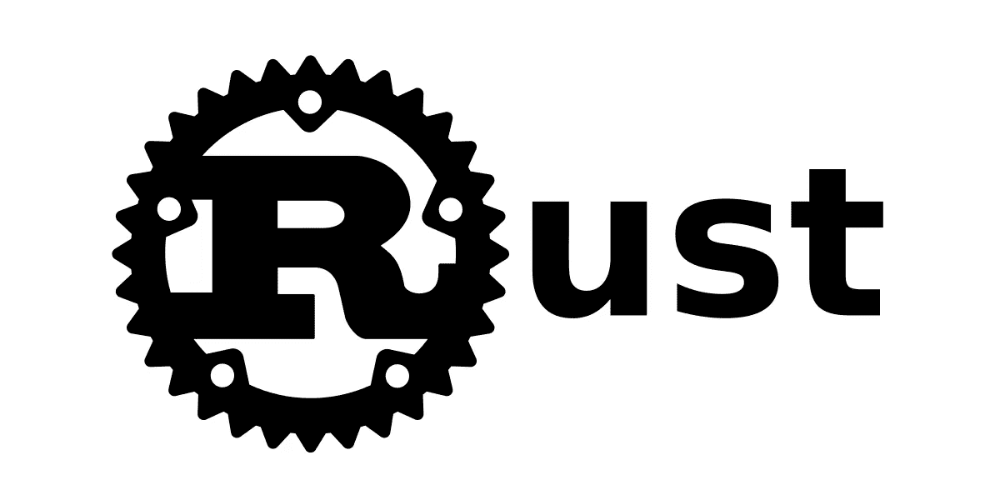

# 如何使用 Rust 建立一个(简单的)博客

> 原文：<https://levelup.gitconnected.com/how-to-build-a-simple-blog-using-rust-54cdee8541c0>

所以，你已经阅读了 rust 很长一段时间，在 Stack Overflow 的年度调查中了解到它连续多年是最受欢迎的编程语言，你想加入。但是，你不是系统级的程序员，Reddit 一直告诉你“使用正确的工具来完成工作”，“rust 旨在编写数据库和编写无人机之类的低级东西”(第一条实际上是个好建议，我只是需要它来创建一个戏剧性的设置)。所以你心灰意冷，选择用你一直用的。我认为这是一个错误，因为无论是从执行速度还是开发者体验来看，rust 都是一种令人惊叹的语言。没有多少语言能给你一个方便的配对程序员，即编译器，它只会给出好的建议，并在此期间闭嘴(rust 的编译器太棒了)。

重写的目标是把*的一些东西*拿出来，作为学习的例子，并在此基础上进一步加深我对语言的理解。我希望这篇文章对你也一样。

*旁注*:我以写 Go 为生，过去 5 年来一直从事专业编码工作，所以尽管我对自己的整体技能很有信心，但本教程可能并不总是展示惯用的 Rust 和最佳实践。有一群比我更容易生锈的开发人员已经写了一些很棒的材料，其中大部分为我将要向您展示的内容奠定了基础。在本文的最后，您将找到一个资源列表，在阅读完本文(希望能够一起编码)后，您可以查看该列表。

如果你有任何问题或意见，请随时在 Twitter 上联系我。

# 开始做事

因此，要使用 Rust 创建你的新博客，你需要在你的系统上安装 Rust，然后运行`cargo new awesome-blog`。然后运行`cd awesome-blog`进入目录，打开`Cargo.toml`，在`[dependencies]`下添加以下内容:

请随意使用上述版本之外的其他版本；这是我写这篇文章时用的。

让我简单介绍一下其中的一些库。这里最主要的是 actix-web，它是 Rust web 框架中最大的玩家之一。还有其他多种选择(例如参见 [warp](http://localhost:8191/page/insert-warp-link) 、 [rocket](http://localhost:8191/page/insert-rocket-link) 、 [axum](http://localhost:8191/page/insert-link-here) )，但是我非常喜欢 Actix 的 API，并且已经使用它构建了多个项目。此外，它的性能非常好，可以处理很多请求。

接下来是`serde`,如果你做过 Rust 编程，你很可能对这个库很熟悉。如果没有，它基本上是一组有效和通用地序列化和反序列化数据结构的方法。如果你找不到你想要的数据结构的实现，你只需要为你的数据结构实现[方法](https://serde.rs/custom-serialization.html)，你就可以开始比赛了。对于这个项目来说，`serde`将被用来把一篇博客文章的元数据从一个`.toml`文件序列化为一个 Rust 结构。

最后，我想提一下`tera`，它是我在这个博客中使用的模板引擎。它的灵感来自 Jinja2，如果你曾经用`Django`做过网络开发，你可能会很熟悉它。过去，我开始使用`Django`构建 web 应用程序，非常喜欢它的模板化方式，所以想在我的个人项目中复制这种体验。在这个世界上，一切都是组件，最轻微的重复都是死罪，使用“老派”模板的经历是一种解脱。

# 简单的服务器

开箱后，在运行`cargo new awesome-blog`之后，您应该能够打开`src/main.rs`并看到如下内容:

执行命令:`cargo run`将在你的终端中输出经典的`Hello, world!`。我们将把`main.rs`作为我们应用程序的瘦入口点，这基本上意味着它应该做一些高级配置和调用启动功能。根据这一要求，我们最终会得到这样的结果:

除了一堆错误之外，这里没发生什么，所以让我们快速分解一下:

*   我们设置了一个 env 变量`RUST_LOG`,它决定了我们要输出哪种日志语句
*   我们初始化一个使用 env 变量配置的简单记录器
*   我们创建一个监听端口`8080`的监听器
*   我们将监听器传递给`start_blog`，然后我们开始比赛

我们稍后将处理`start_blog`，这意味着唯一没有处理的是`#[axtic_web::main]`。这是一个宏，或者更准确地说，是一个为我们生成一些代码的`proc_macro`，让我们的`awesome_blog`异步运行。团队做出了一个明智的决定，不在标准库中提供异步运行时，而是选择提供 essentials，让社区来完成剩下的工作。原因是多方面的，但其中一个原因可能是对于这样的运行时应该是什么样子还没有达成共识。该主题也超出了本文的范围；你只需要知道它为我们生成代码，这使得异步运行时成为可能。

# 剥离这些层

我们需要处理`start_blog`函数，所以在`src`下创建一个名为`lib.rs`的新文件并打开它。我们将逐步构建它，从添加运行`HttpServer`所需的代码开始:

所以，我们做的不仅仅是创建一个`HttpServer`。我们还添加了在`main.rs`中定义的记录器，并创建了一个路由，基本上是 pings 回一个`200 Ok`响应。

上面的大部分代码对你来说应该是有意义的(假设你熟悉`rust`)，但是让我们快速接触一下`move`关键字。根据文档:`move`将通过引用或可变引用捕获的任何变量转换为通过值捕获的变量。如果你对上面的陈述有点困惑，加入这个俱乐部吧。但是，它可以被分解成一个更容易理解的句子(至少对我来说)。归结起来就是`rust`的所有权模型以及它如何处理内存分配和引用。我们在这条线`HttpServer::new( move || { App::new() })`中看到的是一个闭包，闭包可能会[转义](https://huonw.github.io/blog/2015/05/finding-closure-in-rust/)。简而言之，`actix_web`将加速你的应用程序的多个实例，假设是多线程环境，所以传递给`App::new()`的变量/值可能比`App`活得长，也就是说闭包可能会逃逸。这将留下悬而未决的引用，而这些引用并没有被考虑太多，这在`rust`中是不好的。因此，为了解决这个问题，我们告诉`App`获取传递给它的值的所有权，这样每个实例拥有传递给它的值。

尽管我们在这里有点“老派”，使用纯简单的 html，我们仍然希望有一些可重用性。这正是`tera`的用武之地。然而，因为一旦我们将模板放入 prod，它们将保持不变，所以只加载一次然后传递一个引用可能是个好主意。为此，我们将使用`lazy_static!`，继续将以下内容添加到您的`lib.rs`:

一切都好，但缺少一件事。我们需要在根目录中添加一个模板目录，所以继续操作`mkdir templates`。我们将很快回到`main.rs`、`lib.rs`等，但是现在，让我们快速地接触一下模板，这样我们就有东西可以展示了。

# 伙计，部件在哪里？

我的第一份工作是前端开发人员，我从`react`开始做起。当时组件风靡一时(现在仍然如此，但这让我听起来更老更明智了)，这也是我开始考虑 UI 元素的原因。在这一点上，我已经改变了我的想法，但那将是另一篇文章。如你所知，我们在这里不做组件，而是做`partials`和`blocks`，所以在你的`templates`目录中，创建一个名为`base.html`的文件:

以上是我们做其他事情的基础。

要让我们扩展`base.html`(或者说，继承……)的部分就是这个``。让我们看看这是如何做到的，所以继续在`templates`下创建一个名为`home.html`的新文件:

首先，注意顶部的``。这让我们可以与在`base.html`模板中创建的所有`blocks`进行交互。此外，我们在标记中有一个 for 循环:``。我们可以在将 html 作为对`http://awesomeblog.com/`的响应的一部分时将数据作为变量传递，在上面的例子中，它将返回一个名为`posts`的变量，这是一个 posts 数组。

如果您现在尝试运行应用程序，不会有太大的不同，所以让我们实现一些处理程序/控制器/等等来实际服务一些 html！

# 控制器/处理器层

现在我们进入了这个东西的实际内容，并开始编写一些实际的`Rust`代码！

我们需要一些东西来开始，所以继续在`src`下创建一个名为`handlers`的新文件夹。在这个容器中，创建一个名为`mod.rs`和`home_handler.rs`的文件。让我们从一些简单的测试数据开始，在加载主页时展示一些东西。打开`home_handler.rs`并添加以下内容:

如果你读过《T21》这本书，大部分内容对你来说应该是有意义的。

如果没有，让我们快速浏览一下。我们创建一个结构，并从标准库`serde`中派生出一些方法(在`Frontmatter`之上的`#[derive()]`)。接下来，我们通过`tera`创建一个上下文。还记得我们讨论过如何通过我们的处理程序向模板提供数据吗？我们就是这么做的。然后我们简单地在上下文中调用`.insert()`，提供变量名和数据，我们就可以开始了。在函数的返回部分，我们放入了`impl Responder`，所以我们只需要返回*一些实现`Responder`的东西*。恰好`HttpResponse`实现了`Responder`，所以剩下要做的就是从`tera`中取出正确的模板。由于`template.render()`可能会失败，我们提供了一个备份，不可否认，现在有点懒，但我们总是可以回来改进这一点。最后，您可能想知道我们实际上如何访问我们在处理程序中引用的模板`templates: web::Data<tera::TerA>`。

Actix 有一种通过`App::app_data`和`struct Data<T: ?Sized>(_)`类型共享数据的简洁方式。通过将包装在`web::Data::new`中的传递给`App.app_data`(附注:我们可以通过将`web::Data::clone`传递给`app_data`而不是`web::Data::new`来改进这一点，只需在`web::Data::new`中包装一次我们的数据，并简单地传递对`web::Data::copy`中数据的引用。这是因为`Data`在内部使用`Arc`，这使得克隆它非常便宜)我们现在可以在你的处理程序中提取它！

最后，在我们可以访问我们新的闪亮处理程序之前，我们需要使它可访问，因此打开`src/handlers`下的`mod.rs`:

我们只需要添加一个路由，这样我们就可以为用户提供内容。打开`main.rs`并添加以下内容:

旋转一下，你应该会看到(一个相当难看的)有你的博客文章的网页！

# 静态资产和阻力最小的路径

当我们设置 html 模板的时候，你可能已经注意到了看起来像是`tailwindcss`类的东西，然后很快就想知道它在主页上有什么样的最终结果。首先，很高兴你选择了优秀的前端工具。其次，我们还没有包含样式实际执行某些操作所需的 css。

如果你检查`base.html`，你会看到这一行:`<link rel="stylesheet" type="text/css" href="/static/css/index.css">`，它暗示我们需要在`static`中有一个`css`文件夹。现在，我们可以通过多种方式来实现这一点，这取决于我们期望获得什么样的流量，以及我们计划如何(过度)实现这一点。

一种选择是通过 S3 桶提供`index.css`的内容，然后直接指向一个 URL，这个 URL 在这里被引用。这肯定会使生成的二进制文件更小，但它确实会增加一些现在并不真正需要的开销(更复杂的 CI/CD 流，处理开发和生产中的各种路径等)。另一个选择(我们正在做的)是把它作为整个二进制文件的一部分添加进去。

现在它让事情变得简单，如果我们的博客取得巨大成功，我们很可能会担心这一点。所以，在根目录下创建两个新文件夹，即`static`和其下的`css`。接下来，我们需要做一些顺风设置，你可以在他们自己的网站上找到，为了方便起见，这里是你可以在你的终端上运行的`cmd`:

差不多了，只需再走几步，打开`tailwind.config.js`，复制粘贴以下内容:

还有两件事，打开`base.css`，复制粘贴以下内容:

最后，打开`package.json`并在脚本下添加以下内容:

这两个脚本基本上给了你一个`cmd`来观察开发中的任何变化，然后在我们合并时为生产而构建。这也意味着您必须记住在合并到`master`之前运行`build-css-prod`。这肯定可以改进，但由于你是这个项目的主要(也是唯一的)开发者，它将很好地满足我们的需求。

最后一步，我们需要让`actix_web`知道我们的静态文件。所以打开`lib.rs`并更新如下:

我们只需要构建`css`，因此从根目录运行:`cd tailwind && npm run build-css-prod && cd ..`。

现在，旋转一下`cargo run`,你会看到一个更好看的网站。

# 短暂的插曲

目前缺少两样东西:1。一个存储*实际*博客文章和 2。一个展示帖子所有优点的页面。

让我们从清单上的第二项开始，因为我们已经做了很多。为了不让你对同样的事情厌烦两次，继续打开这个[链接](https://github.com/MBvisti/awesome-blog/blob/master/templates/post.html)(链接到带有完整代码的回购协议)，复制内容并在`templates`下创建一个名为`post.html`的新文件。

接下来，转到[这里](https://github.com/MBvisti/awesome-blog/blob/master/tailwind/base.css)复制内容并粘贴到您的`base.css`中。如果你做过任何`css`，并且只是在文章页面上应用了一些简单的样式，你应该对这些很熟悉。

# 像艺术家一样偷窃(或者，模仿比你更聪明的人)

一切都已基本完成*,我们只需要一种方法来存储我们精彩的博客文章，以及一种方法来检索它们，这样我们就可以删除我们之前做的硬编码。这样做的方法很大程度上受到了另一个比我聪明得多的人写的博客的启发:[faster shanlime](https://fasterthanli.me/)如果你还没有看，你绝对应该看看。这家伙很认真地做一些深潜，而且非常了解他的技术。*

*继续创建一个名为`posts`的新文件夹，与`static`文件夹在同一层。在这个里面，创建另一个文件夹，给它一个像`my-first-article`和`cd`的名字。我用`markdown`写我所有的东西，所以这也是我们在这里要做的。*

*创建一个名为`post.md`的文件，复制粘贴一些 lorem ipsum 文本(或者你准备的一篇文章)。接下来，创建一个名为`post_frontmatter.toml`的文件，打开它并添加以下内容:*

*如果这看起来可疑地像我们的`struct Frontmatter {....}`，那么是因为它是。*

*下一个订单业务，添加一些逻辑来提取我们可能有的所有前沿问题，并将其显示在我们的主页上。让我们从获取我们令人敬畏的博客的所有前沿问题的逻辑开始，所以打开`home_handler.rs`并添加以下内容:*

*由于我们将帖子存储为二进制文件的一部分，我们需要一种方法来定位所有帖子的主要内容，为此，我们将使用`ignore::WalkBuilder`。这给了我们一个递归目录迭代器，它有大量的配置，我们可以根据我们想要做的动作类型来设置。在这种情况下，我们希望它在`posts`目录中查找所有带有`.toml`扩展名的文件，它很快就做到了。*

*这里需要注意的一点是，`find_all_frontmatters`返回一个`Result`，因为有些动作可能会失败，这意味着我们也必须处理一些错误。正如你可能知道的，我没有在这个函数的错误上花太多时间，基本上，只是记录来自`ignore`的任何错误，然后从`std::io::ErrorKind`返回最相似的错误。使用像`anyerror`或`thiserror`这样的库肯定可以做得更好。我鼓励你自己尝试一下，或者如果你在这里有所改进就提出一个拉动请求。*

*为了在主页上实际显示一些动态数据，我们需要在我们的`index`处理程序中使用上述函数，因此打开`home_handler.rs`并进行以下调整:*

*旋转`cargo run`看看结果吧！*

*最后需要做的是为`post.html`页面添加处理程序，提取文章的 markdown，将其转换为`html`并提供服务。既然我们已经准备好了`post.html`，继续在`src/handlers`下创建`post_handler.rs`并打开它。我们需要增加两个功能:1 .从一个特定的职位和 2。提取帖子的降价信息。*

*这里没有太多新东西，只是使用了`toml::from_str`将一个字符串反序列化为一个特定的类型，在这里是:`Frontmatter`。*

*我们需要做的最后一件事是创建处理程序，并将其作为`service`添加到我们在`lib.rs`中的`App`中，因此将以下内容添加到`post_handler.rs`:*

*其中大部分都很熟悉，不同之处在于我们为模板提供了两个变量:`post`和`meta_data`。*

*最后，我们需要在`lib.rs`和我们的`handlers/mod.rs`中包含新的处理程序。我会让你决定的！*

*添加之后，再旋转一下`cargo run`，你应该可以从主页点击文章，被重定向到文章页面，看到你的文章！*

# *结束语*

*我希望你喜欢这个演示，并有兴趣用`rust`做更多的 web 开发，它现在的状态非常好，有一个令人兴奋的未来。是的，开始可能会有点令人沮丧，让你的头脑围绕所有权，借用和参考可能需要一些时间。但我向你保证，这是非常值得的！*

*您得到的编译器错误可能很烦人，但也会引导您走向正确的道路，与类似`Typescript`的东西相比，这是天赐之物。你写得越多，它就变得越容易。*

*它很快成为我编写小服务的首选语言，因为它与`aws lambda`配合得非常好，而且由于它的速度非常快，冷启动甚至不再是一个问题。所以，请拿走你这里有的，想怎么延长就怎么延长。*

# *资源*

*这里收集了我开始使用`rust`的所有资料。有些是免费的，有些是付费的，但所有这些都是非常值得推荐的，所以我希望你能找到一些进一步的学习！*

*   *[零 2 产量](https://www.zero2prod.com/)*
*   *[锈书](https://doc.rust-lang.org/book/title-page.html)*
*   *[2020 年的新网站](https://fasterthanli.me/articles/a-new-website-for-2020)*
*   *[铁锈示例](https://doc.rust-lang.org/stable/rust-by-example/)*

**原贴于*[mortenvistisen.com](https://mortenvistisen.com)*

# *分级编码*

*感谢您成为我们社区的一员！在你离开之前:*

*   *👏为故事鼓掌，跟着作者走👉*
*   *📰查看更多内容请参见[升级编码刊物](https://levelup.gitconnected.com/?utm_source=pub&utm_medium=post)*
*   *🔔关注我们:[Twitter](https://twitter.com/gitconnected)|[LinkedIn](https://www.linkedin.com/company/gitconnected)|[时事通讯](https://newsletter.levelup.dev)*

*🚀👉 [**加入升级达人集体，找到一份惊艳的工作**](https://jobs.levelup.dev/talent/welcome?referral=true)*