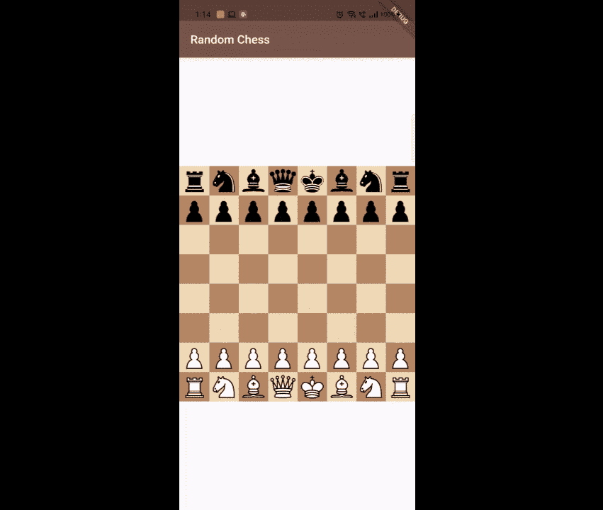
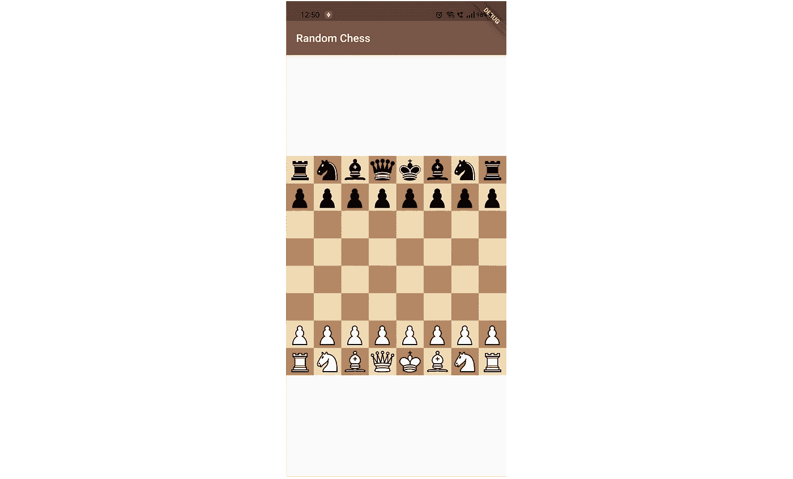

# 如何用 Flutter 搭建一个简单的象棋 App

> 原文：<https://levelup.gitconnected.com/how-to-build-a-simple-chess-app-with-flutter-f2726022de8a>

## 不到 60 行代码


由[哈桑·帕夏](https://unsplash.com/@hpzworkz?utm_source=unsplash&utm_medium=referral&utm_content=creditCopyText)在 [Unsplash](https://unsplash.com/s/photos/chess?utm_source=unsplash&utm_medium=referral&utm_content=creditCopyText) 拍摄的照片

最近写了一个帖子叫[如何用 React](/how-to-create-a-simple-chess-app-with-react-e18c0179b167) 创建一个简单的象棋 App。如果你还没看过，[给个阅读](/how-to-create-a-simple-chess-app-with-react-e18c0179b167)，我推荐。在那之后，我想在 flutter 中构建相同的应用程序，看看它会怎么样。这正是我们在这篇文章中要做的。那么，我们开始吧。

在我们开始之前，这里有一个快速演示。



## 棋盘

我在为 flutter 搜索棋盘小部件的时候，发现了[这个](https://pub.dev/packages/flutter_chess_board)包。很体面。但是，我觉得它为一个棋盘部件做了很多。我喜欢把 UI 和逻辑分开。于是，我创建并发布了一个名为[flutter _ stateless _ 棋盘](https://pub.dev/packages/flutter_stateless_chessboard)的棋盘 widget。给定一个 fen，它负责在屏幕上显示棋盘，并在用户移动时发出通知。你能在这里找到包裹吗？

## 国际象棋规则

我们知道棋盘是一个小部件，它不知道对错和象棋的其他规则。为此我们需要一个图书馆。很幸运，有人把 [chess.js](https://github.com/jhlywa/chess.js/) 库转换成了 [chess.dart](https://pub.dev/packages/chess) 。你可以在这里找到包裹。

现在，我们已经拥有了应用程序所需的所有组件。让我们构建应用程序。

## 创建一个颤振项目

我将使用 android studio 进行开发。你可以使用你最喜欢的 IDE。

创建项目后。删除 main.dart 文件中除 App 小部件以外的所有代码。

将以下依赖项添加到项目的 pubspec.yml 文件中。

```
...  
  flutter_stateless_chessboard: ^0.0.2
  chess: ^0.6.5
...
```

现在，我们准备为我们的应用程序编写代码。让我们从编写实用函数开始。

我们需要为我们的应用程序 2 实用功能。

1.  `makeMove` —给了一分而动。移动后返回更新的 fen。如果移动无效，则返回 null。
2.  `getRandomMove` —给定一个有效分。返回随机的下一步棋。或者如果游戏结束则为空。

我们将把这个函数的代码放在`utils.dart`文件中。这是代码。

utils.dart

创建一个名为`home_page.dart`的新文件。让我们从在屏幕上显示[棋盘](https://pub.dev/packages/flutter_stateless_chessboard)开始。

主页. dart

我正在导入`Chessboard`小部件，并用初始 fen 渲染它。并且将板的尺寸设置为屏幕的宽度。

在我们运行应用程序之前。确保您已经在`main.dart`中将`App`的`home`设置为我们创建的`HomePage`小部件。

如果你运行应用程序，这是你应该看到的。



随机象棋

现在，我们有一个棋盘出现在屏幕上。唯一剩下的就是让它可以玩了。

将在`Chessboard`小部件的`onMove`回调中这样做。我们先看看代码，然后我会解释这是怎么回事。

首先，当用户在棋盘上走棋时。我们进行移动，传递 fen，然后移动到我们之前创建的 makeMove 函数来获取下一个 fen。如果下一个 fen 不为空。然后我们更新 fen 状态，它更新电路板。

第二部分是随机移动电脑。我们正在使用`Future.delayed`功能添加延迟，将计算机延迟 300 毫秒。之后，我们得到当前位置的下一个随机`move`。如果下一个`fen`不是`null`。我们更新状态。这种情况一直持续到游戏结束。

有了这些，我们的应用程序应该可以工作了。你可以在这里找到这个应用[的源代码。](https://github.com/varunpvp/flutter-random-chess)

[](https://github.com/varunpvp/flutter-random-chess) [## 随机跳棋

### 一个用 Flutter 构建的简单象棋应用程序。通过创建一个帐户，为 varunvpp/flutter-random-chess 开发做出贡献…

github.com](https://github.com/varunpvp/flutter-random-chess) 

此外，检查一个[象棋战术应用](https://play.google.com/store/apps/details?id=com.autosoft.chess)，它是用我们在 out post 中使用的[棋盘](https://pub.dev/packages/flutter_stateless_chessboard)小部件制作的。这是应用程序的[链接。](https://play.google.com/store/apps/details?id=com.autosoft.chess)

[](https://play.google.com/store/apps/details?id=com.autosoft.chess) [## 战术训练器 Google Play 上的应用

### 通过训练超过 1700000 种战术来提高您的国际象棋战术。免费提供。所有的战术都采取了…

play.google.com](https://play.google.com/store/apps/details?id=com.autosoft.chess) 

# 结论

我希望这能帮助你今天学到一些新东西。

如果你喜欢这个帖子，给它一个掌声。你可以关注我，看更多这样的帖子。

感谢阅读。

# 分级编码

感谢您成为我们社区的一员！ [**订阅我们的 YouTube 频道**](https://www.youtube.com/channel/UC3v9kBR_ab4UHXXdknz8Fbg?sub_confirmation=1) 或者加入 [**Skilled.dev 编码面试课程**](https://skilled.dev/) 。

[](https://skilled.dev) [## 编写面试问题+获得开发工作

### 掌握编码面试的过程

技术开发](https://skilled.dev)