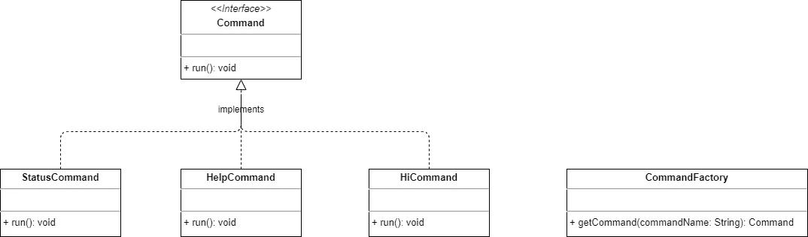
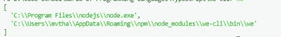
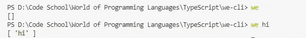
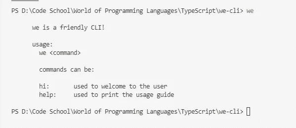
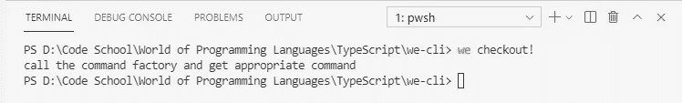
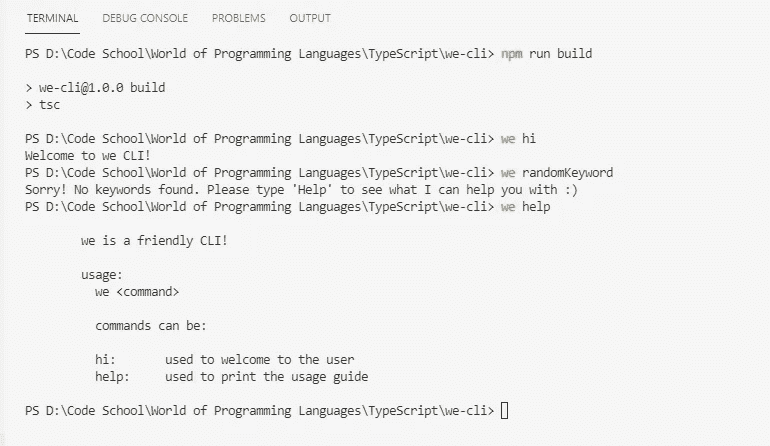

# 如何使用 TypeScript 和工厂设计模式构建简单的 CLI

> 原文：<https://levelup.gitconnected.com/how-to-build-a-simple-cli-using-typescript-and-factory-design-pattern-d9c335778f14>


罗伯特·柯林斯在 [Unsplash](https://unsplash.com/s/photos/happy?utm_source=unsplash&utm_medium=referral&utm_content=creditCopyText) 上的照片

在使用高级过程开发复杂的 CLI 应用程序并利用其他包和库/工具之前，首先，我们需要理解制作 CLI 应用程序的核心概念。

阅读完本文后，您将理解制作 CLI、工厂设计模式的概念，并将能够使用任何语言创建 CLI 应用程序。

在本文中，我们将看到如何创建一个简单的 TypeScript CLI，它可以使用 Node.js 运行[。😃](https://nodejs.dev/learn/nodejs-with-typescript)

# 应用概述

在开始实现之前，我们先来看看如何构建我们的应用程序。



图 1:这个 CLI 的类图

在主应用程序中，我们将使用来自命令工厂的命令名来获取每个命令。这就是所谓的工厂设计模式。

## 工厂设计模式

在这种模式下，我们将有一个工厂。那个工厂会给我们不同类型的对象，它们都属于一个共同的类型。我们将通过提供一些唯一的标识符从工厂获得这些不同类型的对象。通常，这些唯一标识符是字符串。

因此，作为客户，我们不知道这些对象是如何在工厂内部构造的。我们将按照承诺从工厂获得这些可用的对象，它们可以在应用程序中使用。

因为工厂可以根据我们的请求构造并给我们所有不同类型的对象，所以我们通过公共类型指向这些对象。

这种模式提供了创建对象的最佳方式之一:

1.  客户端不知道对象创建逻辑。
2.  我们不必在主应用程序中创建对象。

在我们的 CLI 中，我们将通过向命令工厂提供命令名来调用每个命令。

让我们开始创建 CLI。

# 1.初始设置

转到应用程序目录，使用`npm init --y`创建一个新的 NPM 包。

典型的 CLI 应用程序有一个或多个可执行文件，当我们键入特定于应用程序的命令时，这些文件就会被执行。

在我们的应用程序中，我们将有一个可执行文件，当我们键入命令`we`时，该文件将被执行。

如何进入`we`执行可执行文件？我们将命令`we`映射到可执行文件。所以每当我们输入命令`we`时，就会执行映射的可执行文件。这就是我们的想法。

命令名与可执行文件的映射是通过在 package.json 中指定`bin`字段来实现的。

接下来，让我们创建应用程序的入口点(它实际上获取用户参数)。创建一个目录`bin`并创建一个名为`we`的文件。将以下属性添加到`package.json`文件中。

```
**"bin"**: {
  "we": "./bin/we"
},
**"main"**: "./bin/we"
```

如前所述，`“we”: “./bin/we”`将命令`we`映射到`./bin/we`。在全局安装时，npm 会将`./bin/we`符号链接到`prefix/bin`中，并将`./node_modules/.bin/`符号链接到本地安装。

字段`“main”`告诉`“./bin/we”`是我们程序的主要入口点。

`we`是命令，我们用来执行可执行文件`“./bin/we”`。

要使`./bin/we`成为可执行文件，在文件开头添加以下行:

```
**#!/usr/bin/env node**
```

上面一行告诉系统这个文件是一个节点可执行文件。现在我们的可执行文件准备好了。

我们不能用 Node.js 直接运行 TypeScript 文件，我们需要把 TypeScript 文件向下编译成 JavaScript 文件。这可以使用 TypeScript 配置文件轻松配置。

让我们使用`tsc --init`创建一个 TypeScript 配置文件。这里，我们需要指定包含类型脚本文件的输入文件的根目录:`“rootDir”: “./src”`和包含编译后的 JavaScript 文件的输出目录:`“outDir”: “./lib”`。您可以根据需要添加/删除`tsconfig.json`中的其他属性。

根据 TypeScript 配置，`src`目录下的 TypeScript 文件将作为 JavaScript 文件编译到`lib`目录下。

我们的入口文件`./bin/we`应该执行`lib`目录中编译好的 JavaScript 文件。指定在`we`文件中添加以下行:

```
*#!/usr/bin/env node* ***// require the compiled js files from ts* require("../lib/we.js");**
```

# 2.基本 CLI

让我们安装依赖项:

1.  节点的类型定义:`npm i — save-dev @types/node`
2.  项目中的打字稿:`npm install typescript — save-dev`

使用`npm link`创建一个全局符号链接。

在根目录下创建一个新目录`src`。这个`src`目录将包含我们所有的类型脚本文件。

在`src`里面创造`we.ts`。

首先，我们将通过向`we.ts`添加以下代码来获取 Node.js 进程启动时的所有 CLI 参数:

```
**const args = process.argv;**
*// log all CLI arguments* console.log(args);
```

`[process.argv](https://nodejs.org/docs/latest/api/process.html#process_process_argv)`返回包含所有 CLI 参数的数组。

为了检查这一点，我们应该将 TypeScript 编译成 JavaScript，这样我们的可执行文件就可以执行`lib`目录中的 JavaScript 代码。

所以，让我们定义一个脚本，用于[编译`package.json`中的项目](https://www.typescriptlang.org/docs/handbook/compiler-options.html):

```
**"build":  "tsc"**
```

因为我们已经配置了`tsconfig.json`，所以我们不需要提供像`tsc src/*.ts`这样的命令。有关更多详细信息，请查看此[堆栈溢出讨论](https://stackoverflow.com/questions/50738687/typescript-ts-not-working)。

让我们使用`npm run build`来编译这个项目。它将在`lib`目录中创建编译后的 JavaScript 文件，如`tsconfig`文件中所指定的。

输入`we`检查 CLI 参数:



图 2: CLI 参数

它返回两个参数。首先是启动 Node.js 进程的可执行文件的绝对路径名。第二个是正在执行的 JavaScript 文件的路径。

我们不需要这些争论。我们只需要用户输入一个参数。

```
console.log(args.slice(2));
```



图 3:用户输入的关键字

现在，我们能够从 CLI 获取用户输入。

正如类图中所指定的，我们的应用程序将有三个主要命令:`we hi`、`we status`和`we help`。

如果用户只是输入`we`，我们将向他显示一个很好的帮助指南。

```
***// the help guide***const helpGuide = function () {
 const helpText = `
   we is a friendly CLI! usage:
    we <command>
    commands can be:
    hi:       used to welcome to the user
    help:     used to print the usage guide
 `;
 console.log(helpText);
};***// if user doesn't enter any words (just types 'we')***if (userArgs.length == 0) {
 helpGuide();
}
```



图 4:帮助指南的输出

除此之外，我们会处理的。

```
else {
  console.log('call the command factory and get appropriate command');
}
```



图 5:处理 else 部分

现在，我们的应用程序可以调用命令工厂了😃

# 3.构建命令工厂和命令

让我们在`src`文件夹中创建`commands`目录。这个目录将包含与我们的应用程序相关的所有命令。

创建一个通用的命令接口`Command.ts`:

```
export interface Command { run(): void; }
```

让我们创建具体的命令。

`HelpCommand.ts`:

```
**export class HelpCommand implements Command** {
  run(): void {
   const helpText = `
    we is a friendly CLI! usage:
     we <command>
     commands can be:
     hi:       used to welcome to the user
     help:     used to print the usage guide
   `;
   console.log(helpText);
  }
}
```

`HiCommand.ts`:

```
**export class HiCommand implements Command** {
  run(): void {
   console.log(`Welcome to we CLI!`);
  }
}
```

`StatusCommand.ts`:

```
**export class StatusCommand implements Command** {
  run(): void {
   console.log(`Checkout the status`);
  }
}
```

`ErrorCommand.ts`:

```
**export class ErrorCommand implements Command** {
  run(): void {
   console.log(`Sorry! No keywords found. Please type 'Help' to see what I can help you with :)`);
  }
}
```

让我们在`src`目录中创建命令工厂:

`CommandFactory.ts`:

```
export class CommandFactory {
  getCommand(commandName: string): Command {
   switch(commandName) {
    **case "hi":**
     return new HiCommand();
    **case "status":**
     return new StatusCommand();
    **case "help":**
     return new HelpCommand();
    **default:**
     return new ErrorCommand();
   }
  }
}
```

我们的司令部和司令部工厂已经准备好了。

让我们从`we.ts`打电话给我们的指挥工厂:

```
else {  
 **// call the command factory and get appropriate command**
 const factoryObject = new CommandFactory();
 const commandObject = factoryObject.getCommand(userArgs[0]);
 **commandObject.run();**
}
```

现在，一切都准备好了。让我们构建项目并测试命令！



图 6:构建并测试命令

太好了！我们有一个使用 TypeScript 实现的完整的工作 CLI！😄现在，我们可以根据自己的意愿进一步扩展这个 CLI 应用程序。

在 [GitHub](https://github.com/ThanoshanMV/we) 上查看这个 CLI 应用程序的源代码。

# 结论

感谢您的阅读！希望这篇文章对你有帮助。

我感谢 Shalitha Suranga 对我的帮助！🙌

**快乐编码❤️**