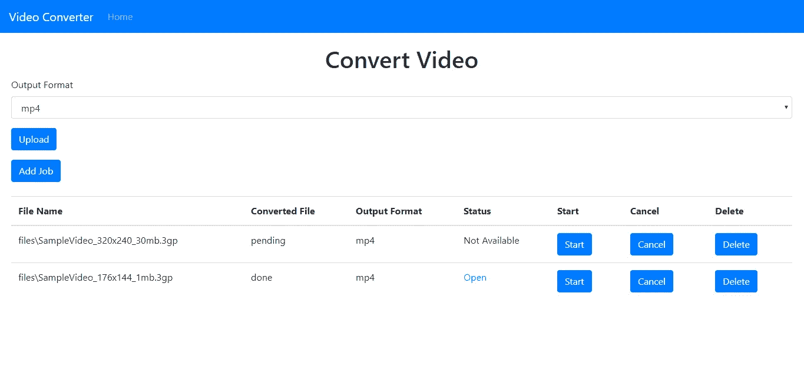

# 如何用 Node.js 构建一个简单的视频转换器

> 原文：<https://levelup.gitconnected.com/how-to-build-a-simple-video-converter-52eaeaf248f1>


视频是一种非常受欢迎的分享信息的媒体，但在过去，转换视频一直是人们的一个问题。有了 FFMPEG，这个问题现在可以很容易地解决。

# 什么是 FFMPEG

FFMPEG 是一个命令行视频和音频处理程序，有许多功能。它还支持多种格式的视频转换。FFMPEG 的功能包括:获取视频和音频元数据，改变视频的分辨率，改变音频质量，压缩视频，从视频中删除音频，从音频中删除视频，从视频中提取帧，改变视频纵横比，等等。

开发人员通过为 FFMPEG 创建 Node.js 包装器为我们做了艰苦的工作。这个包叫做`fluent-ffmpeg`。它位于[https://github.com/fluent-ffmpeg/node-fluent-ffmpeg](https://github.com/fluent-ffmpeg/node-fluent-ffmpeg)。这个包允许我们通过调用内置函数来运行 FFMPEG 命令。

在本文中，我们将构建一个视频转换器，将源视频转换为用户选择的格式。我们将使用`fluent-ffmpeg`包来运行转换。因为作业是长期运行的，所以我们还将创建一个作业队列，以便它在后台运行。

我们将对后端使用 Express，对前端使用 React。

# 后端

首先，创建一个项目目录和一个`backend`文件夹。在`backend`文件夹中，运行`npx express-generator`为 Express 框架生成文件。

接下来运行`backend`文件夹中的`npm i`，下载`package.json`中的包。

然后我们必须安装自己的软件包。我们需要 Babel 在我们的应用程序中使用`import`。此外，我们将使用 Bull 包进行后台作业，CORS 包用于前端的跨域请求，fluent-ffmpeg 用于转换视频，Multer 用于文件上传，Dotenv 用于管理环境变量，Sequelize 用于 ORM，SQLite3 用于 or 数据库。

运行`npm i @babel/cli @babel/core @babel/node @babel/preset-env bull cors dotenv fluent-ffmpeg multer sequelize sqlite3`安装所有软件包。

接下来将`.babelrc`文件添加到`backend`文件夹中:

```
{
    "presets": [
        "[@babel/preset-env](http://twitter.com/babel/preset-env)"
    ]
}
```

这启用了最新的 JavaScript 特性。

在`package.json`的`scripts`部分，将现有代码替换为:

```
"start": "nodemon --exec npm run babel-node --  ./bin/www",
"babel-node": "babel-node"
```

这用 Babel 而不是常规的节点运行时来运行我们的程序。

接下来，我们通过运行创建 config.json 文件的`npx sequelize-cli init`来创建序列代码。

然后在`config.json`中，我们将现有代码替换为:

```
{
  "development": {
    "dialect": "sqlite",
    "storage": "development.db"
  },
  "test": {
    "dialect": "sqlite",
    "storage": "test.db"
  },
  "production": {
    "dialect": "sqlite",
    "storage": "production.db"
  }
}
```

接下来，我们需要创建我们的模型和迁移。我们运行:

```
npx sequelize-cli --name VideoConversion --attributes filePath:string,convertedFilePath:string,outputFormat:string,status:enum
```

为`VideoConversions`表创建模型和迁移。

在新创建的迁移文件中，将现有代码替换为:

```
"use strict";
module.exports = {
  up: (queryInterface, Sequelize) => {
    return queryInterface.createTable("VideoConversions", {
      id: {
        allowNull: false,
        autoIncrement: true,
        primaryKey: true,
        type: Sequelize.INTEGER
      },
      filePath: {
        type: Sequelize.STRING
      },
      convertedFilePath: {
        type: Sequelize.STRING
      },
      outputFormat: {
        type: Sequelize.STRING
      },
      status: {
        type: Sequelize.ENUM,
        values: ["pending", "done", "cancelled"],
        defaultValue: "pending"
      },
      createdAt: {
        allowNull: false,
        type: Sequelize.DATE
      },
      updatedAt: {
        allowNull: false,
        type: Sequelize.DATE
      }
    });
  },
  down: (queryInterface, Sequelize) => {
    return queryInterface.dropTable("VideoConversions");
  }
};
```

这为我们的枚举添加了常数。

在`models/videoconversion.js`中，将现有代码替换为:

```
"use strict";
module.exports = (sequelize, DataTypes) => {
  const VideoConversion = sequelize.define(
    "VideoConversion",
    {
      filePath: DataTypes.STRING,
      convertedFilePath: DataTypes.STRING,
      outputFormat: DataTypes.STRING,
      status: {
        type: DataTypes.ENUM("pending", "done", "cancelled"),
        defaultValue: "pending"
      }
    },
    {}
  );
  VideoConversion.associate = function(models) {
    // associations can be defined here
  };
  return VideoConversion;
};
```

这会将枚举常量添加到模型中。

接下来运行`npx sequelize-init db:migrate`来创建我们的数据库。

然后在`backend`目录下创建一个`files`文件夹来存放文件。

接下来，我们创建视频处理作业队列。创建一个`queues`文件夹，在其中创建`videoQueue.js`文件并添加:

```
const Queue = require("bull");
const videoQueue = new Queue("video transcoding");
const models = require("../models");
var ffmpeg = require("fluent-ffmpeg");
const fs = require("fs");const convertVideo = (path, format) => {
  const fileName = path.replace(/\.[^/.]+$/, "");
  const convertedFilePath = `${fileName}_${+new Date()}.${format}`;
  return new Promise((resolve, reject) => {
    ffmpeg(`${__dirname}/../files/${path}`)
      .setFfmpegPath(process.env.FFMPEG_PATH)
      .setFfprobePath(process.env.FFPROBE_PATH)
      .toFormat(format)
      .on("start", commandLine => {
        console.log(`Spawned Ffmpeg with command: ${commandLine}`);
      })
      .on("error", (err, stdout, stderr) => {
        console.log(err, stdout, stderr);
        reject(err);
      })
      .on("end", (stdout, stderr) => {
        console.log(stdout, stderr);
        resolve({ convertedFilePath });
      })
      .saveToFile(`${__dirname}/../files/${convertedFilePath}`);
  });
};videoQueue.process(async job => {
  const { id, path, outputFormat } = job.data;
  try {
    const conversions = await models.VideoConversion.findAll({ where: { id } });
    const conv = conversions[0];
    if (conv.status == "cancelled") {
      return Promise.resolve();
    }
    const pathObj = await convertVideo(path, outputFormat);
    const convertedFilePath = pathObj.convertedFilePath;
    const conversion = await models.VideoConversion.update(
      { convertedFilePath, status: "done" },
      {
        where: { id }
      }
    );
    Promise.resolve(conversion);
  } catch (error) {
    Promise.reject(error);
  }
});export { videoQueue };
```

在`convertVideo`函数中，我们使用`fluent-ffmpeg`来获取视频文件，然后从环境变量中设置 FFMPEG 和 FFProbe 路径。然后我们调用`toFormat`将其转换成用户想要的格式。我们在 start、error 和 end 处理程序中添加了一个日志语句，以查看输出并解析我们对 end 事件的承诺。转换完成后，我们将其保存到一个新文件中。

`videoQueue`是在后台顺序处理作业的公牛队列。Redis 需要运行队列，我们将需要一个 Ubuntu Linux 安装。我们在 Ubuntu 中运行以下命令来安装和运行 Redis:

```
$ sudo apt-get update
$ sudo apt-get upgrade
$ sudo apt-get install redis-server
$ redis-server
```

在`videoQueue.process`函数的回调中，我们调用`convertVideo`函数，并在作业完成时更新转换文件的路径和给定作业的状态。

接下来，我们创建我们的路线。在`routes`文件夹中创建一个`conversions.js`文件，并添加:

```
var express = require("express");
var router = express.Router();
const models = require("../models");
var multer = require("multer");
const fs = require("fs").promises;
const path = require("path");
import { videoQueue } from "../queues/videoQueue";
const storage = multer.diskStorage({
  destination: (req, file, cb) => {
    cb(null, "./files");
  },
  filename: (req, file, cb) => {
    cb(null, `${+new Date()}_${file.originalname}`);
  }
});
const upload = multer({ storage });router.get("/", async (req, res, next) => {
  const conversions = await models.VideoConversion.findAll();
  res.json(conversions);
});router.post("/", upload.single("video"), async (req, res, next) => {
  const data = { ...req.body, filePath: req.file.path };
  const conversion = await models.VideoConversion.create(data);
  res.json(conversion);
});router.delete("/:id", async (req, res, next) => {
  const id = req.params.id;
  const conversions = await models.VideoConversion.findAll({ where: { id } });
  const conversion = conversions[0];
  try {
    await fs.unlink(`${__dirname}/../${conversion.filePath}`);
    if (conversion.convertedFilePath) {
      await fs.unlink(`${__dirname}/../files/${conversion.convertedFilePath}`);
    }
  } catch (error) {
  } finally {
    await models.VideoConversion.destroy({ where: { id } });
    res.json({});
  }
});router.put("/cancel/:id", async (req, res, next) => {
  const id = req.params.id;
  const conversion = await models.VideoConversion.update(
    { status: "cancelled" },
    {
      where: { id }
    }
  );
  res.json(conversion);
});router.get("/start/:id", async (req, res, next) => {
  const id = req.params.id;
  const conversions = await models.VideoConversion.findAll({ where: { id } });
  const conversion = conversions[0];
  const outputFormat = conversion.outputFormat;
  const filePath = path.basename(conversion.filePath);
  await videoQueue.add({ id, path: filePath, outputFormat });
  res.json({});
});module.exports = router;
```

在 POST `/`路线中，我们接受 Multer 包的文件上传。我们添加作业并将文件保存到之前创建的`files`文件夹中。我们用传入`diskStorage`函数的对象中的`filename`函数中的文件名保存它，并在`destination`函数中指定将文件保存在`files`文件夹中。

获取路线`/`路线获取添加的作业。删除`/`删除给定 ID 的作业以及作业的原始和转换文件。把`/cancel/:id`路线设置为`status`到`cancelled`。

GET `/start/:id`路由将具有给定 ID 的作业添加到我们之前创建的队列中。

在`app.js`中，我们将现有代码替换为:

```
require("dotenv").config();
var createError = require("http-errors");
var express = require("express");
var path = require("path");
var cookieParser = require("cookie-parser");
var logger = require("morgan");
var cors = require("cors");var indexRouter = require("./routes/index");
var conversionsRouter = require("./routes/conversions");var app = express();// view engine setup
app.set("views", path.join(__dirname, "views"));
app.set("view engine", "jade");app.use(logger("dev"));
app.use(express.json());
app.use(express.urlencoded({ extended: false }));
app.use(cookieParser());
app.use(express.static(path.join(__dirname, "public")));
app.use(express.static(path.join(__dirname, "files")));
app.use(cors());app.use("/", indexRouter);
app.use("/conversions", conversionsRouter);// catch 404 and forward to error handler
app.use(function(req, res, next) {
  next(createError(404));
});// error handler
app.use(function(err, req, res, next) {
  // set locals, only providing error in development
  res.locals.message = err.message;
  res.locals.error = req.app.get("env") === "development" ? err : {};// render the error page
  res.status(err.status || 500);
  res.render("error");
});module.exports = app;
```

这将添加 CORS 插件以支持跨域通信，向公众公开`files`文件夹，并向公众公开我们之前创建的`conversions`路由。

要添加环境变量，在`backend`文件夹中创建一个`.env`文件，并添加:

```
FFMPEG_PATH='c:\ffmpeg\bin\ffmpeg.exe'
FFPROBE_PATH='c:\ffmpeg\bin\ffprobe.exe'
```

# 前端

后端完成后，我们可以继续前进到前端。在项目的根文件夹中，运行`npx create-react-app frontend`创建前端文件。

接下来，我们安装一些软件包。我们需要 Axios 进行 HTTP 请求，需要 Formik 进行表单值处理，需要 MobX 进行状态管理，需要 React Router 将 URL 路由到页面，需要 Bootstrap 进行样式设计。

运行`npm i axios bootstrap formik mobx mobx-react react-bootstrap react-router-dom`安装软件包。

接下来，我们用以下代码替换`App.js`中的现有代码:

```
import React from "react";
import { Router, Route } from "react-router-dom";
import "./App.css";
import { createBrowserHistory as createHistory } from "history";
import HomePage from "./HomePage";
import { ConversionsStore } from "./store";
import TopBar from "./TopBar";
const conversionsStore = new ConversionsStore();
const history = createHistory();function App() {
  return (
    <div className="App">
      <TopBar />
      <Router history={history}>
        <Route
          path="/"
          exact
          component={props => (
            <HomePage {...props} conversionsStore={conversionsStore} />
          )}
        />
      </Router>
    </div>
  );
}export default App;
```

我们在这个文件中添加顶栏和路线。

在`App.css`中，我们将现有代码替换为:

```
.page {
  padding: 20px;
}.button {
  margin-right: 10px;
}
```

接下来在`src`文件夹中创建`HomePage.js`并添加:

```
import React from "react";
import Table from "react-bootstrap/Table";
import Button from "react-bootstrap/Button";
import ButtonToolbar from "react-bootstrap/ButtonToolbar";
import { observer } from "mobx-react";
import {
  getJobs,
  addJob,
  deleteJob,
  cancel,
  startJob,
  APIURL
} from "./request";
import { Formik } from "formik";
import Form from "react-bootstrap/Form";
import Col from "react-bootstrap/Col";function HomePage({ conversionsStore }) {
  const fileRef = React.createRef();
  const [file, setFile] = React.useState(null);
  const [fileName, setFileName] = React.useState("");
  const [initialized, setInitialized] = React.useState(false); const onChange = event => {
    setFile(event.target.files[0]);
    setFileName(event.target.files[0].name);
  }; const openFileDialog = () => {
    fileRef.current.click();
  }; const handleSubmit = async evt => {
    if (!file) {
      return;
    }
    let bodyFormData = new FormData();
    bodyFormData.set("outputFormat", evt.outputFormat);
    bodyFormData.append("video", file);
    await addJob(bodyFormData);
    getConversionJobs();
  }; const getConversionJobs = async () => {
    const response = await getJobs();
    conversionsStore.setConversions(response.data);
  }; const deleteConversionJob = async id => {
    await deleteJob(id);
    getConversionJobs();
  }; const cancelConversionJob = async id => {
    await cancel(id);
    getConversionJobs();
  }; const startConversionJob = async id => {
    await startJob(id);
    getConversionJobs();
  }; React.useEffect(() => {
    if (!initialized) {
      getConversionJobs();
      setInitialized(true);
    }
  }); return (
    <div className="page">
      <h1 className="text-center">Convert Video</h1>
      <Formik onSubmit={handleSubmit} initialValues={{ outputFormat: "mp4" }}>
        {({
          handleSubmit,
          handleChange,
          handleBlur,
          values,
          touched,
          isInvalid,
          errors
        }) => (
          <Form noValidate onSubmit={handleSubmit}>
            <Form.Row>
              <Form.Group
                as={Col}
                md="12"
                controlId="outputFormat"
                defaultValue="mp4"
              >
                <Form.Label>Output Format</Form.Label>
                <Form.Control
                  as="select"
                  value={values.outputFormat || "mp4"}
                  onChange={handleChange}
                  isInvalid={touched.outputFormat && errors.outputFormat}
                >
                  <option value="mov">mov</option>
                  <option value="webm">webm</option>
                  <option value="mp4">mp4</option>
                  <option value="mpeg">mpeg</option>
                  <option value="3gp">3gp</option>
                </Form.Control>
                <Form.Control.Feedback type="invalid">
                  {errors.outputFormat}
                </Form.Control.Feedback>
              </Form.Group>
            </Form.Row> <Form.Row>
              <Form.Group as={Col} md="12" controlId="video">
                <input
                  type="file"
                  style={{ display: "none" }}
                  ref={fileRef}
                  onChange={onChange}
                  name="video"
                />
                <ButtonToolbar>
                  <Button
                    className="button"
                    onClick={openFileDialog}
                    type="button"
                  >
                    Upload
                  </Button>
                  <span>{fileName}</span>
                </ButtonToolbar>
              </Form.Group>
            </Form.Row> <Button type="submit">Add Job</Button>
          </Form>
        )}
      </Formik> <br />
      <Table>
        <thead>
          <tr>
            <th>File Name</th>
            <th>Converted File</th>
            <th>Output Format</th>
            <th>Status</th>
            <th>Start</th>
            <th>Cancel</th>
            <th>Delete</th>
          </tr>
        </thead>
        <tbody>
          {conversionsStore.conversions.map(c => {
            return (
              <tr>
                <td>{c.filePath}</td>
                <td>{c.status}</td>
                <td>{c.outputFormat}</td>
                <td>
                  {c.convertedFilePath ? (
                    <a href={`${APIURL}/${c.convertedFilePath}`}>Open</a>
                  ) : (
                    "Not Available"
                  )}
                </td>
                <td>
                  <Button
                    className="button"
                    type="button"
                    onClick={startConversionJob.bind(this, c.id)}
                  >
                    Start
                  </Button>
                </td>
                <td>
                  <Button
                    className="button"
                    type="button"
                    onClick={cancelConversionJob.bind(this, c.id)}
                  >
                    Cancel
                  </Button>
                </td>
                <td>
                  <Button
                    className="button"
                    type="button"
                    onClick={deleteConversionJob.bind(this, c.id)}
                  >
                    Delete
                  </Button>
                </td>
              </tr>
            );
          })}
        </tbody>
      </Table>
    </div>
  );
}export default observer(HomePage);
```

这是我们应用程序的主页。我们有一个用于选择文件格式的下拉菜单，一个用于选择要转换的文件的上传按钮，以及一个用于显示视频转换作业以及源文件和转换文件的状态和文件名的表格。

我们还有启动、取消和删除每个作业的按钮。

为了添加文件上传，我们有一个隐藏的文件输入和在`onChange`处理程序中的文件输入。上传按钮的`onClick`处理器将点击文件输入，打开上传文件对话框。

当我们第一次加载页面时，以及当我们启动、取消和删除作业时，我们通过调用`getConversionJobs`来获取最新的作业。作业数据存储在我们稍后将创建的 MobX 存储中。我们将最后一行的`HomePage`中的`observer`包装起来，以便总是从商店中获取最新的值。

接下来创建`request.js`和`src`文件夹，并添加:

```
const axios = require("axios");
export const APIURL = "[http://localhost:3000](http://localhost:3000)";export const getJobs = () => axios.get(`${APIURL}/conversions`);export const addJob = data =>
  axios({
    method: "post",
    url: `${APIURL}/conversions`,
    data,
    config: { headers: { "Content-Type": "multipart/form-data" } }
  });export const cancel = id => axios.put(`${APIURL}/conversions/cancel/${id}`, {});export const deleteJob = id =>
  axios.delete(`${APIURL}/conversions/${id}`);export const startJob = id => axios.get(`${APIURL}/conversions/start/${id}`);
```

我们向后端发出的 HTTP 请求都在这里。它们被用在了`HomePage`号上。

接下来，通过在`src`文件夹中创建`store.js`文件来创建 MobX 商店。在那里加上:

```
import { observable, action, decorate } from "mobx";class ConversionsStore {
  conversions = []; setConversions(conversions) {
    this.conversions = conversions;
  }
}ConversionsStore = decorate(ConversionsStore, {
  conversions: observable,
  setConversions: action
});export { ConversionsStore };
```

这是一个保存联系人的简单存储，而`conversions`数组是我们存储整个应用程序的联系人的地方。`setConversions`函数让我们从任何组件中设置联系人，我们将这个存储对象传递给该组件。

接下来在`src`文件夹中创建`TopBar.js`并添加:

```
import React from "react";
import Navbar from "react-bootstrap/Navbar";
import Nav from "react-bootstrap/Nav";function TopBar() {
  return (
    <Navbar bg="primary" expand="lg" variant="dark">
      <Navbar.Brand href="#home">Video Converter</Navbar.Brand>
      <Navbar.Toggle aria-controls="basic-navbar-nav" />
      <Navbar.Collapse id="basic-navbar-nav">
        <Nav className="mr-auto">
          <Nav.Link href="/">Home</Nav.Link>
        </Nav>
      </Navbar.Collapse>
    </Navbar>
  );
}export default TopBar;
```

这包含 React 引导程序`Navbar`来显示一个带有主页链接和应用程序名称的顶栏。

在`index.html`中，我们将现有代码替换为:

```
<!DOCTYPE html>
<html lang="en">
  <head>
    <meta charset="utf-8" />
    <link rel="shortcut icon" href="%PUBLIC_URL%/favicon.ico" />
    <meta name="viewport" content="width=device-width, initial-scale=1" />
    <meta name="theme-color" content="#000000" />
    <meta
      name="description"
      content="Web site created using create-react-app"
    />
    <link rel="apple-touch-icon" href="logo192.png" />
    <!--
      manifest.json provides metadata used when your web app is installed on a
      user's mobile device or desktop. See [https://developers.google.com/web/fundamentals/web-app-manifest/](https://developers.google.com/web/fundamentals/web-app-manifest/)
    -->
    <link rel="manifest" href="%PUBLIC_URL%/manifest.json" />
    <!--
      Notice the use of %PUBLIC_URL% in the tags above.
      It will be replaced with the URL of the `public` folder during the build.
      Only files inside the `public` folder can be referenced from the HTML.Unlike "/favicon.ico" or "favicon.ico", "%PUBLIC_URL%/favicon.ico" will
      work correctly both with client-side routing and a non-root public URL.
      Learn how to configure a non-root public URL by running `npm run build`.
    -->
    <title>Video Converter</title>
    <link
      rel="stylesheet"
      href="[https://maxcdn.bootstrapcdn.com/bootstrap/4.3.1/css/bootstrap.min.css](https://maxcdn.bootstrapcdn.com/bootstrap/4.3.1/css/bootstrap.min.css)"
      integrity="sha384-ggOyR0iXCbMQv3Xipma34MD+dH/1fQ784/j6cY/iJTQUOhcWr7x9JvoRxT2MZw1T"
      crossorigin="anonymous"
    />
  </head>
  <body>
    <noscript>You need to enable JavaScript to run this app.</noscript>
    <div id="root"></div>
    <!--
      This HTML file is a template.
      If you open it directly in the browser, you will see an empty page.You can add webfonts, meta tags, or analytics to this file.
      The build step will place the bundled scripts into the <body> tag.To begin the development, run `npm start` or `yarn start`.
      To create a production bundle, use `npm run build` or `yarn build`.
    -->
  </body>
</html>
```

这将添加引导 CSS 并更改标题。

写完所有代码后，我们就可以运行我们的应用程序了。在运行任何东西之前，通过运行`npm i -g nodemon`来安装`nodemon`，这样当文件改变时我们就不必自己重启后端了。

然后通过运行`backend`文件夹中的`npm start`和`frontend`文件夹中的`npm start`来运行后端，然后如果要求您从不同的端口运行它，请选择“是”。

最后，我们得到:

