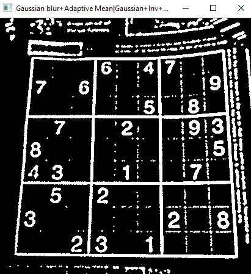
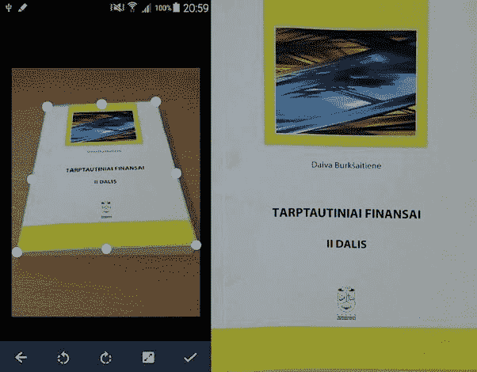

# 如何构建基于视觉的智能数独求解器

> 原文：<https://levelup.gitconnected.com/how-to-build-a-smart-vision-based-sudoku-solver-ffbee2875cda>

## 利用人工智能的力量来检测、识别和解决数独难题

图片由[皮克斯拜](https://pixabay.com/?utm_source=link-attribution&utm_medium=referral&utm_campaign=image&utm_content=4389372)的 Gerd Altmann 提供

我喜欢解数独。嗯，*不是*真的，但为了一个相当*戏剧性的*背景故事，让我们现在离题。

有一天，我被一个特别难的难题难住了，于是我想到要做一个数独解算器，虽然不是普通的解算器，而是一个试图从照片中识别、提取和解答数独的解算器！

不必要的复杂化是我的专长。

当时我正在研究[计算机视觉](https://en.wikipedia.org/wiki/Computer_vision#:~:text=Computer%20vision%20is%20an%20interdisciplinary,human%20visual%20system%20can%20do.)和[深度学习](https://www.investopedia.com/terms/d/deep-learning.asp#:~:text=Deep%20learning%20is%20an%20AI,is%20both%20unstructured%20and%20unlabeled.)，我认为这将是一次有趣的尝试，可以测试我的技能，并在过程中学习更多。

# 让我们开始吧

兴奋之余，我搓着手，掰着指关节，启动我信赖的 HP，下载下面的图片成为“*豚鼠”*，打开 [PyCharm](https://www.jetbrains.com/pycharm/) **、**，一头扎了进去。

(图片由作者提供)

> 在灰度模式下加载图像，因为我们并不真正关心这里的颜色。
> 
> 从现在开始我们就叫这个小家伙“testimg”吧。

# 图像处理

## 步骤 1:模糊和阈值处理

第一步是对图像进行阈值处理。在设定阈值以减少噪声和/或细节之前，最好对图像进行模糊处理。模糊的意思是*顾名思义*。

高斯模糊。来源:[维基共享资源](https://en.wikipedia.org/wiki/Gaussian_blur)

[**阈值处理**](http://www.digitizationguidelines.gov/term.php?term=thresholding#:~:text=Note%3A-,Term%3A%20Thresholding,be%20applied%20to%20color%20images.) 是将灰度图像转换为纯黑白图像的过程。灰度图像中的每个像素都有一个范围从 **0(黑色)**到 **255(白色)的值。基于某个阈值，任何像素值小于该阈值的像素将被设为 0，任何像素值大于该阈值的像素将被设为 255。**

> “世界不是黑就是白，没有中间地带”——阈值。

[**简单阈值处理**](https://www.tutorialspoint.com/opencv/opencv_simple_threshold.htm) 基本上是阈值保持不变的地方。下面是我们在简单阈值处理后的**测试**:

*请忽略下面错误的窗口名*

(图片由作者提供)

> 一点都不好。

嗯，可能是什么原因？

原因是，由于图像不同部分的光照可能存在差异，恒定的阈值不会消除这种差异。

自适应阈值来拯救。

> “如你所愿改变照明，我将适应”——自适应阈值

[**自适应阈值处理**](https://www.tutorialspoint.com/opencv/opencv_adaptive_threshold.htm#:~:text=Adaptive%20thresholding%20is%20the%20method,()%20of%20the%20Imgproc%20class.) 顾名思义使用某种函数根据邻域像素改变阈值的值。其中两个函数是 [**表示**](https://www.tutorialspoint.com/opencv/opencv_adaptive_threshold.htm#:~:text=Adaptive%20thresholding%20is%20the%20method,()%20of%20the%20Imgproc%20class.) 和 [**高斯**](https://www.sciencedirect.com/science/article/pii/0167865588900323) **。**

自适应高斯与自适应均值阈值

## 第二步:反转和扩张

[**反转**](https://www.mathworks.com/help/supportpkg/raspberrypi/examples/image-inversion.html#:~:text=Black%20and%20white%20image%20inversion,areas%20are%20mapped%20to%20light.&text=An%20inverted%20black%20and%20white,negative%20of%20the%20original%20image.) 顾名思义就是将所有黑色像素转换为白色，白色像素转换为黑色。 [**膨胀**](http://matlab.izmiran.ru/help/toolbox/images/morph2.html#:~:text=Dilation%20adds%20pixels%20to%20the,used%20to%20process%20the%20image.) 简单来说就是通过添加像素的排序来加厚边界的一种方式。

*正常与扩张图像*

完成**步骤 1 和 2** 后，我摆弄了几组不同的**模糊、阈值、**和**膨胀**以及**反转**:

不同组合的结果。(图片由作者提供)

最后选定了下面的组合。**原因**是边界线和数字又粗又实。我们不担心内盒线，因为它们是不必要的。

最终的组合。(图片由作者提供)

# 网格提取

## 步骤 1:检测网格

我们来谈谈斑点，不，不是你想的那种。嗯，这种也有点类似于传统的那种。

**BLOB** 代表[二进制大对象](https://en.wikipedia.org/wiki/Binary_large_object)，指的是二进制图像中一组相连的像素。这里有一个例子可以更好地说明这个意思。

红色圆圈代表黑色斑点。(图片来自[维基共享资源](https://commons.wikimedia.org/wiki/Main_Page))

现在让我们看看下图。

(图片由作者提供)

注意到什么了吗？

> 外部网格是一团白色像素！

很容易看出，外部网格包围的区域相当大，事实上是最大的。

因此，我们所要做的就是找到最大的斑点，这将是我们的董事会！

如何找到最大的斑点？*——*答案是洪水填充。

[**洪水填充**基本上就是从某个点(*种子点)*开始，对相同像素值的所有连接点进行着色的算法](https://en.wikipedia.org/wiki/Flood_fill)。

我们开始用绿色填充较大形状内部的白色点，正如你所看到的，整个形状都是绿色的。(图片由[维基共享资源](https://commons.wikimedia.org/wiki/Main_Page)提供)

现在用洪水填充，我们可以隔离斑点，从而分离出最大的斑点，这就是我们的网格。所以我们所要做的就是用黑色填充所有的斑点，除了最大的那个。

洪水填充正在进行中(左)和已完成(右)。(图片由作者提供)

*瞧！我们成功隔离了外层网格。*

(图片由作者提供)

> 记得扩张吗？请允许我介绍他的死敌糜烂。

**侵蚀**是通过移除像素来细化边界的过程。

> 这么说吧，如果右边是原图，那么左边的图就被侵蚀了。

让我们侵蚀网格一点，以撤销我们之前应用的膨胀。

(图片由作者提供)

## 第二步:寻找边界线

让我们从找到所有的线开始。我们可以使用[霍夫线变换](http://opencv-python-tutroals.readthedocs.io/en/latest/py_tutorials/py_imgproc/py_houghlines/py_houghlines.html)来实现。

数学并不那么简单，所以我们只能说这是一种识别图像中直线的技术。点击阅读更多关于这个[的内容。](https://tomaszkacmajor.pl/index.php/2017/06/05/hough-lines-transform-explained/)

一旦所有的线都找到了，下一步就是找到极端或边界线。这是简单而优雅的逻辑。

*   斜率几乎为 0 **(几乎水平)**的离顶部最近的线将是上边缘。
*   斜率几乎为 0 **(几乎水平)**的离底部最近的线是下边缘。
*   从左边算起斜率几乎为无穷大的最近的线**(几乎垂直)**将是左边缘。
*   从右边开始斜率几乎为无穷大的最近的线**(几乎垂直)**将是右边。

*出奇的简单直观不是吗？*

找到所有的线(左)，然后只选择边界线(右)。(图片由作者提供)

## 第三步:寻找边界点。

一旦找到线，我们就可以很容易地找到与一些线性代数的交点——使用**行列式。** [下面是怎么做的](https://iq.opengenus.org/2d-line-intersection/)。

嗯，不容易。事实上，我不得不做了相当多的阅读，即使在那时也很难实现这一部分。

在原始图像上绘制的边界线和点。(图片由作者提供)

## 第四步:修正视角，裁剪掉网格。

现在，我们需要裁剪掉这一部分，并*【校正】*透视。你可以看到图像的顶部看起来比底部离我们更远。

[**扭曲视角**](https://www.pyimagesearch.com/2014/05/05/building-pokedex-python-opencv-perspective-warping-step-5-6/) 。利用透视变换矩阵或单应矩阵来执行变换是校正透视的一种方式。

> 简单来说，它*修正*视角。

扭曲视角。(图片来自[维基共享资源](https://commons.wikimedia.org/wiki/Main_Page))

校正透视后，下面是图像的样子。

作者图片

*咻！我们终于找到了坐标。*

## 步骤 5:一些图像处理

现在是一些有趣的阈值和反转。

(图片由作者提供)

## 第六步:细胞提取

现在该拿把刀了，因为我们要把这个坏小子切成 81 块。

* *恶魔般的微笑*和*急切地磨刀**

这是其中一个被切碎的细胞的样子:

(图片由作者提供)

确实很寒酸。

## 第七步:细胞清洁

我们需要去掉背景中那些肮脏的白色斑点，但是怎么做呢？

**头脑风暴努力**

还记得之前的洪水填充吗？

> 如果我们用黑色填充所有的白色外层点，那么我们可以去掉那些难看的白色斑块！

*嗯，猜不到。*

如果白色斑块从内层开始，那么我们就有问题了。

**随着挫败感的加剧而挠头**

我终于想出了(*不那么*)绝妙的解决方案:

> 从最后 2 层或 3 层进行整体填充，而不仅仅是外层。

既然它奏效了，我决定坚持下去。

## 第八步:将数字放在图像的中心

于是我找到了数字的**包围盒**，通过循环移动像素使图像居中。

*那么如何找到包围盒呢？*

*   从图像的中心开始，向四个方向移动。
*   当我们碰到一个没有任何白色像素的行或列时，这意味着我们到达了数字的末尾！

在广阔的黑暗中孤独的坚定者。(图片作者提供)

# 数字识别

我们得到了网格，我们可以继续识别 81 个单元格中的数字，对吗？

*不对，有问题。*

> 如果单元格是空的呢？我们如何事先识别空细胞？

**头脑风暴加剧**

**别说了，想简单点**

请看下面一个空单元格的图片:

(图片由作者提供)

有什么想法吗？

注意到什么了吗？

> 空单元格根本没有任何白色像素。

因此，我们所要做的就是对所有像素的像素值求和，并检查它是否小于某个阈值。

阈值的原因是可能会有剩余的白色斑块。我将阈值设置为 5 个白色像素(*为了安全起见)。*

## 现在让我们继续辨认**和**。

时间召唤 [**张量流**](https://www.tensorflow.org/) 和 [**Sklearn**](https://scikit-learn.org/) **。**我首先在 [MNIST 手写数字数据集](http://yann.lecun.com/exdb/mnist/)上构建并训练了一个[卷积神经网络(CNN)](https://en.wikipedia.org/wiki/Convolutional_neural_network) 。

**MNIST** 数据集是由 70，000 个 28X28 像素的手写数字图像组成的数据集。

MNIST 数据集。(图片来自[维基共享资源](https://www.google.com/url?sa=i&url=https%3A%2F%2Fcommons.wikimedia.org%2Fwiki%2FFile%3AMnistExamples.png&psig=AOvVaw2JMoJkww20Myz5OYjYGxKK&ust=1610542284303000&source=images&cd=vfe&ved=0CAIQjRxqFwoTCPiX5tm3lu4CFQAAAAAdAAAAABAD))

## 神经网络

在我们讲一个 CNN 是什么之前，我们先讲一个[神经网络](https://www.investopedia.com/terms/n/neuralnetwork.asp#:~:text=Neural%20networks%20are%20a%20series,fraud%20detection%20and%20risk%20assessment.) 是什么:

> **神经网络**从非常高的抽象层次来说，是一种算法，或者说是一系列试图模仿大脑的算法。

它由多层*节点*或*神经元组成。这些神经元要么激活，要么不激活。一层中的每个神经元都与另一层中的每个神经元相连。随着层的堆积和每层神经元数量的增加，连接的数量呈指数增长*。**

> 举例来说，仅用 5 层和每层 32 个神经元，我们将得到 3，35，54，432 个可能的连接！

让我们不要进入数学领域，因为它相当复杂，涉及许多微积分、线性代数和统计学。

一个例证。(图片由[维基共享资源](https://www.google.com/url?sa=i&url=https%3A%2F%2Fcommons.wikimedia.org%2Fwiki%2FFile%3AMultilayer_Neural_Network.png&psig=AOvVaw20TPkJC-JzJaptors9wAKx&ust=1610542370582000&source=images&cd=vfe&ved=0CAIQjRxqFwoTCJC32IO4lu4CFQAAAAAdAAAAABAU)提供)

> 当心，这些机器一天比一天聪明。
> 
> 嗯，事实上不，他们不是。只是很多抽象。在核心，他们所能做的就是玩 0 和 1。

因此， **CNN** 是一类特殊的神经网络**T5，主要用于计算机视觉。**

> *CNN 旨在用通俗的语言模仿人类的视觉。*

一个 CNN。(图片来自[维基共享资源](https://commons.wikimedia.org/wiki/Main_Page))

*因此，CNN 基本上是一个添加了一堆额外层的神经网络。*

要了解神经网络是如何工作的，我会推荐观看 3B1B 的这些令人惊叹的视频。

## 一个 KNN

接下来，我转向一个可靠的简单的[机器学习](https://searchenterpriseai.techtarget.com/definition/machine-learning-ML#:~:text=Machine%20learning%20(ML)%20is%20a,to%20predict%20new%20output%20values.)算法，叫做 [K 近邻分类器](https://en.wikipedia.org/wiki/K-nearest_neighbors_algorithm)。

> “告诉我谁是你的邻居，我会告诉你你是谁”——KNN

**K 最近邻居:**顾名思义，通俗地说，KNN 分类器使用与邻居的距离来确定特定实体属于哪个类。

> 当我们训练 KNN 进行数字识别时，我们基本上是在创造一个 **10 维空间**并在上面绘图。

试着想象一下。

尽管两者在 MNIST 数据集上都获得了大约 97%的准确率，但 KNN 在测试中表现更好。

我决定在一个变量中实现和代码，以控制应用程序使用哪一个。

***TADA！***

(图片由作者提供)

最后，

# 解开谜题。

现在剩下要做的就是解开这个谜题。一种叫做回溯的技术可以用来轻松地实现一个解决方案。

为了解决数独，我们可以这样做:

1.  找一个空的位置。
2.  在不违反行、列或内部框属性的情况下，找到所有可以插入该插槽的数字。
3.  尝试每一个数字并递归。如果这些数字中至少有一个是成功的，那么我们已经找到了一个解决方案，否则没有解决方案。

这是解决方案屏幕:

(图片由作者提供)

# 图形用户界面

一直以来，我都在用截图展示这个过程的不同步骤。如果你想知道我是从哪里得到它们的——从我使用 [Tkinter](https://docs.python.org/3/library/tkinter.html) 为应用程序构建的 UI。

## **主界面:**

所有的框架相互堆叠，每当要显示任何一个框架时，使用 [**Tkraise**](https://www.kite.com/python/docs/tkinter.Frame.tkraise) 来升起该框架。

**第一个画面:**第一个画面是显示主画面，也是加载图像后的画面。

主屏幕和加载图像后的屏幕。(图片由作者提供)

## **第二帧:**

第二帧显示图像从初始图像开始直到识别和求解所经历的所有阶段。几个阶段:

(图片由作者提供)

**第三帧:**第三帧显示识别的数独网格。在这里，用户可以更改任何错误识别的条目，并单击显示解决方案来查看解决方案。

这是因为应用程序不是 100%准确的，任何人工智能模型也不可能做到这一点！

解数独前后。(图片由作者提供)

砍！我们完了。总的来说，这个项目很有趣，但也很耗时——我花了大约十天时间，每天花 7 到 8 个小时来完成这个项目。大约 70 个小时的努力，有趣的是 GUI 比 AI 花了更多的时间。

> “所以大约 70 个小时的努力，有趣的是，GUI 比 AI 部分花了更多的时间。”

我没有深入到每一步，也没有粘贴代码片段，因为如果我这样做的话会太长太无聊。我只是想说明应用程序的整体逻辑和流程。

这个项目是托管在我的 **Github** 的 [neeru1207/AI_Sudoku](https://github.com/neeru1207/AI_Sudoku) 上。所以，如果你想尝试一下，并有可能改进它，请随意去做。

这个项目在 Github 上获得了相当多的关注，到目前为止已经获得了超过 750 颗星星！关于这个项目的另一个有趣的事实是，在 2020 年 2 月初的一天，它在 Github 趋势上排名第一。

> 2020 年 2 月初的某一天，它在 Github 上排名第一。

这篇文章加上我已经写了一个非常详细的自述文件，并且整个代码库都有很好的注释，所以你理解代码应该没有任何问题。

感谢您的阅读，希望您喜欢这篇文章！如果你喜欢这个，你可能也会喜欢，

 [## 使用 OpenCV 在 Python 中进行骨架化

### 让我以一个(不太)有趣的笑话开始。

medium.com](https://medium.com/analytics-vidhya/skeletonization-in-python-using-opencv-b7fa16867331)  [## 我是如何在 Flipkart 得到一份暑期实习的。

### 我是在 NITK 大学攻读 CSE 生物技术的四年级本科生。我最近完成了在 Flipkart 的暑期实习…

medium.com](https://medium.com/datadriveninvestor/how-i-landed-a-summer-internship-at-flipkart-df6e509a5751)  [## 一个棘手且相当有趣的链表问题

### 在最后一轮编码面试中，我被要求解决这个问题

levelup.gitconnected.com](/a-tricky-and-interesting-linked-list-problem-2330d9086102) 

# ***有用资源***

> [*理解神经网络*](https://towardsdatascience.com/understanding-neural-networks-19020b758230)
> 
> [*机器学习基础知识与 K 近邻算法*](https://towardsdatascience.com/machine-learning-basics-with-the-k-nearest-neighbors-algorithm-6a6e71d01761)
> 
> [*艾窝棚*](http://aishack.in/)
> 
> [*YouTube 上的 send ex*](https://pythonprogramming.net/tkinter-depth-tutorial-making-actual-program/)
> 
> OpenCV *中的 [*数独抓取器是*真的*帮我解决了网格提取部分的教程。对于网格提取部分，我遵循了本教程中列出的相同步骤。*](http://aishack.in/tutorials/sudoku-grabber-opencv-plot/)*
> 
> [Tkinter—Python Wiki](https://wiki.python.org/moin/TkInter)
> 
> [*OpenCV-Python 教程*](https://opencv-python-tutroals.readthedocs.io/en/latest/py_tutorials/py_tutorials.html)
> 
> [*回溯|简介— GeeksforGeeks*](https://www.geeksforgeeks.org/backtracking-introduction/)
> 
> [*数独|回溯-7 — GeeksforGeeks*](https://www.geeksforgeeks.org/sudoku-backtracking-7/)