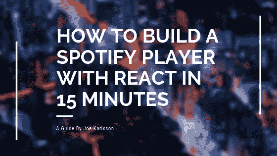
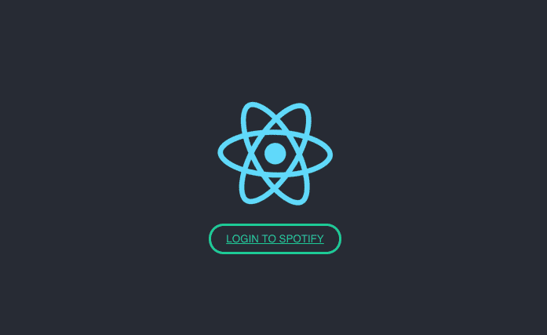
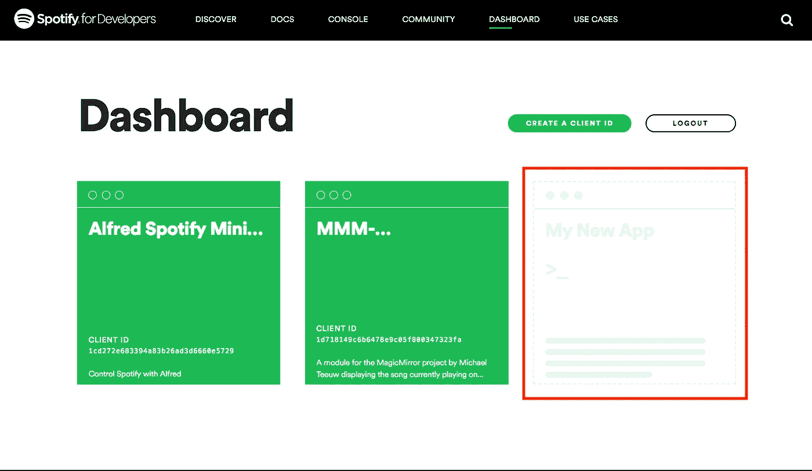
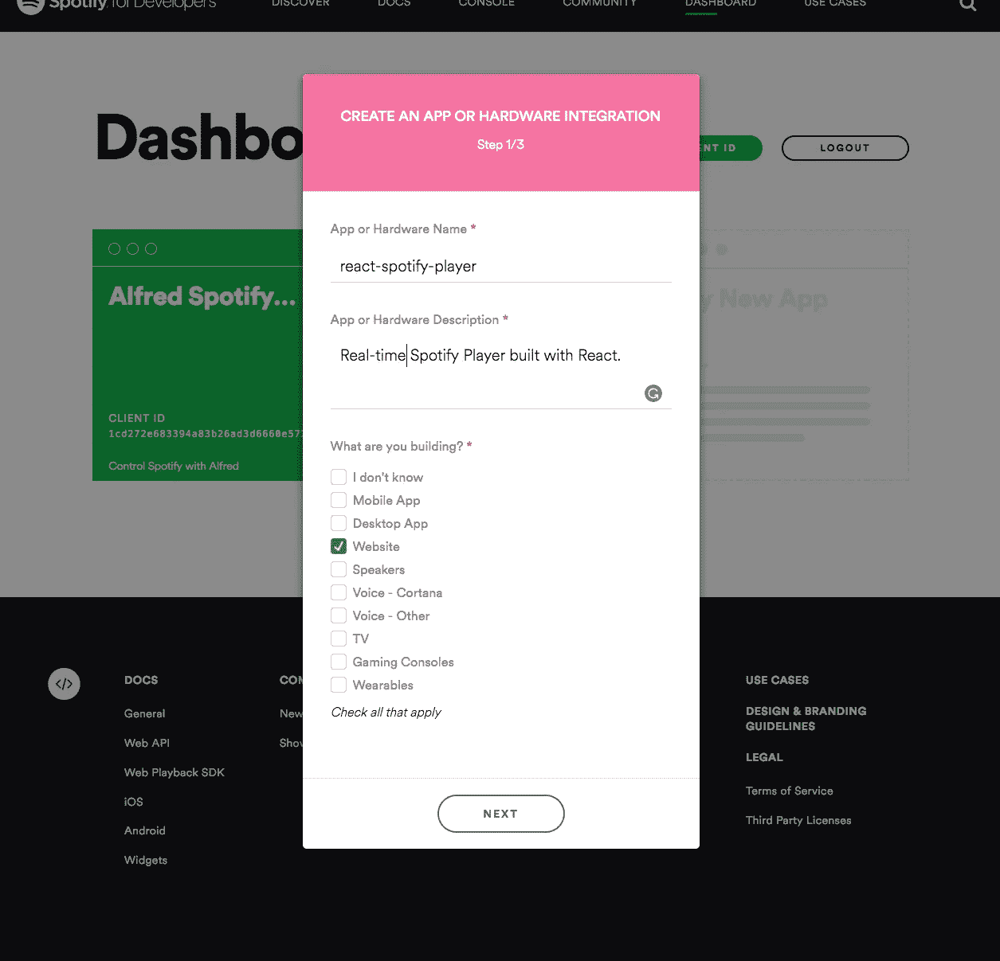
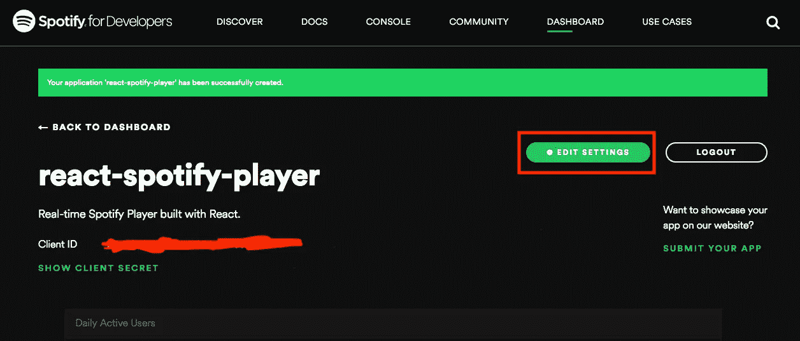
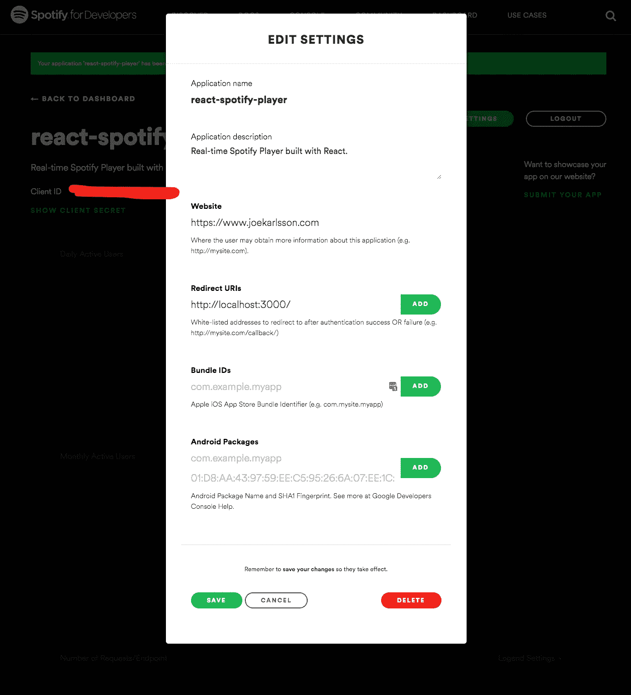
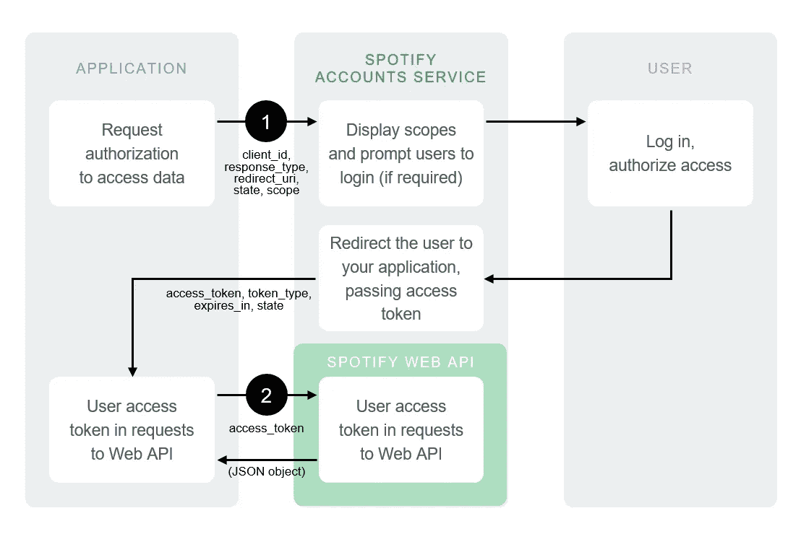

# 如何在 15 分钟内用 React 构建一个 Spotify 播放器

> 原文：<https://levelup.gitconnected.com/how-to-build-a-spotify-player-with-react-in-15-minutes-7e01991bc4b6>

# Spotify 开发者 API 简介



你有没有想过将 Spotify 集成到你的应用程序或网站中？使用 Spotify 开发者 API，将个性化音乐添加到任何应用程序都非常简单。就我个人而言，我一直在玩 Spotify API 和我在业余时间建立的一个物联网项目。


我的 MagicMirror 项目与 Spotify 集成。

Spotify API 易于使用，可以添加到任何应用程序中。

在这篇文章中，我将介绍如何使用 React 在浏览器中访问 Spotify 开发者 API。我们的目标是为那些希望尽快使用 Spotify API 的前端开发人员提供一个起点。我们将共同创建一个 Spotify 网络播放器，显示您当前在 Spotify 上播放的音乐信息。我们还将演示如何:

*   向 Spotify 注册应用程序
*   认证用户并获得访问用户数据的授权
*   从 Web API 端点检索数据

您可以在这里找到所有的源代码:

[](https://github.com/JoeKarlsson/react-spotify-player) [## JoeKarlsson/react-Spotify-播放器

### React 构建的实时 Spotify 播放器。为 JoeKarlsson/react-spotify 播放器开发做出贡献，创建一个…

github.com](https://github.com/JoeKarlsson/react-spotify-player) 

我们的 Spotify 网络播放器正在运行

注意:本文不会深入 React，它需要 JavaScript 和 React 的基础知识。


好了，现在我们开始吧！

# 设置您的帐户

要使用 Web API，首先要创建一个 Spotify 用户帐户(高级或免费)。为此，只需在[www.spotify.com](http://www.spotify.com/)注册即可。

当你拥有一个用户账户时，进入 Spotify 开发者网站的[仪表盘](https://developer.spotify.com/dashboard)页面，如有必要，登录。接受最新的[开发者服务条款](https://developer.spotify.com/terms)以完成您的帐户设置。

# 注册您的应用程序

任何应用程序都可以从 Spotify Web API 端点请求数据，许多端点是开放的，将返回数据*而不需要*注册。但是，如果您的应用程序试图访问用户的个人数据(个人资料、播放列表等)。)必须挂号。

你可以[注册你的应用](https://developer.spotify.com/documentation/general/guides/app-settings/#register-your-app)，甚至在你创建它之前。

前往 Spotify 开发者网站的[仪表盘](https://developer.spotify.com/dashboard)页面，点击“我的新应用”。"



使用表格作为指南，填写新应用的信息。然后单击下一步。



点击“编辑设置”继续您的应用程序注册。



最重要的是，你必须把一个重定向网址。我们将使用 Create React 应用程序中的默认 URL。在本栏位输入 [http://localhost:3000](http://localhost:3000/) 。这是用户通过 Spotify 认证后，您希望重定向到的 URL。



点击“保存”,并确保记下您申请中的客户 ID。恭喜您，您已经注册了您的应用程序，现在我们可以开始编写代码了。


你做到了！

# 设置代码

我们将通过运行 [Create React App](https://github.com/facebook/create-react-app) 快速开始。您可以通过在终端中运行以下命令来做到这一点。

```
npx create-react-app react-spotify-player
cd react-spotify-player
npm start
```

在你最喜欢的文本编辑器中打开项目，然后让我们的应用程序通过 Spotify 认证，这样我们就可以获得这些有趣的数据。向 Spotify 认证的方法有很多很多，但我们将使用[隐式授权](https://developer.spotify.com/documentation/general/guides/authorization-guide/#implicit-grant-flow)。

[隐式授权流](https://developer.spotify.com/documentation/general/guides/authorization-guide/#implicit-grant-flow)适用于完全使用 JavaScript 实现并在资源所有者的浏览器中运行的客户端(如我们的客户端)。隐式授权流程在客户端执行，不涉及密钥。颁发的访问令牌是短期的，并且当它们到期时没有刷新令牌来延长它们。



来源:[https://developer . Spotify . com/documentation/general/guides/authorization-guide/# implicit-grant-flow](https://developer.spotify.com/documentation/general/guides/authorization-guide/#implicit-grant-flow)

我们需要编写一些代码来执行几个动作:

1.  我们将把用户重定向到帐户服务的`/authorize`端点:

`GET [https://accounts.spotify.com/authorize](https://accounts.spotify.com/authorize)`

2.要求用户授权范围内的访问。Spotify Accounts 服务提供正在寻求访问的[范围](https://developer.spotify.com/documentation/general/guides/authorization-guide/#list-of-scopes)的详细信息。

*   如果用户未登录，系统会提示他们使用 Spotify 用户名和密码登录。
*   当用户登录时，会要求他们授权访问范围中定义的数据集。

3.用户将被重定向回您指定的 URI。在用户同意(或拒绝)访问后，Spotify 帐户服务会将用户重定向到`redirect_uri`。在本例中，重定向地址是:`[https://example.com/callback](https://example.com/callback)`

在 App.js 中添加以下代码:

```
import React, { Component } from "react";
import hash from "./hash";
import logo from "./logo.svg";
import "./App.css";export const authEndpoint = 'https://accounts.spotify.com/authorize';// Replace with your app's client ID, redirect URI and desired scopes
const clientId = "YOUR_CLIENT_ID_GOES_HERE";
const redirectUri = "http://localhost:3000";
const scopes = [
  "user-read-currently-playing",
  "user-read-playback-state",
];// Get the hash of the url
const hash = window.location.hash
  .substring(1)
  .split("&")
  .reduce(function(initial, item) {
    if (item) {
      var parts = item.split("=");
      initial[parts[0]] = decodeURIComponent(parts[1]);
    }
    return initial;
  }, {});window.location.hash = "";class App extends Component {
  componentDidMount() {
    // Set token
    let _token = hash.access_token;
    if (_token) {
      // Set token
      *this*.setState({
        token: _token
      });
    }
  }render() {
  return (
    <div className="App">
      <header className="App-header">
      
      {!*this*.state.token && (
        <a
          className="btn btn--loginApp-link"
          href={`${authEndpoint}client_id=${clientId}&redirect_uri=${redirectUri}&scope=${scopes.join("%20")}&response_type=token&show_dialog=true`}
        >
          Login to Spotify
        </a>
      )}
      {*this*.state.token && (
        // Spotify Player Will Go Here In the Next Step
      )}
      </header>
    </div>
  );
  }}export default App;
```

这段代码创建了一个“登录 Spotify”按钮，重定向用户到 Spotify 进行身份验证，我们可以获得一个身份验证令牌，然后用它向 Spotify API 发出请求。

现在，让我们添加一个调用 Spotify API 并返回数据的函数。您需要添加附加信息。

```
import * as $ from "jquery";
import Player from "./Player";class App extends Component {
  constructor() {
    *super*();
    *this*.state = {
      token: null,
    item: {
      album: {
        images: [{ url: "" }]
      },
      name: "",
      artists: [{ name: "" }],
      duration_ms:0,
    },
    is_playing: "Paused",
    progress_ms: 0
  }; *this*.getCurrentlyPlaying = *this*.getCurrentlyPlaying.bind(*this*);
  } getCurrentlyPlaying(token) {
    // Make a call using the token
    $.ajax({
      url: "https://api.spotify.com/v1/me/player",
      type: "GET",
      beforeSend: (xhr) => {
        xhr.setRequestHeader("Authorization", "Bearer " + token);
      },
      success: (data) => {
        *this*.setState({
          item: data.item,
          is_playing: data.is_playing,
          progress_ms: data.progress_ms,
        });
      }
    });
  } ...}
```

然后，当然，我们需要制作实际的播放器。我们首先需要创建一个名为`Player.js`的新玩家组件。

```
import React from "react";
import "./Player.css";const Player = props => {
  const backgroundStyles = {
    backgroundImage:`url(${props.item.album.images[0].url})`,
  };

  const progressBarStyles = {
    width: (props.progress_ms * 100 / props.item.duration_ms) + '%'
  };

  return (
    <div className="App">
      <div className="main-wrapper">
        <div className="now-playing__img">
          
        </div>
        <div className="now-playing__side">
          <div className="now-playing__name">{props.item.name}</div>
          <div className="now-playing__artist">
            {props.item.artists[0].name}
          </div>
          <div className="now-playing__status">
            {props.is_playing ? "Playing" : "Paused"}
          </div>
          <div className="progress">
            <div
              className="progress__bar"
              style={progressBarStyles}
            />
          </div>
        </div>
        <div className="background" style={backgroundStyles} />{" "}
      </div>
    </div>
  );
}export default Player;
```

这里是`Player.css`的 CSS。

```
/** Now Playing **/
.now-playing__name {
  font-size: 1.5em;
  margin-bottom: 0.2em;
}.now-playing__artist {
  margin-bottom: 1em;
}.now-playing__status {
  margin-bottom: 1em;
}.now-playing__img {
  float: left;
  margin-right: 10px;
  text-align: right;
  width: 45%;
}.now-playing__img img {
  max-width: 80vmin;
  width: 100%;
}.now-playing__side {
  margin-left: 5%;
  width: 45%;
}/** Progress **/
.progress {
  border: 1px solid #eee;
  height: 6px;
  border-radius: 3px;
  overflow: hidden;
}.progress__bar {
  background-color: #eee;
  height: 4px;
}
```

然后在你的`App.js`中，你需要将数据从 Spotify 传入你的播放器组件。

```
class App extends Component {... render() {
    return ( ... {*this*.state.token && (
        <Player
          item={*this*.state.item}
          is_playing={*this*.state.is_playing}
          progress_ms={*this*.progress_ms}
        />
      )}
     </header>
   </div>
  );
 }
}
```

这就是你需要的所有代码。到这一步，你的应用程序看起来和工作起来应该是这样的。


就是这样！


你做到了！

如果您有任何问题或意见，请随时联系或[在回购中提出问题](https://github.com/JoeKarlsson/react-spotify-player/issues?q=is%3Aissue+is%3Aopen+sort%3Aupdated-desc)。

> 你可以在这里找到这个教程的源代码:[https://github.com/JoeKarlsson/react-spotify-player](https://github.com/JoeKarlsson/react-spotify-player)

我叫 Joe Karlsson，是一名来自明尼苏达州明尼阿波利斯冻原的软件工程师。我写代码，建立团队，做演讲。您可以关注我:

*   [推特](https://twitter.com/JoeKarlsson1)
*   [GitHub](https://github.com/JoeKarlsson)
*   [领英](https://www.linkedin.com/in/joekarlsson/)
*   [Instagram](https://www.instagram.com/joekarlsson/)
*   [网站](https://www.joekarlsson.com)

[](https://levelup.gitconnected.com)[](https://gitconnected.com/learn/react) [## 学习 React -最佳 React 教程(2019) | gitconnected

### 排名前 49 的 React 教程-免费学习 React。课程由开发人员提交并投票，使您能够…

gitconnected.com](https://gitconnected.com/learn/react)