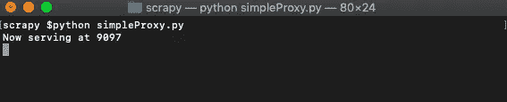
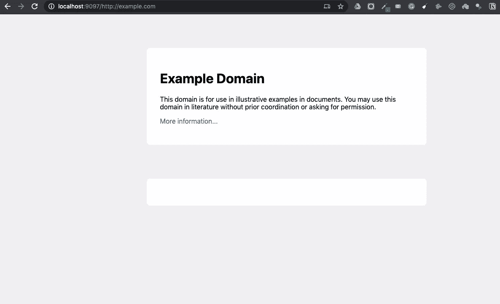
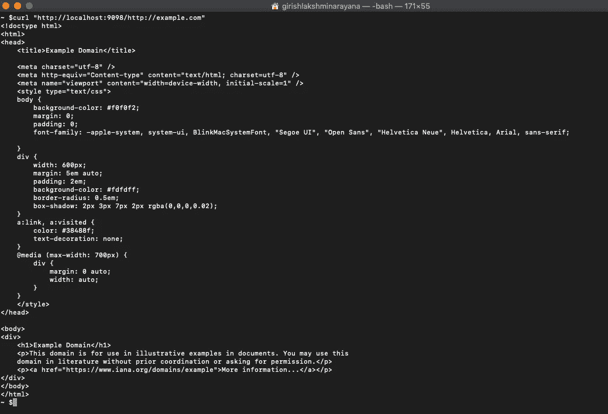

# 如何只用 17 行代码用 Python 构建一个超级简单的 HTTP 代理

> 原文：<https://levelup.gitconnected.com/how-to-build-a-super-simple-http-proxy-in-python-in-just-17-lines-of-code-a1a09192be00>

## 用 Python 构建一个简单的代理服务器非常容易。诀窍在于使用正确的模块。

今天，我们将使用 SocketServer 和 SimpleHTTPServer 模块来监听传入的请求，并使用 URL lib 模块来获取目标 web 页面。

让我们初始化并设置端口。

```
import SocketServer
import SimpleHTTPServer
import urllibPORT = 9097
```

然后我们继承 SimpleHTTPRequestHandler 来创建我们自己的代理。所有 GET 请求都会调用 do_GET。

```
class MyProxy(SimpleHTTPServer.SimpleHTTPRequestHandler):
    def do_GET(self):
    	url=self.path[1:]
    	self.send_response(200)
    	self.end_headers()
      self.copyfile(urllib.urlopen(url), self.wfile)
```

浏览器中的`url`在开头会有一个斜杠(`/`)，所以我们需要使用以下命令删除它:

```
url=self.path[1:]
```

浏览器需要用 HTTP 状态码 200 的头来报告成功的获取，所以我们发送这些头。

```
self.send_response(200)
self.end_headers()
self.copyfile(urllib.urlopen(url), self.wfile)
```

最后一行使用`urllib`库获取 URL，并使用复制文件功能将其写回浏览器。

为了运行它，我们使用`ForkingTCPServer`模式，并将其传递给我们的类来处理中断。

```
httpd = SocketServer.ForkingTCPServer(('', PORT), MyProxy)
httpd.serve_forever()
```

我们把整件事放在一起有 17 行。

```
import SocketServer
import SimpleHTTPServer
import urllibPORT = 9097class MyProxy(SimpleHTTPServer.SimpleHTTPRequestHandler):
    def do_GET(self):
    	url=self.path[1:]
    	self.send_response(200)
    	self.end_headers()
        self.copyfile(urllib.urlopen(url), self.wfile) httpd = SocketServer.ForkingTCPServer(('', PORT), MyProxy)
print ("Now serving at"    str(PORT))
httpd.serve_forever()
```

将文件另存为[simpleserver . py并运行。](http://simpleserver.py/)



像这样从浏览器调用它。



或者使用 cURL，这可能更适合试图抓取 HTML 的程序员，因为我们没有内置的支持来获取浏览器将调用的后续图像、CSS 和 JS 文件。

```
curl "http://localhost:9098/http://example.com"
```

您将获得:



这是一个很好的学习练习，但很容易看出，即使是代理服务器本身也容易被阻塞，因为它使用单个 IP。在这种情况下，您可能需要一个每天处理成千上万次读取的代理，使用专业的轮换代理服务来轮换 IP 几乎是必须的。

否则，通过自动定位、使用和 bot 检测算法，您会发现 [**IP 被大量阻止**](https://proxiesapi.com/blog/why-rotating-proxies-are-the-best-way-to-overcome-IP-Blocks.php) 。

我们的旋转代理服务器 [**代理 API**](https://proxiesapi.com/) 提供了一个简单的 API，可以瞬间解决所有的 IP 阻塞问题。

*   随着数百万高速旋转的代理遍布世界各地，
*   通过我们的自动知识产权轮换
*   通过我们的自动用户代理字符串循环(模拟来自不同的有效 web 浏览器和 web 浏览器版本的请求)
*   有了我们的自动验证码解决技术，

我们的数百个客户已经成功地用一个简单的 API 解决了令人头痛的 IP 地址块问题。

在任何编程语言中，整个事情都可以通过一个简单的 API 来访问，如下所示。

事实上，我们在幕后渲染 Javascript 时，您甚至不必费力加载 puppet er，您只需获取数据并使用任何语言(如 Node、puppet er 或 PHP)或使用任何框架(如 Scrapy 或 Nutch)解析它。在所有这些情况下，你可以像这样调用带有渲染支持的 URL。

```
curl "http://api.proxiesapi.com/?key=API_KEY&render=true&url=https://example.com"
```

我们连续提供 1000 个 API 调用，完全免费。在这里 注册并获得你的免费 API 密匙 [**。**](https://proxiesapi.com/)

# 分级编码

感谢您成为我们社区的一员！升级正在改变技术招聘。 [**在最好的公司**找到你的完美工作](https://jobs.levelup.dev/talent) **。**

[](https://jobs.levelup.dev/talent) [## 提升——改变招聘流程

### 🔥让软件工程师找到他们热爱的完美角色🧠寻找人才是最痛苦的部分…

作业. levelup.dev](https://jobs.levelup.dev/talent)