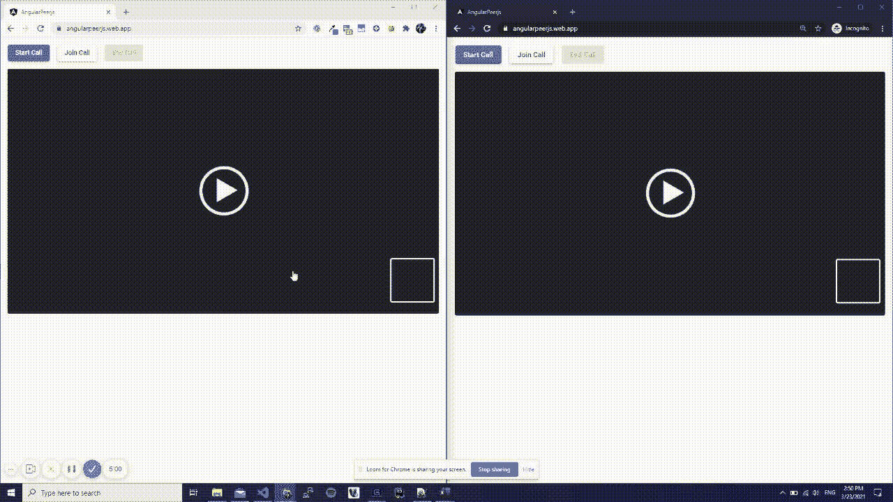
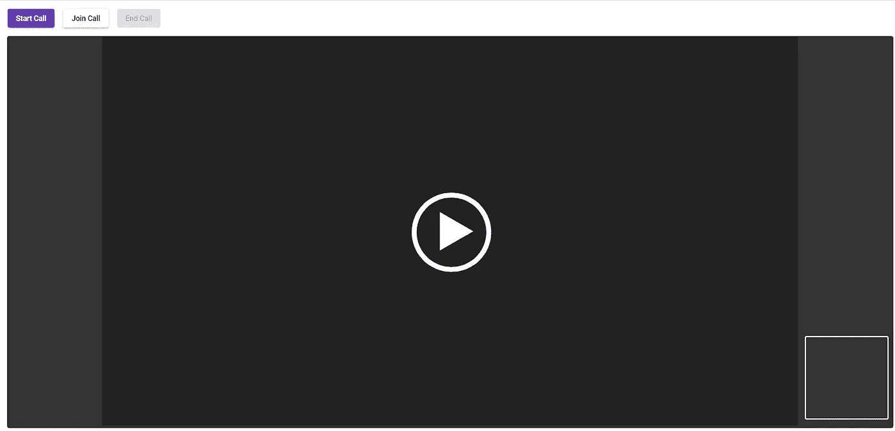

# 如何从零开始构建视频聊天 App:WebRTC 揭秘|循序渐进教程 p. 2 | Angular + PeerJS

> 原文：<https://levelup.gitconnected.com/how-to-build-a-video-chat-app-from-scratch-webrtc-demystified-step-by-step-tutorial-p-2e74767c673>

欢迎阅读 WebRTC 非神秘化系列的第 2 部分。在本文中，我们将使用 Angular 和 PeerJS(一个 JavaScript WebRTC 包装库)从头开始构建一个简单的视频聊天应用程序。如果你现在因为不知道 WebRTC 是什么而紧张不安，首先要冷静下来，其次去看看这个系列的第 1 部分[吧](https://ullal-aaron.medium.com/what-powers-google-meet-and-microsoft-teams-webrtc-demystified-step-by-step-tutorial-e0cb422010f7)，我们在这里见😎

这是我们今天要建造的:

你可以在这里找到一个[工作演示](https://angularpeerjs.web.app/)和 [GitHub repo 这里](https://github.com/ullalaaron/angular-peerjs)。你激动吗？如果是的话，让我们开始派对吧🚀

# **先决条件**

1.  角度的基本知识
2.  安装了[Angular](https://angular.io/guide/setup-local)的计算机
3.  读/写能力

# **阶段 0:设置**

让我们从创建一个全新的 Angular 项目开始:

`**ng new angular-peerjs**`

一旦项目设置好了(不需要路由，我使用 scss 进行样式设计)，让我们进入新创建的项目目录并添加 [Angular Material](https://material.angular.io/) 来给我们的 UI 一个最起码的美学尊严:

`**ng add @angular/material**`

现在，我们可以继续安装项目的 2 个依赖项了:

`**npm i --save peerjs uuid**`

在开始布局之前，让我们导入所有我们需要的有角度的材质组件。

> *以后想看这个故事？* [*把它保存在日记里。*](https://usejournal.com/?utm_source=medium.com&utm_medium=noteworthy_blog&utm_campaign=tech&utm_content=guest_post_read_later_text)

# **第一阶段:布局&样式**

让我们通过打开`**app.component.html**` 文件来完成我们的基本布局。我们将构建一个简单的页面，如下所示。

正如你所看到的，我们有 3 个按钮，使我们能够开始通话，加入通话和结束通话。下面我们找到两个视频元素，我们将使用它们来查看远程参与者和我们自己。

在上面的模板中，我们使用`**isCallStarted$**` 来启用/禁用按钮(如果我们已经参与了一个通话，我们就不能开始通话；如果我们没有参与，我们就不能结束通话)。`**#remoteVideo**` 视频标签将用于播放远程对等体传输的流，而`**#localVideo**` 将用于播放我们的网络摄像头捕获的流。后者将`**muted**`标志设置为`**true**`，否则您会听到自己的声音两次。

现在让我们在`**app.component.scss**`文件中添加一些基本的样式，以使我们的本地视频更小，并锚定在屏幕的右下方:

# 阶段 2:开始/加入呼叫模式

正如你在上面的演示中看到的，当开始或加入一个呼叫时，一个模态被打开。如果需要开始通话，该模式将显示对方的唯一 id，而如果目标是连接到远程对方，该模式将允许您指定远程方的 id。让我们为这个对话框创建一个新组件

`**ng g c callinfo-dialog**`

我们来看看`**callinfo-dialog**` 组件。该模板定义如下:

如果我们正在加入一个呼叫，文本字段将允许我们指定远程对等 id，而如果我们正在开始一个呼叫，相同的输入将被禁用，因为它将显示本地对等 id。我们使用`**cdkCopyToClipboard**`指令来允许简单地通过点击文本输入来复制我们同事的 id。当我们关闭模态时，如果我们正在开始一个呼叫，我们想要传递我们的对等体 id，或者如果我们正在加入它，我们想要传递远程对等体 id 到主`**app.component.ts**` (我们将在阶段 3 中定义)。该组件非常简单，如下所示:

如你所见，这里没什么特别的。我们告诉构造函数我们正在期待一个`**data**`对象——由 main `**app.component.ts**`提供，我们稍后会看到——它包含两个属性:对等体的 Id 和一个布尔值，它指定我们是要加入一个呼叫还是开始一个呼叫。

# 第三阶段:主要部分

让我们看一下`**app.component.ts**`文件，在这里我们将把按钮的逻辑与新创建的模态绑定在一起。

这个组件依赖于我们将在下一节也是最后一节分析的`**call.service.ts**`。在构造函数中，我们得到了一个对`**isCallStarted$**` observable 的引用，它将负责在通话进行中禁用启动/加入通话的按钮。此外，我们初始化我们的对等体，并获得我们唯一的对等体标识符，我们将其分配给`**peerId**` 变量。

在 Angular 正确地实例化了我们的组件类之后，在`**ngOnInit**`方法中，我们订阅了两个流(我们自己的和远程对等体的),并将结果设置为我们之前在模板中定义的视频元素的`**srcObject**`。

在由 start/join call 按钮触发的`**showModal**` 方法中，我们打开模态并传递两个变量:如果我们正在开始呼叫，我们将`**joinCall**`设置为 false，并传递我们对等体的 id(以便我们可以复制它并将其提供给远程对等体)，如果我们正在尝试加入呼叫，我们将`**joinCall**`设置为 true，将`**peerId**`设置为 null。当我们关闭该模式时，我们或者让我们的对等体应答呼叫——如果我们已经开始了一个呼叫的话——或者我们尝试与远程对等体建立呼叫，远程对等体的 id 由用户在该模式中提供。

# 阶段 4:呼叫服务

这是魔法真正发生的地方，我们的同伴被创建，我们提供所有关于如何开始通话、接听和结束通话的指令。因为这是一个 [130 多行的代码类](https://gist.github.com/ullalaaron/fe32d384319f32094b1b8c822f95fb45)，我们将一个方法一个方法地分解它，看看到底发生了什么。

开始时，我们定义将要使用的变量:我们的 peer，一个对实际调用连接的引用，两个行为主体/可观察对象对，用于管理并向外部世界公开本地和远程流，另一个行为主体/可观察对象对用于公开调用的状态(开始或结束)。在构造函数中，我们指示 Angular DI 注入`**MatSnackBar**`，我们将使用它来显示错误消息。如果导入 peerjs 时出现错误，打开`**tsconfig.json**`文件并设置`**allowSyntheticDefaultImports":true**`

这个方法是我们为对等体定义配置的地方。`**PeerJSOption**`允许我们配置 ICE:正如你所看到的，我们使用了 Google 提供的两个免费的 STUN 服务器(要了解更多关于 ICE 和 STUN 的信息，请参考我在本系列的前一篇文章)。如果我们有一个服务器，我们可以把它添加到列表中。在设置好我们的`**peerJSOption**`之后，我们生成一个新的惟一 id 并实例化我们的对等体。我们的客户端现在将连接到 PeerJS 的公共服务器([也可以在本地部署](https://github.com/peers/peerjs-server))，它将为我们处理信令。如果一切顺利，我们返回我们的同行的 id。

既然我们的对等体已经被正确初始化了，是时候做真正的事情了🚀

发起调用的对等点调用`**establishMediaCall**`方法，该方法将远程对等点的 id 作为输入参数，并执行以下操作:

1.  尝试从本地设备(如网络摄像头和麦克风)获取音频/视频流，一旦获取，它将被提供给`**localStreamBs**`行为主体，该行为主体将依次将其提供给所有注册的观察者。
2.  尝试与远程对等方建立连接
3.  一旦与对方建立了连接，呼叫就开始了。
4.  如果呼叫被应答- `**this.mediaCall.on('stream')**`回调-`**remoteStreamBs**`被提供远程流，组播给所有注册的观察者。
5.  如果出现任何错误，它们都会被记录下来，并通知用户发生了什么错误。

应答呼叫的对等点调用`**enableCallAnswer**`方法。此方法执行以下操作:

1.  尝试从本地设备(如网络摄像头和麦克风)获取音频/视频流，一旦获取，它将被提供给`**localStreamBs**`行为主体，该行为主体将依次将其提供给所有注册收听的观察者。
2.  对等方的`**call**` 回调已注册。一旦收到来电，该方法自动应答(将指示对等方开始向对方发送本地流)并开始监听远程流，该流被馈送给`**remoteStreamBs**`行为主体。
3.  如果有错误，记录下来并通知用户哪里出错了

既然已经定义了开始/应答呼叫的逻辑，我们需要做的最后一件事就是处理呼叫的结束。

当我们终止一个呼叫时，我们简单地停止所有曲目，包括远程和本地流。在退出应用程序之前，我们要确保我们结束了所有活动的调用并销毁了我们的对等体。

就是这样！我们现在准备好`**ng serve**`我们的应用程序，尽情享受吧！

*PS:如果你得到下面的错误:* `**parcelRequire is not defined**` *，打开 index.html 文件，在头标签*中放置以下内容

`****`

# 结论

在这两篇系列文章中，我们已经了解了 WebRTC 是如何工作的，然后只用我们的双手构建了一个小巧的视频聊天应用程序。和一个非常强大的 JavaScript 框架。和一个为我们处理所有 WebRTC 东西的库。但是我们做到了🔥所以，给自己一个鼓励，回头见🚀

*如果你喜欢这篇文章，请随意留下一两千个掌声，和你的奶奶谈谈，给我发几个比特币，做一个后空翻，或者在下面的部分留下评论:)*

*ETH:0 xe 00 ef 8 a6 d 7 c 43 BD 164d 41332 D5 e 577 be 9 BD 830 b 6*

📝将这个故事保存在[日志](https://usejournal.com/?utm_source=medium.com&utm_medium=noteworthy_blog&utm_campaign=tech&utm_content=guest_post_read_later_text)中。