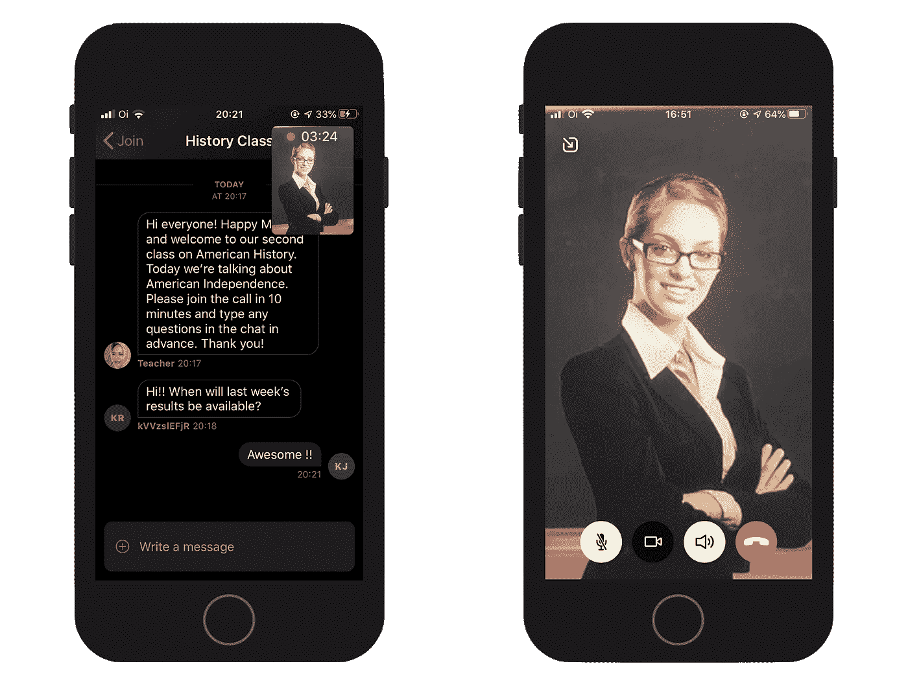
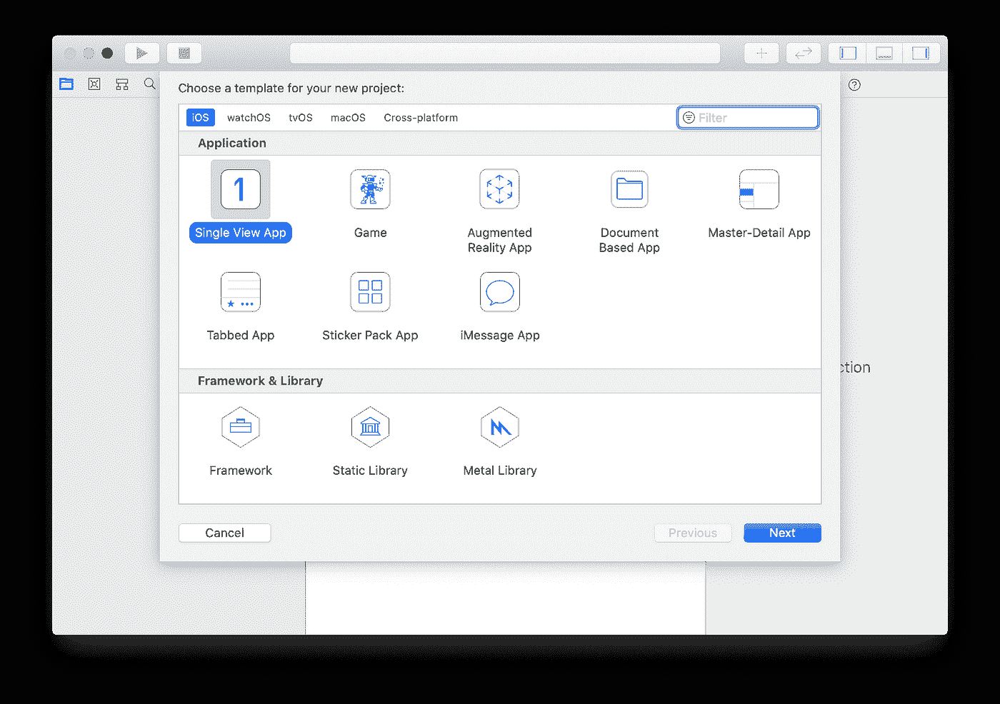
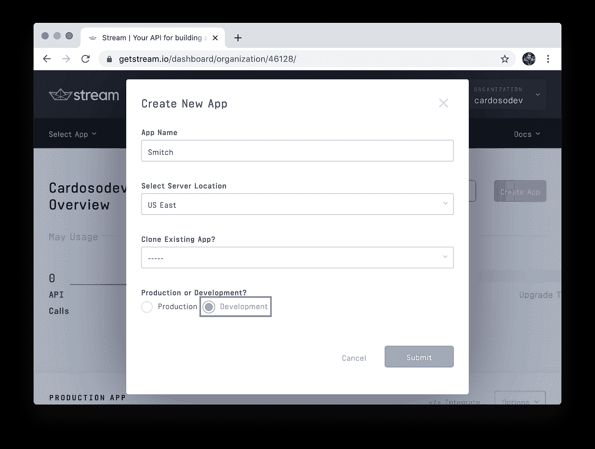
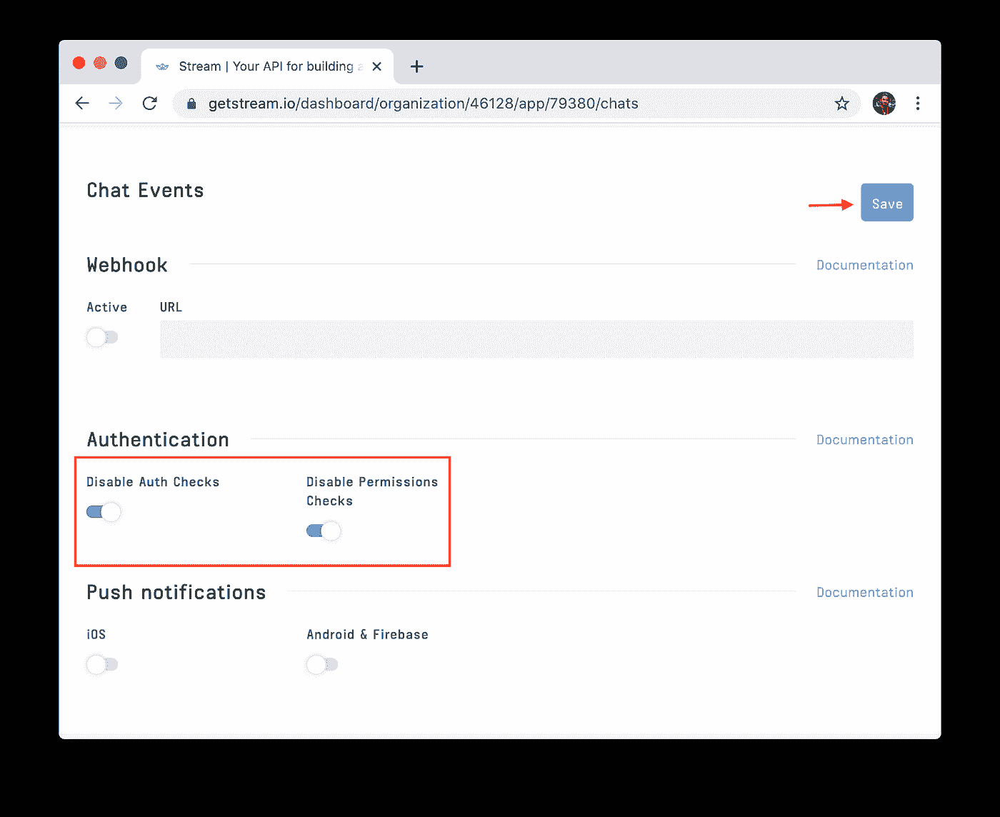
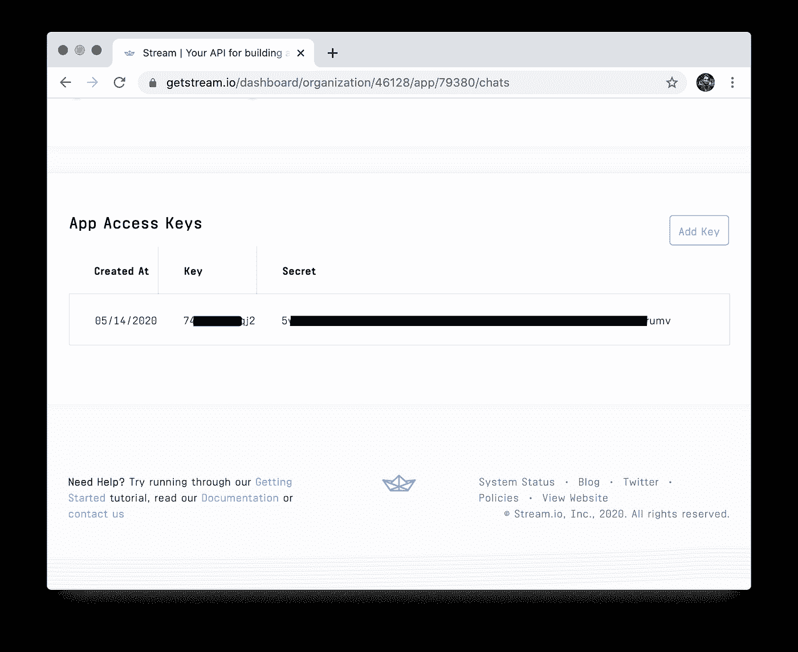
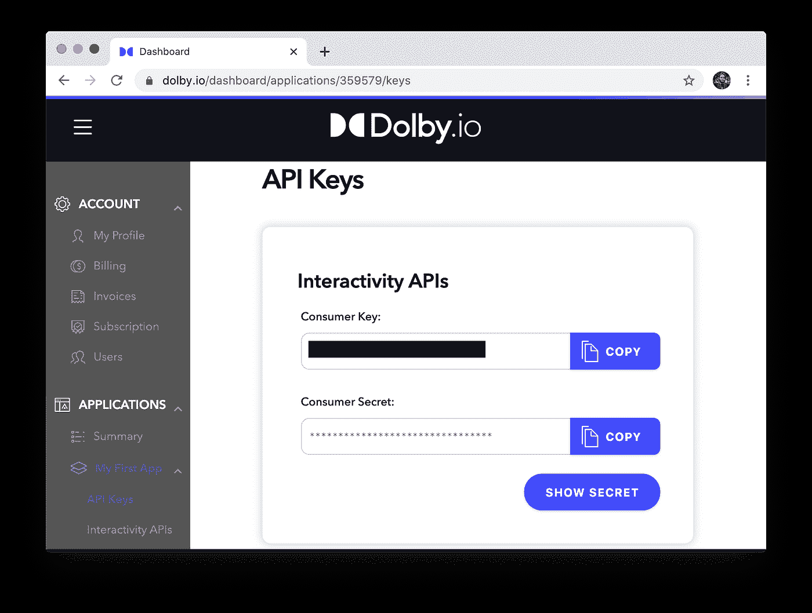
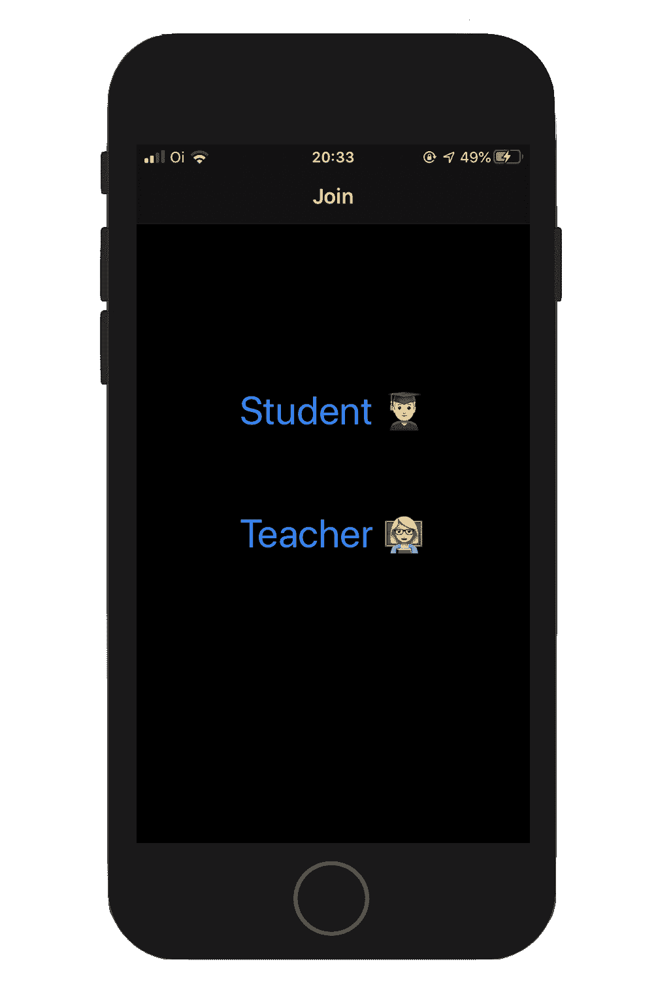
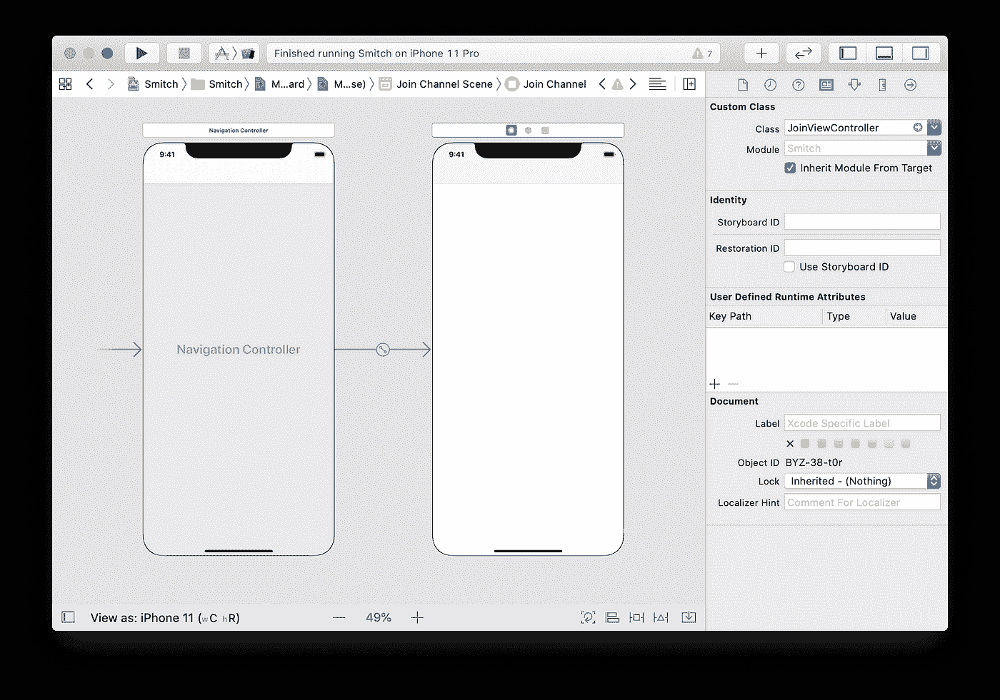
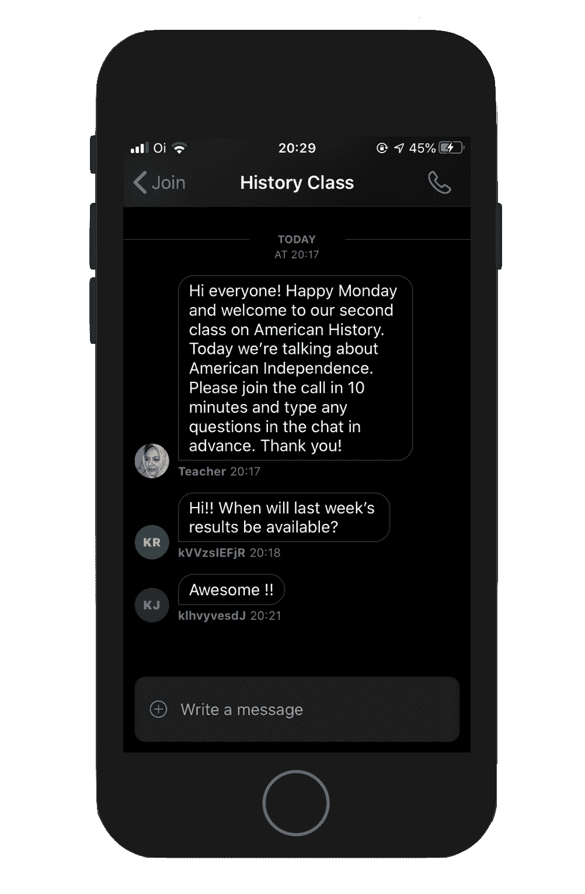
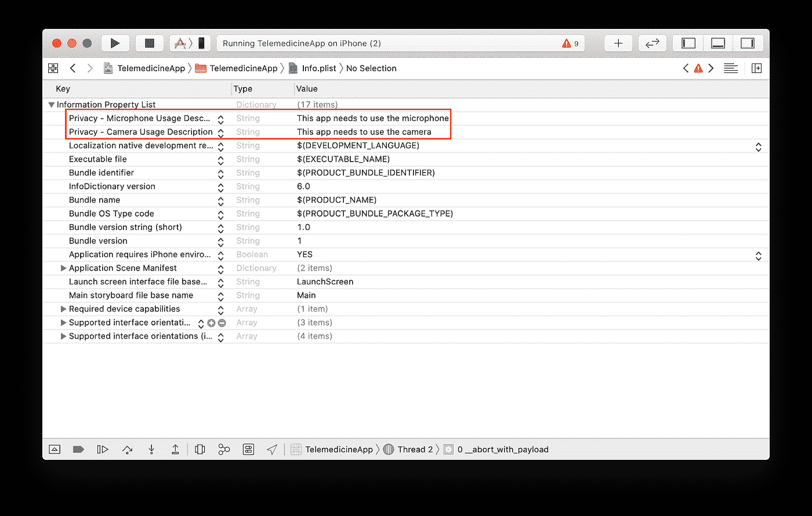

# 如何使用视频和聊天构建虚拟教室 iOS 应用程序

> 原文：<https://levelup.gitconnected.com/how-to-build-a-virtual-classroom-ios-app-with-video-and-chat-fe834bee6678>

在本教程中，我们将构建一个 iOS 应用程序，学生和教师可以在虚拟教室中使用 [Stream Chat](https://getstream.io/chat/) 进行交互，以提供[全功能聊天组件](https://getstream.io/tutorials/ios-chat/)，以及 [Dolby.io](https://Dolby.io) ，以提供高质量的音频和视频。到最后，我们将有一个类似于下面截图的应用程序。额外的好处是，它兼容明暗模式。

如果您在本教程中迷路了，您可以在本 [GitHub repo](https://github.com/GetStream/edtech-classroom-app-ios/) 中查看已完成的项目。让我们开始我们的 EdTech 应用程序开发吧！

# 什么是流聊天？

> *用更少的时间建立实时聊天。借助我们高度可靠的聊天基础架构，快速发送应用内消息。使用流聊天消息平台 API&SDK 推动应用内转换、参与和保留。*
> 
> [*流聊天&留言*](https://getstream.io/chat/)

# 什么是 Dolby.io 的客户端 SDK？

> *Dolby interactive API 提供了一个统一通信和协作的平台。流内通信是指语音、视频和消息的组合，以对最终用户有凝聚力的方式集成到您的应用程序中。这与应用程序外通信形成对比，在应用程序外通信中，用户必须停止使用您的应用程序，转而使用第三方工具。*
> 
> [*杜比. io 文件*](https://dolby.io/developers/interactivity-apis/client-sdk/overview)

# 要求

*   xc code 11+
*   iOS 13+
*   一[流](https://getstream.io/accounts/signup/)帐
*   A [Dolby.io](https://dolby.io/organizations/register) 账户

# 创建 Xcode 项目

首先，我们打开 Xcode，创建一个单视图应用程序项目。

确保为用户界面选择“故事板”。

# 安装依赖项

为了安装[流聊天](https://github.com/getstream/stream-chat-swift)和 [Dolby.io 的客户端 SDK](https://github.com/voxeet/voxeet-sdk-ios) 依赖项，我们将使用[cocapods](https://cocoapods.org/)。如果您更喜欢迦太基，两个框架都支持它。

在保存项目的文件夹中，运行`pod init`，将`StreamChat`和`VoxeetUXKit`添加到`Podfile`中。它应该看起来像这样:

之后，运行`pod install`，等待它完成，并通过 CocoaPods 创建的`.xcworkspace`打开项目。

# 配置流聊天仪表板

在 [GetStream.io](https://getstream.io) 注册，创建应用，确保选择开发而不是生产。

现在为了简单起见，让我们禁用授权检查和权限检查。确保点击保存。当您的应用程序处于生产状态时，您应该保持启用这些功能。

你可以在这里看到关于认证[的文档，在这里](https://getstream.io/chat/docs/tokens_and_authentication/?language=swift)看到关于权限[的文档。](https://getstream.io/chat/docs/chat_permission_policies/?language=swift)

现在，保存您的流凭据，因为我们需要它们来支持应用程序中的聊天。因为我们禁用了 auth 和 permissions，所以我们现在只需要这个密钥。尽管如此，在产品中，您将使用后端的秘密来[实现适当的认证，为流聊天发放用户令牌](https://getstream.io/docs/auth_and_permissions/)，因此用户可以安全地与您的应用程序交互。

如你所见，我把钥匙涂黑了。你应该确保保管好你的凭证。

# 配置 Dolby.io 仪表板

配置 [Dolby.io](https://dolby.io) 仪表盘更加简单。只要在那里创建一个帐户，它应该已经为您设置了一个初始应用程序。

现在，保存您的凭据，因为我们需要它们来支持应用程序中的音频和视频流。与流凭证一样，您可以将它们用于开发。在生产中，您需要设置适当的身份验证。这里详细描述[。](https://dolby.io/developers/interactivity-apis/client-sdk/initializing#secure-authentication)

# 配置流聊天和 Dolby.io 的 SDK

代码的第一步是使用仪表板中的凭证配置流和 Dolby SDK。打开`AppDelegate.swift`文件并对其进行修改，如下所示:

该代码使用您在前两步中获得的凭据初始化 Dolby.io 和 Stream Chat SDKs。

# 创建加入屏幕

让我们开始构建“加入”屏幕。该屏幕由两个`UIButton`实例组成。一个作为学生加入，另一个作为教师参与。为了使本教程更短，更快地获得聊天、音频和视频功能，这是一种过于简化的做法。在你完整的应用程序中，你需要适当的注册，数据库，等等。对于本教程，屏幕将类似于下面的截图。

转到故事板，选择默认的视图控制器，并单击`Editor > Embed In > Navigation Controller`。这将把它放在一个导航控制器下，我们将使用它来导航到教室屏幕。

一定要把`ViewController`改名为`JoinViewController`，这样以后就不会搞混了。你可以通过右击`ViewController.swift`中的`ViewController`并选择`refactor`来轻松做到这一点。

为了使事情简单，让我们像这样离开故事板，从现在开始只使用代码。要设置这两个按钮，我们需要`JoinViewController.swift`中的以下代码:

这些代码设置了我们需要的视图、约束和处理程序。让我们从扩展`JoinViewController`来定义`setupViews`开始:

该代码将创建按钮并将它们添加到控制器的视图中。接下来，我们需要定义三者之间的约束。让我们通过扩展`JoinViewController`来定义`setupConstraints`来做到这一点:

该代码将确保`studentButton`位于屏幕中央，而`teacherButton`位于其下方。现在我们需要设置用户按下按钮时的处理程序。让我们通过扩展控制器来再次定义`setupHandlers`:

当用户按下按钮时，根据用户按下的按钮，为教师或学生创建并设置一个`ClassViewController`。我们将在下一步创建`ClassViewController`。

# 创建教室屏幕

现在，让我们创建一个屏幕，学生和老师将在这里通过聊天进行交谈，并且他们可以在这里开始视频通话。我们将从定义 ClassViewController 开始。它看起来将类似于下面的截图。

第一步是创建一个 ClassViewController.swift 文件并粘贴下面的代码。

该代码定义了 ChatViewController 的一个子类，它提供了我们需要的大多数聊天行为和 UI。它还定义了学生和教师`User`对象和一个`Channel`对象。这些对象将用于与流 API 进行交互。此外，我们正在使用下面的字符串扩展为学生生成一个随机 id。

在`viewDidLoad`上，我们也调用`setupViews`和`setupHandlers`来设置所需的视图和处理程序。接下来我们将定义这些函数。

但是，我们先定义一下将当前流聊天用户设置为学生的`setupStudent`函数，以及将其设置为老师的`setupTeacher`函数。

现在我们定义`setupViews`来设置我们需要的视图。

这些功能将显示一个开始通话的按钮。为了让它工作，我们还需要定义`setupHandlers`。

那些函数将`callButtonPressed`设置为当 call 按钮被按下时要调用的函数，该函数又调用我们接下来定义的`startCall`。

最后，该函数使用 Dolby.io SDK 来启动电话会议。

# 配置用法描述

如果你现在运行应用程序，你将能够聊天，但按下通话按钮将导致应用程序崩溃。这是因为我们需要在`Info.plist`文件中配置麦克风和视频的用法描述。为此，只需打开`Info.plist`并设置`NSMicrophoneUsageDescription`和`NSCameraUsageDescription`键，如下图所示。

最后，我们在两个设备中打开应用程序，通过聊天，我们可以开始通话。

# 包扎

恭喜你！您已经用 Stream Chat 和 Dolby.io 构建了一个功能正常的 EdTech 应用程序的基础。我鼓励您浏览 [Stream Chat 的文档](https://getstream.io/chat/docs/introduction/?language=swift)、 [Dolby.io 的文档](https://dolby.io/developers/interactivity-apis/client-sdk/overview)，并尝试您刚刚构建的项目。祝您的 EdTech 应用程序开发好运！

*原载于*[*https://getstream . io*](https://getstream.io/blog/edtech-virtual-classroom-ios/)*。*