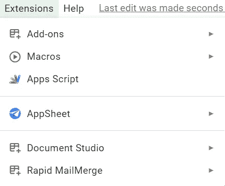

# 如何构建一个 Web API，使用 Google Apps 脚本从 Google 电子表格中检索 JSON 数据

> 原文：<https://levelup.gitconnected.com/how-to-build-a-web-api-that-retrieves-json-data-from-a-google-spreadsheet-using-google-apps-script-e173d4e6c6e1>

各位学习者好！

我很高兴与所有正在寻找脚本化 Web API(应用程序编程接口)以便从 Google 电子表格中检索 JSON 数据的人分享这篇文章。

在此之前，我们将看到这个 Web API 项目如何有所帮助，以及我们如何加强我们对 Google App 脚本编程的了解。

**Google Apps 脚本 Web API 有什么好处？**

1.  您可以使用 Web API 在网站上显示电子表格数据。
2.  使用 Web API 方法插入或迁移 JSON 数据。
3.  使用 Google Apps 脚本 Web API，JSON 数据可以显示在仪表板表示中。
4.  Web APIs 允许在网站上重用代码。
5.  谷歌电子表格数据可以在网站上实时显示。

遵循这些步骤，了解我们如何完成这项任务。

**第一步:**在我们的谷歌电子表格中打开谷歌应用脚本编辑器。



**导航:**菜单选项扩展= >应用程序脚本

通过点击应用程序脚本选项，脚本编辑器将被打开。

**第二步:**在编辑器的开始，定义 doGet()函数。让我们来看看示例代码，其中解释了如何使用该函数从任何网站或网页获取 web hook 请求，以便从 web API URL 发送数据或接收参数。

```
function doGet() {  
 var data = getJsonData(); 
 return buildSuccessResponse(data, 1);
}
```

在上面的示例代码中，调用 **getJsonData()** 函数来获取 JSON 格式的数据。这个函数将在解释代码中定义。 **buildSuccessResponse** 函数用于将 JSON 格式的响应发送给 Web API。

**步骤 3:** 您的电子表格细节应该在 **getJsonData()** 函数中定义。参见下面的完整代码。

```
function getJsonData(){

 var spreadSheetId='YOUR_SPREADSHEET_ID';

 var ss = SpreadsheetApp.openById(spreadSheetId); var sheet = ss.getSheetByName("Validation_sheet");

  var json_data = getData(sheet);return json_data;

}
```

要使用给定的示例代码，您需要输入您的电子表格 id，该 id 可以从电子表格 URL 中复制到 **/d/** 之后。下一行是您要从中获取数据的工作表名称。从工作表中取出数据后，你需要通过 **getData()** 函数传递它，这个函数只不过是给你电子表格数据的 JSON 数组。

**第四步:**现在我们需要定义 **getData()** 函数，这是非常容易和简单的。让我们看看同样的代码。

```
function getData(sheet){

  var jo = {};
  var i =0;
  var rows2 = sheet.getDataRange().getValues();
   Logger.clear();
//  ===============Get data=================
  var rows2=[];
  var rangeData = sheet.getDataRange();
  var values = rangeData.getValues();
  var lastColumn = rangeData.getLastColumn();
  var lastRow = rangeData.getLastRow();// Logger.log("lastrow=>"+ lastRow);
  var data=[];
  var x=0,y=0;
  for(i = 0; i<lastRow; i++){
    data[x]=[];

    for(var j=0; j<lastColumn; j++ ){ 

      if(email == values[i][2]){

        data[x][j]= values[i][j];
        y=1;
      }
    }
    if(y==1){ x=x+1; y=0; }

  }
  return data;  
}
```

在上面声明的函数中，我们只定义了如下几个参数:工作表的范围、最后一行、最后一列以及数组形式的范围值。在这里，您可以根据需要根据条件过滤数据，其他 wise 函数将以 JSON 格式返回完整的范围值。

现在，我们来到 Web API Google 脚本代码的最后一部分。我们只需要定义 **buildSuccessResponse()** 函数，这个函数之前在示例代码顶部的 **doGet()** 函数中声明过。

```
function buildSuccessResponse(data, pages) {
  var output = JSON.stringify({
    status: 'success',
    data: data,
    pages: pages
  });

  return ContentService.createTextOutput(output).setMimeType(ContentService.MimeType.JSON);
}
```

在这段代码中，我们传递从上面的 **getJsonData()** 函数中获取的整个数组。数组数据获取 stringnify，这只是一个获取 JSON 格式的数组数据的过程，通过这个过程，我们还可以发送一些参数，比如数据是否成功发送到 Web API，然后用值 success 传递参数 success，类似地，您可以传递更多的参数。

如果你有兴趣学习 Google Apps 脚本和自动化你的 Google Workspace？一定要试试这本**电子书**上的“ [**谷歌应用套件脚本:初学者指南**](https://www.amazon.com/dp/B0BTJC9X5R) ”

我希望这篇文章能帮助你构建你的 Web API，以便从你的 Google 电子表格中获取数据到网页上。如果你需要任何帮助或者想要按照要求定制这些代码，那么你可以在这个 twitter [链接](https://twitter.com/dilipkashyap07)上给我写信。

为了帮助他人，请与他们分享这篇文章，为了支持我们，请投票支持这篇文章。感谢快乐学习:)