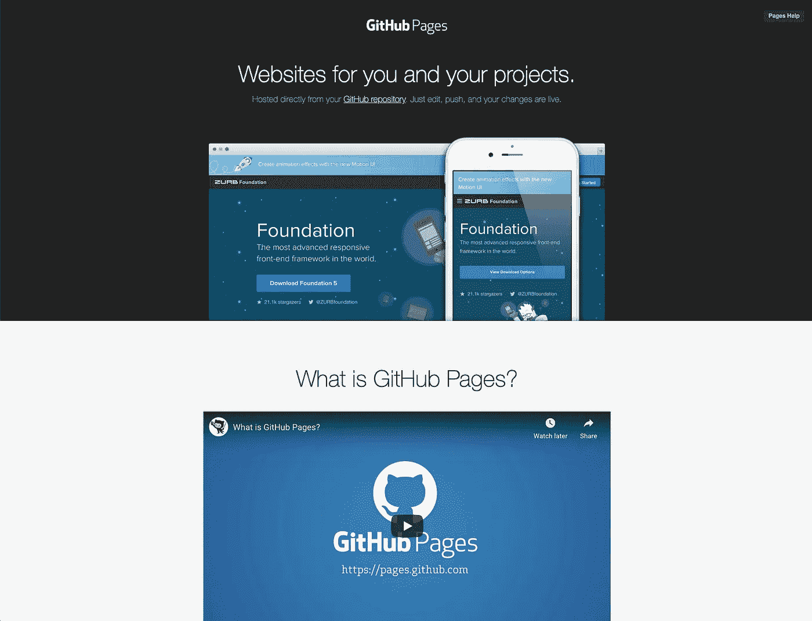

# 如何免费构建 Web 开发人员组合|第 1 部分

> 原文：<https://levelup.gitconnected.com/how-to-build-a-web-developer-portfolio-for-free-d456699ecef7>

开始建立你的个人品牌👨‍💻

感谢您访问本帖！一定也看看我在[*LinkedIn*](https://www.linkedin.com/in/stephenandersondev/)*[*GitHub*](https://github.com/stephenandersondev)*上的其他作品，还有我的* [*网站*](https://stephenanderson.dev/) *。**

**

*投资组合网站示例*

*当我即将从软件工程训练营毕业时，我意识到我需要开始尽我所能让我的名字出现在潜在的雇主面前，并开始建立我的个人品牌。我做了一些研究，意识到为自己建立一个作品集网站是多么重要，基本上是一个任何人都可以见到你的门户，更重要的是，可以看到你的作品。我决定不仅为自己建立一个作品集网站，而且给自己一个挑战，为**免费**建立和托管网站。我是这样做的。*

*首先，我必须能够托管网站，但你怎么可能免费做到这一点？幸运的是，我的一些同学向我展示了如何使用 GitHub 页面。*

# *GitHub 页面*

*[GitHub Pages](https://pages.github.com/) 是一个工具，可以让你用自己的 GitHub 账户免费**托管一个静态网站**。你只需要在你的 GitHub 账户中创建一个存储库，命名约定如下: *< github 用户名> .github.io.* 之后，你只需要将你的网站需要的任何必要文件添加到你的新存储库中。每当有人访问你的网站，其地址与回购名称相同，GitHub 就会在你的根目录中渲染 index.html 文件。例如，我的是[stephenandersondev . github . io .](https://stephenandersondev.github.io)是的，我知道你在想什么，这是一个看起来有点奇怪的网址。好吧，如果你不喜欢它，这很酷，因为 GitHub 给你一个链接自定义域名到你的网站的选项！*

**

*GitHub 页面*

*要将自定义域名链接到您的网站，您首先需要购买一个。不幸的是，这是这个过程中永远不会免费的一部分😔但还是很实惠的。我通过[NameCheap.com](https://www.namecheap.com/)购买我的域名，因为它们就像它们的名字一样便宜！你可以以每年 10-15 美元的价格获得一个定制域名。是的，那就是每年 10-15 美元！之后，你只需在你的域名上做正确的 DNS 记录，并在 GitHub 中将新域添加到 repo 的设置中，就可以开始了🙌请在 https://pages.github.com/[和 https://www.namecheap.com/](https://pages.github.com/)[的](https://www.namecheap.com/)和了解更多相关信息。*

**

*名字便宜*

# *HTML5 以上*

*所以我们有一个地方来托管我们的网站，但我们在哪里可以得到网站本身呢？嗯，你有几个选择:如果你喜欢，你可以完全从头开始做一个，或者你可以得到一个模板，并根据你的喜好定制它。我选择了后者，并使用了 [HTML5 UP](https://html5up.net/) 来这样做。HTML5 UP 是一个提供完全响应的网站模板的网站，这些模板是基于 HTML5 和 CSS3 构建的，并且是超级可定制的。在知识共享许可下，它们也是 100%免费的，这意味着你可以以任何你喜欢的方式使用这个网站，只要你给 HTML5 设计的功劳。HTML5 UP 是我最喜欢的，因为他们有许多不同的模板，看起来都很棒，而且大多数都是为个人网站如作品集网站量身定制的。他们甚至为每个模板提供了现场演示，向您展示该网站在桌面、平板电脑和移动模式下的外观。您只需下载模板，根据您的喜好编辑站点，然后将文件上传到您的 GitHub Pages 存储库中。就是这样！下面是我选择的模板和我个人网站的对比。*

## *之前:*

**

*定制前的网站*

***之后:***

**

*定制后的网站*

*请随意去 https://html5up.net/[查看所有其他模板。另外，我知道你在想什么——我在哪里可以免费获得这样的背景图片？嗯，还有一个地方没错，就是**免费**！](https://html5up.net/)*

# ***去飞溅***

*Unsplash 是一个拥有超过 200 万张免费高分辨率图片的网站，由世界上最慷慨的摄影师社区为您提供。这些是你能在网上找到的一些最好的图片，它们是 100%免费的。你所要做的就是去 [Unsplash](https://unsplash.com/) ，搜索你要找的图片类型，然后下载你选择的图片。 [Unsplash](https://unsplash.com/) 许可证允许你编辑任何你喜欢的照片，你甚至不必给 Unsplash 信用，他们只是要求你不要出售你在 [Unsplash](https://unsplash.com/) 上得到的任何照片。*

**

*不溅*

*在你得到所有你喜欢的图片后，只需将它们上传到你的 GitHub 页面库，你就可以在你的代码中随意使用它们了。去 https://unsplash.com/[看看他们的图片库。](https://unsplash.com/)*

*好了，在这一点上，我们应该有一个惊人的网站，炫耀你是谁，你做什么。因此，当潜在客户和雇主看到它时，他们会想与你联系，寻找潜在的机会。现在，我们不希望只是把我们的电子邮件地址放在网站上，垃圾邮件发送者会不断地为他们收集信息。那我们该怎么办？答案是一个联系表单，幸运的是几乎每个 HTML5 UP 模板都带有可定制的表单！是的，免费的！🤩*

# *Formspree*

*forms spree 是一个平台，它将作为后端来接收你可能有的任何表格——比如联系表格！你所要做的就是用他们创建一个**免费**账户，在你的[forms spree](https://formspree.io/)仪表板中创建表单，然后将该表单的动作 URL 添加到你网站上的 *< form >* 标签中。*

**

*将 Formspree 链接添加到 form 标记*

*然后，您可以设置您的[forms spree](https://formspree.io/)仪表板，在每次提交表单时提醒您，它甚至会向您发送表单中捕获的内容。提交的内容也将保存到您的[forms spree](https://formspree.io/)仪表盘上，以便随时返回查看。免费计划允许每月提交 50 份，这对于个人网站来说应该足够了。*

**

*Formspree*

*随时了解更多信息，并在[https://formspree.io/](https://formspree.io/)创建免费账户。*

# *敬请关注*

*我希望你喜欢使用这些工具来实现你的作品集网站，是的，我知道你在想什么…为什么我没有谈到作品集网站需要什么内容，以及如何通过它创建你的个人品牌？好吧，请继续关注——因为我的下一篇文章(第二部分)将会谈到这一点！*

* [## 斯蒂芬·安德森-软件工程学生-熨斗学校| LinkedIn

### 查看斯蒂芬·安德森在全球最大的职业社区 LinkedIn 上的个人资料。斯蒂芬有 3 份工作列在…

www.linkedin.com](https://www.linkedin.com/in/stephenandersondev/)*