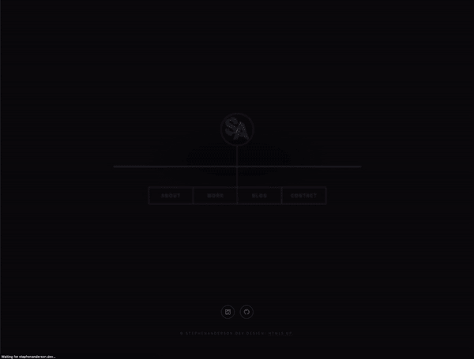
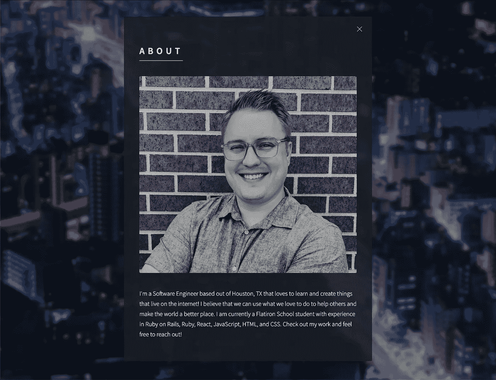
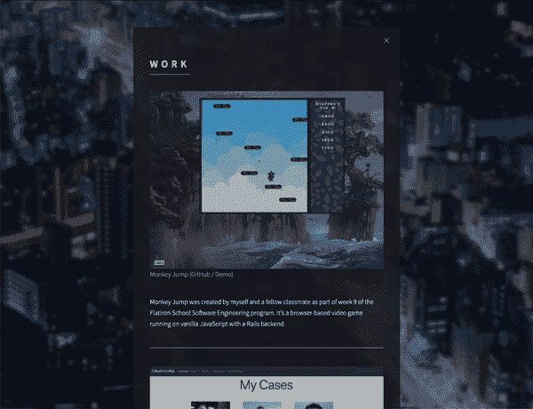
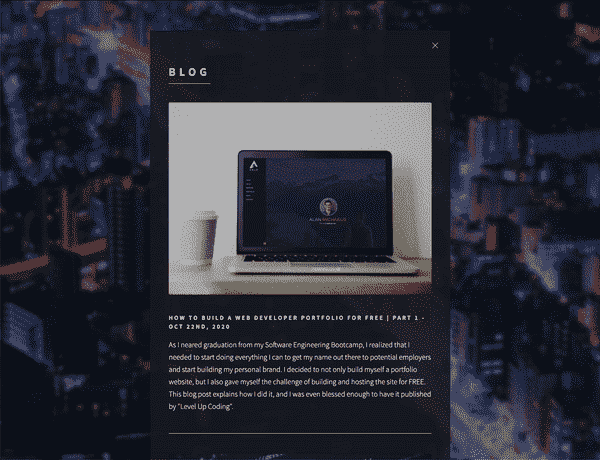
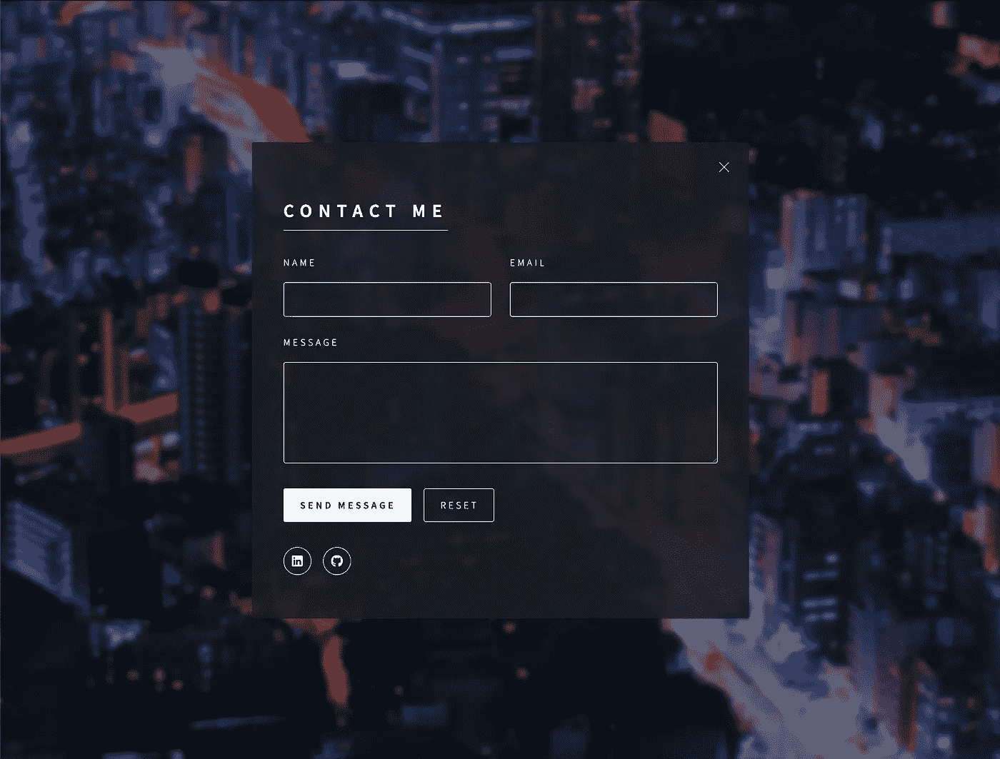

# 作为一名开发人员，使用投资组合开始建立你的个人品牌👨‍💻

> 原文：<https://levelup.gitconnected.com/how-to-build-a-web-developer-portfolio-for-free-part-2-d099ff34f9b2>

## 如何免费构建 Web 开发人员组合|第 2 部分

感谢您访问本帖！一定也看看我在[*LinkedIn*](https://www.linkedin.com/in/stephenandersondev/)*[*GitHub*](https://github.com/stephenandersondev)*上的其他作品，还有我的* [*网站*](https://stephenanderson.dev/) *。**

**

*空白笔记本电脑屏幕*

*在 [*如何免费建立一个 Web 开发者作品集|第一部分*](/how-to-build-a-web-developer-portfolio-for-free-d456699ecef7) 中，我们讨论了你需要知道的一切，来建立一个个人网站并向全世界展示(免费)。在第 2 部分中，我们将讨论你的新作品集网站需要哪些内容来开始建立你的个人品牌，并展示你已经完成的伟大作品。我的意思是，我们是网络开发人员，所以我们的个人网站应该能够展示我们的能力。这是我最近做的事情，所以我将在整篇文章中使用我自己的个人网站作为例子。是时候把你的网站从一个空白的屏幕变成漂亮的东西了，这是我怎么做的。*

*首先，这绝不是建立投资组合网站的唯一方式，甚至不是最好的方式。这只是我简单地分享对我有效的方法。我将介绍你应该具备的基本知识，但你也可以随意探索，在你认为合适的时候给你的网站添加更多的内容。*

# *登录页面*

*你网站的登陆页面总是人们看到的第一个东西，因此应该抓住浏览者的注意力。一个登陆页面应该包含你的名字，一个关于你和你所做的事情的 1-3 句简短陈述，以及到你的其他平台(GitHub，LinkedIn 等)的链接。).它还应该有导航栏，连接到网站的其他部分。最后，但重要的是，它需要有一个醒目的背景(随意添加个人风格以及如你的个人标志！).利用这个机会，通过在加载页面或网站上的其他交互时创建一些动画来展示您的登录页面技能。最重要的是让浏览者想进一步探索你的网站。*

**

*登录页面示例*

# *引人注目的简历*

*简而言之，你的简历/简介部分是一小段关于你的介绍。用它来告诉世界你在做什么，为什么要做。你的简历应该始终展示你对发展的热情，并告诉人们是什么驱动着你。此外，你的简历应该涵盖你目前在职业生涯中所做的事情，并列出你所知道的关键技术。在你的简历中附上一张你自己的照片，给人一种个人的感觉，并给文字配上一张面孔。最后，留下一个行动号召，比如“看看我的作品，随时联系我！”。当一个用户读完你的简历后，他们应该会被感动，想要了解你更多。*

**

*“关于”部分示例*

# *您的项目*

*文件夹中的项目/工作部分是你网站中最重要的部分。这是人们来看你知道什么和你有多熟练的地方。您可以概述您为个人、专业、竞赛和黑客马拉松项目开发的项目。每个项目都应该有一个 gif 或图像(最好是 gif ),显示你的项目是什么样子，项目的标题，项目是什么的简短描述和你用来制作它的技术，以及进一步探索项目的链接。进一步探索项目的链接应该总是包含项目 GitHub 库的链接，以及项目演示(YouTube 视频、部署的应用程序等)的链接。).记住，这是你展示你作为一名软件工程师的地方，所以把你最好的项目放在顶部，然后从那里下去。永远试着在这里保存至少 3-5 个最好的项目。*

**

*项目/工程部分示例*

# *你的博客*

*在你网站的博客部分，人们会看到你的技术能力以及你对社区的参与程度。这向访问者传达了您正在定期编码、学习和增长您的技能。有多种方法可以把你的博客放到你的网站上。实际上，你可以将你的网站作为你的博客平台，你可以从你的博客所在的平台嵌入一个提要，或者你可以手动添加链接回你的博客平台的关于你的博客的简短内容。*

*我个人会选择后者，因为这有助于我更好地跟踪我的博客参与度指标。为此，我会放上我博客的主要图片、标题、发表日期以及博客帖子的简要描述，让他们想看更多。如果他们想阅读更多，他们可以点击图片或标题，这将引导他们到博客帖子(我在媒体上主持)。确保你网站的博客部分一直保持更新，并按时间顺序排列。*

**

*示例博客部分*

# *接触部分*

*让访问者快速、轻松地与您联系和互动。我发现联系表单对我来说是最好的解决方案，因为它不需要我把我的电子邮件放在那里，但仍然可以让人们很容易地给我发消息。我发现处理联系表单的最简单的方法是 Formspree，我在 [*如何免费建立一个 Web 开发者作品集|第一部分*](/how-to-build-a-web-developer-portfolio-for-free-d456699ecef7) *中对此有更深入的讨论。*确保始终至少有一个姓名字段、电子邮件地址字段和消息字段。这样你就有了适当回复询问所需的一切。*

**

*示例联系人表单*

*最后，我想再次强调，与其他平台建立链接来传达你的个人品牌是多么重要。至少，你应该在你网站的登陆页面上有到你的 GitHub 和 LinkedIn 的链接，但是我甚至建议也把它们放在联系页面上。确保使用平台的品牌标志，以便吸引观众的注意。*

# *总结*

*现在，您已经拥有了构建自己的免费 Web 开发人员组合所需的一切。现在出去做吧！如果你跟随这个博客系列并使用它来创建你自己的网站，请联系我并与我分享你的新网站，我很乐意看到它。您也可以在[https://stephenanderson.dev/](https://stephenanderson.dev/)查看我的网站示例。敬请关注即将推出的更多内容！*

* [## 斯蒂芬·安德森-软件工程学生-熨斗学校| LinkedIn

### 我是一名来自德克萨斯州休斯顿的全栈软件工程师，喜欢学习和创建生活在…

www.linkedin.com](https://www.linkedin.com/in/stephenandersondev/)*