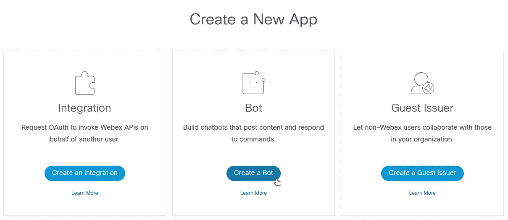
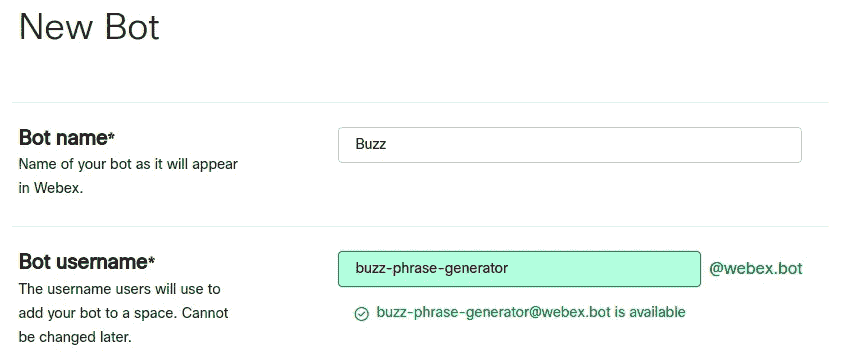
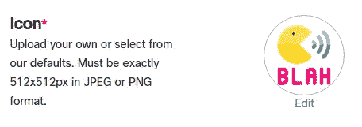
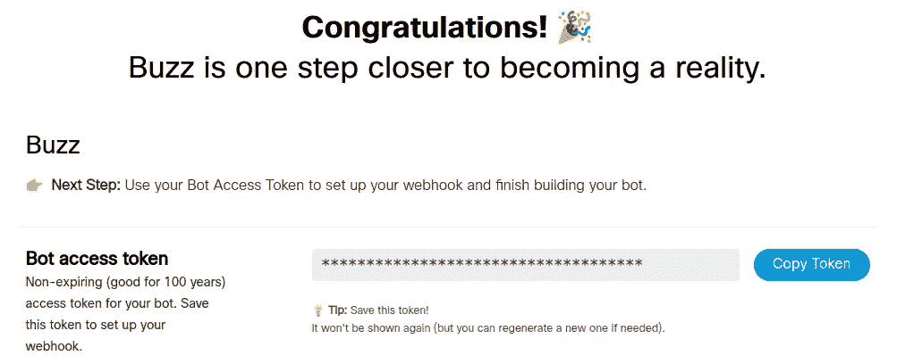
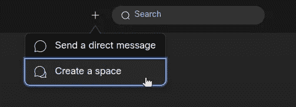
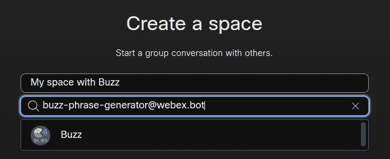
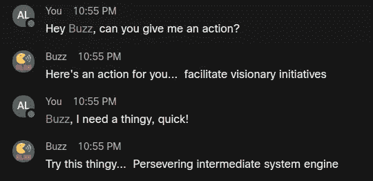
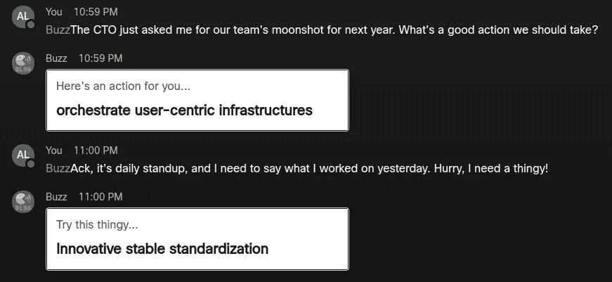

# 如何在 Node.js 中构建 Webex 聊天机器人

> 原文：<https://levelup.gitconnected.com/how-to-build-a-webex-chatbot-in-node-js-874cc496c5a1>


安迪·凯利在 [Unsplash](https://unsplash.com/s/photos/robot?utm_source=unsplash&utm_medium=referral&utm_content=creditCopyText) 上的照片

## 为混合工作生成开发工具

医疗保健、教育、金融、零售以及几乎所有其他领域的员工都是在家登录打卡上班。这为开发人员开发工具来支持每个行业的混合工作提供了机会，而不仅仅是他们自己的工作。其中一个机会是在 ChatOps 领域，使用聊天应用程序来触发运营工作流。

作为软件开发人员，我们多年来一直在做 ChatOps 从聊天空间内部发送命令来部署应用程序、重启服务器和打开 pull 请求。然而，如今通过虚拟会议和团队平台进行协作的不仅仅是 IT 专业人士。2020 年，其他人也开始这么做。

Webex 是主要的混合工作平台之一。我对 ChatOps 在 Webex 中的样子特别感兴趣。为它造一个聊天机器人有多难？事实证明，这一点也不难。

在这篇文章中，我们将通过 Node.js 和 [webex-node-bot-framework](https://github.com/WebexSamples/webex-node-bot-framework) 构建一个简单的 Webex 聊天机器人的步骤。我们将能够将我们的聊天机器人添加到 Webex 团队空间或直接消息空间。只要聊天机器人的后端服务器在运行，聊天机器人就能够在 Webex 中对您或团队空间中的任何人做出响应。

对于第一次迭代，我们将使用 ngrok 隧道在本地运行聊天机器人的后端，以便 Webex 消息可以到达我们的服务器，让聊天机器人提供正确的响应。在后续的文章中，我们将封装我们的 chatbot 后端服务器，并将其部署到云中。

你准备好了吗？我们走吧！

# 我们的演示聊天机器人会做什么？

我参加了很多虚拟会议。有时，会议会陷入一片混乱，首字母缩写词，流行词汇，等等等等。我患有冒名顶替综合征，当谈到为诸如此类的事情做贡献时，我并不总是觉得自己能坚持下去。

进入我们的公司语言生成器聊天机器人: **Buzz** 。在 Webex 中，我可以向 Buzz 发送消息，请他给我一个动作或一件事情:

*   当我要求一个动作时，Buzz 会给我回复“基准虚拟范例”或“创新动态功能”这样的短语。当被问及我们团队下一步应该做什么时，这是一个完美的回答。
*   当我要一个东西时，Buzz 会用“监控移动能力”或“独立整体指令集”这样的短语来回应当我们谈论我们的 2.0 MVP 的特性集时，这正是我所需要的。

# 设置 Webex

首先，你需要建立一个 [Webex 账户](https://cart.webex.com/sign-up)。从那里，你可以登录 [Webex 开发者门户](https://developer.webex.com/)并进入[我的应用](https://developer.webex.com/my-apps)。点击**创建新应用**。选择选项**创建一个机器人**。



为您的聊天机器人选择一个显示名称和用户名。



您也可以为您的聊天机器人上传自定义图标。我决定选这个。



您也可以为您的聊天机器人输入描述。然后，点击**添加机器人**。



复制你的**机器人访问令牌**。我们将在后面的步骤中使用它。

接下来，转到您的 [Webex 空间](https://web.webex.com/spaces)。点击加号**创建一个空间**。



为您的共享空间选择一个名称。然后，通过输入您的聊天机器人的电子邮件，即您选择的聊天机器人用户名，然后按`@webex.bot`，邀请 Buzz 加入该空间。在我们的例子中，那就是`buzz-phrase-generator@webex.bot`。

首次将聊天机器人添加到您的共享空间时，Webex 可能会告诉您该用户是 Webex 的新用户，您需要邀请他们。如果你是这种情况，那么点击**邀请**。



点击**创建**。您现在有了一个带有 Buzz 的 Webex 空间。

# 构建聊天机器人后端

现在，让我们给我们的聊天机器人一些大脑。你可以一步一步来，或者在 [GitHub 库](https://bit.ly/webex-chatbot)查看完整的源代码。我们的 chatbot 后端将是一个基本的 Node.js Express 服务器，我们将在本地机器上构建它。

## 初始化项目并添加依赖项

首先，我们将使用 [yarn](https://yarnpkg.com/) 为我们的服务器初始化一个新的 Node.js 项目。在本地计算机的终端中，执行以下操作:

```
~/$ mkdir buzz-server

~/$ cd buzz-server

~/buzz-server$ yarn init

yarn init v1.22.10
question name (buzz-server): buzz-server
…

success Saved package.json
Done in 9.85
```

接下来，我们将添加依赖项。

```
~/buzz-server$ yarn add webex-node-bot-framework express faker@5.5.3
```

我们的聊天机器人使用 [webex-node-bot-framework](https://github.com/WebexSamples/webex-node-bot-framework) ，它抽象出 webex 机器人创建的复杂性，允许您通过 Node.js [Express](https://expressjs.com/) 服务器和事件监听器来构建聊天机器人交互。

我们还使用 [faker](https://www.npmjs.com/package/faker/v/5.5.3) 包(锁定到版本`5.5.3`，因为最新版本不再像预期的那样工作)。这个库通常用于生成虚假的测试数据，但是它的 API 包括一组用于生成公司术语的调用。这就是 Buzz 将用来生成我们正在寻找的短语。

在我们的项目文件夹中，我们创建了一个名为`index.js`的文件。让我们一次一节地看一下代码做了什么。

## `index.js`漫游

在需要我们所有的第三方包之后，我们初始化一个新的 Express 服务器(名为`app`)并添加用于解析 JSON 的中间件。

**框架配置和启动**

接下来，我们设置框架配置选项:

```
var config = {
  webhookUrl: process.env.WEBHOOK_URL,
  token: process.env.BOT_ACCESS_TOKEN,
  port: 8080
};
```

框架需要两条信息来初始化与 Webex 的连接:

1.  `webhookUrl`:这是我们将部署聊天机器人后端的 URL，每当涉及聊天机器人的事件发生时，Webex 将在这里发送请求。对于这篇文章，我们将在本地部署并用 [ngrok](https://ngrok.com/) 隧道来获取一个 URL。
2.  `token`:这是我们创建 bot 时 Webex 提供给我们的 bot 访问令牌。当我们的 chatbot 后端启动时，它将使用这个令牌向 Webex API 认证，以便注册涉及我们的 chatbot 的 Webex 团队活动。

我们将在启动服务器时提供这两个值作为环境变量。

接下来，我们开始框架:

```
var framework = new Framework(config);
framework.start();
```

**响应聊天机器人听到的内容**

随着框架的启动，我们可以开始注册事件监听器了。虽然框架提供了几个可以监听的[事件](https://github.com/WebexSamples/webex-node-bot-framework#events)，但是我们主要关心的是 [hears()](https://github.com/WebexSamples/webex-node-bot-framework#Framework+hears) 函数。通过这个功能，我们的服务器等待 Buzz 听到一个特定的短语(或者用正则表达式匹配一个短语)，然后它指导 Buzz 以某种方式做出响应。

这是如何告诉 Buzz 在收到包含单词“action”的消息时进行响应的简单实现:

```
framework.hears(/action/i, (bot) => {
  bot.say("Here's an action for you...", faker.company.bs());
});
```

我们用正则表达式调用`hears()`来匹配任何包含单词“action”的消息(不区分大小写)。当 Buzz 收到匹配的消息时，我们调用 bot 的`say()`函数。在这种情况下，我们通过调用 faker 包中的`company.bs()`来获得我们的企业用语。

对于包含单词“thingy”的 Buzz 消息，我们会以类似的方式进行收听和响应:

```
framework.hears(/thingy/i, (bot) => {
  bot.say("Try this thingy...", faker.company.catchPhrase());
});
```

这些是我们想要的关键侦听器，但是对于任何不符合上述情况的消息，有一个后备响应也是有帮助的。要了解完整的实现细节，请查看 [GitHub 库](https://bit.ly/webex-chatbot)。

**快递服务器启动**

最后，我们告诉 Express 让框架处理根路径上的传入请求，并启动我们的服务器:

```
app.post('/', webhook(framework));

var server = app.listen(config.port, () => {
  console.log(`Listening on port ${config.port}...`);
});
```

`index.js`做好了，就该开机测试了！

# 测试聊天机器人后端

因为我们在本地运行后端服务器，所以我们将使用 ngrok，这样 Webex 就可以通过隧道到达我们在端口`8080`的服务器。

## 启动 ngrok

在终端窗口中，运行以下命令:

```
~$ ngrok http 8080
```

ngrok 进程将会运行，您的窗口将如下所示:

```
ngrok by @inconshreveable (Ctrl+C to quit)

Session Status online
Account Alvin Lee (Plan: Free)
Version 2.3.40
Region United States (us)
Web Interface http://127.0.0.1:4040
Forwarding http://98-161-186-106.ngrok.io -> http://localhost:8080
Forwarding https://98-161-186-106.ngrok.io -> http://localhost:8080

Connections ttl  opn    rt1   rt5   p50   p90
              0    0   0.00  0.00  0.00  0.00
```

复制 ngrok 提供的 HTTPS 转发 URL。

## 启动服务器

现在，我们准备运行`node index.js`。然而，我们需要在运行时提供两个环境变量。我们需要指定我们的`WEBHOOK_URL`，这是我们的 ngrok 转发 URL，我们还需要指定我们的`BOT_ACCESS_TOKEN`，这是 Webex 在我们注册 bot 时提供给我们的。

因为 ngrok 需要保持运行，我们将在一个新的终端窗口中工作。使用以下命令启动 chatbot 后端服务器:

```
~/buzz-server$ WEBHOOK_URL=https://98-161-186-106.ngrok.io \
               BOT_ACCESS_TOKEN={ENTER-YOUR-TOKEN-HERE} \
               node index.js

Listening on port 8080...
```

## 在 Webex 中测试

有了我们的服务器监听，我们可以进入我们在 Webex 中的空间并发送消息，确保提到@Buzz 以便我们的后端服务器接收消息。



有用！

哦，巴斯，我需要你参加上周的董事会。

# 更进一步

该框架还支持来自 Webex 的[按钮和卡片](https://developer.webex.com/docs/api/guides/cards)。您的聊天机器人响应可以被很好地格式化，甚至包含用户可以点击的附加动作。我们可以用一个基本的[适配卡](https://adaptivecards.io/)给 Buzz 多一点润色:



## 更严重的用例

当然，像 Buzz 这样古怪的小聊天机器人很有趣，也很容易构建。然而，该框架的简单性为构建强大且真正有用的聊天机器人提供了许多机会。聊天机器人后端的一些可能性包括:

*   联系第三方服务(如金融市场数据、航班状态 API 或社交媒体平台)以获取特定数据，供聊天机器人在 Webex 空间中返回。
*   与通信和生产力 API 集成。想象一下在 Webex 中能够做到这些:*嘿，@PagerBot，发个短信和邮件给@JPeralta 告诉他“每日站立 5 分钟前开始。”*
*   触发内部组织行动，如生成财务报告或收集昨天的学校出勤数字。
*   与物联网或智能助手交互。

我们只触及了 Buzz 的皮毛。

# 结论

在本文的演示迷你项目中，我们在本地部署了我们的聊天机器人。无论你的聊天机器人是 Buzz 还是下一个混合工作游戏规则改变者，当你真的想把你的聊天机器人部署到云上时，你会怎么做？在我们的后续文章中，我们将把我们的 chatbot 后端服务器作为一个容器映像。然后，我们将它部署到云中。做好准备。

随着各行各业越来越多的人在家工作，混合工作平台的使用正呈现爆炸式增长。随着这种使用的增加，出现了构建工具(如聊天机器人)的机会，以支持混合工作革命。如果你要为 Webex 构建 ChatOps 工具，使用 [webex-node-bot-framework](https://github.com/WebexSamples/webex-node-bot-framework) 将会让你快速启动并运行。