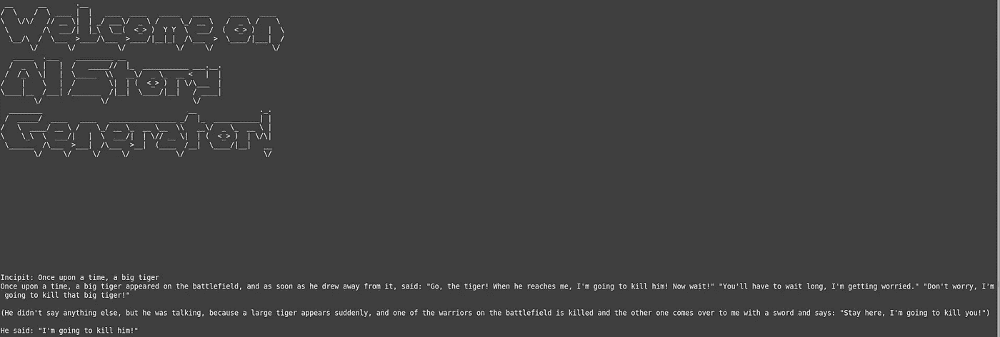

# 你如何为你的孩子建造一个人工智能故事发生器？

> 原文：<https://levelup.gitconnected.com/how-to-build-an-ai-tale-generator-for-your-kids-34b8db153054>


照片由[дмитиийхрусталев-григорьев](https://unsplash.com/@hrustall?utm_source=medium&utm_medium=referral)在 [Unsplash](https://unsplash.com?utm_source=medium&utm_medium=referral)

你好，读者，正如你从我的个人资料中看到的，我通常写网络安全的东西。虽然看起来不像，但我喜欢编程的每个方面。在这篇文章中，我很乐意展示如何编写一个故事生成器。
老实说，最终的结果是一个文本生成器，它将完成你的 incipit，不管它是什么。
顺便说一句“ **AI tale generator** ”是我最终脚本的主要用途。

# 我们要学什么？

整个项目只是磨练我们技能的一个借口。
详细来说，我们将看到:

*   使用 [ASCII 艺术图](https://en.wikipedia.org/wiki/ASCII_art)打印漂亮的横幅
*   管理 CLI 参数
*   使用来自[拥抱面](https://huggingface.co/)的预训练模型

我猜你已经等不及要动手了，那就开始吧！

# 先决条件

我假设您的系统上已经安装了 Python 3，因此我们需要安装一些库:

*   [张量流](https://www.tensorflow.org/)
*   [变形金刚](https://github.com/huggingface/transformers)
*   pyfiglet
*   [点击](https://palletsprojects.com/p/click/)

我们可以在终端上用一行代码做任何事情:

```
pip install tensorflow transformers pyfiglet click
```

可能需要一段时间，休息一下，也许喝杯咖啡！
完成后，我们就准备编码了！

# 热身和准备进口和全球的东西！

像往常一样，我们要写的第一行是导入。然而，它们并不是我们要写的唯一的几行。事实上，我们将要使用的库对我们的口味来说有点冗长！
你可以看到 [tensorflow](https://www.tensorflow.org/) 和[变压器](https://github.com/huggingface/transformers)的所有警告都是关闭的(2、7 线)。

```
import os
os.environ["TF_CPP_MIN_LOG_LEVEL"] = "2"
import transformers
import click
from pyfiglet import Figlet

transformers.utils.logging.set_verbosity(transformers.logging.FATAL)

MAX_LENGTH = 250
```

`MAX_LENGTH`只是一个全局变量，表示生成文本的最大长度的默认值。

# 竖起我们精彩的旗帜

每个命令行应用程序都需要一个精彩的横幅。
让我们看看如何通过使用 [pyfiglet](https://github.com/pwaller/pyfiglet) 和 ASCII Art 用几行代码就能做到

```
def print_banner(text, font='graffiti'):

    figlet = Figlet(font=font)
    print(figlet.renderText(text))
```

我们刚刚定义的函数将很快帮助我们，但是现在，让我们继续我们的代码！

# GPT-2 如何使用预训练的变压器模型

虽然这不是一篇关于神经网络的具体文章，但我想向您展示如何使用来自 [HuggingFace 的预训练模型。](https://huggingface.co/)
在本教程中，我们将使用一个相对较旧的模型，然而在许多情况下结果会令人满意。

感兴趣的模型是 [GPT-2](https://en.wikipedia.org/wiki/GPT-2) (生成式预训练变压器)，它是 2019 年的最先进水平。
它是一个深度神经网络，使用[注意力](https://en.wikipedia.org/wiki/Attention_(machine_learning))机制生成文本。

通过阅读文档[这里](https://huggingface.co/gpt2)很明显我们可以多么容易地使用一个如此复杂的模型！
变形金刚[库提供的高级接口允许我们只关注最终结果。](https://github.com/huggingface/transformers)

这是如何创建模型的代码，然后用给定的 incipit 生成文本！

```
generator = transformers.pipeline('text-generation', model='gpt2')
out = generator(beginning, 
                max_length=max_length, 
                num_return_sequences=1)
```

结果是一个字典列表(在这种情况下，我们将`num_return`设置为 1)。
每个字典包含不同的文本补全，生成的文本存储在键`generated_text`下。

参数`max_length`表示输出的最大可能长度。

# 如何从命令行获取参数

在这一步中，我们希望以两种方式传递变量:

*   长度应该来自终端
*   开始应该来自启动应用程序后的用户输入

要做到这一点，我们可以依靠 [click](https://palletsprojects.com/p/click/) 库，它允许我们只用几个装饰者就能做到。

这些是我们将要使用的:

```
@click.command()
@click.option("--beginning", prompt="Incipit", help="The incipit of your story")
@click.option("--length", default=MAX_LENGTH, help="The max length of the story", type=click.INT)
```

第一个选项从带有选项“*——从*开始”的终端或从用户输入获取变量。

第二个选项的值“— length”设置为 int，来自终端。

很简单，不是吗？

现在是时候创建主要的和辅助的方法来生成故事了。

# 最新功能 main 和 generate_story

在把所有东西组装起来之前，我们还需要两次操作。

首先，我们需要一个方法，用给定的生成器返回生成的文本。

这是完成这项任务的两行代码

```
def get_story(generator, beginning, max_length):

    out = generator(beginning, max_length=max_length, num_return_sequences=1)
    return out[0]['generated_text']
```

之后，我们需要定义 main 方法。这样做更好，这样使用装饰器会更容易、更干净。正如我们之前看到的，main 应该通过从终端获取参数来生成并打印故事。

```
def main(beginning, length):    

    story = get_story(generator, beginning, length)
    print(story)
```

# 把所有的放在一起

最后一步是整理所有东西，并以正确的顺序调用函数，让我们看看如何进行:

```
if __name__=="__main__":
    print_banner("Welcome on AI Story Generator!\n\n\n")
    main()
```

一切似乎都很简单，但对于最懒的人来说，让我们看看完整的代码。

```
import os
os.environ["TF_CPP_MIN_LOG_LEVEL"] = "2"
import transformers
import click
from pyfiglet import Figlet

transformers.utils.logging.set_verbosity(transformers.logging.FATAL)
generator = transformers.pipeline('text-generation', model='gpt2')
MAX_LENGTH = 250

def get_story(generator, beginning, max_length=MAX_LENGTH):

    out = generator(beginning, max_length=max_length, num_return_sequences=1)
    return out[0]['generated_text']

def print_banner(text, font='graffiti'):

    figlet = Figlet(font=font)
    print(figlet.renderText(text))

@click.command()
@click.option("--beginning", prompt="Incipit", help="The incipit of your story")
@click.option("--length", default=MAX_LENGTH, help="The max length of the story", type=click.INT)
def main(beginning, length):

    story = get_story(generator, beginning, length)
    print(story)

if __name__=="__main__":
    print_banner("Welcome on AI Story Generator!\n\n\n")
    main()
```

好了，现在我们可以尝试运行 max_length 为 150 的脚本(在名为“main.py”的文件中)并查看结果:

```
python main.py --length 150
```

这是我的结果！



有许多可能的改进:

*   提供通过循环继续生成的可能性
*   使用更先进的型号，如 GPT-3
*   微调模型以产生更好的故事
*   在生成故事时插入一个加载动画

等等…

我希望你喜欢这篇文章，如果你喜欢我的作品，你可以在 medium 上关注我，或者访问 [StackZero](https://www.stackzero.net/) 。