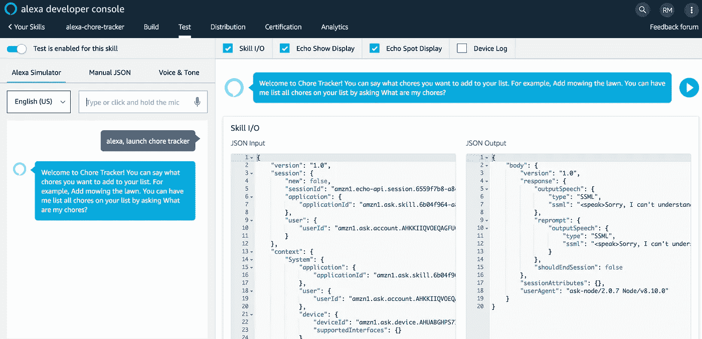

# 如何建立一个 Alexa 技能，通过语音向你的宇宙 JS 桶添加对象

> 原文：<https://levelup.gitconnected.com/how-to-build-an-alexa-skill-to-add-objects-to-your-cosmic-js-bucket-via-voice-ab64aa3e9cb8>


Regan McFarlan 为 Cosmic JS 开发人员文章撰写的故事。

# TL；速度三角形定位法(dead reckoning)

[查看源代码](https://github.com/cosmicjs/alexa-to-do)

# 介绍

在这篇文章中，我们将通过语音命令，使用 Alexa 技能，向您的宇宙 JS 桶中添加、删除和列出对象。我们将在本教程中使用的技能是一个家务/任务跟踪器，它允许你说类似于*“Alexa，告诉家务跟踪器添加修剪草坪”*，*“Alexa，让家务跟踪器列出我的家务”*，*“Alexa，告诉家务跟踪器取消修剪草坪”*。我们将利用一个定制的宇宙 JS 桶来存储这些杂务。

# 设置

## 先决条件

*   亚马逊 AWS 帐户
*   亚马逊开发者账户
*   节点> = 4.5 版

# 安装 ASK CLI

首先，我们需要安装 ASK CLI。这个工具将允许我们在将来轻松地将我们的技能部署到我们的开发人员门户和 AWS Lambda 实例中进行测试。

`npm install -g ask-cli`

*注:AWS 配置基于* [*@rajeeva 的奇妙中篇*](https://medium.com/@rajeeva/getting-started-with-alexa-skill-kit-command-line-interface-ask-cli-2555bcfefbd1) *，一定要去查查他。*

# 在 AWS IAM 中创建 CLI 策略

我们需要一个对我们的 AWS 帐户拥有完全访问权限的用户，以便从命令行轻松部署我们的技能。为此，请转到 AWS 控制台中的 **IAM** 选项卡，导航到*策略*，并选择**创建策略**。


您可以给这个策略起任何名字，但是我将坚持使用 **AWS_CLI_FULL_ACCESS** 。接下来，我们要添加实际的策略内容，您可以复制下面的 JSON 用于策略配置。

```
{
    "Version": "2012-10-17",
    "Statement": [
        {
            "Effect": "Allow",
            "Action": [
                "iam:CreateRole",
                "iam:GetRole",
                "iam:AttachRolePolicy",
                "iam:PassRole"
            ],
            "Resource": "arn:aws:iam::*:role/ask-*"
        },
        {
            "Effect": "Allow",
            "Action": [
                "lambda:AddPermission",
                "lambda:CreateFunction",
                "lambda:GetFunction",
                "lambda:UpdateFunctionCode",
                "lambda:ListFunctions"
            ],
            "Resource": "arn:aws:lambda:*:*:function:ask-*"
        },
        {
            "Effect": "Allow",
            "Action": [
                "logs:FilterLogEvents",
                "logs:getLogEvents",
                "logs:describeLogStreams"
            ],
            "Resource": "arn:aws:logs:*:*:log-group:/aws/lambda/ask-*"
        }
    ]
}
```

在这之后，按照提示并按下**创建策略**如果一切正常，您应该会得到这个警告。


# 在 AWS IAM 中创建 CLI 用户

现在我们已经创建了一个新策略，我们需要将该策略附加到一个用户。回到 AWS 控制台中的 **IAM** 选项卡，导航到*用户*，选择**添加** > **用户**。

*注意:我已经有一个名为 AWS_CLI_FULL_ACCESS 的用户，但你不应该。*


接下来，按照提示命名用户。你可以给它起任何你想要的名字，但是我将坚持使用 **AWS_CLI_FULL_ACCESS** 。当提示输入访问类型时，确保选择**编程访问**。


它将要求为用户附加一个策略，并确保选择我们之前创建的 **AWS_CLI_FULL_ACCESS** 策略。


现在按照提示操作，直到显示用户和他们的**访问密钥 ID** 和**秘密密钥**。这些**非常**重要，我们下一步会用到它们，所以一定要把它们写在某个地方。

# 将我们的 IAM 用户添加到本地机器

现在已经创建了 IAM 用户，我们需要将他添加到我们的 **AWS 本地配置**。根据您的操作系统，它位于不同的位置。

*   macOS: *~/。AWS/凭证*
*   Windows: *%USERPROFILE%。aws\credentials.txt*

我们希望将我们的 AWS IAM 用户添加到该文件中。添加以下几行并保存文件。

```
[AWS_CLI_FULL_ACCESS] 
aws_access_key_id=<YOUR_ACCESS_KEY_ID> 
aws_secret_access_key=<YOUR_SECRET_ACCESS_KEY>
```

# 正在初始化 ASK 配置文件

我们需要为 IAM 用户配置一个 ASK 配置文件。为此，我们需要运行以下命令。

`ask init -p ASK_CLI_FULL_ACCESS`

系统会提示您使用您的 Amazon 帐户登录，如果您通过了身份验证，它会让您知道配置文件已成功初始化。

# 部署技能

导航到**项目**，并运行以下命令。

`ask deploy`

如果出现以下错误:**【错误】:无法解析配置文件【默认】**，请进入位于 *~/的配置文件。ask/cli/config* 并将**【默认】**改为**【AWS _ CLI _ FULL _ ACCESS】**。

就这样，您的技能部署了相应的 AWS Lambda 实例和技能。你现在可以通过导航到[亚马逊开发者网站](https://developer.amazon.com/alexa/console/ask)上的 *Alexa 技能工具包*页面来测试技能。在那里，你可以通过点击*测试*部分来测试技能。



当你想测试新功能时，确保每次都重新部署技能！

# 代码

目前没有任何文件可供我们放入对 Cosmic JS 的 API 调用。所以，我们做一个吧。继续在 **lambda/custom** 目录下创建一个名为 **api.js** 的文件。我们先来补充一些基本的 Cosmic JS 设置。

```
//import CosmicJS Library
const Cosmic = require('cosmicjs');//import our local Config
const config = require('./config');//Fetch our Chore bucket
const choreBucket = Cosmic.bucket({
  slug: config.BUCKET_SLUG,
  read: config.API_READ_ACCESS_KEY,
  write: config.API_WRITE_ACCESS_KEY
});
```

这很简单。前两部分是基本的 require 语句，一部分用于 Cosmic JS npm 模块，第二部分用于我们的 **config.js** 文件，以便我们访问我们的 Bucket Slug 和 API 键。然后我们创建一个对家务桶的引用供以后使用。

# 从我们的桶中读取对象

现在，我们想添加一个功能来检索添加到桶中的所有家务，这样我们的 Alexa 技能可以在用户想要检索它们时将它们列出来。

首先，让我们更新我们的 **api.js** 文件

```
/**
 * Retrieve all chores from the bucket
 */
const getChores = async function() {
  const choreData = await choreBucket
    .getObjects({})
    .then(data => {
      return data;
    })
    .catch(err => {
      console.log(err);
      return null;
    });
  let chores = [];
  if (!choreData) {
    return [];
  } else {
    choreData.objects.map(item => {
      chores.push(item.title);
    });
    return chores;
  }
};//update module.exports
module.exports = {
  getChores
}
```

这是一个简单的函数，它将从我们之前创建的引用中返回所有对象。当 **getObjects()** 返回一个承诺时，我们用传统的 **then()** 和 **catch()** 来处理。最后，我们映射 choreData 中所有的**杂务**，并将标题添加到一个数组中并返回它。

我们还需要更新我们在 **index.js** 中的 **ListChoresIntentHandler** ，以调用我们的 **API** 文件中的**get feathers()**。

```
/**
 * Handler for the ListChoresIntent
 */
const ListChoresIntentHandler = {
  canHandle(handlerInput) {
    const { request } = handlerInput.requestEnvelope;
    return (
      request.type === Requests.INTENT_REQUEST &&
      request.intent.name === Intents.LIST_CHORES_INTENT
    );
  },
  async handle(handlerInput) {
    let speakOutput = 'There are no chores in your bucket';
    const chores = await API.getChores();
    if (chores.length > 0) {
      speakOutput = 'Your chores are ' + chores.join(', ');
    }
    return handlerInput.responseBuilder.speak(speakOutput).getResponse();
  }
};
```

确保使用 **require()** 语句将 api.js 包含在 index.js 的顶部。另外，请记住，我们给 **handle()** 添加了 **async** 修饰符。为了允许我们使用 **await** 关键字，必须添加这一点。

现在，当你问 Alexa *“让家务跟踪器列出我的家务吗？”*，它应该回说*“你的家务活是割草。”*

# 将对象写入我们的桶

既然我们有了检索所有添加的家务的方法，让我们添加一个允许我们添加新家务的函数。

首先，让我们用下面的函数更新我们的 **api.js** 文件。

```
/**
 * Add a chore to the bucket
 */
const addChore = async function(chore) {
  const params = {
    title: chore,
    type_slug: 'chores',
    content: null
  };
  var returnData = await choreBucket
    .addObject(params)
    .then(data => {
      return data;
    })
    .catch(err => {
      console.log(err);
      return null;
    });
  return !!returnData;
};//Update module.exports
module.exports = {
  getChores,
  addChore
}
```

这是一个简单的函数，它将把一个对象类型为**的对象添加到我们的家务桶中。类似于 **getObjects()** ，我们用 **then()** 和 **catch()** 处理承诺。最后，无论响应是否为空，我们都返回一个布尔值，表明操作成功。**

我们还需要更新 **index.js** 中的 **AddChoreIntentHandler** 来调用**add jare()**。

```
/**
 * Handler for the AddChoreIntent
 */
const AddChoreIntentHandler = {
  canHandle(handlerInput) {
    const { request } = handlerInput.requestEnvelope;
    return (
      request.type === Requests.INTENT_REQUEST &&
      request.intent.name === Intents.ADD_CHORE_INTENT
    );
  },
  async handle(handlerInput) {
    const { request } = handlerInput.requestEnvelope; //Retrieve the chore said by the user
    const choreSlot = request.intent.slots.Chore;
    let choreName;
    if (choreSlot && choreSlot.value) {
      choreName = choreSlot.value.toLowerCase();
    } let speakOutput = Messages.ERROR_NO_CHORE_SLOT;
    if (choreName) {
      const success = await API.addChore(choreName);
      if (!success) {
        speakOutput = Messages.ERROR_ADDING_CHORE;
      }
      speakOutput = `Added ${choreName} to your chores list!`;
    }
    return handlerInput.responseBuilder.speak(speakOutput).getResponse();
  }
};
```

这比上一个处理程序稍长，因为我们必须通过阅读 **choreSlot** 来检索用户所说的杂务的名称。接下来，我们调用**add Jerome()**并检查操作是否成功，然后返回相应的消息。

现在，当你问 Alexa *“要求家务跟踪器添加清洗碗碟”*时，它应该回说*“将清洗碗碟添加到你的家务清单”*，以及向你的桶添加一个新对象。

# 从我们的桶中取出物品

但是，如果我们想去除杂务呢？像以前一样，我们需要首先将**remove Jerry()**添加到我们的 **api.js** 文件中，并更新 **index.js** 中的**RemoveChoreIntentHandler**。

首先，我们最后一次更新 **api.js** 文件。

```
/**
 * Remove a chore from the bucket
 */
const removeChore = async function(chore) {
  const params = {
    slug: chore
      .split(' ')
      .join('-')
      .toLowerCase()
  };
  var returnData = await choreBucket
    .deleteObject(params)
    .then(data => {
      return data;
    })
    .catch(err => {
      console.log(err);
      return null;
    });
  return !!returnData;
};module.exports = {
  getChores,
  addChore,
  removeChore
};
```

这个函数几乎与**add jore()**相同，但是我们修改了参数，并在我们的 Chore Bucket 上调用了 **deleteObject()** 。我们还必须用连字符替换杂务中的所有空格，因为这是对象存储在桶中的方式。这还会返回一个布尔值，表明操作是否成功。

同时更新 **index.js** 中的 **RemoveChoreIntentHandler**

```
/**
 * Handler for the RemoveChoreIntent
 */
const RemoveChoreIntentHandler = {
  canHandle(handlerInput) {
    const { request } = handlerInput.requestEnvelope;
    return (
      request.type === Requests.INTENT_REQUEST &&
      request.intent.name === Intents.REMOVE_CHORE_INTENT
    );
  },
  async handle(handlerInput) {
    const { request } = handlerInput.requestEnvelope; const choreSlot = request.intent.slots.choreName;
    let choreName;
    if (choreSlot && choreSlot.value) {
      choreName = choreSlot.value.toLowerCase();
    } let speakOutput = Messages.ERROR_NO_CHORE_SLOT;
    if (choreName) {
      const success = await API.removeChore(choreName);
      speakOutput = Messages.ERROR_REMOVING_CHORE;
      if (success) {
        speakOutput = `Successfully removed ${choreName}`;
      }
    }
    return handlerInput.responseBuilder.speak(speakOutput).getResponse();
  }
};
```

这也非常类似于 **AddChoreIntentHandler** ，但是消息和 API 调用不同。

所以，当你问 Alexa *“问家务追踪器移除割草”*时，它应该回说*“成功移除割草”*，以及从桶中移除相应的物体。

# 结论

这就对了。你现在有一个工作的 Alexa 技能，你可以用它来跟踪你在家里必须做的任何家务或任务。通过修改 **en-US.json** 模型文件和通过修改 **Messages.js** 文件来添加您自己的杂务。

如果您有任何问题或遇到任何困难，请随时在[完整源代码 GitHub 库](https://github.com/cosmicjs/alexa-to-do)上提出问题，我将非常乐意回应


.

*原载于【cosmicjs.com】[](https://www.codementor.io/reaganmcfarland/how-to-build-an-alexa-skill-to-add-objects-to-your-bucket-via-voice-n3ce2kq1s)**。***