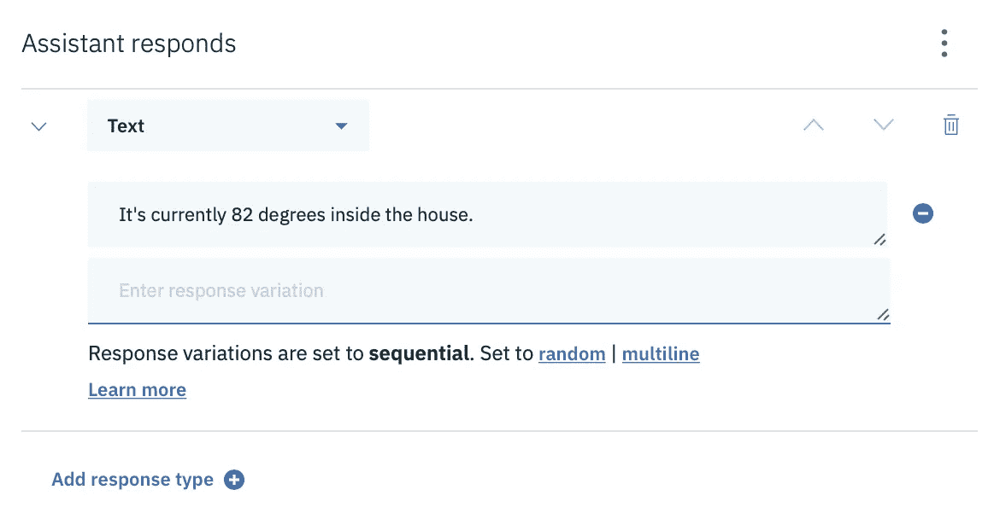

# 如何使用 IBM Watson 构建助手(第 1 部分，共 2 部分)

> 原文：<https://levelup.gitconnected.com/how-to-build-an-assistant-using-ibm-watson-part-1-of-2-758415f2911c>

在这两篇文章中，我将向您展示如何构建一个助手来控制一个模拟的智能家庭恒温器。这些文章旨在通过在现实世界中创建一些相关的东西，让您开始使用构建助手。

如果您阅读完本文后，想要更深入地了解或获得不同聊天框架的帮助，如 Twilio、Drift、Lex 或其他框架，请给我留言。

# 概述

下面是我们将涉及的工具和服务列表:

*   IBM Watson Assistant(需要一个免费的 IBM Cloud 帐户)
*   意图
*   上下文变量
*   三元运算符
*   SpEL 表达式
*   条件反应
*   槽填充
*   系统实体
*   文字实体
*   图案实体
*   Webhooks

# 但是首先

…简单说说我为什么写这篇文章。

我从事产品管理工作，严格来说，产品经理不需要掌握技术技能来完成他们的工作。毕竟，工程师就是干这个的。

然而，我相信产品管理中的每个人都应该拥有一套技术技能。为什么要完全依赖他人来实现你的愿景呢？有时候，产品发布需要掌控全局，找借口让工程师出来，自己动手做东西。

此外，我发现激发他人并帮助他们理解一个想法的全部潜力的最佳方式是构建一个原型。没有什么比在你眼前看到工作更令人振奋的了。

总的来说，我希望每个产品人都能够在正确的时间用正确的产品打入市场，有时自己动手做点什么是最好的方式。所以，让我们磨练你的技能，让你马上成为建筑助理！:)

# 我们开始吧

首先在 IBM Cloud 上创建一个免费账号，创建一个沃森助手资源。

这里有一个让你开始的捷径:【https://cloud.ibm.com/catalog/services/watson-assistant】T2

精简计划(免费)将完美地为我们工作。创建账户的步骤非常简单，但是如果你在评论区遇到任何问题，请告诉我。

创建帐户后，您应该可以看到一个“启动沃森助手”按钮。

如果没有，请参见下面的步骤。

**如果你没有看到“启动沃森助手”按钮…**

验证您已经登录，然后点击左上角的“IBM Cloud ”,然后点击屏幕右上角的“Create Resource ”(自从我写这篇文章以来，事情可能已经发生了变化)。

可选:单击创建资源

在搜索栏中输入“沃森助手”，然后点击沃森助手框。

可选:搜索“沃森助手”

选择离您最近的地区，选择 Lite 作为您的计划，然后单击 Create。您可能还需要为您的资源提供一个名称。我把我的命名为“沃森助手-我”。

如果您仍然没有看到“启动沃森助手”按钮，请通过点击左上角的“IBM Cloud”返回到您的 IBM Cloud 仪表板。您应该在“资源摘要”框中看到“服务”。如果是，请单击此处。

可选:从 IBM Cloud dashboard 中单击服务

接下来，您应该会看到 Watson Assistant 的一项服务。如果是，请点击名称。

可选:在服务下选择您的助手

如果上面两个步骤对你不起作用，在搜索栏中输入“Watson Assistant ”,你应该能找到你刚刚创建的资源。开始计时。

可选:从 IBM Cloud dashboard 中搜索 Watson Assistant

最后，点击启动沃森助手，让我们开始建立我们的助手！

点击启动沃森助手

# 助理 vs 技能

IBM Watson Assistant 由助手和技能组成。把助手想象成一个帮助你的用户的虚拟人，把技能想象成助手的能力。

在撰写本文时，您的助手可能在 Lite 计划中只有一项自定义技能。

在我们的例子中，我们将构建一个可以控制智能家居恒温器温度的助手。

**让我们创建一个助手:**

1.  单击 Create Assistant，并将其命名为您想要的任何名称。(我把我的取名为家庭管家。)
2.  确保选中启用预览链接。
3.  单击添加对话技能
4.  单击“创建技能”并为其命名。(我把我的技能命名为恒温控制。)
5.  如果一切顺利，您应该会看到下面的屏幕。(注意该技能是如何与家庭管家助理联系在一起的。)

家庭管家助理已经与恒温器控制技能相关联

恭喜你！您刚刚在 IBM Watson 上创建了一个助手和一项技能！让我们继续下去。

# 创建技能对话框

首先，通过点击打开技能。系统会提示您创建一个意向。现在让我们跳过这一步，开始构建我们的对话

对话框是我们倾听用户输入并对其做出响应的方式。

单击左侧的对话框选项卡。

对话框选项卡将位于左侧

您将看到两个标题为“欢迎”和“其他任何内容”的节点。当用户开始对话时，欢迎节点会做出响应。当用户说出助手不理解的内容时,“其他任何内容”节点会做出响应。

如果你点击右上角的“尝试”,你可以和你的助手聊天，但是你会很快发现，你的助手目前还没有完全理解。我们会尽快解决这个问题。

但首先…让我们概述一下智能家居恒温器助理应该能够做的所有事情:

1.  查看空调或加热器当前是否在运行
2.  打开或关闭恒温器
3.  将房子冷却或加热到特定的温度

我确信我们以后会添加更多的内容，但这是一个很好的开始列表。

**让我们创建一个节点来检查房子的当前温度:**

1.  单击欢迎节点上的三个垂直点，然后单击“在下面添加节点”
2.  将会打开节点的对话框编辑器窗格
3.  标题类似于“检查当前温度”

单击“在下面添加节点”(参见上述步骤)

请注意，您给出的标题实际上不会处理命令，有时称为话语，如“检查当前温度”或“当前温度是多少”。

使用“如果助手识别”下面的文本框

让我们听一下“现在的温度是多少？”:

1.  在“如果助手识别”下面，键入“input.text ==“当前温度是多少？”
    (注意:如果你将双引号从这里复制/粘贴到 Watson 中，你可能会有问题，所以当你在 Watson 中时键入它们。)
2.  在“助理回应”下面，输入类似“目前室内温度为 82 度。”
3.  点击回车

键入您助手的回答

**让我们来测试一下我们的技能:**

1.  点击“尝试一下”
2.  问“现在的温度是多少？”

*注意:您必须准确使用该命令。如果你输入其他类似的东西，比如“现在的温度是多少？”，行不通。*

在“尝试”面板中尝试一下

耶，成功了！然而，我们可以看到这是一个脆弱的用户体验。如果用户问，“温度是多少？”，助理不会懂的。

让我们用意图来解决这个问题。

# 创建一个意图

意图是用户可能说出的短语，并且反过来期望执行单个动作。例如，如果有人说，“温度是多少？”或者“有多热？”甚至是“现在有多冷？”助理会以同样的方式回答说，房间里的温度是 82 度。

**创建意图:**

1.  点击左侧的意向
2.  单击创建意图
3.  给它起个名字。注意:不允许有空格。(这是一种技术，但沃森技能实际上是一个 JSON 文件，所以我喜欢让我所有的意图名称都符合 camelCase。)
4.  将您的意图命名为“what isthetemp”
    (我强烈建议添加一个描述，如“用户想知道他们家里有多冷或多热。”)
5.  键入现实生活中用户可能会说的例子。
    (经验法则是用十个左右的例子。)

我在下面附上了我想出的例子的截图。

whatIsTheTemp 意图的示例短语

您可能会在“试用”标题下方看到“沃森正在训练”。每当这种情况出现时，你刚才输入的意图(和实体)很可能在对话中不起作用。在试用之前，你需要等待沃森完全训练。

**让我们更新负责告知温度的节点:**

1.  单击返回箭头退出您输入十个左右意向的屏幕
2.  点击对话框
3.  打开检查当前温度节点。
4.  “当前温度是多少？”'
5.  单击文本框，注意它下面会出现一个选择框
6.  点击“# intents”
7.  选择“#whatIsTheTemp”
8.  返回“试用”面板，然后点按“清除”
9.  键入您之前创建的意图短语之一，如“天气有多热？”

瞧啊。您现在可以使用多个短语来检索同一个答案。

现在让我们试试一个短语，比如“这房子里有多热？”请注意，我们并没有特意提供这一点作为意图。所以你可能想知道它会有问题吗？会完美回应吗？让我们看看:)

对我来说，成功了！如果这对你没用，没问题。在你刚刚输入的短语下面，点击下拉菜单，将其归类为#whatIsTheTemp。

训练 Watson Assistant 识别“尝试”面板中的短语

一旦沃森完成了训练，它将在未来为这个短语和类似的短语工作。

华生很酷。😎

# 创建上下文变量

我们的技能应该能够做到的一件事是打开和关闭我们想象中的智能恒温器。让我们通过设置和操作一个表示恒温器开/关状态的上下文变量来模拟这种能力。

**让我们创建一个上下文变量并设置它的值:**

1.  回到你的技能对话框，点击欢迎节点。
2.  在“助理回应”的右边应该是三个垂直的点，点击它们并选择“打开上下文编辑器”。
3.  注意可以输入变量名的文本框前面的美元符号(就像 Intents 前面有一个 hash 标签一样，上下文变量前面有一个美元符号。)
4.  将这个变量命名为“thermostatPower”，然后将其设置为 true(不过不要为 true 加上任何引号。见下面截图。)

打开上下文编辑器将位于打开 JSON 编辑器的正下方。点击它。(参见上述步骤)

添加名为 thermostatPower 的上下文变量，并将其设置为 true(参见上述步骤)

在我们的例子中，我们将假设 true 表示恒温器打开，false 表示恒温器关闭。

干得好！您刚刚创建了第一个上下文变量！

# 带有 SpEL 表达式的三元运算符

现在，让我们使用这个变量。

**让我们创建一个使用上下文变量的节点:**

1.  通过单击三个垂直点，在“检查当前温度”下创建一个新节点
2.  让我们把它命名为“检查恒温器的状态”。
3.  在“助手响应”下，键入类似于“恒温器当前为$恒温器电源”的内容*(排除引号。)*

在下面添加节点，检查当前温度(参见上述步骤)

接下来，让我们测试一下这个节点的性能。为此，我们需要节点来识别输入。

为了让我们的节点识别“恒温器打开了吗？”:

1.  在“如果助手识别”下面，键入“input.text ==”恒温器打开了吗？
    *(在 Watson 中键入引号，而不是从这里复制/粘贴。)*
2.  点击回车
3.  点击右上角的“尝试一下”(或者如果你已经打开了面板，则清除)
4.  键入“恒温器打开了吗？”

如果您这样做了，您应该会收到“恒温器当前为真”

恒温器是“尝试”窗格中的当前真实响应

很好，但这不是助理应该说的话。

**让我们用一点三元魔法来改善这一点:**

1.  回到你的课本上，上面写着，“恒温器目前是$恒温器功率。”
2.  改为:“恒温器当前为 $thermostatPower ? “on” : “off” ?>。”
3.  单击尝试或清除
4.  键入“恒温器打开了吗？”又来了。

您应该看到“恒温器当前打开”

三元运算符(见上述步骤)

不错！

**如果你有兴趣，让我们来分解一下如何'<？$恒温器电源？“开”:“关”？>作品:**

*在此之前，请记住 SPEL 表达式是您的 Watson 助手中的小型 Java 代码块。*

*   $恒温电源？是在说，$ thermostatPower 变量等于 true 吗？
*   $恒温器电源？“开”是说，“如果是真的，那么在我给用户的回复中写‘开’
*   $恒温器电源？“开”:“关”是说，“但如果是假的，那就写‘关’”

**现在，让我们通过添加一个#getThermostatStatus 意图来清理这个节点。**参见上面的几个章节，以获得意图方面的帮助。

以下是我为此目的设置的一些示例短语。

1.  检查一下恒温器。
2.  获取恒温器的状态。
3.  它在给房子降温吗？
4.  它在给房间供暖吗？
5.  恒温器开了吗？
6.  恒温器现在在运行吗？
7.  恒温器在运行吗？
8.  恒温器怎么了？
9.  恒温器在做什么？
10.  恒温器怎么了？
11.  空调开着吗？
12.  恒温器开了吗？

以下是输入我的示例短语后的样子:

getThermostatStatus 意图示例短语

现在祝你测试助手愉快！在接下来的一两篇文章中，我们将讨论下面列出的其余内容:

*   条件反应
*   槽填充
*   系统实体
*   文字实体
*   图案实体
*   Webhooks

西亚在下一篇文章！