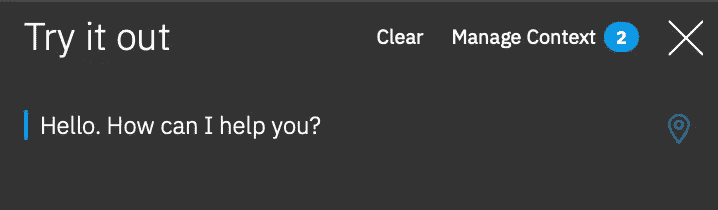
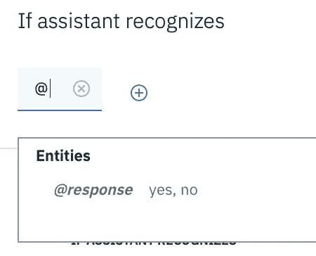

# 如何使用 IBM Watson 构建助手(第 2 部分，共 2 部分)

> 原文：<https://levelup.gitconnected.com/how-to-build-an-assistant-using-ibm-watson-part-2-of-2-7c2a90693b53>

如果您还没有这样做，请在阅读本文之前查看第 1 部分。

**我们在上一篇文章中提到过:**

*   意图
*   上下文变量
*   三元运算符
*   SPEL 表达式

**在本文中，我们将介绍:**

*   条件反应
*   系统实体
*   文字实体
*   图案实体
*   槽填充
*   Webhooks

# 条件反应

我见过的 IBM Watson Assistant 内置了两种条件。

1.  一个在节点级别，我们已经看到并使用过了(它在“如果助手识别”副标题的下面。)
2.  另一个在响应级别

结合这些条件反应给了我们非凡的控制力。让我们看看怎么做。

**向我们的响应添加另一个三元运算符:**

1.  打开“检查恒温器的状态”节点。
2.  在我们之前创建的三元运算符之后，添加一个问题，该问题将提示用户做出响应，例如“您想转动它 $thermostatPower ? “off” : “on” ?>吗？”

注意我的第二个三元组是如何在恒温器打开时要求关闭它的，反之亦然。

让我们试一试。见下面我的截图。

添加更多三元运算符(参见上述步骤)

现在，我们需要添加一些子元素来监听用户对这个提示的响应，比如“是”或“否”。

**添加两个子节点:**

1.  点击“检查恒温器状态”节点上的三个垂直点
2.  选择“添加子节点”
3.  标题为“是—调整温度计”，让它听“输入. text ==“是”
4.  添加另一个子节点到“检查恒温器的状态”
5.  标题为“否—不要调整温度计”，让它听“否”

当你完成后，它看起来会像下面的截图。

用于检查恒温器状态的子节点

**让我们编辑“否—不调整温度计”节点:**

1.  打开节点
2.  在“助理回应”下，提供文本，如“好的，如果您还需要什么，请告诉我。”

**现在让我们编辑“是—调整温度计”节点:**

1.  打开它
2.  单击节点编辑器窗格右上角附近的“定制”
3.  将会打开一个名为“自定义”是—调整温度计的模式
4.  滚动到底部，启用“多重条件反应”
5.  单击应用

在模式中启用多个条件响应(参见上述步骤)

将出现一对名为“如果助手识别”和“回复”的文本框。

**让我们创建一些条件响应:**

1.  在第一个框中，键入“$ thermostatPower = = true”
2.  在第二个框中，键入“好的，我将关闭恒温器。”
3.  单击“添加响应”添加新行
4.  在第一个框中填入“$ thermostatPower = = false”
5.  输入“好的，现在开机。”在第二个盒子里

当你完成的时候它会看起来像这样。

助手响应多个条件

如果用户想关掉恒温器，我们就关掉它:

1.  现在，单击第一行文本框右侧的齿轮图标
2.  将打开一个模式
3.  点击“助理回应”右侧的三个垂直点
4.  选择“打开上下文编辑器”
5.  将$ thermostatPower 设置为 false

它看起来会像这样:

将恒温器功率设置为假(见上述步骤)

**让我们打开恒温器，如果用户想开的话:**

1.  现在点击齿轮图标右边的 ***第二行*** 文本框
2.  将打开一个模式
3.  点击“助理回应”右侧的三个垂直点
4.  选择“打开上下文编辑器”
5.  将$ thermostatPower 设置为 true

这是你完成后的样子:

将恒温器功率设置为真(见上述步骤)

**让我们测试一下我们的工作:**

测试时要做的第一件事是写下你的步骤和期望。我的如下:

1.  单击“尝试一下”,然后单击“管理上下文”(我希望$ thermostatPower 将被设置为 true。)
2.  退出“上下文变量”面板，问一个类似“恒温器打开了吗？”在“尝试”面板中(我希望助手回答说它已经打开了。我还期望它会问我是否要关闭它)
3.  我会说是(我期待它说已经关机。)
4.  我还希望$ thermostatPower 被设置为 false

自己尝试一下。手指交叉！

谢天谢地，一切都解决了。请参见下面我的步骤和结果。

*点击试试:*

试用窗格

*点击管理上下文:*

查看上下文变量

*退出“上下文变量”窗格，键入“恒温器打开了吗？”:*

返回“尝试”面板

*助理回应说开着，问我要不要关。我回答是:*

回答是

*我又检查了一次$ thermostatPower 上下文变量，它被设置为 false！*

恒温器功率设置为假(成功了！)

恭喜你！

现在是时候停下来测试你的助手了，问它是否打开，然后关掉，再问一次，然后再打开，重复几次以确保它工作正常。

# 添加实体

您可以将实体视为同义词。

以下是“是”实体的一些同义词示例:

*   是
*   是
*   绝对

而“否”实体将具有:

*   不
*   决不
*   不了

你可能认为意图和实体非常相似，并可能想知道真正的区别是什么。

我是这样想的:意图是一组描述用户想要的动作的短语，而实体是一个和其他单词有相同定义的单词。

这有什么帮助呢？我们的节点“是—调整温度计”和“否—不调整温度计”只有在用户分别说“是”和“否”时才会做出反应。他们不会对“是”和“否”的同义词做出反应。让我们用实体来解决这个问题。

**创建一个“响应”实体:**

1.  单击左侧的实体选项卡
2.  单击创建实体
3.  键入“响应”,然后单击“创建实体”

创建实体(参见上述步骤)

对于第一个值，键入“yes ”,然后添加以下同义词:

*   是
*   是
*   是
*   绝对
*   (还有其他你能想到的同义词。)

然后点击“增值”。

接下来加上“不”和下面所有的同义词。

*   不
*   不
*   决不
*   不了
*   (以及任何你能想到的其他人。)

完成后，它将看起来像这样:

是和否的回应实体

现在，让我们编辑“是—调整温度计”和“否—不调整温度计”节点。

1.  点击对话框选项卡
2.  打开“是—调整温度计”
3.  删除“input.text == "yes "”
4.  在
    *处输入“@”(你会看到一个选择框出现。)*

实体的选择框

点击@response。你会看到更多的选项。

响应实体的选项

点击“:是”，然后点击“是”。它看起来会像这样:

已添加“是”的响应实体！

现在，转到“否——不要调节温度计”,除了使用“@响应:否”之外，进行与上面相同的操作

现在你知道了！如果您做的一切都正确，您的节点将如下所示:

响应“是”和“否”短语的节点

一旦沃森完成了训练，再回去试一试，试着打开和关闭它，但是要使用“是”或“肯定”以及“不”或“不”这样的词。

在“尝试”窗格中测试我们的响应实体

# 关于实体的更多信息…

如果你感兴趣，实体是超级强大的，我想指出一些你可以用它们做的事情。

**系统实体**

这些都是 IBM 在沃森助手中加入的实体。例如，他们有一个可以处理现金同义词的@sys-currency 实体。想想自己做“货币”实体会有多难。

一些用户可以键入“$100.23”或“100.23 美分”或“100.23 美分”。没有一个系统实体，你怎么可能解决这个问题呢？

还有更多系统实体，所以如果你感兴趣，可以去实体>系统实体查看。

导航中的系统实体

**图案实体**

就我个人而言，我喜欢这些，因为我喜欢写得很好的正则表达式。注意当我们添加实体时，有一个“同义词”的下拉菜单？

实体屏幕上的同义词下拉列表

我们可以将这个下拉列表改为“模式”并使用正则表达式，这允许我们识别用户输入中的模式。

在下一节中，我们将创建一个“温度”实体，它可以识别从 60 到 100 的数字。这将允许我们的用户设置恒温器的目标温度。

**有趣的图案实体**

好了，让我们看看目前为止我们已经完成了什么:

1.  查看空调或加热器当前是否正在运行…检查！
2.  打开或关闭恒温器…检查！
3.  将房子冷却或加热到特定的温度

现在让我们来解决第三个问题吧！

**首先，让我们创建一个模式实体，它将使用一个正则表达式来识别从 60 到 100 的数字:**

1.  转到实体
2.  单击创建实体
3.  命名为“学位”
4.  该值的名称也将是“度”
5.  将“同义词”改为“模式”
6.  将此输入模式文本框:([6–9]{ 1 }[0–9]{ 1 })|(100)

稍微分解一下:

*   ([6–9]{ 1 } '表示第一个数字应该是 6、7、8 或 9
*   [0–9]{ 1 })'表示第二个数字应该是 1 到 9 之间的任何数字
*   | '的意思是'或'
*   “100”是指 100

所以基本上，它告诉我第一个数字是 6 到 9，第二个数字是 0 到 9，或者直接给我 100。

如果你有兴趣学习更多关于正则表达式的知识，我推荐你看看 regex101.com 的**。**

***接下来，让我们创建能够识别命令的意图，例如“打开恒温器，将其设置为 90 度。”***

1.  *转到意图*
2.  *单击创建意图*
3.  *将其命名为“setThermostat”*
4.  *我给它的描述是，“用户想打开恒温器，并可能把它设置到一个期望的温度。”(这是可选的。)*
5.  *给了它示例命令…*
6.  *将房子冷却到 72 度*
7.  *冷静下来*
8.  *给房子加热*
9.  *把房子加热到 72 度*
10.  *将温度设置为 100*
11.  *把恒温器调到 100 度*
12.  *发动*
13.  *打开恒温器*
14.  *打开恒温器，把它调到 60 度*
15.  *打开恒温器，把温度调到 82 度*

*咻！我们做了很多，但我们可以做得更多。让我们使用注释(在撰写本文时仍是测试版特性)，这样 Watson 可以识别上面一些命令中的度数。*

*启用“注释实体”。*

**

*启用注释实体复选框*

*然后单击命令中的数字，如 60、72、82 和 100，并从选择框中选择@degree。*

**

*用度数实体进行标注*

*这是一个很大的设置工作，但我们几乎在那里。*

***让我们更新对话框，以识别新的#setThermostat 意图:***

1.  *走向你的对话*
2.  *在“检查恒温器的状态”下创建一个节点，并将其命名为“打开并获得所需的温度”*
3.  *打开您的新节点*
4.  *在“如果助手识别”下面，添加您的新#setThermostat 意图*

**

*添加您的新 setThermostat 意图*

# *槽填充*

*现在我们将使用 slot filling 来找出用户想要将恒温器设置到什么温度。*

***让我们启用槽填充:***

1.  *接下来，单击节点标题旁边的自定义*
2.  *启用插槽*
3.  *单击应用*

*该节点的编辑器现在将包含一个新的“Then check for”部分。*

***让我们填充一个新的$desiredTemp 上下文变量:***

1.  *在“Check for”框中，添加新的@degree 实体(注意，由于它是一个模式实体，如果您想获得用户提供的值，您需要键入@degree.literal。)*
2.  *在“另存为”框中，将该值保存到$desiredTemp。*
3.  *在“如果不存在，请询问”框中键入“您希望它设置为什么温度？”*

*这是你完成后的样子:*

**

*desiredTemp 变量的槽填充*

***现在，让我们测试所有的东西:***

*在我看来，这就是事情变得非常酷的地方！*

*打开“尝试”面板。如果需要，让沃森完成培训，然后键入“打开恒温器”请注意，系统会提示您输入温度。接下来，输入 60。*

*最后，单击“Manage context ”,注意$desiredTemp 被设置为 60。多酷啊！*

*继续下去，通过发出诸如“将房子冷却到 65 度”这样的命令来进行更多的测试然后单击“管理上下文”以验证$desiredTemp 是否设置为 65。注意到它没有问你要学位了吗，因为你在一个命令中提供了学位。我们的助手越来越强大了！*

*在下一节中，我们将看到如何用 Webhooks 将我们的助手带到下一个层次。*

# *用 Webhooks 控制恒温器*

*让我们假设我们想象的智能恒温器连接到云，并且有一个 API 端点，我们可以用它来调整恒温器。*

*在这个场景中，我们的助手会调用一个 webhook(一个 API 端点)并要求该 API 做一些事情。在我们的例子中，我们将要求打开恒温器，并将其设置为所需的温度。*

*最后，API 不仅仅接收请求，它们通常还提供包括数字代码(比如 400)和响应消息(比如“没有找到恒温器”)的响应。如果一切顺利，将返回一个响应代码 200 和一条类似“成功调节恒温器”的消息。*

*所以要使用 webhook 调用，我们需要一个 API。开发 API 超出了本文的范围，但是如果您对此感兴趣，请在评论中告诉我。现在，让我们使用一个模拟 API 服务。在我看来最容易使用的是 [webhook.site](http://webhook.site) 。*

***但是首先，原谅我的打断…***

*[*web hook . site*](http://Webhook.site)*不使用 SSL 加密，您应该假设它接收的数据不会得到安全保护。即使您认为数据不敏感，也不要发送真实数据。只用假数据。说真的，我怎么强调都不为过。**

***好，我们继续……***

*由于我们的数据完全是虚构的，就像我们的智能恒温器一样，我们可以很好地使用 [webhook.site](http://webhook.site) 。*

***设置 Webhook.site:***

1.  *在浏览器的地址栏中输入 [webhook.site](http://webhook.site)*
2.  *点击回车*

*一旦你登陆他们的网页，你会得到一个随机生成的网址，你可以用它来进行网页挂钩。见下文。*

**

*自动生成的 Webhook 网站 URL*

***将这个 webhook URL 添加到沃森:***

1.  *点击 Edit，将内容类型改为“application/json”(Watson 只接受 JSON 响应)*
2.  *单击保存*
3.  *复制整个 URL*
4.  *回到你的助手那里去*
5.  *转到选项*
6.  *粘贴 URL*
7.  *按下键盘上的回车键*

**

*选项下的 Webhook 设置*

***让我们在对话中使用这个 web hook:***

1.  *在“打开并获得所需温度”下创建一个新节点，并将其命名为“调节恒温器”*
2.  *打开“调节恒温器”节点*
3.  *单击自定义*
4.  *启用 Webhooks*
5.  *点击应用*

**

*为“调整恒温器”节点启用 Webhook*

1.  *在“密钥”文本框中，键入“desiredTemp”*
2.  *在“值”文本框中，键入“$desiredTemp”*

*当你完成时，它看起来像这样:*

**

*desiredTemp 的键和值对*

*滚动到节点编辑器窗格的底部。您将看到“如果助理识别”和“回复”副标题。*

1.  *在文本框的第一行和下面的“响应与”输入，“恒温器已设置。房子需要 20 分钟才能达到$desiredTemp。"*
2.  *在下方的文本框中，键入“抱歉，出现了问题。请再试一次。”*

*下面是它的样子:*

**

*Webhook 结果变量*

***现在，让我们做一个节点跳转到这个:***

1.  *返回到“打开并获得所需温度”节点*
2.  *滚动到节点编辑器窗格的底部*
3.  *点击“等待回复”下拉菜单*
4.  *选择“跳转到”*
5.  *点击“调节恒温器”节点*
6.  *选择响应*

*让我们来测试一下！打开“尝试”面板，输入“将恒温器设置为 72”*

*然后…你出错了！这实际上很好，因为现在你知道你的助手正在优雅地处理 webhook 错误，而不是仅仅崩溃或者从不通知用户他们的命令不起作用。*

***让我们纠正错误:***

1.  *返回到 [webhook.site](http://webhook.site)*
2.  *如果您不记得分配给您的唯一 URL，请返回 Watson 中的选项，复制 URL，将其粘贴到一个新标签中，并在“ [webhook.site](http://webhook.site) ”和随机数之间插入“#！/
    *(对我来说，那就是*[*http://webhook.site/#!/152ea314-6c9f-4dd9-9b81-bb823e80*](http://webhook.site/#!/152ea314-6c9f-4dd9-9b81-bb823e80)*)**
3.  *单击编辑*
4.  *将响应正文更改为{“Response”:“success”}*
5.  *单击保存*

*回到华生那里，再试试你的命令。这次会成功的！*

*另外一个很酷的东西是 webhook.site 向你展示了 Watson 发送给它的内容。*

**

*来自沃森助手的 Webhook 站点数据*

***关于沃森助手中 Webhooks 的几个注意事项:***

1.  *每个技能只能添加一个网页挂钩*
2.  *你只能发帖子*

***这意味着:***

1.  *要制作一个完整的生产就绪的应用程序，您需要创建一个单独的 API 来检查有效负载，以了解必须做什么*
2.  *不能使用多个端点，每个端点只执行一个功能*
3.  *您不能执行 Get、Put 或其他类型的请求，这是非常有限的*

*除此之外，世界都是你的！*

# *通过预览链接分享您的技能*

*我们创建了一个与助手相关的技能，并且我们已经用“尝试”面板测试了它，所以现在是时候与他人分享它了。*

***找到并分享您的预览链接:***

1.  *在右上角，单击聊天气泡图标(这将带您回到您的助手。)*
2.  *点击“家庭管家”*
3.  *点击预览链接并复制其网址*

**

*预览链接 URL*

*你完了！任何有这个链接的人都可以测试你的助手。*

*下面是我助手的截图:*

**

*使用预览链接与我的家庭管家互动*

***最后，一些收尾工作…***

*为了证明概念或原型，我们已经做得够多了。希望决策者、利益相关者或你公司的任何人都能看到这其中的潜力，并理解你在努力构建什么。*

*然而，要建立一个强大的技能，“足够好”是不够的。我们需要潜得更深，所以继续前进！*

*我继续添加了更多的功能，这将使这个助手更加强大，我敢说，只需要一些小的调整就可以投入生产了。如果想更深入地了解，请[下载我的技能(JSON 文件)](https://github.com/andravis/smart-thermostat)，上传到您的 IBM Watson Assistant 帐户，尽情享受吧！*

*此外，请务必让我知道你是否有任何问题，因为你细读它。*

*重要提示:助手本身已接近生产就绪。如果您想让它实际控制一个智能恒温器，那么需要连接一个前端接口和后端解决方案，这是一项不小的工作，超出了本文的范围。此外，您可能希望升级到 IBM Watson Assistant 的标准计划。*

# *关于我…*

*我担任产品主管，与 C 级高管密切合作，以发现机会并确定如何在市场中执行这些机会，从而产生积极的投资回报。*

*当我在产品部门工作时，我认为拥有技术技能也是必须的。这样做可以让我了解我对设计师和开发人员的要求的重要性，为构建过程做出贡献，加快交付速度，确保质量，并探索自己的想法。*

*最后，我喜欢与他人分享我的知识。我之所以能有今天，是因为过去有人与我分享了他们的知识，我希望能回报他们。*

*如果你有任何问题，我很乐意收到你的来信！*

*安德鲁·戴维斯*