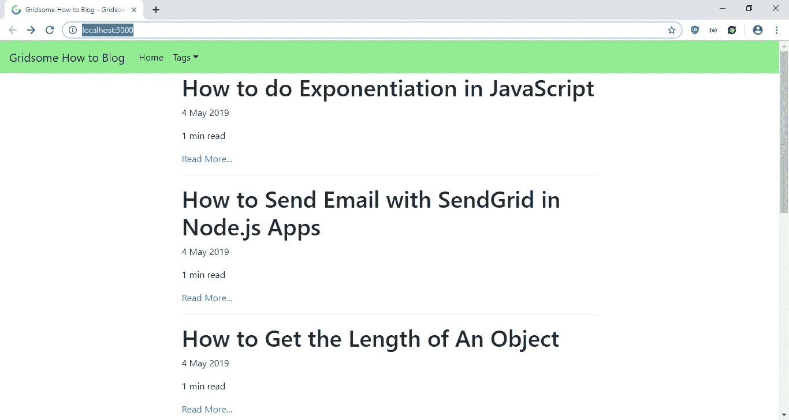

# 如何用 Gridsome 和 Markdown 文件建立一个很棒的网站

> 原文：<https://levelup.gitconnected.com/how-to-build-an-awesome-website-with-gridsome-and-markdown-files-8f5422bb0183>


如今静态网站又开始流行了。信息和宣传册网站不再需要使用像 WordPress 这样的内容管理系统来动态更新。

使用静态站点生成器，您可以从动态源(如 headless CMS)和文件(如 Markdown 文件)中获取内容。

Gridsome 是一个很棒的基于 Vue.js 的静态网站生成器，很容易用来构建静态网站。它有插件可以从各种来源获取内容，比如 WordPress 和 Markdown 文件。你可以添加插件来扩展网站的功能，比如降价解析和图像处理。Gridsome 通过将内容传输到模板来显示它们，从而从这些来源构建静态网站。使用 GraphQL 查询检索数据。你也可以构建页面来获取列表中的内容，还可以获取每个帖子的元数据，比如标签。每个模板、页面或布局都可以有一个获取网站数据的静态查询和一个获取内容数据的页面查询。

在本文中，我们将使用 Gridsome 构建一个博客，并将对内容使用 Markdown。你得先了解 Vue.js，才能用 Gridsome 建网站。

我们通过使用 Gridsome CLI 开始构建网站。运行:

```
npm install --global @gridsome/cli
```

这将安装 CLI 程序。

接下来，通过运行以下命令创建 Gridsome 项目:

```
gridsome create gridsome-how-to-blog
```

然后，我们进入创建的项目文件夹并安装一些包。我们需要 Gridsome 源文件系统和 Gridsome Transformer 注释插件。要安装它们，请运行:

```
npm i @gridsome/source-filesystem @gridsome/transformer-remark
```

然后我们运行:

```
gridsome develop
```

这启动了项目。

随着项目的创建和插件的安装，我们可以开始编写代码和创建内容。首先，我们为我们的博客创建帖子。创建一个`content`文件夹，如果它还不存在的话，然后在里面创建一个`posts`文件夹。然后，我们创建以下文件:

`check-variable-number.md`:

```
---
path: "/blog/check-variable-number"
date: "2019-05-04"
title: "How to Check if a Variable is a Number"
tags: ["number"]
---We can check if a variable is a number in multiple ways.## isNaNWe can check by calling `isNaN` with the variable as the argument. It also detects if a string’s content is a number. For example:```
isNaN(1) // false
isNaN('1') // false
isNaN('abc') // true
```Note:** `isNaN(null)` is `true` .### typeof OperatorWe can use the `typeof` operator before a variable to check if it’s a number, like so:```
typeof 1 == 'number' // true
typeof '1' == 'number' // false
```)
```

`clone-array.md`:

```
---
path: "/blog/clone-array"
date: "2019-05-04"
title: "How to Clone Array in JavaScript"
tags: ["array"]
---There are a few ways to clone an array in JavaScript,### Object.assign`Object.assign` allows us to make a shallow copy of any kind of object including arrays.For example:<pre>const a = [1,2,3];
const b = Object.assign([], a); // [1,2,3]</pre>### Array.sliceThe `Array.slice` function returns a copy of the original array.For example:<pre>const a = [1,2,3];
const b = a.slice(0); // [1,2,3]</pre>### Array.fromThe `Array.slice` function returns a copy of the original array. It takes array like objects like `Set` and it also takes an array as an argument.<pre>const a = [1,2,3];
const b = Array.from(a); // [1,2,3]</pre>### Spread OperatorThe fastest way to copy an array, which is available with ES6 or later, is the spread operator.<pre>const a = [1,2,3];
const b = [...a]; // [1,2,3]</pre>### JSON.parse and JSON.stringifyThis allows for deep copy of an array and only works if the objects in the array are plain objects. It can be used like this:<pre>const a = [1,2,3];
const b = JSON.parse(JSON.stringify(a)); // [1,2,3]</pre>
```

`concat-array.md`:

```
---
path: "/blog/concat-array"
date: "2019-05-04"
title: "How to Concatenate Array in JavaScript"
tags: ["array"]
---There are a few ways to concatenate arrays in JavaScript.## Array.concatWe can all `Array.concat` on an array to combine 2 arrays and return the new one. For example:```
const a = [1,2,3];
const b = [4,5];
const c = a.concat(b) // [1,2,3,4,5]
```## Array.pushWe can push elements of one array into another.```
const a = [1,2,3];
const b = [4,5];
let c = Object.assign([], a);
for (let i = 0; i < b.length; i++){
  c.push(b[i]);
}
console.log(c); // [1,2,3,4,5]
```What we did is make a copy of `a` and assigned it to `c` , then pushed the elements of `b` by looping through it and adding them to the end of `c` .## Spread OperatorWith ES6 or later, we can use the spread operator to spread the items from another array into a new array by doing the following:```
const a = [1,2,3];
const b = [4,5];
const c = [...a, ...b];
console.log(c); // [1,2,3,4,5]
```)
```

`exponentation.md`:

```
---
path: "/blog/exponentiation"
date: "2019-05-04"
title: "How to do Exponentiation in JavaScript"
tags: ["number"]
---There are multiple to compute exponents with JavaScript.The newest way is the exponentiation operator `**`, available with ES2016 or higher.For example, we can do this:```
const a = 2 ** 3; // 8
```It is right associative, so `a ** b ** c` is equal to `a ** (b ** c)`. This works with all exponents.For example:```
const a = 2 ** (3 ** 4);
const b = 2 ** 3 ** 4;
a == b // true, both are 2.4178516392292583e+24
```Detail browser compatibility is available at [[https://developer.mozilla.org/en-US/docs/Web/JavaScript/Reference/Operators/Arithmetic_Operators#Browser_compatibility](https://developer.mozilla.org/en-US/docs/Web/JavaScript/Reference/Operators/Arithmetic_Operators#Browser_compatibility)](https://developer.mozilla.org/en-US/docs/Web/JavaScript/Reference/Operators/Arithmetic_Operators#Browser_compatibility](https://developer.mozilla.org/en-US/docs/Web/JavaScript/Reference/Operators/Arithmetic_Operators#Browser_compatibility))We can also use the `Math.pow` function, like this:```
const a = Math.pow(2,3) // 8
```It takes 2 arguments, the first is the base and the second is the exponent. `Math.pow` works with all exponents.`Math.pow` is compatible with all recent browsers.)
```

`get-length-obj.md`:

```
---
path: "/blog/get-length-obj"
date: "2019-05-04"
title: "How to Get the Length of An Object"
tags: ["object"]
---There are 2 ways to get the length of the list of keys of an object.## Object.keys`Object.keys` gets the top level list of keys of an object and returns an array of them. For example:```
const a = {foo: 1, bar: 2};
const length = Object.keys(a).length // 2
```## Object.getPropertyNames`Object.getPropertyNames` also gets a list of all top level of keys of an object and return them as an array. For example:```
const a = {foo: 1, bar: 2};
const length = Object.`getOwnPropertyNames`(a).length // 2
```## for…in LoopThere is a special loop for looping through the keys of an object. You can do the following:```
const a = {foo: 1, bar: 2};
let keysCount = 0;
for (let key in a) {
    keysCount++;
}
console.log(`keysCount) // 2
```)
```

`repeat-strings.md`:

```
---
path: "/blog/repeat-strings"
date: "2019-05-04"
title: "How to Repeat Strings with JavaScript"
tags: ["string"]
---There are a few ways to repeat a string in JavaScript. JavaScript strings have a built in `repeat()` function. You can also use a loop to do the same thing.## String.repeat FunctionTo use the `repeat` function, you pass in the number of times you want to repeat the string as an argument. It returns a new stringFor example:
```
const hello = "hello";
const hello5 = A.repeat(5);
console.log(hello5); // "hellohellohellohellohello"
```## Use a loopYou can use `for` loop and `while` loop to do repeatedly concatenate strings.Using a `for` loop, you can do:```
const hello = "hello";
```With a `while` loop, you can do:```
const hello = "hello";
```They both involve increment indexes up to the maximum.)
```

`send-email.md`:

```
---
path: "/blog/send-email"
date: "2019-05-04"
title: "How to Send Email with SendGrid in Node.js Apps"
tags: ["array"]
---SendGrid is a great service made by Twilio for sending emails. Rather than setting up your own email server for sending email with your apps, we use SendGrid to do the hard work for us. It also decrease the chance of email ending up in spam since it is a known trustworthy service.It also has very easy to use libraries for various platforms for sending emails. Node.js is one of the platforms that are supported.To send emails with SendGrid, install the SendGrid SDK package by running `npm i [@sendgrid/mail](http://twitter.com/sendgrid/mail)` . Then in your code, add `const sgMail = require(‘[@sendgrid/mail](http://twitter.com/sendgrid/mail)’);` to import the installed package.Then in your code, you send email by:```
sgMail.setApiKey(process.env.SENDGRID_API_KEY);
const msg = {
  to: email,
  from: '[email@example.com](mailto:email@example.com)',
  subject: 'Example Email',
  text: `
    Dear user,  Here is your email.`,
  html: `
    <p>Dear user,</p></pre>
        Here is your email.</p>`,
};
sgMail.send(msg);
```where `process.env.SENDGRID_API_KEY` is the SendGrid’s API, which should be stored as an environment variable since it is a secret.Testing is easy since you don’t need to set up a local development email server.Sending email is this simple and easy with SendGrid API. It is also free if you send small amounts of email, which is a great benefit.)
```

之后，我们可以创建代码来显示我们网站的内容。在`layouts`文件夹中，将现有代码`Default.vue`替换为:

```
<template>
  <div>
    <nav class="navbar navbar-expand-lg navbar-light bg-light">
      <a class="navbar-brand" href="#">{{ $static.metadata.siteName }}</a>
      <button
        class="navbar-toggler"
        type="button"
        data-toggle="collapse"
        data-target="#navbarSupportedContent"
        aria-controls="navbarSupportedContent"
        aria-expanded="false"
        aria-label="Toggle navigation"
      >
        <span class="navbar-toggler-icon"></span>
      </button><div class="collapse navbar-collapse" id="navbarSupportedContent">
        <ul class="navbar-nav mr-auto">
          <li class="nav-item active">
            <g-link class="nav-link" to="/">Home</g-link>
          </li>
          <li class="nav-item dropdown" v-if="$page.allTag">
            <g-link
              class="nav-link dropdown-toggle"
              href="#"
              id="navbarDropdown"
              role="button"
              data-toggle="dropdown"
              aria-haspopup="true"
              aria-expanded="false"
            >Tags</g-link>
            <div class="dropdown-menu" aria-labelledby="navbarDropdown">
              <g-link
                class="nav-link"
                :to="tag.node.path"
                v-for="(tag, index) in $page.allTag.edges"
                :key="index"
              >{{tag.node.id}}</g-link>
            </div>
          </li>
        </ul>
      </div>
    </nav>
    <div class="layout">
      <slot />
    </div>
  </div>
</template><static-query>
query {
  metadata {
    siteName
  }
}
</static-query><style>
nav.navbar  {
  background-color: lightgreen !important;
}.layout {
  max-width: 760px;
  margin: 0 auto;
  padding-left: 20px;
  padding-right: 20px;
}.header {
  display: flex;
  justify-content: space-between;
  align-items: center;
  margin-bottom: 20px;
  height: 80px;
}.nav__link {
  margin-left: 20px;
}
</style>
```

这是我们包装内容的布局组件。在那里，我们在布局组件的顶部添加了引导导航条组件，在组件的底部，我们有`slot`组件来通过我们将要制作的模板显示我们的内容。

我们从模板和页面的`page-query`部分获取标签列表，如果标签存在，将显示一个带有标签列表的下拉菜单。每个标签都有一个链接。

组件的`static-query`部分获取网站的元数据。在这里，我们用`siteName`来显示网站的名称。`static-query`的结果存储在具有`static-query`部分的组件的`this.$static`变量中，所以我们可以像上面那样使用`$static`在模板中显示结果。

接下来，在`pages`文件夹的`Index.vue`中，将现有代码替换为:

```
<template>
  <Layout>
    <div class="post-list">
      <div v-for="(edge, index) in $page.allPost.edges" :key="index">
        <h1 class="title" v-html="edge.node.title" />
        <p class="date" v-html="edge.node.date" />
        <p class="description" v-html="edge.node.description" />
        <p>{{edge.node.timeToRead}} min read</p>
        <g-link :to="edge.node.path" class="read">Read More...</g-link>
        <hr class="line" />
      </div>
    </div>
  </Layout>
</template><script>
export default {
  metaInfo: {
    title: "Gridsome How to Blog"
  }
};
</script><style>
.home-links a {
  margin-right: 1rem;
}
</style><page-query>
query {
  allPost {
    totalCount
    edges {
      node {
        id
        title
        timeToRead
        date (format: "D MMMM YYYY")
        path
      }
    }
  },
  allTag {
    edges {
      node {
        id
        path
      }
    }
  }
}
</page-query>
```

这是我们网站的主页。我们显示了之前在`content/posts`文件夹中创建的文章列表。为了获得 post 数据，我们将`page-query`添加到上面的组件中。对于`page-query`查询，结果设置在`this.$page`中，所以我们可以像上面那样使用`$page`在模板中显示数据。

我们用`allPost`查询来获取所有的帖子，用`allTag`查询来获取`Layout`组件的标签，这些标签写在我们上面修改过的`layouts/Default.vue`中。

接下来，我们创建模板来显示我们写的文章。在`templates`文件夹中，我们创建`Post.vue`并添加:

```
<template>
  <Layout>
    <br />
    <g-link to="/" class="link">&larr; Go Back</g-link>
    <div class="post-title">
      <h1>{{$page.post.title}}</h1>
      <p class="post-date">{{ $page.post.date}} | {{$page.post.timeToRead}} min read</p>
    </div>
    <div class="post-content">
      <p v-html="$page.post.content" />
    </div>
  </Layout>
</template><page-query>
query Post ($path: String!) {
   post: post (path: $path) {
    id
    title
    content
    date (format: "D MMMM YYYY")
    timeToRead
  }
}
</page-query>
```

在这个组件中，我们通过路径获取单个帖子的数据，并将结果赋给`this.$page`变量，因为它是一个像我们之前一样的`page-query`。

接下来在`templates`文件夹中创建`Tag.vue`并添加:

```
<template>
  <Layout>
    <h1>Articles Tagged with: {{ $page.tag.title }}</h1>
    <ul>
      <li v-for="edge in $page.tag.belongsTo.edges" :key="edge.node.id">
        <g-link :to="edge.node.path">{{ edge.node.title }}</g-link>
      </li>
    </ul>
  </Layout>
</template><page-query>
query Tag($id: ID!) {
  tag(id: $id) {
    title
    belongsTo {
      edges {
        node {
          ... on Post {
            id
            title
            path
          }
        }
      }
    }
  },
  allTag {
    edges {
      node {
        id
        path
      }
    }
  }
}
</page-query>
```

用`allTag`查询获取所有标签，用`tag`查询获取我们在 Markdown 文件中写的带有标签的所有文章。在`Layout`组件中使用了`allTag`查询，在该组件中使用了`tag`查询。我们在这个文件中浏览了`tag`查询的结果。

接下来在`gridsome.config.js`中，将现有代码替换为:

```
// This is where project configuration and plugin options are located.
// Learn more: [https://gridsome.org/docs/config](https://gridsome.org/docs/config)// Changes here require a server restart.
// To restart press CTRL + C in terminal and run `gridsome develop`module.exports = {
  siteName: "Gridsome How to Blog",
  siteDescription: "A how to blog designed with Gridsome",
  plugins: [
    {
      use: "[@gridsome/source-filesystem](http://twitter.com/gridsome/source-filesystem)",
      options: {
        path: "content/posts/**/*.md",
        typeName: "Post",
        route: "/blog/:slug",
        refs: {
          tags: {
            typeName: "Tag",
            route: "/tag/:id",
            create: true
          }
        }
      }
    }
  ]
};
```

添加[@ grid some/source-file system](http://twitter.com/gridsome/source-filesystem)插件，这样我们就可以获取降价文件并在我们的站点中显示它们。`options`对象中的`path`是我们创建的降价文件的路径。`route`是帖子的相对 URL。包含了`tags`对象，以便我们创建页面来列出带有给定标签的文章。`typename`与我们模板的文件名相同。所以`typename: "Post"`意味着我们使用`templates/Post.vue`来显示我们的帖子内容，而`typename: "Tag"`将使用`templates/Tag.vue`来显示贴有给定标签的帖子。

接下来在`mains.js`中，将现有代码替换为:

```
// This is the main.js file. Import global CSS and scripts here.
// The Client API can be used here. Learn more: gridsome.org/docs/client-apiimport DefaultLayout from "~/layouts/Default.vue";export default function(Vue, { router, head, isClient }) {
  // Set default layout as a global component
  Vue.component("Layout", DefaultLayout);head.link.push({
    rel: "stylesheet",
    href:
      "[https://stackpath.bootstrapcdn.com/bootstrap/4.3.1/css/bootstrap.min.css](https://stackpath.bootstrapcdn.com/bootstrap/4.3.1/css/bootstrap.min.css)",
    integrity:
      "sha384-ggOyR0iXCbMQv3Xipma34MD+dH/1fQ784/j6cY/iJTQUOhcWr7x9JvoRxT2MZw1T",
    crossorigin: "anonymous"
  });// Add an external Javascript before the closing </body> tag
  head.script.push({
    src: "[https://code.jquery.com/jquery-3.3.1.slim.min.js](https://code.jquery.com/jquery-3.3.1.slim.min.js)",
    integrity:
      "sha384-q8i/X+965DzO0rT7abK41JStQIAqVgRVzpbzo5smXKp4YfRvH+8abtTE1Pi6jizo",
    crossorigin: "anonymous",
    body: true
  });head.script.push({
    src:
      "[https://cdnjs.cloudflare.com/ajax/libs/popper.js/1.14.7/umd/popper.min.js](https://cdnjs.cloudflare.com/ajax/libs/popper.js/1.14.7/umd/popper.min.js)",
    integrity:
      "sha384-UO2eT0CpHqdSJQ6hJty5KVphtPhzWj9WO1clHTMGa3JDZwrnQq4sF86dIHNDz0W1",
    crossorigin: "anonymous",
    body: true
  });head.script.push({
    src:
      "[https://stackpath.bootstrapcdn.com/bootstrap/4.3.1/js/bootstrap.min.js](https://stackpath.bootstrapcdn.com/bootstrap/4.3.1/js/bootstrap.min.js)",
    integrity:
      "sha384-JjSmVgyd0p3pXB1rRibZUAYoIIy6OrQ6VrjIEaFf/nJGzIxFDsf4x0xIM+B07jRM",
    crossorigin: "anonymous",
    body: true
  });// Add a meta tag
  head.meta.push({
    name: "keywords",
    content: "HTML,CSS,XML,JavaScript"
  });
}
```

将引导 CSS 和 JavaScript 文件添加到页面的`head`标签中。

然后为了构建我们的静态站点，我们运行`gridsome build`。我们的站点将建立在`dist`文件夹中。然后，为了服务我们的网站，我们使用浏览器同步网络服务器。我们运行`npm i -g browser-sync`来安装服务器，然后转到`dist`文件夹并运行`browser-sync`。

那么我们应该得到:

