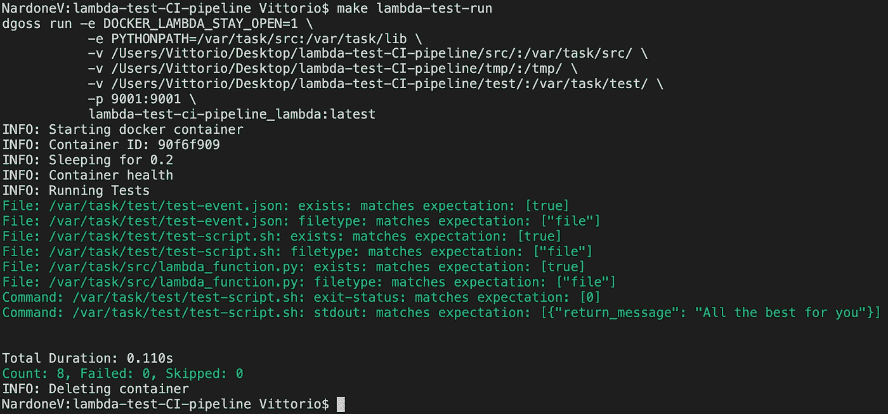
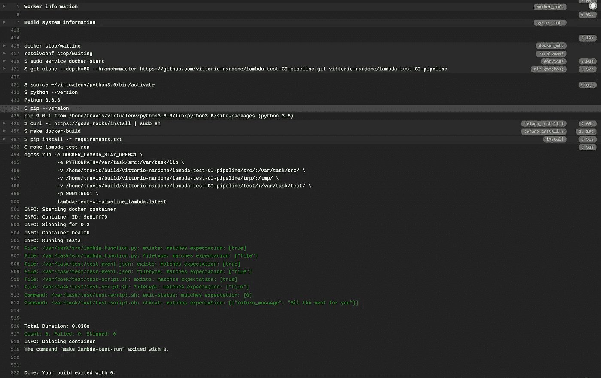

# 如何用 Goss 和 TravisCI 构建 AWS Lambda CI 管道

> 原文：<https://levelup.gitconnected.com/how-to-build-an-aws-lambda-ci-pipeline-with-goss-and-travisci-4928874b218e>

开发、构建和测试您的 Lambda 函数，而无需实际进入 AWS 云！


从用于开发示例 Lambda 函数的 Python 环境开始，**让我们看看如何创建一个持续集成管道**，它处理对每个新提交的测试。我们将使用 ***Goss*** 作为测试工具，使用 ***TravisCI*** 来实现 CI 管道。

# Docker 容器中的 AWS Lambda

让我们快速看看如何在基于 [LambdaCI](https://hub.docker.com/r/lambci/lambda/) Docker 图像的容器中运行 AWS Lambda 函数。

我们使用下面的 Python 函数，它处理在 SQS 上排队的消息，并且需要一个通常不安装在默认 Lambda 环境中的包(PILLOW)。

为了创建执行 Lambda 函数所需的 Docker 映像，这个 ***Dockerfile*** 从映像 ***开始/lambda:python3.6*** 并安装***requirements . txt***中提供的任何附加 python 包

更多详情请查看[这篇帖子](https://www.vittorionardone.it/en/2020/05/12/aws-lambda-offline-development-with-docker/)；现在我们有了 Docker 映像，Lambda 函数在容器中正确运行。我们已经准备好开始构建测试套件。

# 戈斯和德戈斯

我选择使用 [Goss](https://goss.rocks/) 作为测试工具主要是因为这些原因:由于包装器 DGoss，在测试的执行阶段和开发(或编辑)期间，可以直接与 docker 容器交互。Goss 的主要目的是验证服务器的配置，在我们的例子中，服务器就是运行 Lambda 函数的容器。测试套件可以直接从服务器(或容器)的当前状态生成，使得操作非常快速和实用。

测试套件由 YAML 文件定义。

继续进行 Goss 和 DGoss 的[安装。我们现在已经准备好启动允许我们创建测试套件的容器了。为此，我喜欢使用 Makefile。](https://github.com/aelsabbahy/goss)

这个命令以“保持打开”模式启动容器 docker:API 服务器监听端口 9001，我们的 Lambda 函数回复 HTTP 请求。使用 DGoss 参数 ***edit*** 是因为我们要运行容器来创建测试套件。 ***测试*** 目录的目的是收集运行测试所需的文件。例如，如果我们想通过 lambda 验证 SQS 消息处理，一些样本事件(以 JSON 格式)将被保存在这个文件夹中，以便在测试期间使用。

此时，可以使用任何 Goss 命令来创建我们的测试套件:例如，如果我们想要验证函数处理程序文件的存在，要使用的命令是:

```
goss add file /var/task/src/lambda_function.py
```

该选项向配置文件添加了一个新的测试，在我们的例子中是检查指定文件的存在。Goss 允许检查运行环境的许多配置参数，例如文件、包、进程、DNS 解析等的存在。[参考手册](https://github.com/aelsabbahy/goss/blob/master/docs/manual.md)非常详尽。

现在让我们创建一个脚本来验证 Lambda 函数的响应。

```
#!/bin/sh
# /var/task/test/test-script.shcurl --data-binary "@/var/task/test/test-event.json" [http://localhost:9001/2015-03-31/functions/myfunction/invocations](http://localhost:9001/2015-03-31/functions/myfunction/invocations)
```

***Curl*** 用于查询 Lambda 端点发送测试 SQS 事件(文件 **test-event.json** )。所以让我们添加另一个 Goss 测试，这次是键入 ***命令*** 。 ***goss.yaml*** 文件将变成如下所示。

***命令*** 部分包括查询 Lambda 函数的脚本的执行。我们期望在 ***stdout*** 上有一个特定内容的 JSON，确认函数的正确执行。当然，这个测试只是用 Goss 可以做什么的一个示例。

当从容器中退出时，DGoss 负责将新编辑的文件 ***goss.yaml*** 复制到我们的 localhost，这样它在删除容器本身后仍然存在。通过再次启动编辑过程，相同的文件被复制到新的容器中，并在最后再次同步。

考试时间！代替 ***编辑*** ，我们将使用 DGoss ***运行*** 命令。同样，Makefile:

DGoss 创建一个新的容器并运行测试套件。这里有一个例子。



数据运行

太好了！我们的测试套件已经准备好了，让我们继续将它集成到我们的 CI 管道中。

# 带 TravisCI 的 AWS Lambda CI

是时候配置 CI 管道了。我选择 [TravisCI](https://travis-ci.com/) 是因为它的简单性，因为它允许我们在任何计划中构建 docker 映像。我也在这篇文章和 [Ansible](https://www.ansible.com/) 中使用了它[，它是我更喜欢的 CI 工具。为了在每次提交时自动化测试过程，TravisCI 被配置为监控托管源代码的 GitHub / Bitbucket 存储库。](https://www.vittorionardone.it/en/2020/02/11/travisci-pipeline-to-test-ansible-roles-with-molecule-on-aws-ec2/)

一个简单的文件 ***.travis.yaml*** 定义了管道。

我们来分析一下: ***services*** 指令指示 TravisCI 使用 ***docker*** 服务。在开始测试之前，按照 ***安装*** 之前的说明，安装 Goss ad DGoss 并构建 AWS Lambda 映像。最后 ***脚本*** 表示有效执行我们之前准备好的测试套件的命令。



管道执行示例

太好了！我们的管道完工了！

# 结论


我们已经自动化了一个简单的 AWS Lambda 函数的构建和测试过程，而不需要它真正进入 AWS 云。我已经在许多项目中使用了这个环境，我相信它允许我们显著地加速开发，允许我们在 AWS 上部署经过测试的高质量代码。

这个 GitHub 存储库收集了本文中讨论过的内容，它可以作为用 Goss 构建自己的 CI 管道的起点。

我们玩得开心吗？下次见！

*原载于 2020 年 5 月 20 日*[*https://www . vittorionardone . it*](https://www.vittorionardone.it/en/2020/05/20/build-aws-lambda-ci-pipeline-with-goss-and-travisci/)*。*