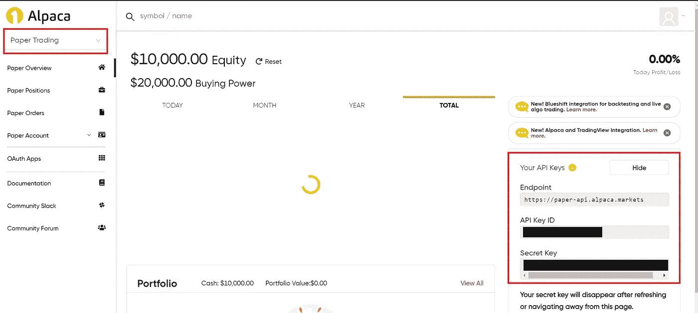
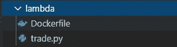
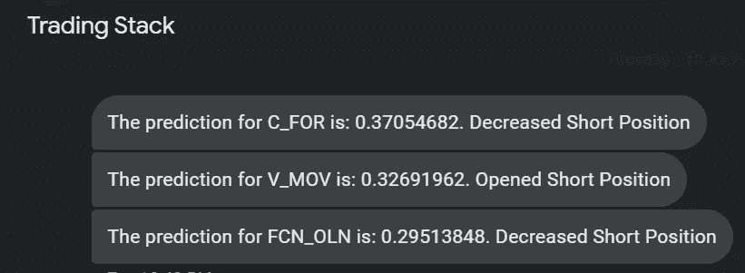
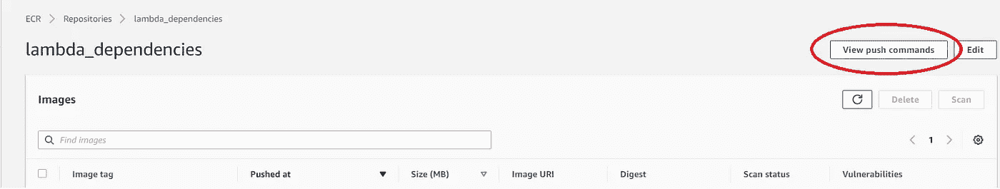
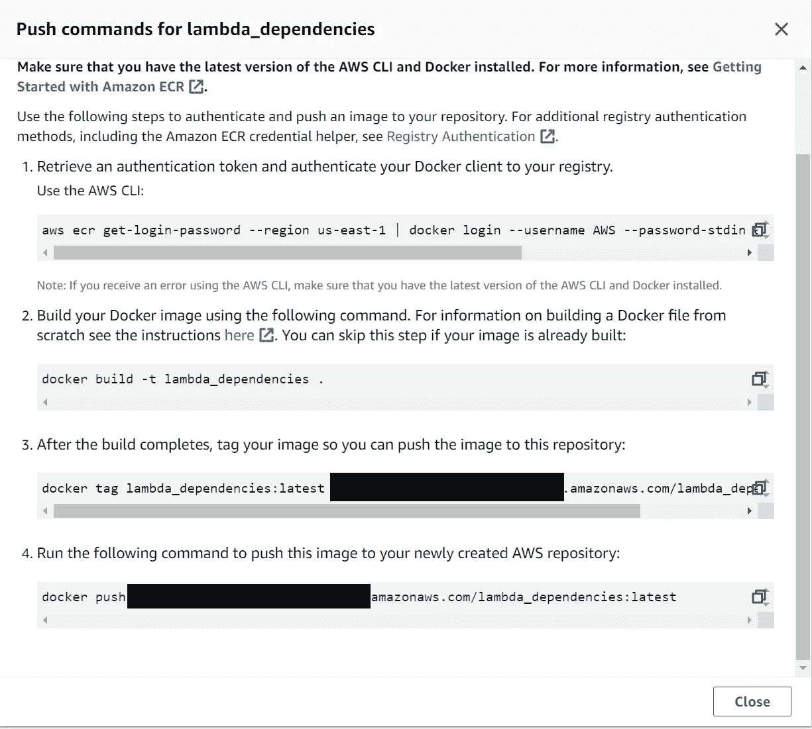
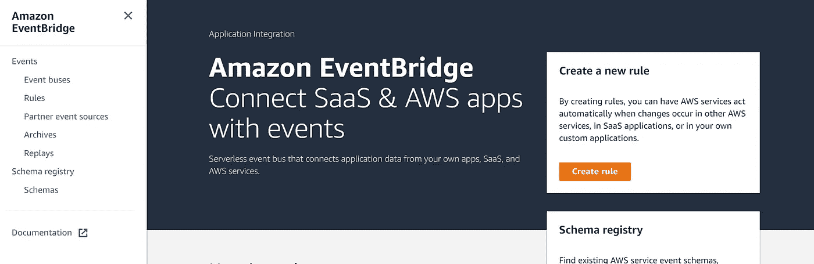
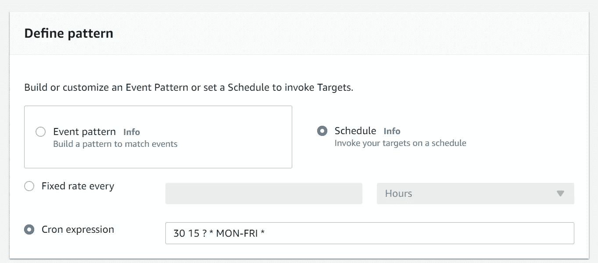
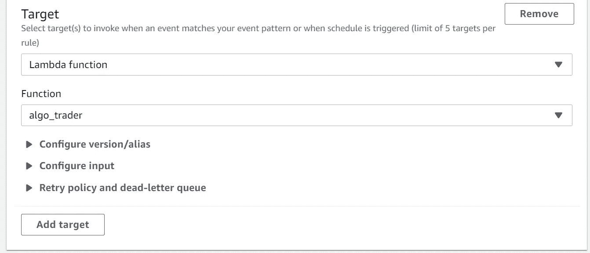
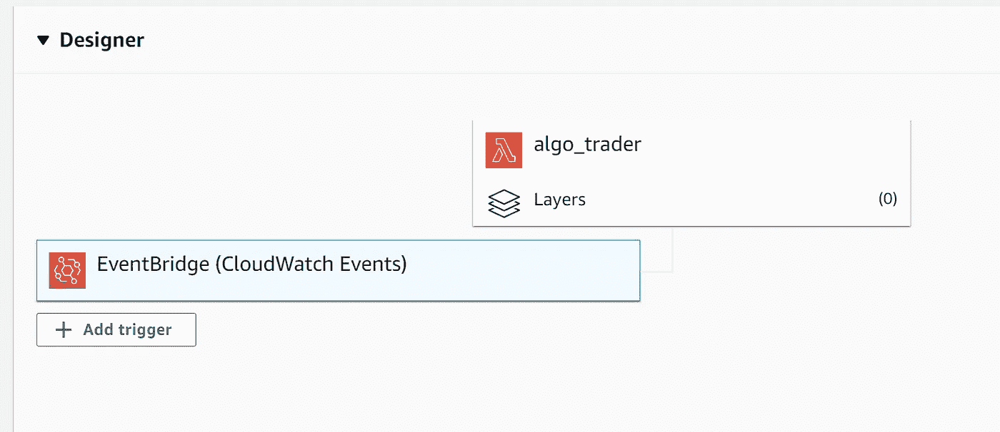

# 如何建立算法交易的 AWS Lambda

> 原文：<https://levelup.gitconnected.com/how-to-build-an-aws-lambda-for-algorithmic-trading-da5d6826551a>

## 这是为特定用例构建 AWS lambda 的一系列方法中的第二篇文章。本文重点介绍使用 Alpaca API、AWS Lambda、SNS 文本消息和 EventBridge 的算法交易。

阿兰·范在 [Unsplash](https://unsplash.com?utm_source=medium&utm_medium=referral) 上的照片

# 介绍

上个月，我发表了一篇文章，详细介绍了如何在容器映像上创建 AWS Lambda，特别是针对数据科学用例。我想通过利用 Alpaca API 来阐述这篇文章，以便数据科学模型可以用于股票交易。我还将使用另外两个 AWS 服务， [SNS](https://docs.aws.amazon.com/sns/index.html) 用于文本消息，以及 [EventBridge](https://aws.amazon.com/eventbridge/) 用于触发 lambda 循环调度。让我们开始吧。

## 步骤 1:用 Alpaca API 创建一个帐户

羊驼是一个免佣金*的经纪平台，允许用户通过 API 进行交易。一旦您创建了一个帐户，您将获得一个 API 密钥 ID 和一个密钥，您将在 Python 脚本中引用它们。这将为你的交易策略自动化搭建桥梁。

[羊驼入门](https://app.alpaca.markets/signup)

**免佣金交易是指通过 API 交易美国上市证券的羊驼自导个人现金经纪账户不收取佣金。SEC 和 FINRA 可能会收取相关费用。*

一旦你创建了一个账户，继续，拿起你的纸交易 API 密匙，把它们存放在某个地方。我建议将它们存储在您的[系统环境变量](https://towardsdatascience.com/securing-api-keys-with-environment-variables-using-anaconda-d30a7c48b1fd)中。这是最佳实践，也是我希望一开始就知道的事情。

羊驼纸交易仪表板

## 步骤 2:完成[如何为数据科学构建 AWS Lambda](https://towardsdatascience.com/how-to-build-an-aws-lambda-for-data-science-cec62deaf0e9)中的步骤 1-4

为了减少重复，请在继续阅读之前完成[如何为数据科学构建 AWS Lambda](https://towardsdatascience.com/how-to-build-an-aws-lambda-for-data-science-cec62deaf0e9)中的步骤 1-4。这将帮助您了解一些术语和一些重要的设置。在第 4 步结束时，您应该拥有一个 AWS 帐户，熟悉某些概念和术语，设置好与 AWS 通信的命令行，以及一个 ECR 存储库。

## 步骤 3:使用 Docker 构建您的容器映像

用于数据科学的 AWS Lambda 和用于算法交易的 AWS Lambda 之间的唯一区别是我们 pip 安装(如果我们使用 Python)并导入到代码文件中的包。我将包括两个新的包，[羊驼 _ 贸易 _api](https://alpaca.markets/docs/api-documentation/) 和 [ta](https://github.com/bukosabino/ta) 。Ta 是一个很棒的包，包含 42 个技术指标，派上用场。

为 lambda 构建 docker 映像有两个主要部分。

1.  docker file—lambda 的操作系统、软件、软件包依赖关系
2.  Lambda 处理程序——您希望 lambda 运行的代码。对于这个例子，我们的代码文件被标记为 trade.py

您会希望这些文件在同一个文件夹中。请随意使用下面的文件开始。

## Dockerfile 文件

## Trade.py

trade.py 是 lambda 将触发的。我已经调用了 s3，这样如果你想在 s3 桶中读写文件，一切都准备好了。SNS 也被调用，用于向一系列电话号码发送文本消息。这可以用来通知你什么时候你的策略运行正确，知道你当天的 P&L 是多少。您可以随意设置文本格式。

这是一个来自 lambda 的使用 SNS 的文本消息的例子。

来自社交网站的文本消息示例。

这个 lambda 使用的是纸质交易账户，所以你可以测试一下你的算法是如何完成的。一旦你准备好打开它，你需要改变的只是基本网址。

paper:OS . environ[" APCA _ API _ BASE _ URL "]= " https://paper-API . alpaca . markets "

live:OS . environ[" APCA _ API _ BASE _ URL "]= "[https://API . alpaca . markets](https://api.alpaca.markets)"

要完成 lambda 的 docker 映像，请确保保存这两个文件，然后打开命令行(powershell、bash、linux)和这些文件所在的“cd”。在那里，打开 AWS 控制台中的 ECR 并打开您之前创建的存储库。在右上角点击“查看推送命令”

在 ECR 中查看推送命令

按照显示的顺序执行这些命令。第二个命令需要一段时间，因为它正在构建您的容器映像。第四个命令也需要一段时间，因为它将容器映像推送到云中，并且必须构建映像的所有层。

ECR 推送命令

完成此步骤后，刷新 ECR 页面并检查您的映像是否成功。

## 步骤 4:完成[如何为数据科学构建 AWS Lambda](https://towardsdatascience.com/how-to-build-an-aws-lambda-for-data-science-cec62deaf0e9)中的步骤 6-7

步骤 6 和 7 展示了如何设置 lambda，以及如何在编辑 Dockerfile 或 Lambda 处理程序时对容器图像进行修改。

## 步骤 5:使用 EventBridge 创建规则

在 AWS 控制台中搜索 EventBridge 并创建您的第一个规则。

AWS EventBridge 主页

下面是一个一小时后进入市场的规则的例子。美国东部时间上午 8:30 开市，因此这会触发算法 lambda 在美国东部时间上午 9:30 运行。

*注意:AWS 时间采用 UTC，因此您必须计算 cron 表达式应该何时运行。

接下来，指定目标。如果您将 lambda 命名为 algo_trader，您的选择将如下所示。

EventBridge 规则创建

一旦你保存了规则，你就可以回到你的 lambda 并检查它是否附加在你的 lambda 上。见下文。

你准备好了！现在，你会收到一条短信，让你知道你的交易策略已经和你输入 lambda 的任何信息一起运行了。

# 结论

想想所有强大的技术就在我们的指尖，这是非常不可思议的。通过阅读这篇文章，你已经创建了一个无服务器的技术栈，可以自动选择算法交易策略。最重要的是，你可以用 EventBridge 触发你的 Lambda，让它在任何你想运行的时候运行，并且不需要承担启动 EC2 或服务器的成本。最重要的是，你的手机会收到一条简单的短信通知。

干杯，快乐建筑！