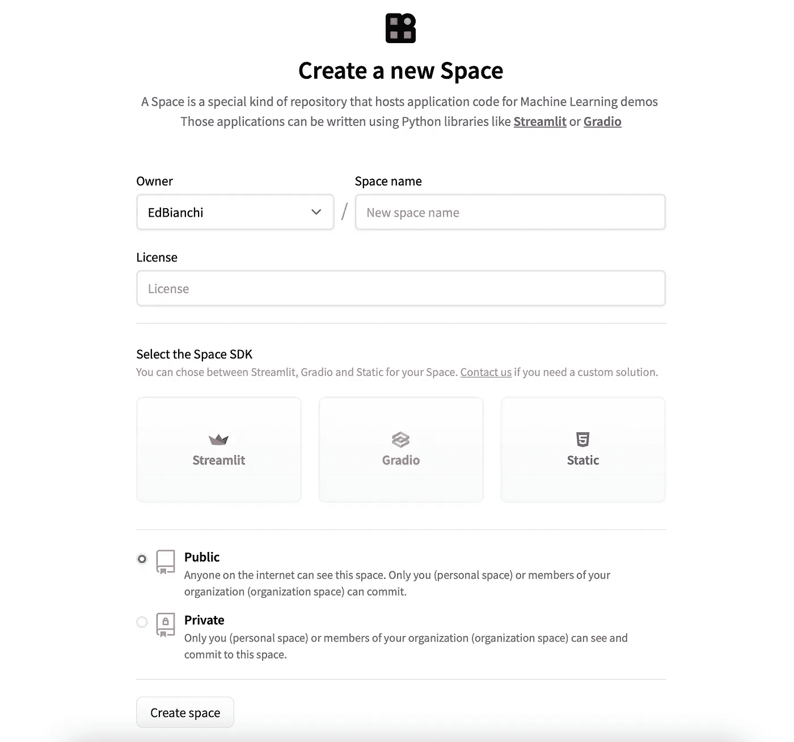

# 如何立即用 8 个简单的步骤构建一个有效的 Web 应用程序

> 原文：<https://levelup.gitconnected.com/how-to-build-an-effective-web-app-in-8-simple-steps-right-now-1d4a370edbbf>

## 不，你不需要成为全栈开发者


照片由 [Unsplash](https://unsplash.com?utm_source=medium&utm_medium=referral) 上的 [Fotis Fotopoulos](https://unsplash.com/@ffstop?utm_source=medium&utm_medium=referral) 拍摄

**如果你不是全栈开发人员，创建一个 web 应用程序一点也不简单****。幸运的是，**有一些** **工具可以在很短的时间内创建(简单的)网络应用**。本文结束后，**你将能够创建自己的应用程序**。**

**不，你不需要成为 JS、HTML 和 CSS 的专家**

## **大纲:**

1.  *****什么是细流？*****
2.  *****为什么要用 Streamlit？*****
3.  *****安装*****
4.  *****主要部件概述&布局*****
5.  *****部分高级功能概述*****
6.  *****如何用 8 个简单步骤构建 web app*****
7.  *****主题化&定制*****
8.  *****如何部署你的 app？*****
9.  *****结论*****

## **1.什么是 Streamlit？**

**[Streamlit](https://streamlit.io) 是一个**开源 Python 框架**，你可以用它来开发**简单而有效的 web 应用**。**

**Streamlit **提供了一组** [**组件**](https://docs.streamlit.io/library/api-reference) **，可以放置在应用**的 **页面上。这些组件的范围从**标题到用户输入、数据帧和图表**。****

## **2.为什么使用 Streamlit？**

**原因很简单:用 **Streamlit 创建一个 app 很容易**而且你**不需要任何前端经验**。你只需要**了解 Python** ，一旦你进入其中，很容易**创建甚至更复杂的应用**。**

> **基本上，**你用普通 Python 编写你的应用的后端**，然后你**添加特定于 Streamlit 的函数来创建前端**。**

**这些函数在应用程序页面上呈现元素(标题、文本、图表、结果等)。最后，通过一个简单的命令，**我们可以在我们的浏览器**中测试应用程序。**

***我们开始吧:)***

## **3.装置**

**要使用 Streamlit，您首先需要从终端**安装它**:**

```
pip install streamlit
```

**然后，**测试安装**,用:**

```
streamlit hello
```

**请注意，您可以在现有的**虚拟环境**中安装 Streamlit，或者创建一个新的环境。另请注意，在 MacOS 上，您需要安装 Xcode 命令行工具,包括:**

```
xcode-select --install
```

**如有问题，请参考[官方文件](https://docs.streamlit.io/library/get-started/installation)。**

****

**罗宾·格劳泽在 [Unsplash](https://unsplash.com?utm_source=medium&utm_medium=referral) 上拍摄的照片**

## ****4。主要部件概述&布局****

**要使用特定于 Stremlit 的函数和组件，您需要在您的`app.py` Python 文件中使用`import streamlit as st`并使用`st.<function name>`调用函数，例如，`st.title("My Title")`。**

**这是一些可用组件的列表**:****

*   *******标题—*** `st.title("My Title")`****
*   *******副标题—*** `st.subheader("My Subheader")`****
*   *******代码块—*** `st.code("a = 123")`****
*   *******数据框和表格—*** `st.dataframe(my_data_frame)` ***或*** `st.table(my_data_frame)`****
*   *******JSON 文件—*** `st.json(my_json)`****
*   *******图表—*** `st.line_chart(my_data_frame)` ***或*** `st.pyplot(my_mpl_figure)`****
*   *******按钮—*** `clicked = st.button("Click")`****
*   *******复选框—*** `selected = st.checkbox("I agree")`****
*   *******单选—*** `choice = st.radio("Choose", ["one"], ["two"])`****
*   *******文本输入—*** `st.text_input("First Name:")`****
*   *******数字输入—*** `num = st.number_input("Pick a number")`****

****除了上述元素，还有其他**组件允许管理应用程序的布局**。****

****例如:****

*   *******侧边栏—*** 是用来创建侧边栏****

****侧边栏用法示例****

*   *******列—*** 是用于创建并排列****

****列用法示例****

*   *******标签—*** 是用来创建分隔成标签的容器****

****制表符用法示例****

*   *******容器—*** 是用来创建多元素容器****

****容器使用示例****

****这些组件**可以根据您的喜好组合在一起**。****

## ******5。一些高级功能概述******

****Streamlit 还提供关于**性能和有状态应用**的**高级功能**。尤其值得一提的是:****

*   *******缓存*******
*   *******会话状态*******

******缓存**用来 [**记忆**](https://en.wikipedia.org/wiki/Memoization) **功能执行**。该功能允许 Streamlit 仅在和**将结果存储在缓存**中**执行一次功能。对于需要长时间计算的函数**(例如，导入模型)来说，这是理想的**。******

****注意 **Streamlit 将重新计算一个被选中的函数，如果**:****

1.  ****函数的名称被更改****
2.  ****该函数的代码被更改****
3.  ****功能输入参数被改变****

****您可以通过*用`@st.cache()`符号标记*一个函数来告诉 Streamlit 使用缓存。这是一个简单的例子:****

****Streamlit 中的缓存****

****更多信息请参考[缓存文档](https://docs.streamlit.io/library/api-reference/performance/st.cache)。****

******会话状态**用于**存储应用程序不同运行**之间的变量。我们正在**向我们的应用程序**添加一个*状态*。例如，此功能可用于实现历史功能:****

****使用 Streamlit 中的会话状态作为历史记录****

****更多信息请参考[会话状态文档](https://docs.streamlit.io/library/api-reference/session-state)。****

********

****Randy Fath 在 [Unsplash](https://unsplash.com?utm_source=medium&utm_medium=referral) 上拍摄的照片****

## ****6.如何用 8 个简单的步骤构建一个 web 应用程序****

****在概述了 Streamlit 提供的可能性之后，是时候**创建您的第一个应用程序了**。特别是，我喜欢用 8 个步骤来总结整个过程:****

1.  *******用你喜欢的编辑器*** 创建一个新的 Python 文件****
2.  *******导入细流库(以及最终其他人需要的库)*******
3.  *******想想 app 的设计和组件*******
4.  *******考虑功能和性能(缓存、历史记录等)*******
5.  *******为 app*** 编写 Python 代码****
6.  *******为你的应用程序创建自定义主题(可选)*******
7.  *******在浏览器中测试结果*******
8.  *******部署&享受！*******

****对于本教程，我将开发一个简单的**应用程序，允许用户创建一个包含 4 个元素的电影观看列表**。首先是****的代码，然后是**的解释。请随意使用它作为模板。******

****一个简单的 Streamlit 应用的代码。****

****在这个例子中，我使用了不同的组件。正如你所看到的，**所有的文本元素**都可以通过使用`st.write("text")`结合**标记符号**来获得不同的大小(标题、子标题……)。****

****`st.markdown("""---""")`用于插入**行分隔符**。可用于**分离不同的应用部分**。****

****我使用**会话状态功能来创建电影的历史**(观看列表)。*状态*是一个名为`history`、**的 Python 列表，从**开始初始化。当用户选择电影时，**使用通用 Python 列表方法**更新列表。****

******通过`selectbox`选择电影**。这个组件也允许用户写电影标题的一部分来加速搜索。****

****一旦用户选择了一部电影，我就使用一个 **API 来获取海报**。然后使用`columns`布局将结果**并排**呈现。****

******最后一节**显示了`dataframe`功能，允许**以表格形式显示数据集。******

****最后，你可以在终端中运行`streamlit run myApp.py`来**在浏览器**中测试你的 app。结果应该是这样的:****

********

****简单的 Streamlit 应用。作者图片****

****您可以使用 Streamlit 进行**可视化结果或创建您的机器学习项目的演示**。您可以直接在`app.py`文件中训练您的模型，但是更好的方法是**导入一个现有的模型并利用缓存功能**。****

****如果您想**了解更多关于保存(序列化)和重用**您的训练模型的信息，**请参考本文**:****

****[](/serialize-and-save-ml-models-for-future-use-in-python-c0953e4193f9) [## 序列化并保存 ML 模型，以备将来在 Python 中使用

### 增加毅力和避免长时间再培训的实用指南

levelup.gitconnected.com](/serialize-and-save-ml-models-for-future-use-in-python-c0953e4193f9) 

现在，让我们看看**如何进一步定制你的应用**和自定义主题**部署最终结果**。**** 

## ****7.主题化和定制****

****Streamlit 让你有可能**个性化你应用程序的某些方面**。您可以通过创建一个`config.toml`配置文件来做到这一点。****

****首先，导航到你的 app 文件夹，新建一个文件夹，命名为`.streamlit`。此操作可以从终端完成:****

```
**cd my_app
mkdir .streamlit/**
```

****然后在`.streamlit`文件夹中创建一个`config.toml`文件。将主题配置放入该文件，如下例所示:****

****个性化应用程序的 config.toml 文件示例****

****复制这个模板，并改变你喜欢的颜色。记住**你只能为每个应用程序**创建一个自定义主题。让我们看看这个主题的应用程序是什么样子的:****

********

****主题定制。作者图片****

****如果你对这种风格满意，你可以部署你的应用。祝您身体健康****

## ****8.如何部署你的 app？****

****你可以用几种方式部署你的应用程序**。(1)您可以按照[部署官方文档](https://docs.streamlit.io/streamlit-cloud/get-started/deploy-an-app)，将您的 app 上传到 GitHub，然后连接到 Streamlit 工作区。你必须为此创建一个简化帐户。******

******(2)我更喜欢的另一种方式是使用[抱脸](https://huggingface.co)。******

******拥抱脸是一个面向人工智能的社区。在他们的平台上，你可以创建*空间*和**分享你的网络应用**。你首先需要**创建一个账户**。然后**你可以创建一个新的*空间*来托管你的应用**。我们开始吧。******

****从您的个人资料图标中，选择*“创建共享空间”*。您将看到以下屏幕:****

********

****创造一个拥抱脸的空间。作者图片****

******填写所需信息**，选择*“streamlit”*，点击*“创建空间”*。****

****现在，您只需点击*“文件和版本”*、*“添加文件”*和*“上传文件”，即可**上传您的** `app.py` **文件**。*****

********

****上传应用文件。作者图片****

****编译后，您的应用程序将出现在*“应用程序”*选项卡下。**一个横幅指示应用程序**的一些属性，并让您可以**查看日志**(以防故障排除)。****

********

****信息和公用事业横幅。作者图片****

****你的应用程序**正在运行，可以从任何地方访问**。****

## ****9.结论****

****在这篇文章中，我试图**介绍 Streamlit 的特性**并指导你**创建你的第一个应用**。****

****这个框架主要用于**展示机器学习模型**。知道如何使用它可以让你**创建演示**，你可以用它来展示你的下一个项目。****

****高级功能**兼顾性能和用户体验**。在选择**综合框架**时，这些方面一定不能低估。****

*****感谢阅读，祝 web 应用开发愉快:*****

## ****参考资料:****

****Streamlit 文档—[https://docs . streamlit . io](https://docs.streamlit.io)****

****拥抱脸文档—[https://huggingface.co/docs](https://huggingface.co/docs)****

****记忆化——https://en.wikipedia.org/wiki/Memoization****