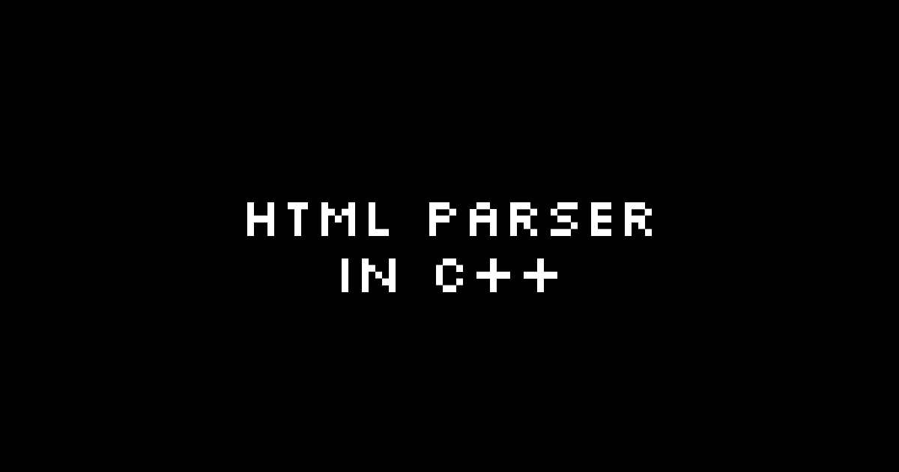

# 如何用 C++构建一个 HTML 解析器

> 原文：<https://levelup.gitconnected.com/how-to-build-an-html-parser-in-c-ec618bfd176c>



*最初发布于*[*https://devtails . XYZ*](https://devtails.xyz/@adam/how-to-build-an-html-parser-in-c++)*。*

## 介绍

我已经开始[构建一个 web 浏览器](https://devtails.xyz/@adam/building-a-web-browser-with-sdl-in-c++)，并且最初用一个相对粗糙的正则表达式设置它来“解析”HTML。这不考虑嵌套结构，并且很可能有各种各样的其他问题。

谷歌搜索“用 c++构建 html 解析器”的结果只出现了一个教程，它一次只解释一行 html。随着我对这个项目的深入，我可能会对我所拥有的进行一些修改，但目前下面的代码已经满足了我的基本需求。

## 最终产品

我发现一次看到所有东西有助于对所有东西是如何组合在一起的有一个大致的了解。接下来的部分将对其进行更深入的分析。

```
#include <string>
#include <vector>
#include <cassert>

using namespace std;

class HTMLElement
{
public:
  string tagName;
  vector<struct HTMLElement *> children;
  struct HTMLElement *parentElement;
  string textContent;
};

enum State
{
  STATE_INIT,
  STATE_START_TAG,
  STATE_READING_TAG,
  STATE_READING_ATTRIBUTES,
  STATE_END_TAG,
  STATE_BEGIN_CLOSING_TAG
};

bool isWhitespace(char c)
{
  return c == ' ';
}

HTMLElement *HTMLParser(string input)
{
  HTMLElement *root = new HTMLElement();

  State state = STATE_INIT;
  HTMLElement *lastParent = root;
  string tagName = "";

  for (auto c : input) {
    if (c == '<') {
      state = STATE_START_TAG;
    } else if (state == STATE_START_TAG) {
      if (c == '/') {
        state = STATE_BEGIN_CLOSING_TAG;
      } else if (!isWhitespace(c)) {
        state = STATE_READING_TAG;
        tagName = c;
      }
    } else if (state == STATE_READING_TAG) {
      if (isWhitespace(c)) {
        state = STATE_READING_ATTRIBUTES;
      } else if(c == '>') {
        state = STATE_END_TAG;

        auto parent = new HTMLElement(); 
        parent->tagName = tagName;
        parent->parentElement = lastParent;

        lastParent->children.push_back(parent);
        lastParent = parent;
      } else {
        tagName += c;
      }
    } else if(state == STATE_READING_ATTRIBUTES) {
      if (c == '>') {
        state = STATE_END_TAG;

        auto parent = new HTMLElement(); 
        parent->tagName = tagName;
        parent->parentElement = lastParent;

        lastParent->children.push_back(parent);
        lastParent = parent;
      }
    } else if (state == STATE_END_TAG) {
      lastParent->textContent += c;
    } else if (state == STATE_BEGIN_CLOSING_TAG) {
      if (c == '>') {
        lastParent = lastParent->parentElement;
      }
    }
  }

  return root;
}

int main()
{
  HTMLElement *el = HTMLParser("<h1>Hello World!</h1>");

  assert(el->children.size() == 1);

  return 0;
}
```

## html 元素

我遵循了 [DOM 元素](https://www.w3schools.com/jsref/dom_obj_all.asp)的属性命名约定。如果您习惯于在 JavaScript 中使用 DOM，这应该会让您感觉很熟悉。这个过程还帮助我理解了这些属性是如何作用于 DOM 元素的。

```
class HTMLElement
{
public:
  string tagName;
  vector<struct HTMLElement *> children;
  struct HTMLElement *parentElement;
  string textContent;
};
```

## 状态机

就像我开始说的，我真的没有找到一个好的资源来工作，所以结束了我自己绘制的课程。对我来说，状态机是最简单的可视化和工作方式。我想一次一个字符地遍历 html 文本。状态机允许代码跟踪它在解析过程中的位置，并且(至少对我来说)更容易理解发生了什么。

```
enum State
{
  STATE_INIT,
  STATE_START_TAG,
  STATE_READING_TAG,
  STATE_READING_ATTRIBUTES,
  STATE_END_TAG,
  STATE_BEGIN_CLOSING_TAG
};
```

## 状态初始化

```
// Detects when a new html tag has begun (whenever "<" is detected we enter this state)
if (c == '<') {
  state = STATE_START_TAG;
}
```

## 状态 _ 开始 _ 标签

```
if (state == STATE_START_TAG) {
  // Ignore any whitespace characters until we hit a real character
  if (!isWhitespace(c)) {
    state = STATE_READING_TAG;
    tagName = c;
  }
}
```

## 状态 _ 阅读 _ 标签

```
// Once we have detected the start of a tag, we proceed to read any characters that follow and this forms the `tagName` property
if (state == STATE_READING_TAG) {
  // Once we hit a whitespace character we transition to STATE_READING_ATTRIBUTES
  if (isWhitespace(c)) {
    state = STATE_READING_ATTRIBUTES;
  }
  // If we hit a > this indicates that we're done reading the start of the tag, so we create a new HTMLElement with the tagName we read 
  else if(c == '>') {
    state = STATE_END_TAG;

    auto parent = new HTMLElement(); 
    parent->tagName = tagName;
    parent->parentElement = lastParent;

    lastParent->children.push_back(parent);
    lastParent = parent;
  } else {
    tagName += c;
  }
}
```

## 状态 _ 读数 _ 属性

```
// [TODO] I've avoided actually reading attributes for now
if(state == STATE_READING_ATTRIBUTES) {
  // For now, it is good enough to move to STATE_END_TAG once a ">" is detected
  if (c == '>') {
    state = STATE_END_TAG;

    auto parent = new HTMLElement(); 
    parent->tagName = tagName;
    parent->parentElement = lastParent;

    lastParent->children.push_back(parent);
    lastParent = parent;
  }
}
```

## 状态结束标签

```
// This state will be exited when the next "<" is detected and we return to STATE_START_TAG
if (state == STATE_END_TAG) {
  // Once in this state, we extract any characters into the `textContent` property
  lastParent->textContent += c;
}
```

## 状态 _ 开始 _ 标签

```
// At this point, the html is either closing out a tag or starting a new nested element
if (state == STATE_START_TAG) {
  // If it's closing one, the "/" character moves us to STATE_BEGIN_CLOSING_TAG
  if (c == '/') {
    state = STATE_BEGIN_CLOSING_TAG;
  } 
  // If it's not a closing tag, the process begins and we start reading a new html element with the previous node as the `parentElement`
  else if (!isWhitespace(c)) {
    state = STATE_READING_TAG;
    tagName = c;
  }
}
```

## 状态 _ 开始 _ 结束 _ 标记

```
if (state == STATE_BEGIN_CLOSING_TAG) {
  // When a tag has been closed, we set the `lastParent` to its parent
  if (c == '>') {
    // This ensures each sibling gets the correct `parentElement` attached
    lastParent = lastParent->parentElement;
  }
}
```

## 结论

可能有几种情况下这不起作用。然而，使用这个起点，当问题出现时，确定需要添加什么来解决问题应该是相当容易的。

我已经用这个替换了浏览器中的 regex 版本，到目前为止，它看起来像预期的那样工作。

# 分级编码

感谢您成为我们社区的一员！在你离开之前:

*   👏为故事鼓掌，跟着作者走👉
*   📰查看[升级编码出版物](https://levelup.gitconnected.com/?utm_source=pub&utm_medium=post)中的更多内容
*   🔔关注我们:[Twitter](https://twitter.com/gitconnected)|[LinkedIn](https://www.linkedin.com/company/gitconnected)|[时事通讯](https://newsletter.levelup.dev)

🚀👉 [**加入升级达人集体，找到一份惊艳的工作**](https://jobs.levelup.dev/talent/welcome?referral=true)