# 如何用 React 和 Stream 搭建一个 Ionic 聊天 App

> 原文：<https://levelup.gitconnected.com/how-to-build-an-ionic-chat-app-with-react-and-stream-739b67611280>

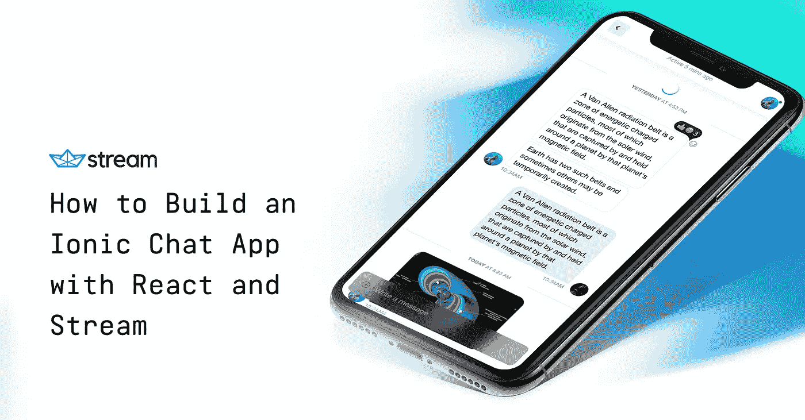

如何用 React 和 Stream 搭建一个 Ionic 聊天 App

与 Ionic 相比， [React Native](https://facebook.github.io/react-native/) 和 [Flutter](https://flutter.dev/) 等平台之间存在巨大差异。Ionic 认为，驱动当今网络的开放技术是未来的发展方向，应该用于构建移动应用。因为这种方法，Ionic 是唯一一个流行的平台，允许你在网络和移动上重用相同的代码库。

另一方面，Flutter 和 React Native 取代了 web 的技术堆栈。Flutter 通过其[渲染引擎](https://github.com/flutter/flutter/wiki/The-Engine-architecture#architecture-overview)来实现这一点，并将原生钩子反应到 [iOS 和 Android 的原生渲染引擎](https://facebook.github.io/react-native/)中。

Ionic 的好处是你可以使用开放的基于网络的技术，并且可以重用一个代码库。Flutter & React Native 不允许你复用那么多，但是他们的性能更接近于原生应用。

我在推特上关注了爱奥尼亚的创始人马克斯·林奇，并想尝试一下。事实证明，起床跑步是非常容易的。本教程向你展示了如何用 React(你在网络上使用的普通老版本)和 [Stream 的聊天 API](https://getstream.io/chat/) 构建一个聊天应用。

> 如果你想跳过前面的内容，可以在[quite](https://appetize.io/app/afcadgqt1p2q26rqdecvb10w68?device=nexus5&scale=100&orientation=portrait&osVersion=9.0&deviceColor=white)上看到一个演示，这样你就可以自己评估性能了(注意，ceilite 确实会让速度慢一些)。你也可以[下载安卓版的签名 APK](https://cl.ly/549207e68774)以获得更好的体验。[这里是 React / Ionic GitHub repo](https://github.com/GetStream/ionic-chat-tutorial-react) 这里是 API GitHub repo 。

在本教程中，我将带您了解如何构建一个由 React 和 Stream Chat 支持的轻量级 Ionic 聊天应用程序。

> 对此有一些要求，主要是 Node.js 的版本(我更喜欢使用 nvm 进行节点版本管理)，如果你在 macOS 上，则是 iOS 的 [XCode](https://developer.apple.com/xcode/) ，或者如果你在 macOS 或 Windows 上，并且想要针对 Android 进行构建，则是 [Android Studio](https://developer.android.com/studio) ，以及用于依赖管理的 yarn。

我们来编码吧！🤓

# 1.安装离子

要开始使用 Ionic，请使用 npm 下载 Ionic CLI:

**$纱全球添加离子**

安装完成后，使用新的 CLI 从命令行登录 Ionic:

**$ ionic 登录**

现在，这就是我们要做的一切。我们将使用 Create React App(下一步)继续安装。

# 2.安装创建 React 应用程序和依赖项

与我们安装 Ionic 的方式类似，让我们继续使用 npm 在全球范围内安装 Create React App (CRA ):

**$ yarn global add create-react-app**

接下来，创建一个新目录。我将在我的 **~/Code** 目录中工作，但是您可以自由使用您选择的目录:

**$ cd ~/Code**

现在，使用 CRA 安装 React(ionic-chat 是将要生成的目录的名称——这也是可选的，因为您可以随意命名它):

**$ npx 创建-反应-应用离子-聊天**

进入 ionic-chat 目录，我们将开始安装必要的依赖项。

**$ yarn 添加流-聊天流-聊天-react axios react-路由器 react-路由器-dom @ionic/react**

安装完依赖项后，让我们继续进行下一步设置。

# 3.用 Heroku 设置 API

这个 API 虽然很小，但在聊天中起着重要的作用。该 API 接受来自登录屏幕的用户凭证，并生成一个在其中使用的 JWT。它还将用户添加到频道中。

为了加速 API，我加入了一个简单的[一键式 Heroku 按钮](https://heroku.com/deploy?template=https://github.com/GetStream/ionic-chat-tutorial-react-api)。这将在 Heroku 上生成一个新的应用程序，然后创建一个流聊天试用版供您使用。点击 Heroku 按钮后，系统会提示您添加一个应用程序名，要唯一。然后点击“部署”开始 Heroku 部署过程。

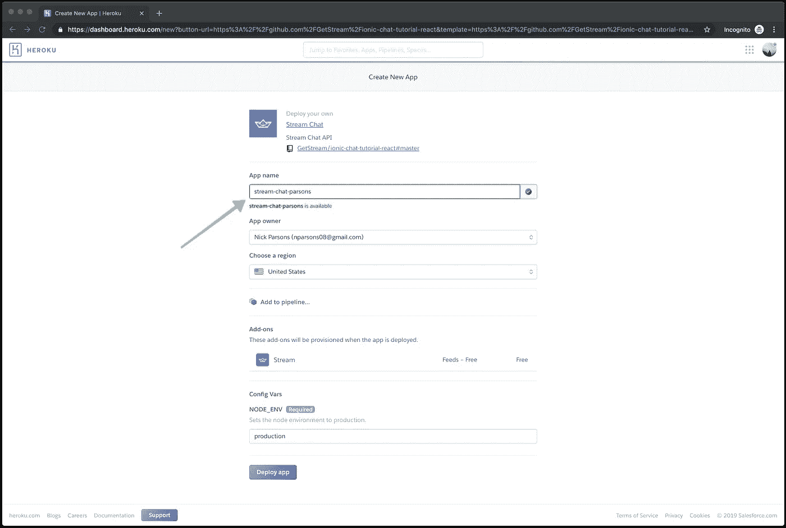

Heroku 仪表板

安装完成后，从 Heroku 获取环境变量(它们是由 Heroku 创建时生成的)并放到您的**中。env** 文件。环境变量可以在 Heroku 仪表板的“设置”部分找到，如 Heroku 的这篇博文中的[所示。注意，只有一个环境变量叫做“STREAM_URL”。密钥和机密由“:”分隔，第一个是密钥，第二个是机密。](https://devcenter.heroku.com/articles/config-vars)

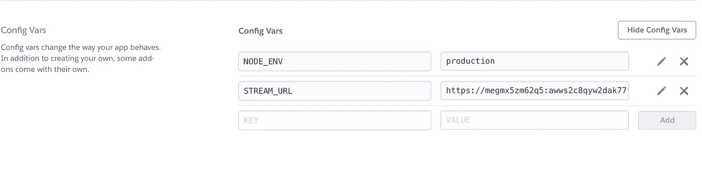

Heroku —环境变量

> 或者，如果你想跳过 Heroku，你可以[克隆这个 GitHub repo](https://github.com/GetStream/ionic-chat-tutorial-react-api) 并使用 yarn start 命令运行 API 确保在启动之前运行 yarn install，并确保填写你的。env 带有在 Stream dashboard 上找到的凭证(您将需要启用免费聊天试用)。

# 4.安装 iOS 模拟器

如果你已经安装了 XCode，那你就基本上一切就绪了。如果没有，你想下载 XCode，你可以在这里下载[。默认情况下，XCode 与 iOS 模拟器捆绑在一起。](https://developer.apple.com/xcode/)

如果你不想安装 XCode，你可以选择安装这个 npm 包，它会为你安装一个独立的 iOS 模拟器。

**$ yarn global 添加 ios-sim**

> 如何使用它的完整说明在这里:[https://www.npmjs.com/package/ios-sim](https://www.npmjs.com/package/ios-sim)

# 5.安装 Android Studio(可选)

在装有 macOS 的 iOS 上运行似乎是测试你的代码最快的方法；然而，如果你使用的是 Windows 或者只是想使用 Android，我会在下面介绍。

前往 [Android Studio 下载页面](https://developer.android.com/studio/)并选择您的下载选项。Android Studio 适用于 iOS、Windows 和 macOS。这是一个很大的文件，所以下载可能需要很长时间。

下载完成后，按照安装说明操作，打开 Android Studio。我们将下载必要的 SDK 并创建一个 Android 虚拟设备(AVD)。

**打开 Android Studio，点击“配置”，然后点击“SDK 管理器”。**

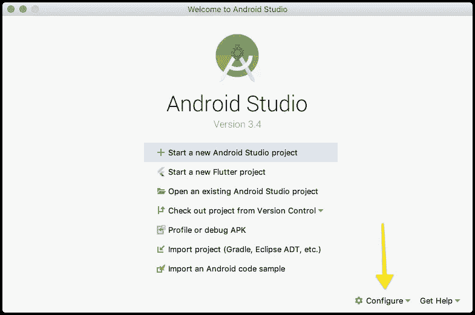

Android Studio —配置

**在 SDK 管理器打开的情况下，选择“Android 9.0 (Pie)”，然后单击“应用”。**

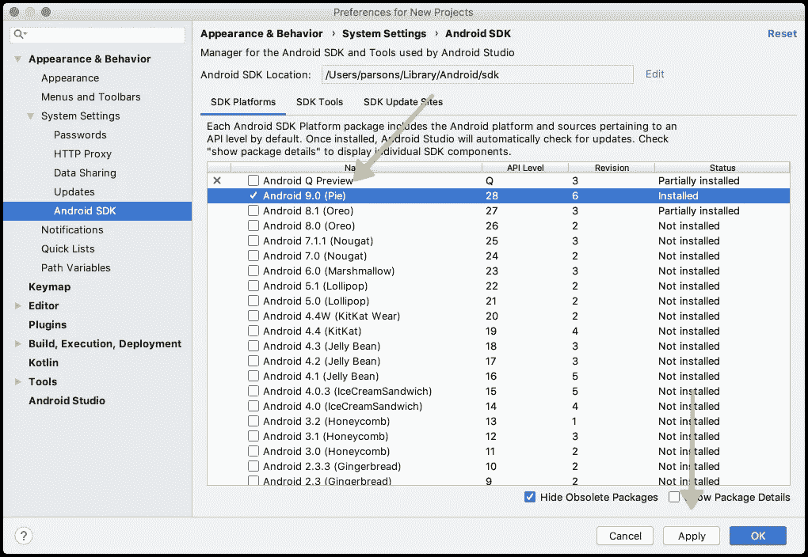

Android Studio — Android 9.0 (Pie)

您的下载将开始。完成后，返回主屏幕，点击“配置”按钮，然后点击“AVD 管理器”。在 AVD 管理器屏幕上，您需要单击“+创建虚拟设备”。

**选择“Pixel 3 XL”设备，然后点击“下一步”。为您的 API 级别选择“饼图(28)”，然后单击“下一步”按钮。**

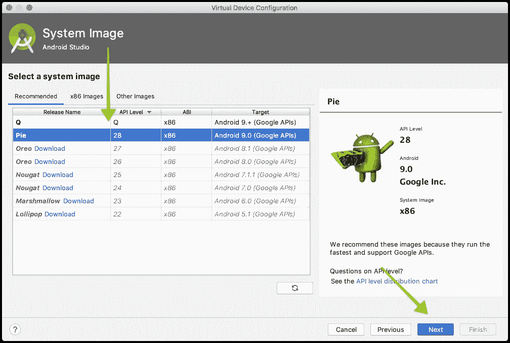

Android Studio —操作系统下载

**最后，点击“完成”,你的 AVD 将被配置。一旦完成，您可以安全地退出 AVD 屏幕，您将在 AVD 管理器中看到您新创建的 AVD。**

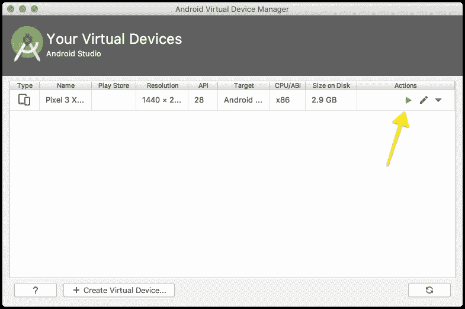

AVD 经理

如果您点击绿色的播放按钮，您的 AVD 将会启动！

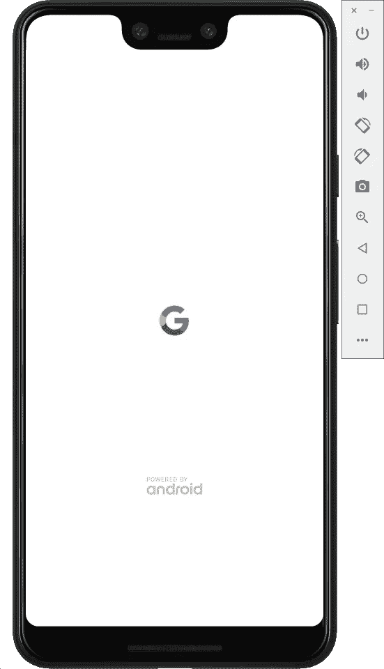

Android Pie 模拟器

恭喜你！您已经成功地在 Android Studio 中生成了一个 AVD！我们现在还不打算使用它，但是在本教程后面的测试中，AVD 将会派上用场。

# 6.创建文件

我们已经设置好了一切，现在是时候添加必要的文件来使我们的代码工作了！我们需要创建一些文件，所以请密切注意:

1.  在你的根目录下，创建 **ionic.config.json** ，内容如下:

ionic.config.json

2.在 **public/index.html** 中，将当前 html 替换为以下内容:

public/index.html

3.进入 **src/** 目录，我们将创建并修改几个文件:

**在 app.css 中，将所有现有的 css 换成这个:**

App.css

**在 App.js 中，替换掉这个 JavaScript 的现有代码(这个逻辑将负责文件之间的路由):**

App.js

**创建一个名为 AuthedRoute.js 的文件，并将以下内容放入该文件:**

AuthedRoute.js

**创建一个名为 Chat.js 的文件，并使用下面的代码(这是支持 Chat 的所有逻辑):**

聊天. js

**接下来，创建一个名为 Login.js 的文件，并使用以下代码(这会将 auth 添加到您的应用程序中):**

Login.js

> 请记住在您的。env 与您的 Heroku 端点。

**现在，创建一个名为 un delegate route . js 的文件，以容纳未经身份验证就进入的用户:**

un delegate route . js

**创建一个名为 withSession.js 的文件:**

withSession.js

4.在 package.json 文件中安装 Ionic 构建脚本:

package.json

Capacitor 是 Ionic 提供的开源框架，可以帮助你构建渐进式的本地网络应用、移动应用和桌面应用。它针对 Ionic 应用进行了优化；然而，它几乎可以用于任何框架。

我们将使用 Capacitor 来提升和准备我们的 iOS 和 Android 版本。不过首先，让我们安装电容器！

**$离子电容加 ios**

然后，从根目录使用以下命令启动 React 应用程序:

**$纱开始**

在 iOS 上打开:

**$离子电容开 ios**

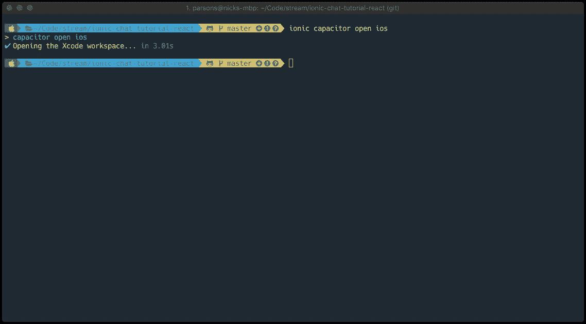

电容— iOS

或者，在 Android 上打开:

**$离子电容开安卓**

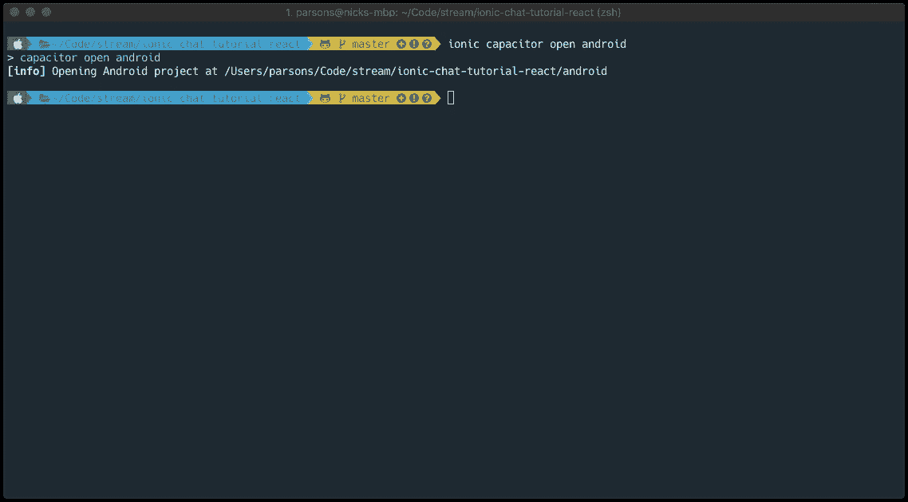

电容器— Android

因为我运行的是 macOS，所以我将使用 iOS 模拟器。运行**离子电容打开 ios** 后，XCode 将启动。您需要等待大约一分钟，让它对项目进行索引，然后您可以按下 run 按钮。

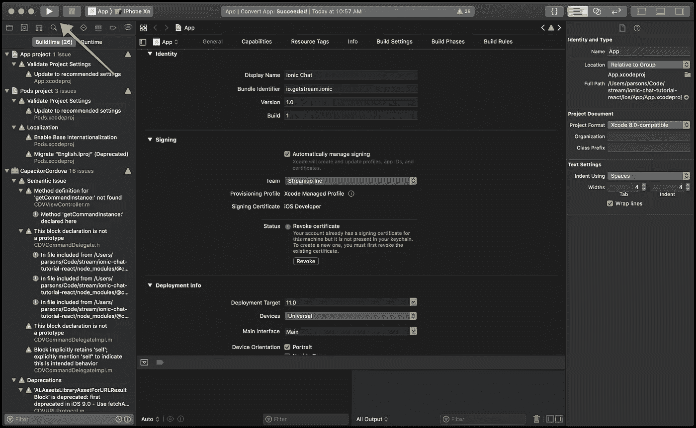

XCode

您的 iOS 模拟器应该在安装了应用程序的情况下启动，您应该会看到类似于以下内容的登录屏幕:

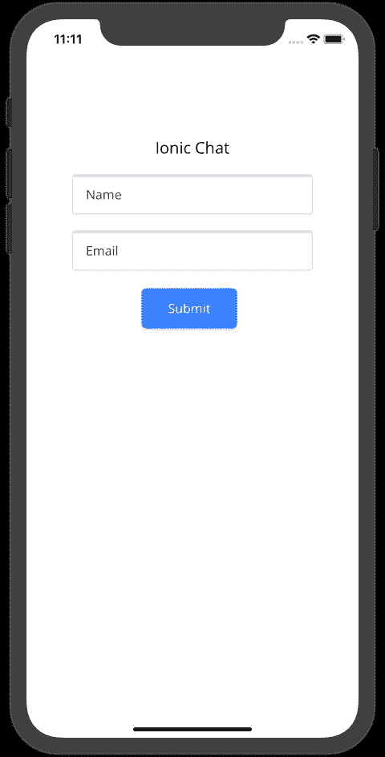

iOS —登录

继续使用您的姓名和电子邮件地址登录。别担心，您的信息仅存储在本地存储中，不会保存到任何第三方平台。加载聊天窗口后，您就可以开始聊天了！

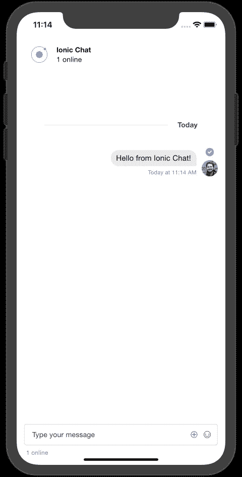

iOS —聊天

# 下一步是什么？

我鼓励你继续开发你已经创建的代码库。如果你遇到了任何问题，你可以从 GitHub 中克隆回购协议来重新开始。

在将应用程序部署到 iOS 或 Android 等独立设备方面，Ionic 有一套很好的教程来指导如何做。iOS 和 Android 出版物的教程[都可以在 Ionic 文档](https://ionicframework.com/docs/publishing/app-store)中找到。

想了解更多[流聊](https://getstream.io/chat/)？看看我们的交互式 [API 之旅](https://getstream.io/chat/get_started/)，它将带您从零开始使用 Stream 创建聊天的各个步骤。我们也有令人惊奇的 API 文档和漂亮的 UI 套件，允许你建立任何类型的聊天。

编码快乐！✌