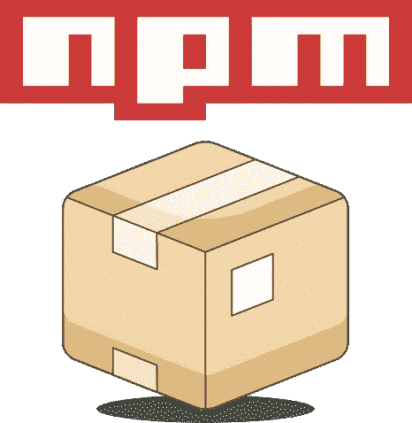
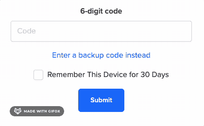
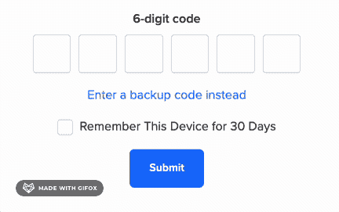

# 如何构建 NPM 包

> 原文：<https://levelup.gitconnected.com/how-to-build-an-npm-package-4158347e7fbf>

## 从创建我的第一个 Javascript 包中学到的经验



作为开发人员，我们总是试图找出如何使我们的解决方案可扩展和可重用。我们讨厌一遍又一遍地重写相同的代码。在最高产量和自动化之间游走需要做大量的工作。有时，很明显，解决方案可以从当前项目之外抽象出来，直接从第三方引入。我想分享一个最近的解决方案，它非常合理地创建了一个 NPM 包，并直接在我们的应用程序中使用该解决方案。到目前为止，我从未创建过 NPM 包，所以我希望在这篇文章中分享我的经验会有所帮助。

## 为什么要构建 NPM 包？

我们可以直接在我们构建的应用程序中编写解决方案，这就足够了。但是伟大的解决方案减少了重复，并且遵循了实现[干](https://www.digitalocean.com/community/tutorials/what-is-dry-development)代码所必需的代码模式。

正如“[务实的程序员](https://pragprog.com/titles/tpp20/the-pragmatic-programmer-20th-anniversary-edition/)所说:

> 每一项知识都必须在系统中有一个单一的、明确的、权威的表示。

有时，我们可以在应用程序之外创建一个明确的解决方案，并将模块放入应用程序中以达到目的。这对开发人员来说是一个很好的练习，也是对编程社区的回馈，因为您的解决方案可能会解决其他人的问题。编写一个可以在任何地方使用的解决方案迫使开发人员明确地解决问题；仅此一点对我来说就是一个卖点。我不是说每个解决方案都应该变成一个包，但是我们应该在需要的时候配备工具和技术。

在本教程中，我不会涉及所有的细节，但是我认为对创建和使用你的第一个 NPM 包的必要步骤做一个高层次的概述是有帮助的。

# 如何建立一个 NPM 包？

这些是我创建第一个 NPM 包的步骤。

# 第一步:向 NPM 注册

这一步是发布准备好的包所必需的。我可以带你看一下这一部分，但是 NPM 已经有了很好的心流文档:

[](https://docs.npmjs.com/getting-started) [## 开始| npm 文档

### 国家预防机制登记册、网站和命令行界面的文件

docs.npmjs.com](https://docs.npmjs.com/getting-started) 

一旦完成，我们就可以进入有趣的部分了。

# 第二步:有一个要解决的问题或想法

我工作的应用程序有一个双因素登录流程。登录流程的最后一步是为用户提供一次性密码输入。第一次迭代使用了一个尽可能美观的数字输入。尽管如此，我们的设计者想要一个输入，将每个数字的输入分成六个独立的输入。下面是一些图片，让它更简单明了:

## 原始输入



## 由我的 NPM 包创建的输入



从头开始构建这个输入很有挑战性，但是当我开始这个过程时，我很快意识到这个解决方案作为一个可重用的模块是有意义的，它应该作为一个 NPM 包存在。这种输入需要相当多的 Javascript 来处理边缘情况，并确保用户在输入时有流畅的体验。下面是我如何创建我的第一个 NPM 包 [Honeycrisp](https://github.com/cameronbass/honeycrisp) 。

***注:*** *你可以在这里演示我创建的包->*[*Codepen*](https://codepen.io/cambass23/pen/wvxwJKY)

# 步骤 3:创建“package.json”文件

创建`package.json`文件最简单的方法是从项目根目录运行`npm init`命令:

```
> mkdir path-to-project/honeycrisp
> cd path-to-project/honeycrisp
> npm init 
```

`npm init`将引导您完成定义 package.json 文件的选项。以下是我运行 npm init 后的结果:

```
{
  "name": "honeycrisp",
  "version": "1.0.0",
  "description": "A crispy input",
  "main": "app.js",
  "scripts": {
    "test": "test"
  },
  "author": "",
  "license": "ISC"
}
```

这里的兴趣点是`main`字段。正如 NPM 医生描述的那样:

> “main”字段是一个模块 ID，它是程序的主要入口点。也就是说，如果你的包被命名为`foo`，一个用户安装了它，然后执行`require("foo")`，那么你的主模块的导出对象将被返回。

上面的`package.json`文件是所需的 package.json 文件的最简单版本。还有相当多的字段可以用来定义您的项目。在这里查阅官方文件很有帮助—

## Package.json 文档:

[](https://docs.npmjs.com/cli/v7/configuring-npm/package-json) [## package.json | npm 文档

### 关于 package.json 文件中需要的内容，您只需要知道这个文档。它必须是实际的 JSON，而不仅仅是…

docs.npmjs.com](https://docs.npmjs.com/cli/v7/configuring-npm/package-json) 

# 步骤 4:编写入口点文件:

我用名字`app.js`作为我的主文件。为了本教程的简单，我将所有代码保存在一个文件中。理解这段代码的所有内容并不重要。我只是想分享这个演示的目的。

*这是创建上面演示的输入所需的所有代码。这个项目仍在积极更新，因为有大量的升级要做。最新版本可以随意咨询 GitHub 上的包:*[*GitHub 上的 honey crisp*](https://github.com/cameronbass/honeycrisp)

写完这个文件后，我在 package.json 文件中更新了我的版本，并测试了我的解决方案。

# 第五步:用 NPM 包测试你的包

`NPM Pack`是一个不用发布就能测试你的包的优秀工具。NPM 使用[语义版本化](https://semver.org/)，而不是每次你想测试一个变化就发布一个新版本到 NPM，你可以创建一个 TAR 文件，保存在本地，并针对你正在应用它的应用程序进行测试。

***如何使用***`***npm pack***`***—***

首先，将 package.json 文件更新到新版本。版本是任意的，但是你应该对流程有逻辑。我的现在是这样的:

```
{
  "name": "honeycrisp",
  "version": "1.0.1", // <- update version
  "description": "A crispy input",
  "main": "app.js",
  "scripts": {
    "test": "test"
  },
  "author": "",
  "license": "ISC"
}
```

其次，从项目的根目录下，运行 NPM 打包命令:

```
> npm pack

npm notice
npm notice 📦  honeycrisp@1.0.1
npm notice === Tarball Contents ===
npm notice 173B package.json
npm notice === Tarball Details ===
npm notice name:          honeycrisp
npm notice version:       1.0.1
npm notice filename:      test-1.0.1.tgz
npm notice package size:  204 B
npm notice unpacked size: 173 B
npm notice shasum:        2c069041cc1d121d0a0a0286b60fe86e80b5a
npm notice integrity:     sha512-X6RzbgcmgYeb/[...]gQoUMy2H3QyiA==
npm notice total files:   1
npm notice
test-1.0.0.tgz
```

第三，将文件复制到计算机的根目录:

```
cp honeycrisp-1.0.1.tgz
```

最后，从您正在使用的应用程序的根目录，安装软件包的本地版本:

```
> cd path/to/application
> npm install ~/honeycrisp-1.0.1.tgz
```

现在，您可以在预期的应用程序中测试您的更改。如果有些东西不能正常工作，对你的包进行修改，修改版本并再次运行`npm pack`。

以下是 NPM 包的一些附加文档:

[](https://docs.npmjs.com/cli/v7/commands/npm-pack) [## npm-pack | npm 文档

### 表示您不希望 npm 进行任何更改，并且它应该只报告它本来会做的事情。这可以…

docs.npmjs.com](https://docs.npmjs.com/cli/v7/commands/npm-pack) 

# 步骤 6:发布您的包

在您对您的包的实现感到满意之后。进行过程中最令人满意的一步，出版！

从项目运行的根目录开始:

```
> npm publish
```

该命令将创建一个 TAR 文件，NPM 会自动将它推送到一个公共注册中心。您的软件包现在可以被您和任何有权限访问 NPM 的人使用！

# 总结一下—

希望这可以作为构建您的第一个 NPM 包的一个有用的演练。NPM 做了一件很棒的工作，让你卸下了繁重的工作，让你专注于项目的技术细节。

## 完成软件包的第一个版本后的其他注意事项:

1.  在你的自述里做一段精彩的自述。解释如何使用这个包，以及为什么开发者应该使用你的包。
2.  我们的解决方案需要随着时间的推移而改变。定义贡献准则，以便社区可以帮助您改进实施。
3.  推广一下！

## 看看我的第一个包 Honeycrisp

这是我的 NPM 套餐的链接: [Honeycrisp](https://github.com/cameronbass/honeycrisp)

随着时间的推移，我计划做大量的更新。就目前的情况来看，它非常简单，所以用它作为开始项目的例子可能会很好。当然，我也喜欢反馈或贡献。