# 如何用 PHP 和 Composer 构建和发布漂亮的命令行应用程序

> 原文：<https://levelup.gitconnected.com/how-to-build-and-distribute-beautiful-command-line-applications-with-php-and-composer-50b6420245f2>

## PHP 不一定只能在 web 上使用——开始创建自己的 CLI 工具怎么样？

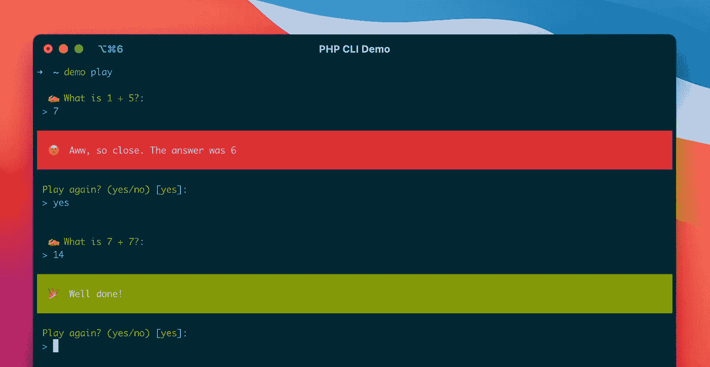

当您想到命令行应用程序时，不会立即想到 PHP。然而这种语言支持许多流行的工具，或者作为独立的程序，或者在项目中使用。

这里有几个例子:

*   [贴身男仆](https://github.com/laravel/valet)
*   [诗篇](https://github.com/vimeo/psalm)
*   [PHPStan](https://github.com/phpstan/phpstan)
*   [PHP 洞察](https://github.com/nunomaduro/phpinsights)
*   [PHP CS Fixer](https://github.com/FriendsOfPHP/PHP-CS-Fixer)
*   [PHP_CodeSniffer](https://github.com/squizlabs/PHP_CodeSniffer)
*   [校长](https://github.com/rectorphp/rector)
*   [外卖](https://github.com/tighten/takeout)

无论是通过其庞大的库和框架生态系统、其与主机交互的能力，还是其依赖性管理器的多功能性，PHP 提供了构建和发布强大 CLI 应用程序所需的一切。

本教程将带你完成创建一个在终端运行的简单游戏的过程，使用 [Symfony 的控制台组件](https://symfony.com/doc/current/components/console.html)作为基础，使用 [GitHub Actions](https://github.com/features/actions) 进行兼容性检查，使用 [Composer](https://getcomposer.org) 进行发布。

我们不会使用像 [Minicli](https://github.com/minicli/minicli) 或 [Laravel Zero](https://laravel-zero.com) 这样的专业框架，因为我们的目标并不是关注特性，而是更好地理解命令行程序的开发、测试和发布阶段。

您会发现，您可以在这样一个简单的基础上构建许多东西，但是如果您需要额外的功能，您可以随时查看这些框架。

# 在这篇文章中

*   先决条件
*   存储库和核心依赖项
*   入口点
*   命令
*   样式化输出
*   分布测试
*   PHP 版本支持
*   释放；排放；发布
*   清理
*   结论
*   资源

# 先决条件

要完成本教程，您需要:

*   一个 [GitHub](https://github.com) 账号(免费的也可以)
*   一个[本地 PHP 安装](https://www.php.net/manual/en/install.php)
*   安装了一个[本地作曲者](https://getcomposer.org/doc/00-intro.md)
*   与上面交互的终端

如果任何时候你感到迷茫，你也可以参考本文的[资源库](https://github.com/osteel/php-cli-demo)。

# 存储库和核心依赖项

我们需要做的第一件事是创建一个名为`php-cli-demo`的 GitHub 存储库(或者您喜欢的任何名称，但是本指南的其余部分将引用这个名称，因此坚持使用它可能会更简单)。

如果您愿意，您可以直接将存储库公开，但是我只喜欢在代码基本准备好的时候这样做。无论你选择什么，我都会让你知道什么时候是公开的好时机。

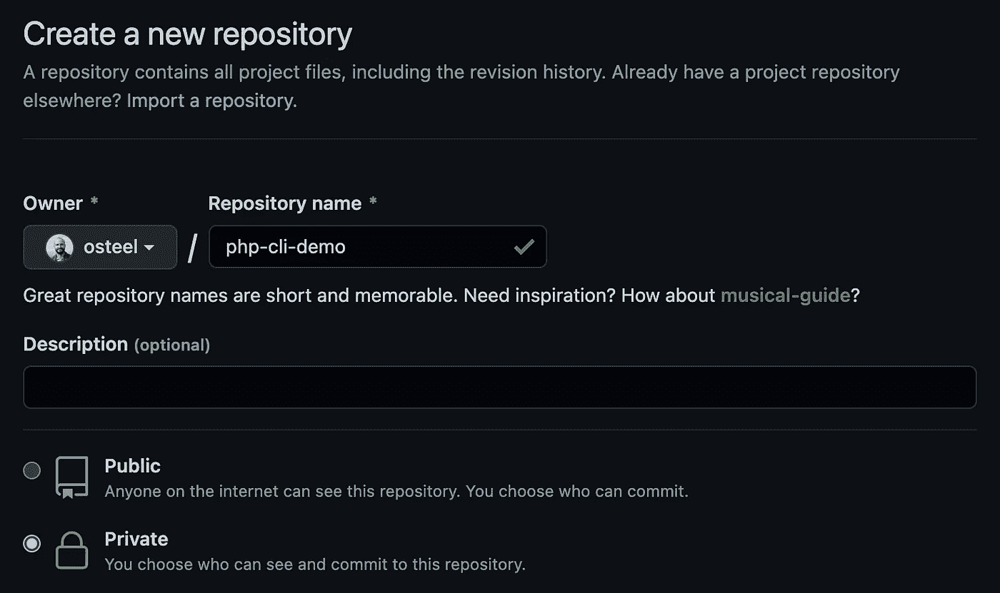

接下来，打开一个终端，在本地克隆项目，并输入其根目录:

```
$ git clone git@github.com:<YOUR GITHUB USERNAME>/php-cli-demo.git
$ cd php-cli-demo
```

运行以下命令以交互方式创建一个`composer.json`文件:

```
$ composer init
```

它会问你一系列问题——以下是如何回答这些问题的一些指导:

*   `Package name (<vendor>/<name>)`:我用供应商的名字`osteel`发布我所有的包，所以对我来说，它是`osteel/php-cli-demo`。如果你不确定，你可以选择你的 GitHub 用户名
*   `Description`:显示为可选，但稍后分发时需要。可以设置“PHP 命令行工具演示”
*   `Author`:确保你设置的价值观是你乐于公开分享的
*   `Minimum stability`:前往`stable`。如果你的工具的一些依赖项没有被标记为`stable`，你有时可能需要选择`dev`(详见[。然而，在本教程中不会出现这种情况](https://getcomposer.org/doc/04-schema.md#minimum-stability)
*   `Package type`:选择`library`(此处见[)](https://getcomposer.org/doc/04-schema.md#type)
*   这由你决定，但是因为代码将会公开发布，所以它必须是开源的。在大多数情况下，MIT 是好的，但是如果你需要更具体的东西[这个指南](https://choosealicense.com)会有帮助。确保设置一个值，该值也能被编写器识别。对于这篇文章，`MIT`就可以了

我们将手动设置我们的依赖项，所以当被问及交互定义它们时，请回答`no`。保持 PSR-4 自动加载映射的默认值(`src/`)。

最后一个问题是关于将`vendor`目录添加到`.gitignore`文件中，对此你要回复`yes`。

对于`composer init`来说应该就是这样了——它将基于您选择的值在您的项目的根目录下生成一个`composer.json`文件。

在我们安装任何依赖项之前，让我们在项目顶部创建一个`LICENSE`文件，并将所选许可证的内容粘贴到其中([这里是麻省理工学院的一个](https://choosealicense.com/licenses/mit)——你会在这里找到其他的)。确保编辑姓名和年份的占位符。

现在让我们要求 Symfony 的控制台组件作为依赖项:

```
$ composer require symfony/console
```

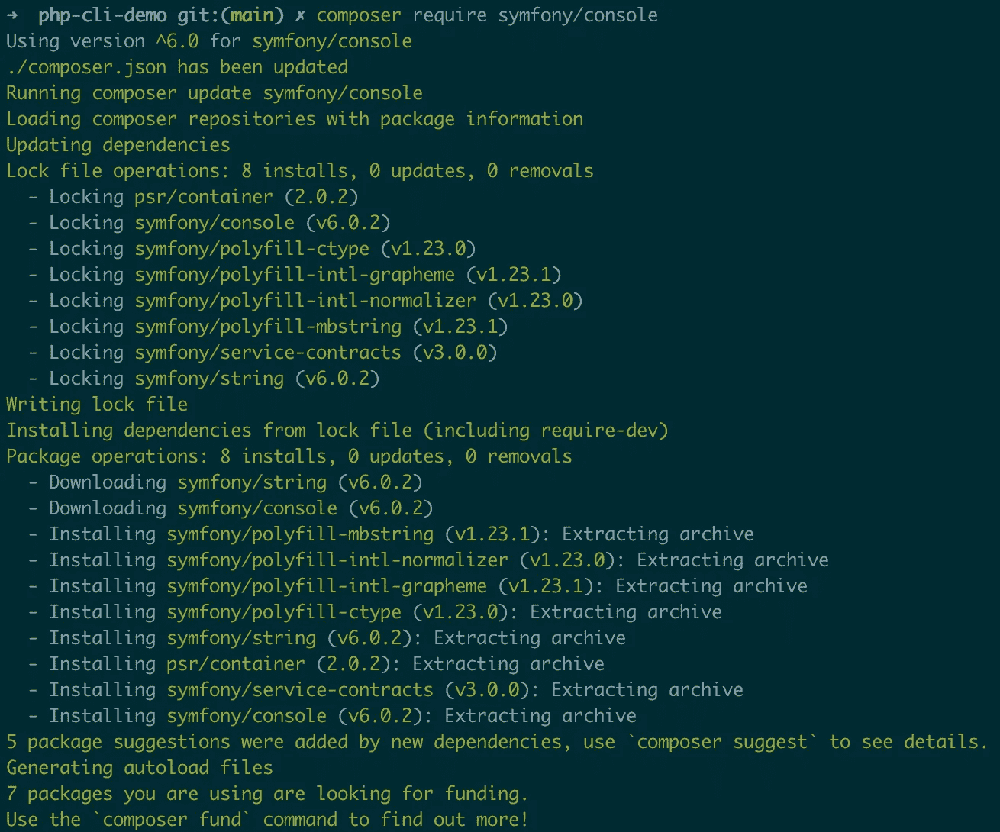

这个组件被用作许多框架命令行特性的基础，比如 Laravel 的 Artisan。这是一个健壮的、经过实战检验的控制台应用程序类集，在现阶段几乎是一个标准，因此将其作为起点而不是重新发明轮子是有意义的。

一旦脚本完成，您应该会看到在`composer.json`的`require`部分列出的依赖项(您的版本可能会根据您完成本教程的时间而有所不同):

```
"require": {
    "symfony/console": "^6.0"
},
```

# 入口点

像 web 应用程序一样，控制台程序需要一个入口点，所有的“请求”都通过这个入口点。换句话说，我们的命令需要一个`index.php`。

首先，我们将重用控制台组件的[文档](https://symfony.com/doc/current/components/console.html#creating-a-console-application)中给出的示例。在项目的根目录下创建一个名为`bin`的新文件夹，并在其中添加一个`demo`文件，内容如下:

`demo`文件将是我们程序的入口点，允许我们从终端使用如下命令调用它:

```
$ demo play
```

如果你已经有一个名为`demo`的本地应用程序，给它一个不同的名字(如果你不确定，运行`which demo`，看看它是否返回一个现有应用程序的路径)。

回到我们的`demo`文件——注意第一行:

```
#!/usr/bin/env php
```

这是系统知道应该使用哪个可执行文件来运行脚本的一种方式，使我们不必显式地调用它。

换句话说，这将允许我们运行这个:

```
$ demo play
```

而不是这个:

```
$ php demo play
```

`#!/usr/bin/env`表示系统将使用在用户的`PATH`中找到的第一个`php`可执行文件，而不管它的实际位置(详见此处的)。

说到执行，这只有在`demo`可执行的情况下才有效。让我们确保情况确实如此:

```
$ chmod +x bin/demo
```

现在运行以下命令:

```
$ php bin/demo
$ ./bin/demo
```

两者都应该显示默认的控制台菜单:

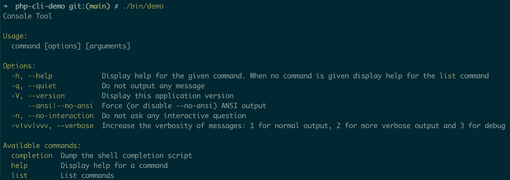

# 命令

既然我们的应用程序的基本结构已经就绪，我们可以把注意力集中在包含程序核心的命令上。我们正在构建的是一个简单的计算游戏，给用户基本的总数来解决，并返回答案是否正确。

再一次，[文档](https://symfony.com/doc/current/console.html)提供了一些关于如何编写命令的指导，但是为了简单起见，我将直接给你代码，然后是细目分类。

在项目的根目录下创建一些新的文件夹`src`和`src/Commands`，并将下面的`Play.php`文件添加到后者中:

确保更改顶部的名称空间以反映您的供应商名称。

我们的类扩展了 Symfony 控制台的`[Command](https://github.com/symfony/symfony/blob/6.0/src/Symfony/Component/Console/Command/Command.php)` [类](https://github.com/symfony/symfony/blob/6.0/src/Symfony/Component/Console/Command/Command.php)，并覆盖了它的一些静态属性。`$defaultName`和`$defaultDescription`是命令的名称和描述，它们都将出现在应用程序的菜单中。前者还允许我们稍后在终端中调用命令。

接下来是`execute`方法，父类要求我们实现它。它包含游戏的实际逻辑，并接收控制台输入和输出的实例。

有几种方法可以与它们交互，我承认我发现官方文档在这个主题上有点混乱。我的首选方法是依赖`[SymfonyStyle](https://symfony.com/doc/current/console/style.html)` [类](https://symfony.com/doc/current/console/style.html)，因为它抽象出了大多数典型的控制台交互，我喜欢它给它们的默认风格。

让我们仔细看看`execute`方法的主体:

首先，我们随机生成和的两项，并预先计算结果。我们实例化`SymfonyStyle`，将控制台的输入和输出传递给它，并使用它来显示问题和请求答案(使用`ask`方法)。

> 如果你不熟悉`sprintf`，它是一个 [PHP 函数](https://www.php.net/manual/en/function.sprintf)，允许开发者以一种我认为比标准连接操作符(`.`)更容易阅读的方式格式化字符串。不过，请随意使用后者。

我们收集答案并保存在`$answer`变量中，将其转换为整数(默认情况下输入是字符串)，并将其与预期结果进行比较。如果答案是正确的，我们将显示一条成功消息；如果没有，我们会显示一个错误。

然后我们询问用户是否想再玩一轮，这次使用`confirm`方法，因为我们需要一个布尔答案(“是”或“否”)。

如果答案是“是”，我们递归调用`execute`方法，实质上是重新开始游戏。如果答案是“否”，我们通过返回`Command::SUCCESS`(一个包含整数`0`的常数，它是一个表示成功执行的代码)来退出命令。

返回值是告诉控制台程序执行是否正确的一种方式，与答案的对错无关。这些退出代码[是标准化的](https://tldp.org/LDP/abs/html/exitcodes.html)，除了`0`之外的任何代码通常意味着“失败”。你可以在这里看到[默认情况下`Command`类定义了哪些退出代码，如果需要的话，你可以自己定义。](https://github.com/symfony/symfony/blob/6.0/src/Symfony/Component/Console/Command/Command.php#L36)

以上分类对于本文来说已经足够了，但是请随意查看官方文档[以了解详细信息和高级命令用法。](https://symfony.com/doc/current/console.html)

我们现在需要注册我们的命令，以便从外部使用它。更新`bin/demo`文件的内容以匹配以下内容:

我们唯一改变的是，现在我们在运行应用程序之前将命令的实例传递给应用程序(同样，不要忘记更新导入的类的名称空间)。

回到您的终端，从项目的根目录运行:

```
$ ./bin/demo
```

帮助菜单应该再次显示，只是这次`play`命令应该是它的一部分，旁边是它的描述:

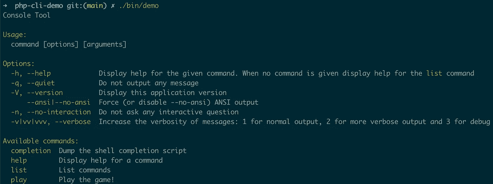

我们现在应该可以玩游戏了，所以让我们试一试:

```
$ ./bin/demo play
```

确保它的行为符合你的预期——如果没有，后退几步或者看一下教程的[库](https://github.com/osteel/php-cli-demo)来检查你是否遗漏了什么。

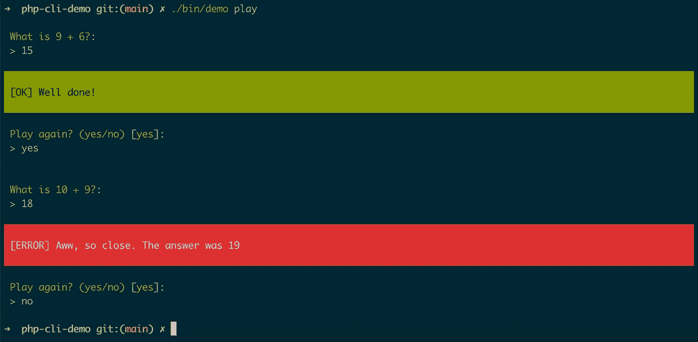

> 由于我们的应用程序将公开一个命令`play`，我们也可以让它成为[的默认命令](https://symfony.com/doc/current/components/console/changing_default_command.html)。这样做将允许我们通过运行`demo`而不是`demo play`来开始游戏。

# 样式化输出

`SymfonyStyle`类提供的默认已经很不错了，但是这些`[OK]`和`[ERROR]`消息有点干巴巴的，不太适合一款游戏。

为了让它们更加用户友好，让我们在`src`中创建一个新的`Services`文件夹，并向其中添加以下`InputOutput.php`文件:

同样，确保在顶部更改供应商名称空间。

这个类的目的是扩展`SymfonyStyle`来适应我们的需求。

该程序通过三种方式与玩家互动——提出问题并指出答案是对还是错。

我已经通过创建三个公共方法- `question`、`right`和`wrong`在上面的`InputOutput`类中反映了这一点。`question`简单地调用父类的`ask`方法，并在问题前添加✍️表情符号。

对于`right`和`wrong`，我从父类和方法中汲取了灵感，并修改了它们的内容，用更欢乐的表情符号替换了默认消息。

这就是全部了——剩下的唯一事情就是修改`Play`命令来使用我们的新服务，而不是`SymfonyStyle`:

像往常一样，注意名称空间。

让我们再次玩游戏，欣赏新的外观:

```
$ ./bin/demo play
```

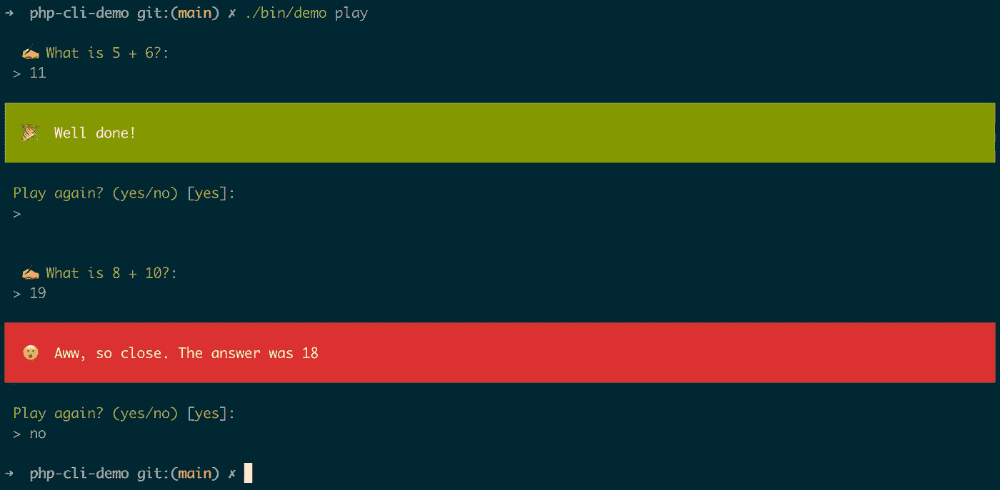

好一点了，不是吗？

现在，你可能想知道为什么我创建了新的方法，而不是扩展`ask`、`success`和`error`方法。快速的答案是这样做增加了跨库版本的兼容性。

扩展一个方法意味着子方法的签名必须与父方法的签名相同(有一些细微的差别)，只要父类不改变，这是没问题的。然而，出于可移植性的考虑，我们希望我们的应用程序与各种 PHP 和依赖版本兼容，对于控制台组件，方法签名因主要版本而异。

简而言之，创建新的方法而不是扩展现有的方法允许我们避免与跨版本的签名不匹配相关的错误。

以上是一个如何定制控制台输出风格的简单例子。它还让您了解如何构建您的应用程序，并引入了`Services`文件夹，您可以在其中放置实用程序类来解耦您的代码。

关于样式，如果您需要进一步改进控制台程序的外观，您可能想看看 [Termwind](https://github.com/nunomaduro/termwind) ，这是一个被描述为“Tailwind CSS，但用于 PHP 命令行应用程序”的有前途的新框架。

# 分布测试

现在让我们采取几个步骤来发布我们的应用程序。首先，我们需要调整我们的`demo`脚本:

我们更新的内容如下:

```
$root = dirname(__DIR__);

if (! is_file(sprintf('%s/vendor/autoload.php', $root))) {
    $root = dirname(__DIR__, 4);
}

require sprintf('%s/vendor/autoload.php', $root);
```

我们现在在两个不同的地方寻找`autoload.php`文件。为什么？因为根据我们是处于开发模式还是分发模式，这个文件将位于不同的文件夹中。

到目前为止，我们只在前一种模式下使用了我们的应用程序，所以我们知道`vendor`文件夹在哪里——在项目的根目录下。但是一旦它被分发(全局安装在用户的系统上)，该文件夹将位于当前文件夹的上几层。

例如，当我全局安装好应用程序后，它在我系统上的`bin`文件夹的路径如下:

```
~/.composer/vendor/osteel/php-cli-demo/bin
```

这里是全局`autoload.php`文件的路径:

```
~/.composer/vendor/autoload.php
```

到`/vendor/autoload.php`的路径比`bin`高四层，因此使用`dirname(__DIR__, 4)`(这个[函数](https://www.php.net/manual/en/function.dirname)返回给定目录的父目录的路径，这里是当前目录`__DIR__`的父目录。第二个参数是要增加的父目录的数量)。

保存文件，并通过显示菜单确保您仍然可以访问应用程序:

```
$ ./bin/demo
```

> [从 Composer 2.2](https://getcomposer.org/doc/articles/vendor-binaries.md#finding-the-composer-autoloader-from-a-binary) 开始，包含自动加载程序路径的`$_composer_autoload_path`全局变量在全局运行程序时可用。这个变量将允许我们简化上面的脚本，但也意味着我们必须强制使用 Composer 2.2 作为最低要求，这可能会影响兼容性。

我们需要做的另一件事是将`composer.lock`添加到`.gitignore`文件中:

```
/vendor/
composer.lock
```

如果您来自常规的 PHP 应用程序开发，您可能习惯于[提交这个文件](https://getcomposer.org/doc/01-basic-usage.md#commit-your-composer-lock-file-to-version-control)来冻结依赖版本(也称为*依赖固定*)，从而保证跨环境的一致行为。然而，当使用命令行工具时，情况就不同了。

如前所述，理想情况下，您的 CLI 应用程序应该与各种 PHP 和依赖版本一起工作，以最大限度地提高兼容性。这种灵活性意味着您不能规定您的用户应该安装哪个版本，而是让客户端环境自己找出依赖关系树。

请注意，您提交了该文件—当您的应用程序通过 Composer 安装时，它将被忽略。但是在实践中，明确忽略`composer.lock`最能反映真实的使用情况，并迫使您(和您的团队)尽早考虑版本变化。

顺便说一句，如果你想知道更多关于什么时候该做什么时候不该做`composer.lock`的事情，我发表了一篇关于这个主题的 Twitter 帖子:

由于我们不再强制特定的依赖版本，我们需要定义我们的应用程序将支持的版本范围。打开`composer.json`并更新`require`部分，如下所示:

```
"require": {
    "php": "^8.0",
    "symfony/console": "^5.0|^6.0"
},
```

我们需要指定 PHP 版本，因为我们不知道用户运行的是哪个版本。通过将其显式化，Composer 将能够检查 PHP 的兼容版本是否可用，如果不可用，则拒绝继续安装。

不过现在我们只对在我们当前的机器上运行一个发行版测试感兴趣，所以指定您的本地 PHP 版本就足够了(如果它与上面的不同，请进行调整——如果您不确定，请从终端运行`php -v`)。

您会注意到我还添加了控制台组件的版本`5.0`——这是因为在运行我自己的测试时，我遇到了一些与 Laravel Valet 的本地实例的兼容性问题，当时它需要控制台`5.0`。

根据您完成本教程的时间，版本可能已经改变，这个约束可能不再成立，但这是您可能必须处理的兼容性问题的一个很好的例子。

我们需要对这个文件做最后一个更改，那就是添加一个`bin`部分:

```
"require": {
    "php": "^8.0",
    "symfony/console": "^5.0|^6.0"
},
"bin": [
    "bin/demo"
],
```

这就是您如何指定[供应商二进制文件](https://getcomposer.org/doc/articles/vendor-binaries.md)，这是一种告诉 Composer“这将是应用程序的入口点，请使它在用户的`vendor/bin`目录中可用”的方式。通过这样做，我们的用户将能够在全球范围内调用我们的应用程序。

提交并推动上述更改。然后，如果您的存储库到目前为止是私有的，那么现在是时候将其公开了。进入*设置*选项卡，进入*选项*部分，一路向下滚动到*危险区*(总是让我想起[射手](https://www.youtube.com/watch?v=k3-zaTr6OUo))。

在那里，您可以将存储库的可见性更改为 *public* :

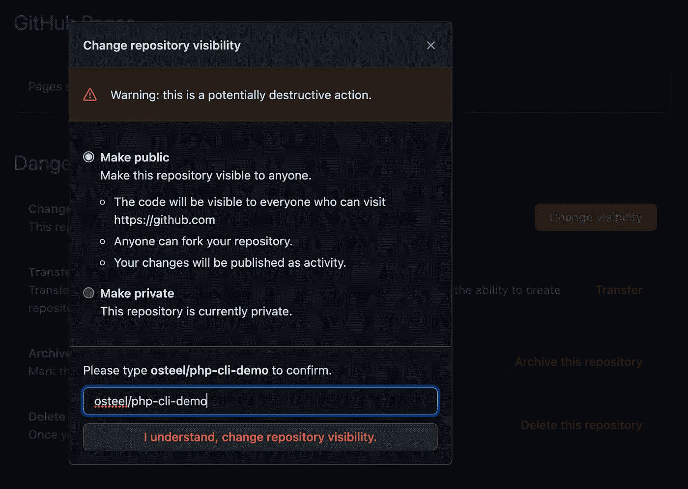

现在前往[packagist.org](https://packagist.org/)创建一个账户(或者如果你已经有了一个，就登录)。

登录后，点击右上角的*提交*按钮，提交你的库的 URL。请稍等片刻，让爬虫完成工作，您的存储库将会出现:

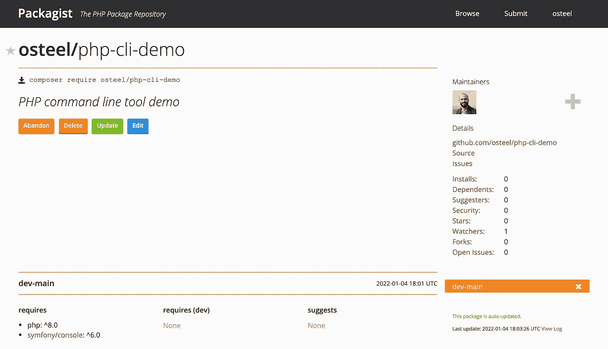

不要太担心发布一个虚拟包——最坏的情况是除了你自己没有人会安装它(而且你可以在以后删除它)。

现在让我们试着在您机器上安装它。转到您的终端，运行以下命令:

```
$ composer global require osteel/php-cli-demo:dev-main
```

同样，确保设置正确的供应商名称。注意结尾出现的`:dev-main`——这是一种专门针对`main`分支的方式，因为还没有发布。

安装成功后，确保系统能够识别您的应用程序(您可能需要打开一个新的终端窗口):

```
$ which demo
```

这个命令应该返回应用程序入口点的路径(`demo`文件)。如果没有，确保`~/.composer/vendor/bin`目录[在你系统的](https://blackdeerdev.com/how-to-add-composer-vendor-bin-directory-in-your-path) `[PATH](https://blackdeerdev.com/how-to-add-composer-vendor-bin-directory-in-your-path)`中。

让游戏快速旋转，以确保游戏按预期运行:

```
$ demo play
```

我们的分销测试成功了！

# PHP 版本支持

在我们继续发布一个合适的版本之前，我们需要解决一些我们已经提到过几次的事情——PHP 版本支持。

这将是一个两步的过程:

1.  编写一个测试来控制我们程序的正确端到端执行
2.  添加一个 GitHub 工作流，它将使用各种 PHP 版本运行测试

## 自动化测试

我们将使用 [PHPUnit](https://phpunit.de/) 作为我们的测试环境——让我们将它作为开发依赖项来安装:

```
$ composer require --dev phpunit/phpunit
```

在项目的根目录下创建文件夹`tests`和`tests/Commands`，并在后者中添加一个`PlayTest.php`文件，内容如下:

像往常一样，确保更新名称空间和`use`语句中的供应商。

根据[文档](https://symfony.com/doc/current/console.html#testing-commands)，控制台组件附带了一个`CommandTester`助手类，它将简化`Play`命令的测试。

我们实例化后者并将其传递给测试人员，这允许我们[模拟一系列输入](https://symfony.com/doc/current/components/console/helpers/questionhelper.html#testing-a-command-that-expects-input)。

顺序如下:

1.  回答第一个问题
2.  说`yes`再打一轮
3.  再次回答`10`
4.  说`no`再打一轮

然后，我们让测试人员执行命令，并使用`assertCommandIsSuccessful`方法(控制命令返回`0`)检查它是否成功运行。

仅此而已。我们没有测试游戏的输出——我们只是确保程序在给定一系列输入的情况下成功运行。换句话说，我们在确保它不会崩溃。

随意添加更多的测试来控制游戏的实际行为(例如，它是否给出正确的答案)，但对于我们的直接目的，以上是我们所需要的。

让我们确保我们的测试通过:

```
$ ./vendor/bin/phpunit tests
```

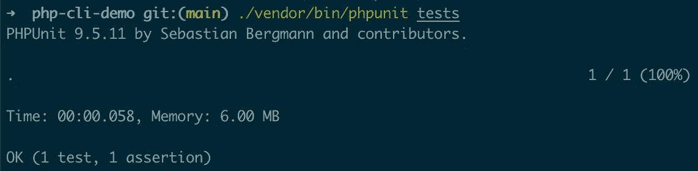

如果没有，后退几步或者看一下教程的[库](https://github.com/osteel/php-cli-demo)来检查你是否错过了什么。

## GitHub 工作流程

现在我们有了一个控制程序正确执行的测试，我们可以用它来确保后者与一系列 PHP 版本的兼容性。手动这么做可能有点痛苦，但是我们可以使用 [GitHub Actions](https://github.com/features/actions) 来自动化这个过程。

GitHub 动作允许我们编写触发选定事件的工作流，比如提交的推送或打开的拉取请求。任何 GitHub 账户都可以使用它们，包括免费账户(它们每个月都有[津贴](https://docs.github.com/en/billing/managing-billing-for-github-actions/about-billing-for-github-actions))。

工作流采用 YAML 格式，必须放在根目录下的`.github/workflows`文件夹中。

创建该文件夹，并将以下`ci.yml`文件添加到其中:

在工作流的最顶端是它的名字(“CI”代表[持续集成](https://www.martinfowler.com/articles/continuousIntegration.html))，后面是它应该触发的事件，在`on`部分。每当一些代码被推送到`main`分支，或者每当一个 pull 请求向它打开时，我们的就会关闭。

然后我们定义要执行的作业，在我们的例子中只有一个——运行测试。我们指定使用 Ubuntu 作为环境，然后定义要应用的执行[策略](https://docs.github.com/en/actions/learn-github-actions/contexts#strategy-context)。这里，我们将使用 PHP 版本的[矩阵](https://docs.github.com/en/actions/using-jobs/using-a-build-matrix-for-your-jobs)，每个版本都将按顺序运行我们的测试(在撰写本文时，列出的版本是[支持的版本](https://www.php.net/supported-versions.php))。

最后，我们定义我们工作的步骤，细分如下:

1.  检查代码
2.  使用当前版本设置 PHP
3.  安装编写器依赖项
4.  运行测试

我们现在需要在应用程序的`composer.json`中列出相同的 PHP 版本，这样 Composer 就不会拒绝为其中一些版本安装它。让我们再次更新`require`部分:

```
"require": {
    "php": "^7.4|^8.0",
    "symfony/console": "^5.0|^6.0"
},
```

如果你想知道为什么我没有列出`8.1`，那是因为根据[语义版本化](https://semver.org/) ( *semver* )的规则，`^8.0`涵盖了所有高于或等于`8.0`的版本，但严格来说在`9.0`之下，包括`8.1`。如果你像我一样，在需要的时候往往会忘记永远的规则，把这张备忘单放在手边，以后再感谢我。

保存、提交并推送上面的内容——如果进展顺利，您应该会在 GitHub 存储库的 *Actions* 选项卡中看到工作流正在运行:

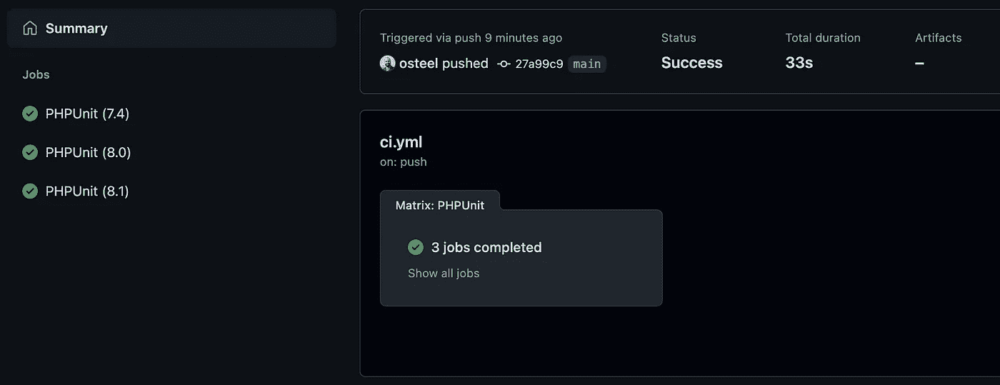

此外，如果出现问题，请参考文章的[库](https://github.com/osteel/php-cli-demo)。

这个工作流给了我们信心，我们的应用程序可以在任何列出的 PHP 版本上成功运行，并且当我们进行一些修改时，它会确认这种情况是否仍然存在。

> 上面是一个简化的工作流程，没有完全覆盖所有的依赖版本。我们可以进一步推进矩阵的概念，但是为了避免这篇文章变得太长，我已经发表了一篇关于这个主题的单独的博客文章。

[](/a-github-workflow-to-check-the-compatibility-of-your-php-package-with-a-range-of-dependency-19b674c41b95) [## 一个 GitHub 工作流来检查你的 PHP 包与一系列依赖项的兼容性…

### 对于我们不知道目标环境约束的场景

levelup.gitconnected.com](/a-github-workflow-to-check-the-compatibility-of-your-php-package-with-a-range-of-dependency-19b674c41b95) 

# 释放；排放；发布

我们现在有了一个经过测试的应用程序，它与一系列 PHP 版本兼容，并且我们设法在我们的机器上安装了一个早期版本。我们准备发布一份官方声明。

但是在我们这样做之前，我们需要确保我们未来的用户知道如何安装和使用我们的应用程序——这就是`README.md`文件的作用。

让我们在项目的根目录下创建一个(点击底部的“查看原始数据”查看源代码):

这是一个混合了一些 HTML 和 markdown 代码的基本模板。我不会花太多时间来解释它，所以这里有一个内容的快速总结:

*   标题和副标题
*   预览图像
*   一些徽章
*   安装说明
*   使用说明
*   更新说明
*   删除说明

您需要再次用您的供应商名称替换`osteel`的实例(如果您选择了`demo`以外的名称，可能还需要一些其他的东西，比如应用程序名称或入口点)。

对于预览图像，我喜欢拍摄一个正在使用的应用程序的简单截图:


这也是我用来说明这篇文章的图片

在项目的根目录下创建一个`art`文件夹，并在其中放置一个`preview.png`图像(如果选择不同的名称，请相应地更新代码)。

您也可以通过在存储库的*设置*选项卡的*社交预览*部分中进行设置，将此图片用于社交媒体。

差不多就是这样——请随意重用和修改这个模板。

保存并按下`README.md`，前往存储库的*发布*部分，可从右侧的栏中获得:


为你的发布创建一个标签，它应该遵循[语义版本](https://semver.org/)的规则。我们将制作我们的版本 1:

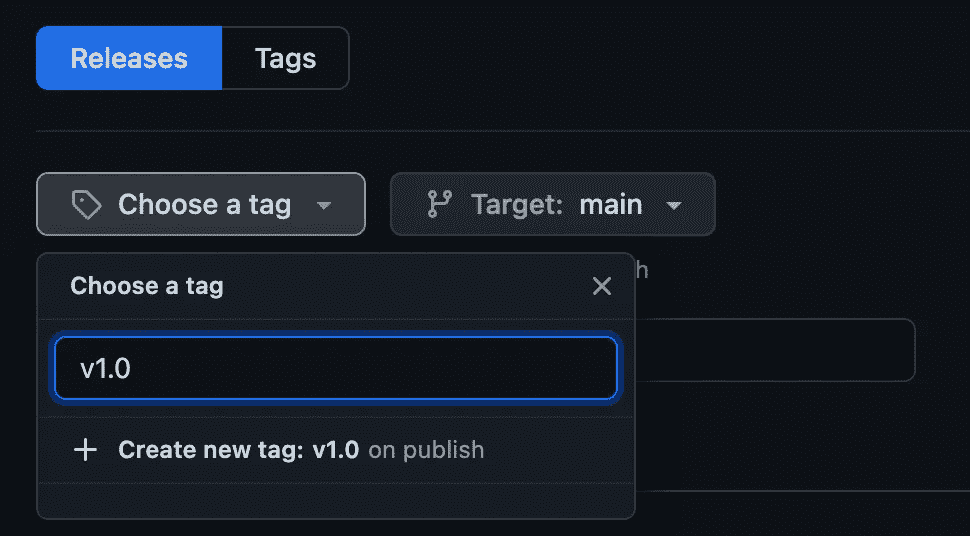

为您的版本命名并描述，然后发布它:

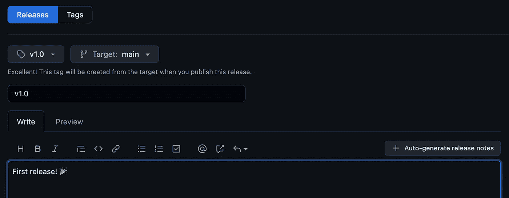

过一会儿，您应该会看到它出现在您的存储库的 Packagist 页面上:

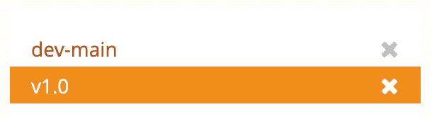

现在回到您的终端，运行以下命令(使用适当的供应商名称):

```
$ composer global require osteel/php-cli-demo
```

既然有了合适的版本，就没有必要再添加`:dev-main`了。

确保你还能玩游戏:

```
$ demo play
```

就是这样！您的应用程序现在已经可以发布和分发了。

您可以通过运行以下命令来安装未来的次要版本:

```
$ composer global update osteel/php-cli-demo
```

主要有以下几个:

```
$ composer global require osteel/php-cli-demo
```

# 清理

本教程即将结束，如果在玩完应用程序后，您想清理一下，您可以从 Packagist:

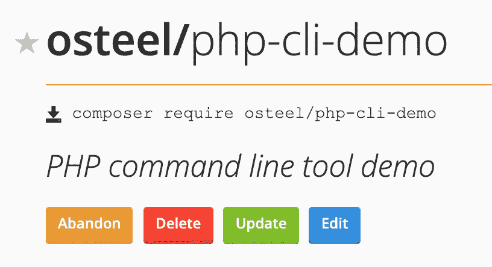

从本地系统中删除它的方法如下:

```
$ composer global remove osteel/php-cli-demo
```

当然，你也可以随时删除你的 GitHub 库。

# 结论

我希望这能启发你用 PHP 编写自己的命令行工具。

虽然这种语言的主要应用仍然是 web 开发，但上面的内容应该表明它足够灵活，可以在其他方面为您提供帮助。

老实说，如果你的目标是广泛使用独立的 CLI 应用程序，PHP 可能不是最好的语言。用户仍然需要一个支持它的环境，一个本地安装的 Composer，还需要编辑他们的本地`PATH`来包含 Composer 的`bin`目录。这些都是大多数人不愿意采取的步骤。

但是，如果您已经是一名 PHP 开发人员，您的环境很可能已经满足这些条件，因此，构建您自己的 CLI 工具的障碍非常低。

想一想你经常执行的重复性任务，这些任务不需要一个成熟的网站就可以自动完成。例如，我厌倦了手动将我的 Kobo 注释导入到 read wise 中，所以想出了一个 T2 工具来使转换更容易。

PHP 运行[系统命令](https://www.php.net/manual/en/function.system.php)没有问题，如果你需要比控制台组件单独提供的更多的能力，像 [Laravel Zero](https://laravel-zero.com) 这样的框架将极大地扩展可能性的领域。

您不必为了严格的个人用途而通过 Packagist 分发您的程序，但这是一种与可能有类似需求和潜在的开源开发尝试的其他人共享您的工作的方式。

此外，编写和分发您自己的 CLI 工具的过程与应用程序库的过程并没有太大的不同——一旦您对前者感到满意，后者就变得更容易访问，并且两者都是回馈社区的方式。

# 资源

以下是本帖中引用的一些资源:

*   [文章库](https://github.com/osteel/php-cli-demo)
*   [作曲文档](https://getcomposer.org/doc/00-intro.md)
*   [Symfony 的控制台组件文档](https://symfony.com/doc/current/components/console.html)
*   [选择开源许可](https://choosealicense.com)
*   [为什么用“#！/usr/bin/env NAME "而不是" #！/path/to/NAME "作为我的 shebang？](https://unix.stackexchange.com/questions/29608/why-is-it-better-to-use-usr-bin-env-name-instead-of-path-to-name-as-my)
*   [附录 e .具有特殊含义的退出代码](https://tldp.org/LDP/abs/html/exitcodes.html)
*   [PHP 中的类型差异](https://www.npopov.com/2021/11/08/Type-variance-in-PHP.html)
*   [PHP 的 dirname 函数](https://www.php.net/manual/en/function.dirname)
*   [PHP 支持的版本](https://www.php.net/supported-versions.php)
*   [PHPUnit](https://phpunit.de/)
*   [持续集成](https://www.martinfowler.com/articles/continuousIntegration.html)
*   [GitHub 动作](https://github.com/features/actions)
*   【Packagist.org 
*   [语义版本](https://semver.org/)
*   [语义版本控制备忘单](https://devhints.io/semver)
*   [如何将 composer 厂商 bin 目录添加到路径](https://blackdeerdev.com/how-to-add-composer-vendor-bin-directory-in-your-path)
*   [Minicli](https://github.com/minicli/minicli)
*   [Laravel 零点](https://laravel-zero.com)
*   [术语风](https://github.com/nunomaduro/termwind)

*本故事原载于*[*tech . osteel . me*](https://tech.osteel.me/posts/how-to-build-and-distribute-beautiful-command-line-applications-with-php-and-composer)*。*