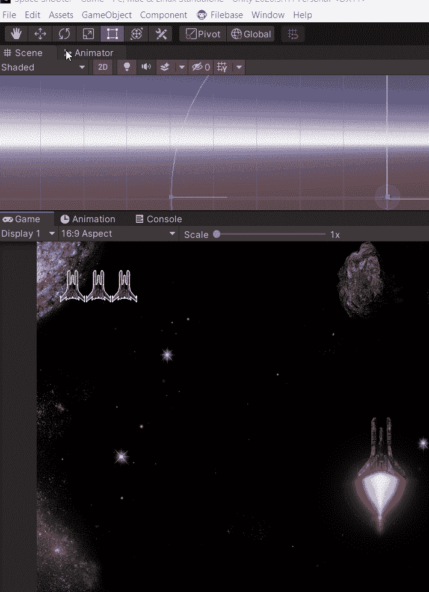
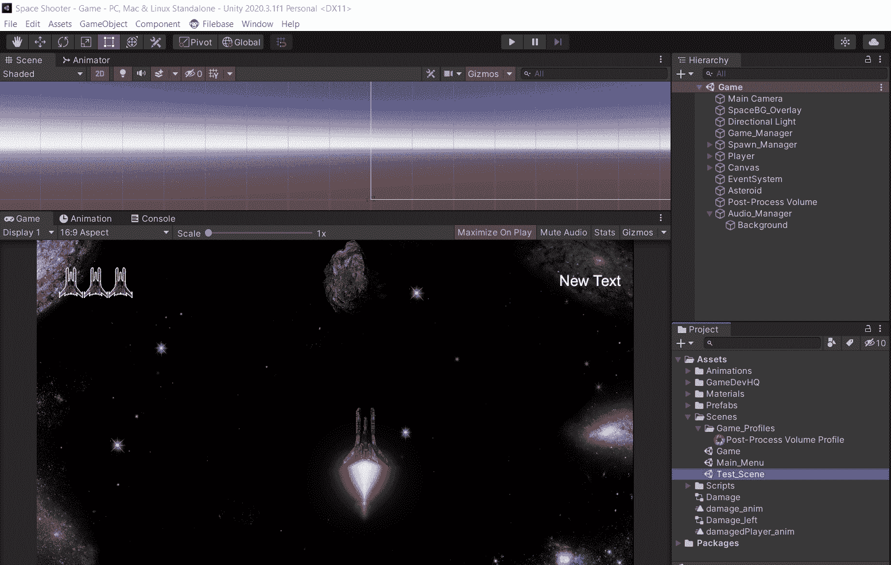
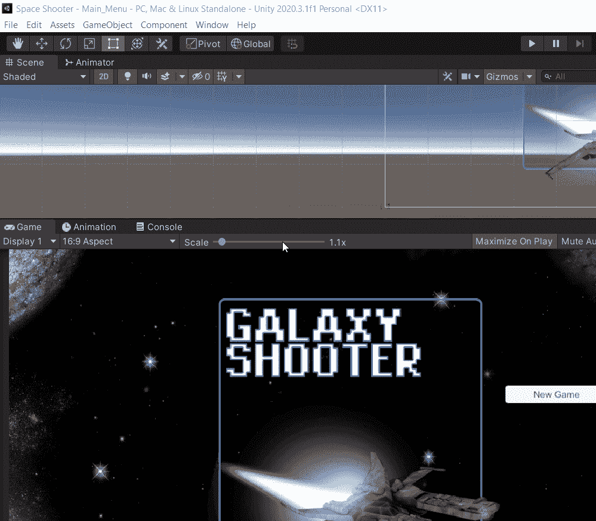
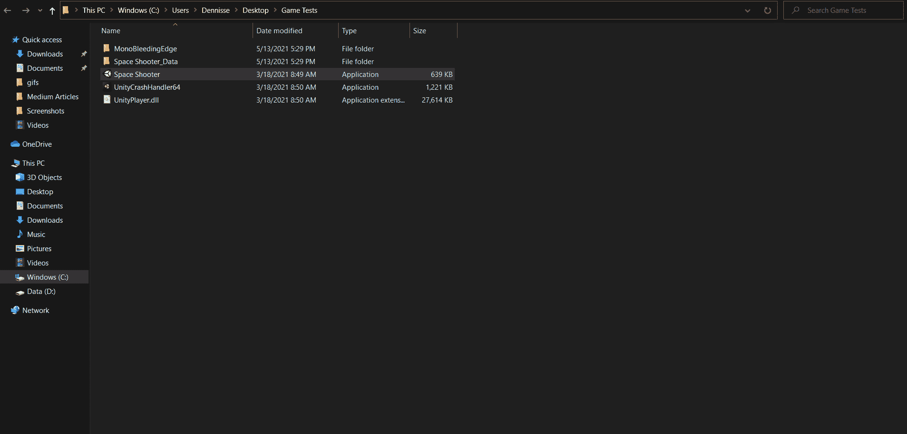

# 如何构建和测试你的 Unity 游戏

> 原文：<https://levelup.gitconnected.com/how-to-build-and-test-your-unity-game-7ace02e03490>

Unity 引擎附带了完整的 [**构建设置**](https://docs.unity3d.com/Manual/BuildSettings.html) ，允许用户在部署的最后阶段之前构建和测试他们的应用程序。

在本文中，您将学习如何使用构建设置来创建应用程序的测试版本，该版本实际上可以在您的计算机上执行！

# 使用生成设置

1.  要访问构建设置，请转到**文件→构建设置**

> 注意:一旦你打开了构建设置，你会看到所有你当前添加的场景，它们会以正确的顺序出现。如果你**错过了任何场景**，你可以打开你错过的场景，然后回到你的构建设置，选择添加**打开的场景。**

2.选择想要的平台，有些平台有具体的设置，你可以在这里了解更多[。当您正在进行早期测试构建时，如果可能的话，最好在您的计算机上测试产品。一旦选择了平台，单击 Build 并继续操作。如果您选择 PC，请确保为您的计算机选择正确的](https://docs.unity3d.com/Manual/BuildSettings.html)[架构](https://www.seeedstudio.com/blog/2020/02/24/what-is-x86-architecture-and-its-difference-between-x64/#:~:text=x86%20refers%20to%20a%2032%2Dbit%20CPU%20and%20operating%20system,bit%20CPU%20and%20operating%20system.)类型。

> **注意**:通常，在控制台上进行测试需要开发者的同意，以及使用专业分发的开发工具包的许可。以微软为例。

3.一旦该过程完成，您选择用来存储构建的文件夹应该会自动打开。从那里，您可以执行您的完全可玩/可运行的测试！

在下一篇文章中，我将讲述如何制作一个游戏或应用程序的可共享版本！