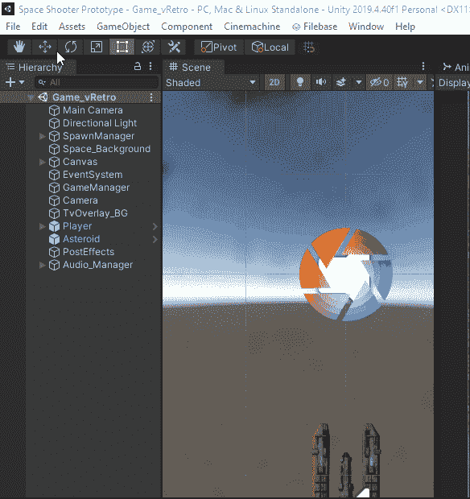
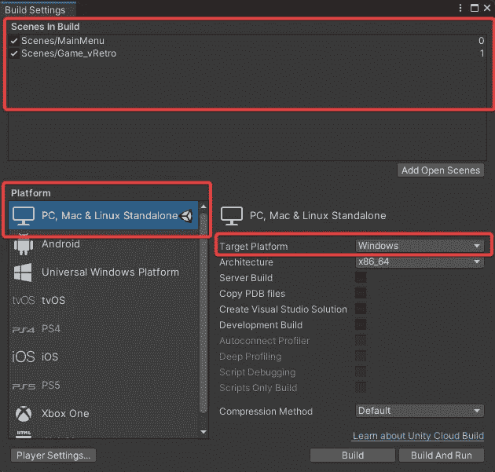
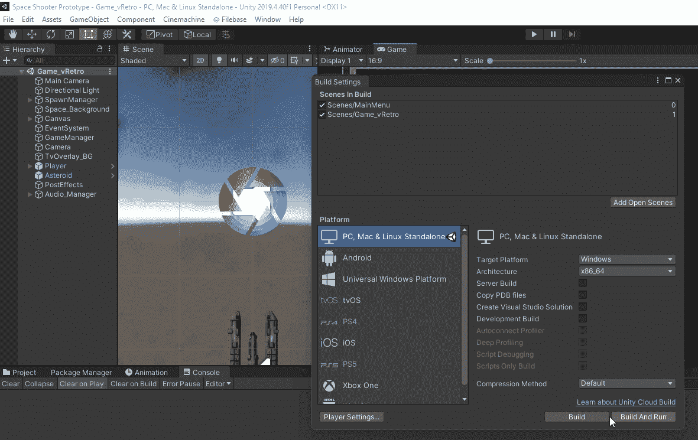
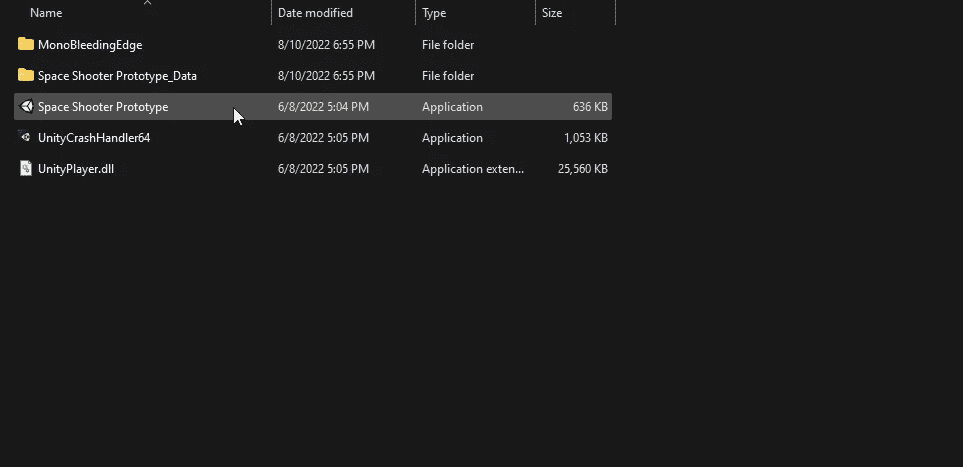
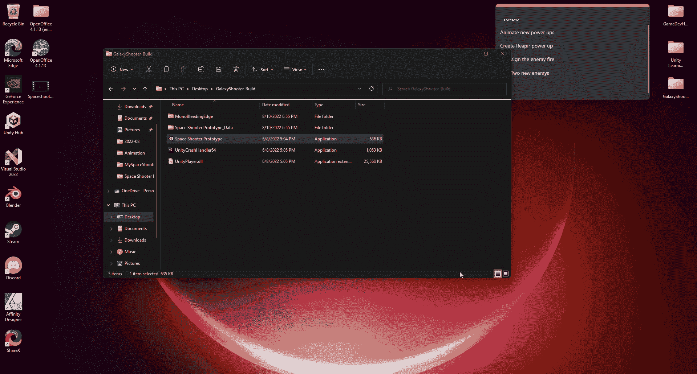

# 如何为 Windows/Linux/macOS 构建和测试您的 Unity 游戏

> 原文：<https://levelup.gitconnected.com/how-to-build-and-test-your-unity-game-for-windows-linux-macos-a2f0289f1afa>

**概述:**

今天我们将讨论如何为 Windows/Linux/macOS 构建和测试你的游戏。让我们开始吧。

**打造你的游戏:**

在你发布之前，你可能想先构建并测试你的游戏。让我们看看我们能做些什么。

1.  要在 Unity 中启动，导航到文件>构建设置，或者您可以使用快捷键 Ctrl+Shift+B。

2.请确保您已经选择了场景，并选择了 PC 作为平台。

**我的目标平台是 windows**

3.按 Build 选择一个文件夹。

4.完成后，导航到你选择的文件夹，这就是你的游戏。exe 文件。

**测试你的游戏:**

现在只需运行你的游戏 exe 并测试你的游戏。

这就是构建和测试你的游戏。在下一篇文章中，我将介绍如何构建 WebGL 以便在 web 上发布。

感谢您的时间和关注。

# 分级编码

感谢您成为我们社区的一员！在你离开之前:

*   👏为故事鼓掌，跟着作者走👉
*   📰查看[升级编码出版物](https://levelup.gitconnected.com/?utm_source=pub&utm_medium=post)中的更多内容
*   🔔关注我们:[Twitter](https://twitter.com/gitconnected)|[LinkedIn](https://www.linkedin.com/company/gitconnected)|[时事通讯](https://newsletter.levelup.dev)

🚀👉 [**加入升级人才集体，找到一份神奇的工作**](https://jobs.levelup.dev/talent/welcome?referral=true)