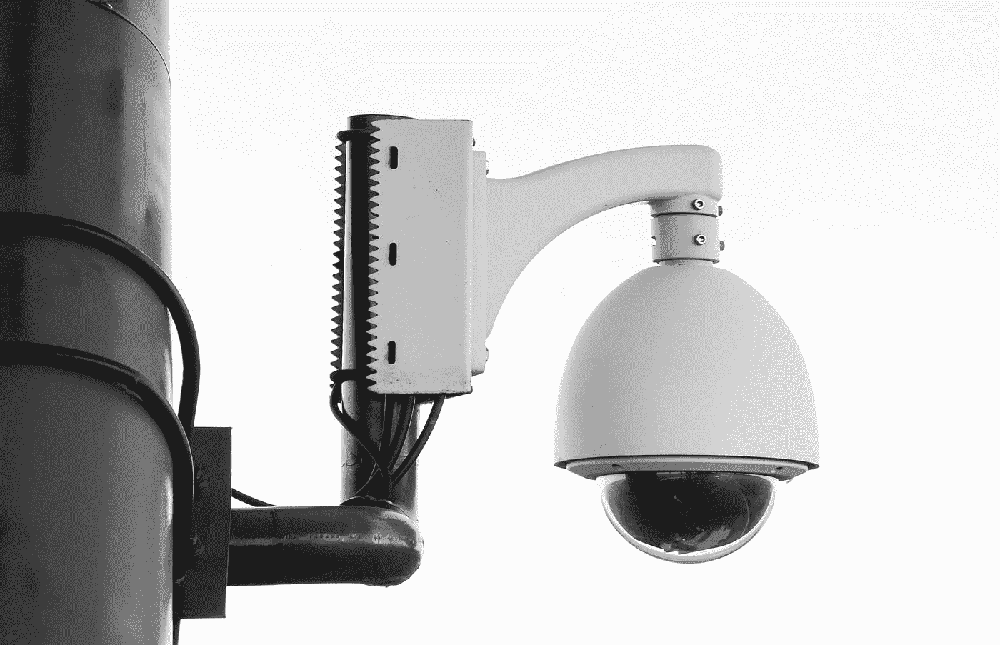
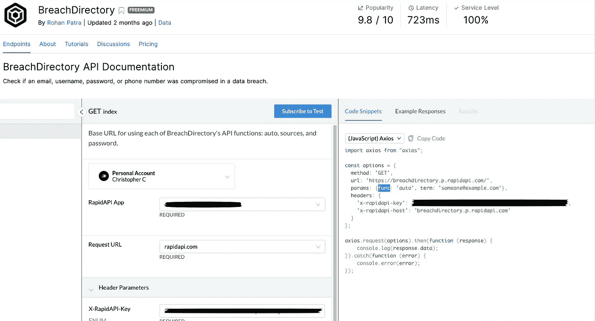
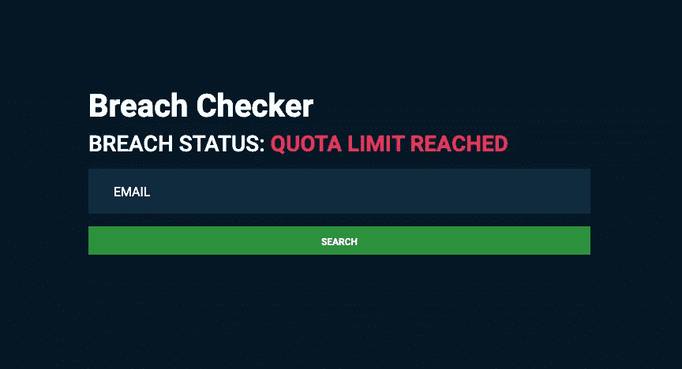

# 如何用 Nuxt.js 和 Axios 构建数据漏洞检查器

> 原文：<https://levelup.gitconnected.com/how-to-build-data-breach-checker-with-nuxt-js-and-axios-f6714ef53385>



Pawel Czerwinski 在 [Unsplash](https://unsplash.com?utm_source=medium&utm_medium=referral) 上拍摄的照片

# 先决条件

本课要求您对 Vue、Axios 和普通 javascript 有一个基本的了解，以便获得最好的理解。

阅读本教程后，您将确切地了解如何构建一个简单的应用程序，该应用程序将获取用户的电子邮件，并检查它是否涉及数据泄露。我们将使用 Nuxt 自带的内置 Axios 模块。

# API

在 Rapid API 创建一个帐户，订阅[break directory API](https://rapidapi.com/rohan-patra/api/breachdirectory/)。有付费计划，但我们只担心我最喜欢的计划，*免费的！*你每天只能发出 **50** 个请求，所以明智地测试吧！

订阅后，您将能够在 API 页面的*端点选项卡*上测试端点。

它应该看起来像这样。



因为我们将使用`$axios`来执行我们的请求，所以一定要将方法改为 Javascript Axios。我们将很快从代码区复制选项常量，因此请保持此窗口打开。

# 创建一个 Nuxt 项目

使用**纱线**

```
yarn create nuxt-app "name-of-app"
```

使用 **NPX**

```
npx create nuxt-app "name-of-app"
```

浏览所有步骤，并确保选择 Axios 包和通用应用程序。在应用程序构建完成之前，只需按 enter 键即可完成其他所有操作

# 创建一个 Nuxt 项目

在`/pages`目录中，进入 `index.vue`文件，替换并添加以下代码。

```
<template><div *style*="height:100vh;" *class*="d-flex justify-content-cetner align-items-center"><div *class*="container"><div *class*="row"><div *class*="col-lg-6 mx-auto my-5 left"><h1 *class*="font-weight-bold">Breach Checker</h1><h3>BREACH STATUS: <span *class*="breach-status">{{breachStatus}}</span></h3><form><input *class*="form-control my-3" *type*="email" *placeholder*="Email" *v-model*="*query*.*email*" /><button *class*="btn btn-success text-white" *type*="button"@*click*.*prevent*="checkBreach">Search</button></form></div></div></div></div></template>
```

一些样式现在没有意义，你的应用看起来会很难看，直到我们添加材料设计引导，这是接近尾声。

如您所见，我们有一个表单，其中有一个电子邮件输入，一个启动`checkBreach`方法的按钮，该方法使用输入的当前值来扫描电子邮件，以查看它是否与数据泄露相关联。

在`<template>,`下面的`<script>`标签内，用下面的代码添加数据函数。

```
*data*(){ *return* { breachData:null, breachStatus:'', query:{ email:'' } }},
```

`query`将保存在`$axios`请求中使用的所需凭证。使用`v-model`从输入中引用电子邮件。`breachStatus`将是 is 应用程序搜索时显示的文本，以及违规的状态。

在`methods`生命周期挂钩内，添加以下代码

```
*start*(){ *var* breachStatustext *= document.querySelector(*'.breach-status'*)* *breachStatustext*.*classList*.*add*('text-warning'); *this*.*breachData* *=* null; *this*.*breachStatus* *=* 'SCANNING';},*finish*(data){ *this*.*breachData* *=* data},
```

`breachStatustext`将是显示违规状态文本的文本。不要与`breachStatus`混淆，后者是实际显示的文本。我们还从 BootStrap 添加了类“text-warning ”,以便在应用程序搜索时添加黄色文本。

当用户单击搜索按钮时，`start()`方法将被初始化，当 axios 请求返回响应细节时，`finish(data)`将被调用。 `data` 将是我们传递给 `finish()`方法来设置数据对象`breachData`的值。

现在我们要为`checkBreach`方法添加代码。从 BreachDirectory API 中复制`options`并粘贴到这个方法中，如下例所示。

```
*async* *checkBreach*({ $axios }){ *this*.*start*(); *const options = {* *method:* 'GET'*,* *url:* 'https://breachdirectory.p.rapidapi.com/'*,* *params: {func:* 'auto'*, term:this.query.email},* *headers: {* 'x-rapidapi-key'*: 'your-api-key',* 'x-rapidapi-host'*:* 'breachdirectory.p.rapidapi.com' *}**}*;var breachStatustext = document.querySelector('.breach-status')      var response  = await this.$axios.$request(options).then(res => console.log(res)).catch(err => {               breachStatustext.classList.remove('text-warning');          breachStatustext.classList.add('text-danger');          breachStatustext.classList.add('font-weight-bold');          this.breachStatus = "QUOTA LIMIT REACHED";          setTimeout( () => this.clearBreachStatus(), 2000)          return      })      this.breachData = response; *if*(*this*.*breachData*.*error* *===* "Not found"){ *this*.*breachStatus* *=* "NEGATIVE"; *breachStatustext*.*classList*.*remove*('text-warning'); *breachStatustext*.*classList*.*add*('text-success');} *else* { *this*.*breachStatus* *=* "POSITIVE"; *breachStatustext*.*classList*.*remove*('text-warning'); *breachStatustext*.*classList*.*add*('text-danger');}*this*.*finish*(*this*.*breachData*)},
```

这段代码将调用`start()`方法，它将在 DOM 中显示为“scanning”。我们还有一个 if-else 语句来确定在我们从`$axios`得到响应后显示什么消息。接下来，`finish(data)`方法获取 breakout data 对象，以便在以后有其他操作使用它时可以访问它。但是现在，我们将把重点放在基础上。

最后，我添加了一些计算样式和一个`setTimout`函数，以便在免费 API 达到极限时清除配额限制消息。

# 风格

现在我们将添加艺术。在您的`<script>`下添加以下代码

```
<style>body { background-color:#061826; color:white;}input*.form-control* { border:none; border-radius:0*px* *!important*; padding:1*rem* 2*rem*; max-width:100*%* *!important*; background:#112b40; transition:0.2*s* ease;}input*.form-control:focus* { font-size:18*px*;}input*.form-control:focus::placeholder* { color:#061826}input*.form-control::placeholder* { color:white; text-transform:uppercase;}button*.btn* { border-radius:0*px* *!important*; width:100*%*; font-weight:bold; max-width:100*%* *!important*;}</style>
```

现在我们将添加材料设计自举。进入主目录，打开你的`nuxt.config.js`文件，并将它粘贴到`head`对象中。这些是不会让我们的应用程序变得难看的样式表。

```
*// Global page headers: https://go.nuxtjs.dev/config-head*link: [{ rel: 'stylesheet', href: 'https://cdnjs.cloudflare.com/ajax/libs/mdb-ui-kit/3.6.0/mdb.min.css' },{ rel: 'stylesheet', href: 'https://cdnjs.cloudflare.com/ajax/libs/font-awesome/5.15.1/css/all.min.css' },{ rel: 'stylesheet', href: 'https://cdnjs.cloudflare.com/ajax/libs/mdb-ui-kit/3.6.0/mdb.min.css' }],script: [{ scr: 'https://cdnjs.cloudflare.com/ajax/libs/mdb-ui-kit/3.6.0/mdb.min.js', type: 'text/javascript' }]
```

# 结论

这是最终结果应该是什么样子。因为我必须测试这一点，以确保这为您工作，我已经达到了我的配额限制！



现在你所要做的就是在开发模式下启动应用程序。

Npm

```
npx nuxt dev
```

**纱线**

```
yarn dev
```

*我不建议生产应用程序使用这种设置。为了安全起见，请务必将您的* `*api_key*` *隐藏在一个* `*env*` *变量中。*

## 在网上和我联系！

*   在 Linkedin 上与我联系
*   我的软件公司
*   [个人博客](http://www.christopherclemmons.com/)
*   电子邮件:christopher.clemmons2020@gmail.com