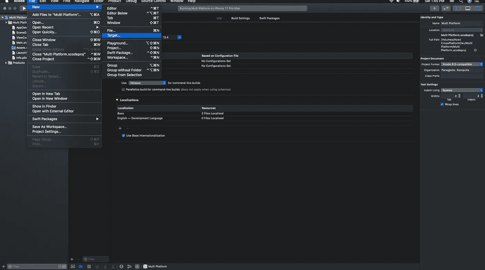
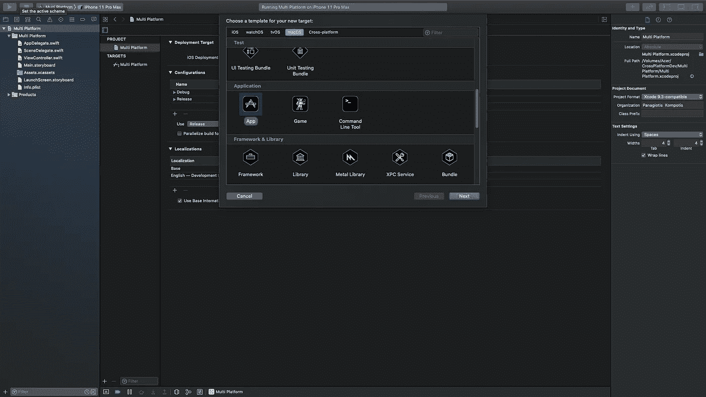
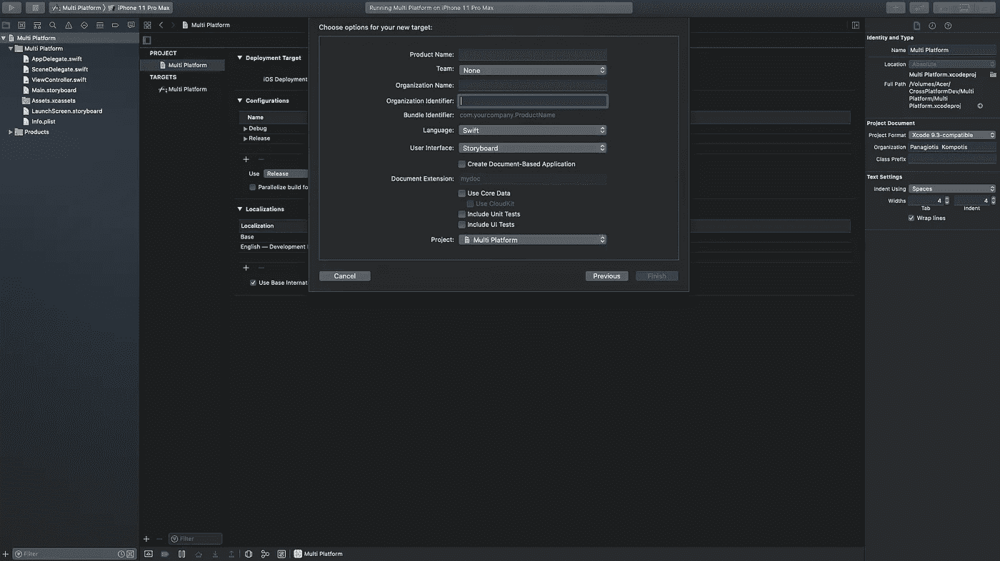
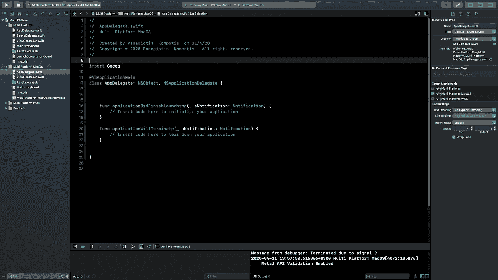

# 如何在同一个 Xcode 项目中为多个 Apple 平台构建

> 原文：<https://levelup.gitconnected.com/how-to-build-for-multiple-apple-platforms-within-the-same-xcode-project-9b60097fa9a9>

## 用同一项目管理多个部署目标

[Zan](https://unsplash.com/@zanilic) 在 [Unsplash](https://unsplash.com) 上的照片

如果我们想支持多个苹果平台，我们不需要管理多个 Xcode 项目。我们可以在同一个 Xcode 项目上为每一个人开发。

首先创建或使用现有的 Xcode 项目。为了能够构建多种操作系统，我们需要向 Xcode 项目添加新的目标。

要添加新目标，我们需要转到文件->新建->目标

要添加新的 MacOS 目标，我们需要选择 macOS 选项卡，然后从应用程序部分选择 App。然后单击下一步。

出现此弹出窗口，

我们提供所需的详细信息，然后点击“完成”

这将为我们的 Xcode 项目创建一个新的方案，将我的 Mac 作为构建设备。构建并运行，我们就有了一个空的 macOS 应用程序。
对于我们添加到项目中的每个新的 os 目标，Xcode 都会为它创建一个新的子文件夹。因此我们最终得到了这个项目结构，

如果我们需要文件对多个目标可用，我们在文件检查器选项卡内的目标成员部分下选择相应的复选框。

我们看到了如何创建新的 macOS 目标。然而，完全相同的逻辑适用于我们需要支持的每个平台。因此，我们可以遵循相同的步骤，但我们选择的不是 macOS，而是我们想要支持的平台(例如 watchOS tvOS)。

希望你喜欢这篇文章，并了解如何在同一个 Xcode 项目中支持多个苹果平台。如果您有任何问题或想要留下反馈，请随时发表评论。