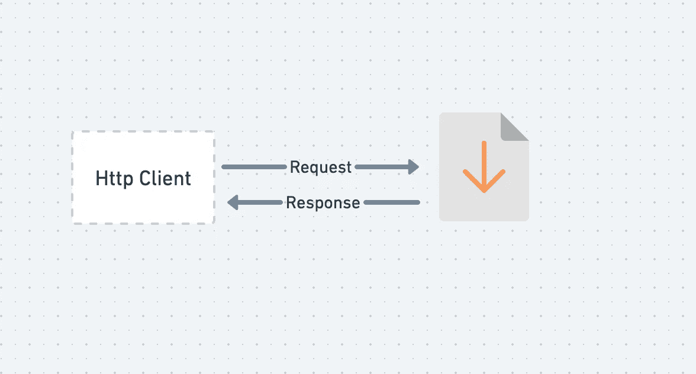

# 如何用 Java 构建 HttpClient 下载文件

> 原文：<https://levelup.gitconnected.com/how-to-build-httpclient-in-java-to-download-file-7085c2b6a3d0>

## 构建 HTTP 客户端下载图像和 PDF 等文件。

## 介绍

*   在本文中，我们将构建一个从互联网下载文件的 HTTP 客户端。
*   我们将为此演示下载图像文件和 pdf 文件，但我们可以将其扩展到任何类型的文件。
*   仅供参考，这段代码需要 Java 11，因为我们将使用 Java 11 中添加的 HttpClient。

## 构建请求对象

*   首先，我们将构建 HTTP GET 请求。HttpRequest 遵循构建器模式。

## 构建 HttpClient 对象

*   之后，我们将构建 httpclient 并执行以获得响应。由于响应由文件组成，我们需要像 InputStream 一样传递 bodyhandlers 来读取文件。

## 写入本地文件

*   写入本地文件很容易，我们可以使用 FileOutputStream 来写。这里我们将内容作为输入流。

## 下载图像客户端

*   我们正在下载端点“https://miro . medium . com/max/864/1 * edetjtqydwavqdaimiwxww . png”
*   因为我们正在下载图像，所以响应正文包含 inputstream。
*   一旦有了 inputstream，我们就可以写入本地磁盘。

## 下载 PDF 客户端

*   同样，我们也可以下载 PDF 文件，代码看起来将完全一样的图像文件。

## 结论

*   在本文中，我们使用 Java 11 HttpClient 下载图像和 pdf 文件。BodyHandler 提供了不同的方法来处理响应体，对于文件，我们可以使用 InputStream
*   我们可以使用这种方法下载任何类型的文件。

## 额外小费

*   如果你想提高你的 Java 技能，你绝对应该看看 [***这门最畅销的课程***](https://click.linksynergy.com/link?id=FAaRt1BJn8w&offerid=1060092.533682&type=2&murl=https%3A%2F%2Fwww.udemy.com%2Fcourse%2Fjava-the-complete-java-developer-course%2F)

> 下面连线上[**LinkedIn**](https://www.linkedin.com/in/suraj-mishra-16b515a4)如果你喜欢这篇文章，请查看更多@[**https://asyncq.com/**](https://asyncq.com/)