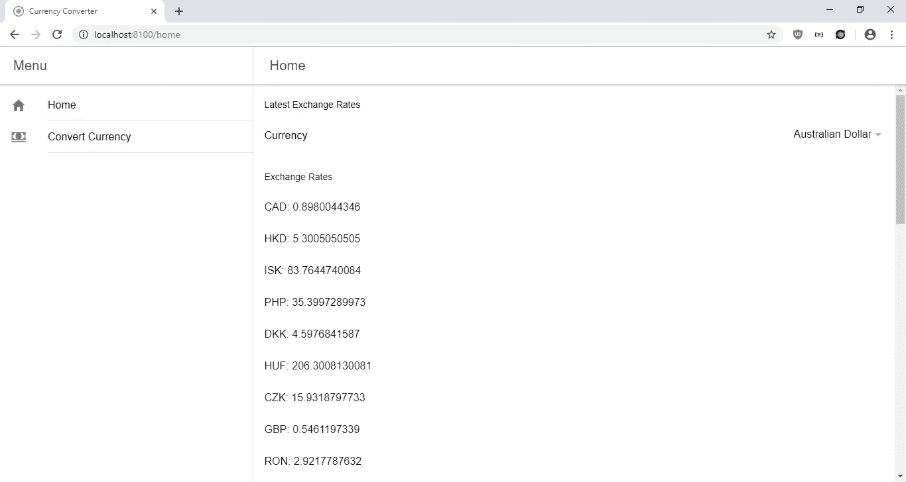
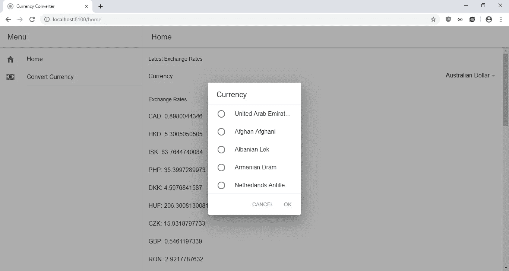

# 如何用 React 构建 Ionic 应用

> 原文：<https://levelup.gitconnected.com/how-to-build-ionic-apps-with-react-73963c6a0fc0>


塞巴斯蒂安·皮克勒在 [Unsplash](https://unsplash.com?utm_source=medium&utm_medium=referral) 上的照片

有了最新版本的 Ionic framework，一个让你用 web 技术编写移动应用的工具，你就可以用 React 来构建你的移动应用了。在 v4 之前，Ionic 只为 Angular 提供组件，但现在 React 已经完全支持组件。

Ionic 4 是一个手机 app 框架，也是一个组件库。您可以构建移动应用程序、渐进式 web 应用程序和普通 web 应用程序。组件库也可以单独使用。当然，如果您愿意，硬件支持仍然可供您使用。

Ionic 的 React 版本的完整参考资料位于 https://ionicframework.com/docs 的。

在本文中，我们将使用 Ionic 构建一个 React web 应用程序来进行货币兑换。主页将显示最新的汇率列表，另一页将有一个表格来转换您选择的货币。为了获得数据，我们使用位于[https://exchangeratesapi.io/](https://exchangeratesapi.io/)的外汇汇率 API。我们使用位于[https://openexchangerates.org/](https://openexchangerates.org/)的公开汇率 API 来获取货币列表。

## 入门指南

首先，我们将安装 Ionic CLI。我们运行:

```
npm install -g ionic@latest
```

接下来，我们运行:

```
ionic start currency-converter --type=react
```

然后我们选择 Sidenav 选项来创建一个带有左侧栏的 Ionic 项目。

我们还需要安装一些其他的软件包。我们需要 Axios 进行 HTTP 请求，需要 MobX 进行状态管理。在我们的项目文件夹中运行`npm i axios mobx mobx-react`来安装它们。

现在我们准备创建一些页面。在`pages`文件夹中，创建`ConvertCurrencyPage.jsx`并添加:

```
import {
  IonButtons,
  IonContent,
  IonHeader,
  IonItem,
  IonList,
  IonMenuButton,
  IonPage,
  IonTitle,
  IonToolbar,
  IonInput,
  IonLabel,
  IonSelect,
  IonSelectOption,
  IonButton
} from "[@ionic/react](http://twitter.com/ionic/react)";import React from "react";
import { observer } from "mobx-react";
import { getExchangeRates } from "../requests";const ConvertCurrencyPage = ({ currenciesStore }) => {
  const [fromCurrencies, setFromCurrencies] = React.useState({});
  const [toCurrencies, setToCurrencies] = React.useState({});
  const [values, setValues] = React.useState({ amount: 0 } as any);
  const [submitting, setSubmitting] = React.useState(false);
  const [toAmount, setToAmount] = React.useState(0);const convertCurrency = async () => {
    setSubmitting(true);
    if (values.amount <= 0 || !values.from || !values.to) {
      return;
    }
    const { data } = await getExchangeRates(values.from);
    const rate = data.rates[values.to];
    setToAmount(values.amount * rate);
  };React.useEffect(() => {
    const fromCurrencies = {};
    for (let key in currenciesStore.currencies) {
      if (key != values.to) {
        fromCurrencies[key] = currenciesStore.currencies[key];
      }
    }
    setFromCurrencies(fromCurrencies);const toCurrencies = {};
    for (let key in currenciesStore.currencies) {
      if (key != values.from) {
        toCurrencies[key] = currenciesStore.currencies[key];
      }
    }
    setToCurrencies(toCurrencies);
  }, [currenciesStore.currencies, values.from, values.to]);return (
    <IonPage>
      <IonHeader>
        <IonToolbar>
          <IonButtons slot="start">
            <IonMenuButton />
          </IonButtons>
          <IonTitle>Convert Currency</IonTitle>
        </IonToolbar>
      </IonHeader><IonContent>
        <IonList lines="none">
          <IonItem>
            <IonInput
              type="number"
              value={values.amount}
              color={!values.amount && submitting ? "danger" : undefined}
              min="0"
              onIonChange={ev =>
                setValues({ ...values, amount: (ev.target as any).value })
              }
            ></IonInput>
          </IonItem><IonItem>
            <IonLabel>Currency to Convert From</IonLabel>
            <IonSelect
              placeholder="Select One"
              color={!values.from && submitting ? "danger" : undefined}
              onIonChange={ev =>
                setValues({ ...values, from: (ev.target as any).value })
              }
            >
              {Object.keys(fromCurrencies).map(key => {
                return (
                  <IonSelectOption value={key} key={key}>
                    {(fromCurrencies as any)[key]}
                  </IonSelectOption>
                );
              })}
            </IonSelect>
          </IonItem><IonItem>
            <IonLabel>Currency to Convert To</IonLabel>
            <IonSelect
              placeholder="Select One"
              color={!values.to && submitting ? "danger" : undefined}
              onIonChange={ev =>
                setValues({ ...values, to: (ev.target as any).value })
              }
            >
              {Object.keys(toCurrencies).map(key => {
                return (
                  <IonSelectOption value={key} key={key}>
                    {(toCurrencies as any)[key]}
                  </IonSelectOption>
                );
              })}
            </IonSelect>
          </IonItem><IonItem>
            <IonButton size="default" fill="solid" onClick={convertCurrency}>
              Convert
            </IonButton>
          </IonItem>{toAmount ? (
            <IonItem>
              {values.amount} {values.from} is {toAmount} {values.to}.
            </IonItem>
          ) : (
            undefined
          )}
        </IonList>
      </IonContent>
    </IonPage>
  );
};export default observer(ConvertCurrencyPage);
```

这添加了一个将货币从一种货币转换成另一种货币的表单。在此表单中，我们通过从第一个下拉列表中排除要兑换的货币，并从第二个下拉列表中排除要兑换的货币，按选择进行筛选。此外，我们还有一个用于转换金额的`ion-input`。我们从`currenciesStore`中获取货币的值，这是 MobX 存储，从它获取货币列表。在`IonSelect`组件中，我们将`onIonChange`属性设置为设置下拉列表值的处理函数。我们还为所有输入和选择设置了占位符。在`IonInput`组件中，我们对`onIonChange`处理程序做同样的事情。我们通过在变更事件期间使用在`values`对象中设置的变量来显示正确的值。

当用户点击 Convert 时，我们运行`convertCurrency`函数。在运行其余代码之前，我们检查这些值是否设置正确。如果成功，那么我们运行从`requests.js`导入的`getExchangeRates`函数，然后我们通过将比率乘以金额来设置最终的`toAmount`。

`useEffect`回调用于从待兑换货币列表中排除待兑换货币，反之亦然。第二个参数`useEffect`中的数组指定要监视哪些值。

最后一行中的`observer`函数用于指定组件监视来自 MobX 存储的最新值。

接下来在`Home.tsx`中，我们将现有代码替换为:

```
import {
  IonButtons,
  IonContent,
  IonHeader,
  IonItem,
  IonLabel,
  IonList,
  IonListHeader,
  IonMenuButton,
  IonPage,
  IonTitle,
  IonToolbar,
  IonSelect,
  IonSelectOption
} from "[@ionic/react](http://twitter.com/ionic/react)";
import React from "react";
import "./Home.css";
import { getExchangeRates } from "../requests";
import { CurrencyStore } from "../stores";
import { observer } from "mobx-react";const HomePage = ({ currencyStore, currenciesStore }) => {
  const [rates, setRates] = React.useState({});const getRates = async () => {
    const { data } = await getExchangeRates(
      (currencyStore as CurrencyStore).currency
    );
    setRates(data.rates);
  };React.useEffect(() => {
    getRates();
  }, [(currencyStore as CurrencyStore).currency]);
  return (
    <IonPage>
      <IonHeader>
        <IonToolbar>
          <IonButtons slot="start">
            <IonMenuButton />
          </IonButtons>
          <IonTitle>Home</IonTitle>
        </IonToolbar>
      </IonHeader>
      <IonContent>
        <IonList lines="none">
          <IonListHeader>Latest Exchange Rates</IonListHeader> <IonItem>
            <IonLabel>Currency</IonLabel>
            <IonSelect
              placeholder="Select One"
              onIonChange={ev => {
                (currencyStore as CurrencyStore).setCurrency(
                  ev.target && (ev.target as any).value
                );
              }}
            >
              {Object.keys(currenciesStore.currencies).map(key => {
                return (
                  <IonSelectOption
                    value={key}
                    key={key}
                    selected={
                      (currencyStore as CurrencyStore).currency
                        ? key == (currencyStore as CurrencyStore).currency
                        : key == "AUD"
                    }
                  >
                    {(currenciesStore.currencies as any)[key]}
                  </IonSelectOption>
                );
              })}
            </IonSelect>
          </IonItem>
        </IonList> <IonList lines="none">
          <IonListHeader>Exchange Rates</IonListHeader>
          {Object.keys(rates).map(key => {
            console.log(rates);
            return (
              <IonItem>
                {key}: {rates[key]}
              </IonItem>
            );
          })}
        </IonList>
      </IonContent>
    </IonPage>
  );
};export default observer(HomePage);
```

在这个文件中，我们显示了来自 API 的汇率。我们从`currenciesStore`中获取货币，这样用户就可以看到基于不同货币的汇率。这些物品显示在 Ionic 提供的`IonList`中。

最后一行中的`observer`函数用于指定组件监视来自 MobX 存储的最新值。

接下来在`App.tsx`中，将以下代码替换为:

```
import React from "react";
import { Redirect, Route } from "react-router-dom";
import { IonApp, IonRouterOutlet, IonSplitPane } from "[@ionic/react](http://twitter.com/ionic/react)";
import { IonReactRouter } from "[@ionic/react-router](http://twitter.com/ionic/react-router)";
import { AppPage } from "./declarations";import Menu from "./components/Menu";
import Home from "./pages/Home";
import { home, cash } from "ionicons/icons";/* Core CSS required for Ionic components to work properly */
import "[@ionic/react](http://twitter.com/ionic/react)/css/core.css";/* Basic CSS for apps built with Ionic */
import "[@ionic/react](http://twitter.com/ionic/react)/css/normalize.css";
import "[@ionic/react](http://twitter.com/ionic/react)/css/structure.css";
import "[@ionic/react](http://twitter.com/ionic/react)/css/typography.css";/* Optional CSS utils that can be commented out */
import "[@ionic/react](http://twitter.com/ionic/react)/css/padding.css";
import "[@ionic/react](http://twitter.com/ionic/react)/css/float-elements.css";
import "[@ionic/react](http://twitter.com/ionic/react)/css/text-alignment.css";
import "[@ionic/react](http://twitter.com/ionic/react)/css/text-transformation.css";
import "[@ionic/react](http://twitter.com/ionic/react)/css/flex-utils.css";
import "[@ionic/react](http://twitter.com/ionic/react)/css/display.css";/* Theme variables */
import "./theme/variables.css";
import ConvertCurrencyPage from "./pages/ConvertCurrencyPage";
import { CurrencyStore, CurrenciesStore } from "./stores";
import { getCurrenciesList } from "./requests";const currencyStore = new CurrencyStore();
const currenciesStore = new CurrenciesStore();const appPages: AppPage[] = [
  {
    title: "Home",
    url: "/home",
    icon: home
  },
  {
    title: "Convert Currency",
    url: "/convertcurrency",
    icon: cash
  }
];const App: React.FC = () => {
  const [initialized, setInitialized] = React.useState(false); const getCurrencies = async () => {
    const { data } = await getCurrenciesList();
    currenciesStore.setCurrencies(data);
    setInitialized(true);
  };React.useEffect(() => {
    if (!initialized) {
      getCurrencies();
    }
  }); return (
    <IonApp>
      <IonReactRouter>
        <IonSplitPane contentId="main">
          <Menu appPages={appPages} />
          <IonRouterOutlet id="main">
            <Route
              path="/home"
              render={() => (
                <Home
                  currencyStore={currencyStore}
                  currenciesStore={currenciesStore}
                />
              )}
              exact={true}
            />
            <Route
              path="/convertcurrency"
              render={() => (
                <ConvertCurrencyPage
                  currenciesStore={currenciesStore}
                />
              )}
              exact={true}
            />
            <Route exact path="/" render={() => <Redirect to="/home" />} />
          </IonRouterOutlet>
        </IonSplitPane>
      </IonReactRouter>
    </IonApp>
  );
};export default App;
```

我们修改了路由，因此我们使用了`render`属性而不是`component`属性，因为我们想要将我们的 MobX 存储传递到组件中。存储区包含当前为主页选择的货币以及两个页面的货币列表。

我们在这里获取/设置两个组件的货币列表。

接下来，在`src`文件夹中创建`requests.ts`并添加:

```
const axios = require('axios');
const APIURL = '[https://api.exchangeratesapi.io'](https://api.exchangeratesapi.io');
const OPEN_EXCHANGE_RATES_URL = '[http://openexchangerates.org/api/currencies.json'](http://openexchangerates.org/api/currencies.json');export const getExchangeRates = (baseCurrency: string) => axios.get(`${APIURL}/latest?base=${baseCurrency}`)export const getCurrenciesList = () => axios.get(OPEN_EXCHANGE_RATES_URL)
```

这是发出 HTTP 请求以获取货币和汇率的代码。

接下来创建`store.ts`并添加:

```
import { observable, action } from "mobx";class CurrencyStore {
    [@observable](http://twitter.com/observable) currency: string = 'AUD'; [@action](http://twitter.com/action) setCurrency(currency: string) {
        this.currency = currency;
    }
}class CurrenciesStore {
    [@observable](http://twitter.com/observable) currencies = {}; [@action](http://twitter.com/action) setCurrencies(currencies) {
        this.currencies = currencies;
    }
}export { CurrencyStore, CurrenciesStore };
```

`CurrencyStore`用于在主页中存储所选货币，并显示基于所选货币的汇率。`currency`是主页观察到的值，`setCurrency`设置货币值。类似地，`CurrenciesStore`存储在`App.tsx`中检索的货币列表，其中`setCurrencies`被调用。

接下来在`tsconfig.json`中，我们将现有代码替换为:

```
{
  "compilerOptions": {
      "experimentalDecorators": true,
    "target": "es5",
    "lib": [
      "dom",
      "dom.iterable",
      "esnext"
    ],
    "allowJs": true,
    "skipLibCheck": true,
    "esModuleInterop": true,
    "allowSyntheticDefaultImports": true,
    "strict": true,
    "forceConsistentCasingInFileNames": true,
    "module": "esnext",
    "moduleResolution": "node",
    "resolveJsonModule": true,
    "isolatedModules": true,
    "noEmit": true,
    "jsx": "preserve",
    "noImplicitAny": false
  },
  "include": [
    "src"
  ]
}
```

这将改变`noImplicitAny`并将其设置为`true`。

所有的艰苦工作完成后，我们得到:

