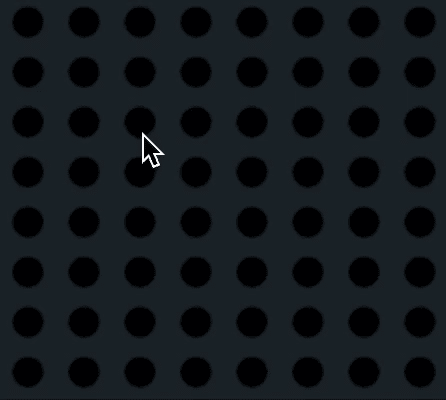

# 如何用 React、HTML 和 CSS 构建日语 GO

> 原文：<https://levelup.gitconnected.com/how-to-build-japanese-go-with-react-html-and-css-d28f21041dec>

这一次，完整的模型太大，无法放在我的白板上，所以我用一个缩小的模型来代替:


我刚刚在我的街机网站上推出了日本围棋。

既然我已经完成了另一个项目，是时候完成另一篇文章了。

如果您愿意，可以查看实际代码:

[](https://github.com/Clashbuster/tarcade) [## 粉碎/粉碎

### 一个有很多网络游戏的网站。通过在…上创建帐户，为 Clashbuster/tarcade 开发做出贡献

github.com](https://github.com/Clashbuster/tarcade) 

# 本次实施的目标

*   教人如何用编程做实事。
*   固化自己的学习。这对我来说是一个具有挑战性的项目，我知道接受它会有好处。
*   制作很酷的东西

# 让我们直接跳进来吧

日本围棋的传统尺寸是 19x19，但也经常看到 13x13 和 6x6 的棋盘。

规则非常简单，但是随着游戏状态的增长，游戏变得无限复杂。

每个玩家轮流在他们喜欢的任何交叉点上一次放置一块石头。

经验丰富的玩家总是出白棋，经验不足的玩家总是出黑棋。黑方总是先走，白方以 6.5 的基础分开始游戏。这条规则被称为 komi，它的存在是因为在 19x19 的棋盘上先走有一种天然的优势，大约相当于 6 分。

这个游戏是老兵友好的。如果一个新玩家和一个中级玩家比赛，这通常是一场淘汰赛，所以当玩家的排名不均衡时，通常会使用一系列的差点规则。最常见的是放弃科米规则，让玩家以偶数分数开始。

之后，通常允许经验较少的玩家在玩家同意的情况下开始尽可能多的移动(通过允许他们自由放置一定数量的石头)。)

# **捕捉**

放置的每块石头周围都有一定数量的开放交叉点，代表其安全性。如果任何一颗石头的所有正交相邻交叉点都被对方的石头覆盖，那么这颗有问题的石头就会被捕获并从棋盘上移走。所有捕获的石头都算作对手的点数。


一次抓捕

连接在一起的相同颜色的石头共享交叉点，因此它们一起生一起死。然而，只有当它们的连接严格正交时，它们才被认为是一个群。



群组捕获

# **Ko**

为了防止无限循环，玩家不允许立即重新获得在下面演示的星座中刚刚用于捕获的有风险的石头。如果他们想重新占领，他们必须先在别的地方比赛，这样进攻球员就可以防守他们想要的位置。


Ko 演示

# **领地**

游戏以这种方式继续，直到双方都同意没有更有意义的行动。在这一点上，赢家要么是不言而喻的，要么玩家可以计算他们的士兵保护的领土，这也相当于点。

领土是通过计算由特定玩家的石头保护的开放交叉点来评分的。从技术上来说，只有当交叉路口受到一队士兵的保护时，领土点才会被计算在内。中立区域是没有明确所有者的交叉点。


一个红色区域、一个蓝色区域和一个中性交叉点

此外，任何留在领地内的不安全士兵都会被自动捕获，并被视为“死石”

剩下的士兵被认为是安全的还是不安全的取决于它的团队有多少只眼睛。任何留在一个领域中只有一只眼睛的士兵群组都被视为死亡，任何有两只或更多眼睛的群组都是安全的，然后会被视为领域中的领域。这个规则是隐含的，因为任何只有一只眼睛的士兵仍然可以在任何时候被俘虏。


一只眼睛的团体在领地内是不安全的。


这个蓝色群组是安全的，因为它有一只以上的眼睛，所以会获得 4 个领域点数。

# **关**

最后，有一个叫做 Seki 的规则，这是一种评估一个群体的安全和领土的方法。Seki 描述了一种情况，一群士兵没有两只眼睛，但他们仍然是安全的，因为他们组成的星座对任何一个玩家参与都是不利的。

考虑以下状态:


关星座

在这种情况下，士兵被认为是安全的，除非有外力作用于他们。这在最后的游戏得分中仍然是正确的，因为即使红队或蓝队决定在眼睛里面比赛，后面的玩家也能立即捕捉到。

# **实现和意想不到的智慧**

起初，我认为制作这个游戏会非常困难，因为我必须考虑所有这些星座，并编写逻辑来处理它们。

当我在这个项目中工作时，我发现我在这一点上是完全错误的，也是正确的。这个游戏非常具有挑战性，但出于不同的原因。

有一个组成游戏的基础机制集(一次放置一块石头，捕获，不自杀)，只要那些基础机制集一直工作，大多数星座就成为隐含特征。

然而，尽管有所减少，但要使基本的机制始终工作，证明比预期的更具挑战性。我认为像这样的小智慧在项目工作中是无价的，这也是我喜欢这样做的原因之一。

# **我要否决的事情**

结束游戏领域得分。我对此做了大量的研究，虽然最终的游戏区域评分是可能的，但目前还没有已知的方法可以 100%准确地静态评分。

即使是业内最好的方法也是在十多年前发明的。

最常见和有效的处理游戏结束得分的方法是强迫玩家在游戏结束时关闭领域，反过来，使领域更加明确，但即使这样也有许多眼睛或眼睛喜欢识别。即使这样，关也可以变得无限复杂。

在大多数非职业游戏中，赢家是显而易见的，所以否决最终得分仍然允许我们建立一个可玩的围棋版本。

# **渲染**

游戏是用 react 组件的矩阵呈现的。每列有 19 个 go 列和 19 个 go 单元。我是这样构建的:

```
this*.*boardModel = this*.generateFirstModel*()*let* newboardrender=[]*for*(*let* x=0; x < this*.boardModel.*length; x++){*let* newColumn=[]// *console.log(this.boardModel[x])**for*(*let* y=0; y < this*.*boardModel[x]*.*length; y++){if(this*.*boardModel[x][y][0] === 1){*newColumn.push*(<GoCell *indentifier*={1} *dropper*={this*.*dropper} *coordinates*={[x,y]}></GoCell>)} else if(this*.*boardModel[x][y][0] === 2){*newColumn.push*(<GoCell *indentifier*={2} *dropper*={this*.*dropper} *coordinates*={[x,y]}></GoCell>)} else {*newColumn.push*(<GoCell *indentifier*={0} *dropper*={this*.*dropper} *coordinates*={[x,y]}></GoCell>)}}*newboardrender.push*(<GoColumn *column*={newColumn}></GoColumn>)}*return* newboardrender
```

在每个回合执行结束时，我用从更新的模型创建的新渲染替换该渲染。

# **模型**

我用一个 19x19 的三维矩阵来模拟这个游戏。第三维是必要的，因为我想不出更好的方法来跟踪访问和 ko 状态。

每个 go 单元格都由一个数组表示，其中第一个索引是 0、2 或 1。这告诉模型这个单元格要么是 1 号玩家，要么是 2 号玩家，要么是空的。

第二个索引是 0 或 1，它告诉模型在洪水填充递归搜索期间是否访问过该单元。

第三个索引是 0 或 1，它是一个 ko 标记。如果一个单元格被标记为 ko，捕获它是无效的移动。

它最终看起来像这样:


当玩家点击一个 GoCell 时，这个单元格会将自己的坐标传递给父组件，由我来完成所有的逻辑。

之后，回合分两个阶段执行。首先，有一个模拟回合，对两个条件之一进行一系列检查。

第一个检查是看是否所有相邻的位置都属于一个对手。如果是这样，它将检查是否有任何相邻的组被捕获。然后，它检查是否有任何被捕获的石头被标记为 ko。如果这出戏是自杀而没有俘虏，那么这步棋是无效的。如果捕获有 ko 标记的石头，移动无效。

我识别一群士兵和他们的开放路口的方法是通过运行一个四方向的洪水填充递归算法。该算法接受组标识符和坐标。一旦它发现传入的坐标与组标识符匹配并且没有被访问过，它就将其标记为已访问过。然后，它将坐标放入一个被访问的堆栈中，并为每个基本方向返回 1 +一个递归调用。

在每次调用 flood-fill 算法时，它都会运行相邻的空单元格检查。与每个组 id 标记的单元正交相邻的任何空单元被标记并放入“空访问堆栈”

重要的是，空的已访问堆栈和组识别堆栈是不同的，因为我们从不需要在一个回合中多次重新标记组识别单元，但是我们需要在一个回合中多次重新标记空的已访问单元。

这是因为我们不想在单个组检查期间重新访问开放的相邻交叉口，但我们需要检查在同一转弯期间可能共享一个空交叉口的其他组。下图描述了这种情况:


我们可以看到，右边的组有正确标记的士兵和他们的开放交叉点，但是 26 是与另一个相邻组共享的开放交叉点，在这一轮也需要检查。

我们需要标记空的交叉路口，因为否则，右边的小组将会两次标记开放的单元 47。

我已经为我的 stack 类创建了一个类函数，这个类函数可以管理堆栈并重置那些单元格的访问状态。在我们检查这一轮中放置的棋子的下一个正交方向之前，我在空的已访问堆栈上调用这个方法。下一个检查评估如下:


一般的已访问堆栈不会被清空，但空的已访问堆栈会。您还会注意到，有一个捕获堆栈，它严格地跟踪正在检查的当前组中的单元格。捕获堆栈也将在每次新的正交检查之前清空自身。

捕获堆栈的唯一目的是处理一个捕获。在任何检查中，如果算法发现有一组士兵有 0 个开放的交叉点，它将浏览捕获堆栈，并将所有这些位置标记为空。

一旦算法识别了状态或处理了正交相邻的每个组的状态，它就清除所有的堆栈，重新呈现棋盘，并开始下一个玩家的回合。

现在我们有了。可以在我们的浏览器上玩的日本围棋。

# 为什么是所有的书库？

他们很快。

栈数据结构对于候选组是理想的，因为如果该组不满足捕获所需的标准，清空栈是 O(1)操作。

否则，浏览堆栈以重置已访问状态的时间为 O(n ),其中 n 是该轮已访问的单元数。循环通过电路板以重置已访问状态始终至少为 O(361)。考虑到大多数回合只会访问 4-15 个单元，使用堆栈会更快。

即使有一个插入堆栈的操作，然后另一个操作为每个单元掠过堆栈，它仍然减少了每轮的总操作数，每轮最多 2000 次。

# 结论

好了，这就是我今天的全部时间。下次见。

我计划继续在我的网站上发布游戏，直到我得到想雇用我的人的注意，所以期待更多的到来。