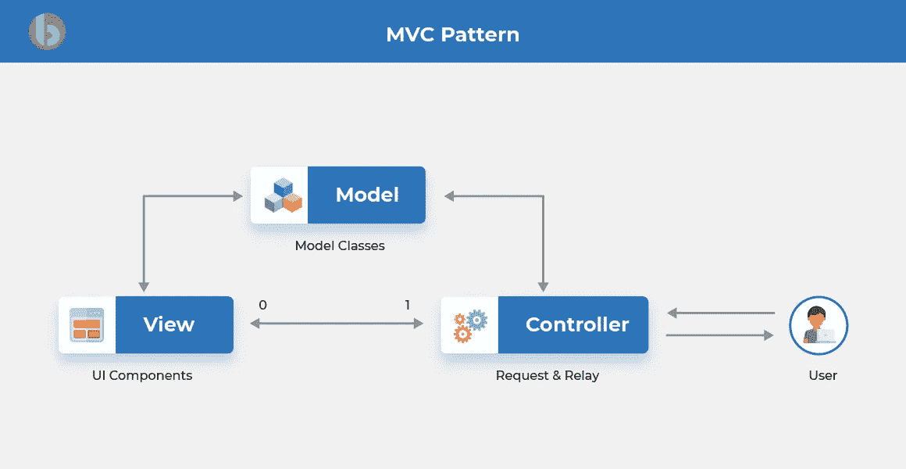

# 如何使用 Vue 和 Golang 构建新闻聚合网站

> 原文：<https://levelup.gitconnected.com/how-to-build-news-aggregator-website-using-vue-and-golang-a48999001238>

在上一篇文章中，我们已经研究了如何构建一个 web scraper 来从各种金融新闻网站中提取新闻并将其存储到数据库中(如果您还没有，请点击[此处](https://medium.com/@wm_7an888/web-scraping-and-task-scheduling-with-golang-da0421abd04c))。今天，我们将探讨如何使用 Vue(前端)和 Golang(后端)构建一个新闻聚合网站，将新闻存储在数据库中。

**让我们先看看后端。**

我们将采用 MVC 框架来构建后端服务器。那么什么是 MVC 呢？

来自 https://www.bacancytechnology.com/blog/mvc-vs-mvp-vs-mvvm[的](https://www.bacancytechnology.com/blog/mvc-vs-mvp-vs-mvvm)

**模型**:对应用户使用的数据相关逻辑。表示在视图和控制器之间传输的数据。一个客户对象从数据库中检索客户信息，操作它并把它更新回数据库

**视图**:用于应用的所有 UI 逻辑。客户视图包括用户交互的 UI 组件，如文本字段、下拉框等。

**控制器**:模型和视图之间的接口，用于处理业务逻辑和传入请求，使用模型组件操纵数据，并与视图交互以呈现最终输出。客户控制器处理来自视图的所有交互和输入，并使用模型更新数据库。

然而，由于我们要分离前端和后端，我们可以放开视图部分，只关注模型和控制器。

我们将构建两个 API 路径:检索新闻和运行 web 抓取。

1.  **获取新闻文章列表的方法**

由于数据库中会有很多新闻文章，我们将构建控制器来接收 URL 参数中的以下输入:

a)来源:允许用户根据新闻网站过滤新闻提要

b) Limit:在每个请求调用中返回最大数量的新闻文章

c)以前的 ID 和以前发布的日期时间:按照以前发布的日期时间和以前的 ID 的降序编写 SQL 脚本。通过使用以前的 ID 和以前发布的日期时间进行过滤，我们可以返回比以前已经检索到的文章“更早”的文章。这允许我们稍后构建一个无限滚动的页面。

控制器和模型

在 SQL 中有几种检索数据列表的方法，我认为其中一种常见的方法是使用 limit 关键字:

*SELECT * FROM articles ORDER BY published _ at desc 限制 0，10；*

上述查询将从位置 0 返回 10 篇文章，文章以 published_at 降序排列。它照常工作，给你正确的输出。

但是，当有数百万条记录时，以及当您想从位置 10，000 开始时(例如)，会有一个性能问题。这是因为在这种方法中，表格将被逐行扫描，直到位置 10，000，并且当我们想要从稍后的位置开始时，将花费长得多的时间。

可以向上阅读[http://allyouneedisback end . com/blog/2017/09/24/the-SQL-I-love-part-1-scanning-large-table/](http://allyouneedisbackend.com/blog/2017/09/24/the-sql-i-love-part-1-scanning-large-table/)了解更多。因此，我们将使用键集分页方法，根据以前的 ID 和以前发布的日期时间进行过滤，以实现更快的执行时间。

2.**帖子方法触发新闻网站的抓取**

我们还允许用户选择新闻来源来开始新闻网站的网络搜集。由于网页抓取可能需要一段时间，当用户想要抓取所有新闻网站时，可能会导致很长的等待时间。因此，我们将引入 goroutine 来允许执行并发运行，以缩短总的执行时间。

**什么是 goroutine？**

Goroutine 可以被认为是轻量级线程。它是可以并发运行的函数或方法。要在 golang 中实现 goroutine，只需在函数前添加关键字 *go* 即可。

然而，我们必须记住，每次 goroutine 执行仍然会消耗资源(如 CPU、内存等),尽管与其他编程语言相比要少一些。这就是为什么限制 goroutine 的数量很重要，以避免同时运行太多 go routine 任务而导致资源耗尽。

为此，我们将使用 goroutines 和通道实现一个工人池。

使用 goroutines 和通道的工人池

在这个方法中，我们将首先对 source ID 进行一些预处理，以确保传入的所有源 ID 都是有效的。然后，我们将创建 worker 方法，从而接收 sourceID 通道并在结果通道上发送相应的结果。

在这里，我们定义了 4 个工人数，这些工人最初被阻止，因为还没有收到工作。然后，我们遍历处理过的源 ID 来发送作业，并关闭通道以表明这是我们所有的工作。最后，我们将收集结果。

换句话说，我们将有 4 个 goroutine 并发运行。假设我们有 10 个作业要运行，goroutine 工作线程将选择前 4 个作业并发运行，一旦其中一个工作线程完成，它将选择第 5 个作业和后续作业，如此重复，直到所有 10 个作业都完成。

我们完成了我们的 API，完成了 2 条路线。你可以参考下面的链接来获得完整的代码库。

来源:https://github.com/wilsontwm/goinvest

**前端使用 Vue**

我们将在一个类似于 Pinterest 的布局中构建一个新闻提要，其中有显示缩略图和标题的新闻提要卡片。将有无限的滚动，用户滚动到底部，它会自动扫描下一篇文章。

此外，我们将构建一个允许用户选择新闻来源的过滤器和一个运行 web 爬行的按钮。

我再一次推荐 [Vuetify](https://vuetifyjs.com/en/) (一个材料设计框架)，我以前用过它，因为它无疑加快了我的开发过程，而不必设计和开发每个组件。

新闻聚合网站的屏幕截图

新闻提要的主要代码库

首先，我们将构建一个包含所有硬编码新闻源的<select>下拉列表，选择的新闻源将被存储为 selectedNewsSources 。为了不在下拉列表中显示所有新闻来源的名称，我们还添加了一些逻辑，以便在选择的数量超过 2 时显示“全部”或“+( < number > others)”。除此之外，我们还添加了一个列表项操作，允许用户切换选择来选择/取消选择所有新闻源。</select>

然后，我们需要一个方法来触发 API 调用，从 Golang 后端服务器检索新闻数据，如 *applySearch* 方法所示。收到数据后，我们将存储最后一篇文章的 ID 和发布日期，以便我们可以扫描从这篇文章开始的下一篇文章。

类似地，我们还添加了 submitCrawlNews 来触发 API 调用，以启动 web 爬行功能。这在很大程度上取决于我们在下拉列表中所做的选择。

主体是我们显示新闻提要的地方。当我们从 API 响应中收到文章数据时，我们会将它们添加到*news*和中，然后我们会遍历数组中的每个元素来显示新闻。

另外，请注意，我们添加了一个事件，当在 *mounted* 方法中到达窗口底部时，该事件将触发搜索。

要调用 API 的端点

从上面的摘录中，我们可以看到有两个端点:获取新闻列表和触发网络抓取；一个是 GET 方法，另一个是 POST 方法。对于 GET 方法，我们获取输入并将它们连接成查询参数字符串，而对于 POST 方法，我们将输入转换成 JSON 格式。随后，我们调用 fetch 方法向我们的后端服务器发送网络请求，并返回响应或错误。

来源:https://github.com/wilsontwm/my-investing-vue

我们基本上完成了我们的前端和后端。我们现在能够通过分别为我们的后端和前端服务器运行' *go run main.go'* 或' *npm run serve'* ,在本地托管它。

接下来，我们将考虑在云上托管它们。

敬请期待…干杯！