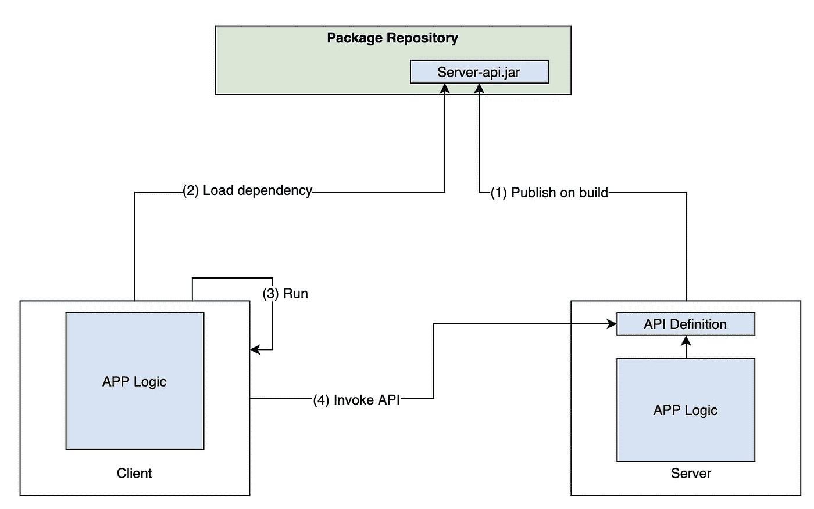

# 如何在 Spring Boot 使用 Feign 构建一个 REST API 客户端

> 原文：<https://levelup.gitconnected.com/how-to-build-rest-api-client-using-feign-in-spring-boot-50db38289420>

照片由[约书亚·阿拉贡](https://unsplash.com/@goshua13?utm_source=medium&utm_medium=referral)在 [Unsplash](https://unsplash.com?utm_source=medium&utm_medium=referral) 拍摄

您通过 API 构建和公开其功能的服务必须由某个客户端使用。这个客户端可能是一个浏览器应用程序，也可能是另一个需要与您的应用程序交互的后端服务。在唯一的客户端是浏览器应用程序的情况下，您不需要做任何额外的事情来简化需要在客户端完成的工作。

然而，当客户端是另一种服务，并且是基于 Java 的服务时，那么你可以通过使用一种我们将在本文中讨论的常见技术来相当地简化客户端。

假设您正在构建一个 API，它允许您使用一个公共类— `FileMetadata`来加载和存储文件。

如果我们公开一个`FileApi`，它有一些使用注释定义的端点，最终目标是让客户端能够调用这个 API，就像说`FileApi.getFile()`一样简单。

对服务器的 HTTP 调用以及一些重试逻辑将从客户端抽象出来。

此外，如果服务器端的任何端点发生变化，客户端会在**编译时**而不是在**运行时**意识到这一点。

为此，我们将在客户端和服务器端使用一个流行的库，名为 [Feign](https://github.com/OpenFeign/feign) 。

> 此外，我们可以有选择地组织**服务器**项目，当它被构建时，产生 2 个 jar 文件——一个包含所有的服务数据，另一个只包含 API 定义。这样，客户机将只依赖于第二个带有 API 定义的 jar 文件，而第一个 jar 将用于运行服务器。这可以通过在您的服务器项目中引入一个子项目来实现，这个子项目可以包含所有的 API 定义。

我们也可以将项目作为一个单独的 jar 来构建和运行，但是因为客户端需要加载整个 jar 来定义 API，所以不鼓励这样做。

然而，无论使用哪种方式，当您更新服务器的 API 时，您都需要同时发布服务器和客户端，以防出现重大更改。但是，当您将客户机设置为使用最新的服务器 jar 时，如果对新更新的 API 的调用没有更新，客户机应用程序就不会构建。

这意味着我们在编译时发现并解决问题，如果可能的话，这总是首选。

下图给出了上述整个流程的概述。

数据流动

## 假装入门

Feign 是一个库，允许你声明性地访问不同的 API。它使用关于构建 API 的`JAX-RS`规范中指定的注释工作。

`JAX-RS`只是一个用 Java 实现 REST web 服务的规范。它带有一些定义好的注释，如`[@Path](http://twitter.com/Path)`、`[@GET](http://twitter.com/GET)`、`[@POST](http://twitter.com/POST)`等。，这与我们在构建弹簧控制器时看到的类似。`JAX-RS`有几个实现，其中之一是`Jersey`——一个构建 REST APIs 的框架。

在我们的例子中，我们使用 Spring Boot，它自带了构建 REST APIs 的规范(Spring MVC 注释，如`[@RequestMapping](http://twitter.com/RequestMapping)`、`[@GetMapping](http://twitter.com/GetMapping)`、`[@PostMapping](http://twitter.com/PostMapping)`、`[@PathVariable](http://twitter.com/PathVariable)`等)。).所以为了使用 Feign 和定义 API，我们将使用`spring-cloud-starter-openfeign`库，它提供了对 Spring MVC 注释的支持。

我们需要将这个依赖项和`spring-cloud-dependencies`一起添加到我们的项目中，如下所示:

在我们能够使用 Feign 之前，我们需要修改我们以前定义的 API，用使用的 Spring MVC 注释定义一个接口，然后注册一个实现该接口的 bean，如下面的代码所示。

注意，我们必须确保`FileController`将在 Spring 中注册为控制器 bean，因此我们必须使用`[@RestController](http://twitter.com/RestController)()`注释该类。下面的两个代码片段演示了这一点。

根据这一变化，我们仍然可以使用 Postman 或另一个客户端来使用 API。

不同之处在于，我们现在提取了一个带有 API 规范的接口，Feign 可以使用它。现在您知道了，Feign 允许您通过简单地指定一个接口并使用`JAX-RS`注释(在我们的例子中是 Spring MVC 注释，因为我们添加了`spring-cloud-starter-openfeign`依赖项)来构建声明式客户端。

构建假后台 API 非常简单，如下面的代码所示。这个方法将是一个工厂类的一部分，这个工厂类可以是服务器 API 子项目的一部分，但是我们将在一分钟后讨论它。

1.  它需要服务的 URL，如下所示静态地指定它并不是一个好主意，相反，您应该通过一个环境变量传递该 URL。为了简单起见，它是静态定义的。
2.  为了让 Feign 识别 Spring MVC 注释，您必须指定要使用的契约为`SpringMvcContract`。
3.  指定的目标是您之前定义的实际接口。

## 编码器和解码器

这个简单的假装配置不允许您发送类型安全的请求体，也不完全允许您检索类型安全的响应。

如果服务器有一个预定义的 POJO 作为要反序列化的请求体结构，或者当服务器返回一个 POJO 作为响应时，您可能会遇到序列化和反序列化问题。

在我们的例子中，我们使用了一个`FileMetadata`类，它也使用了`LocalDateTime`。序列化&反序列化`LocalDateTime`需要特别小心。由于这个原因，我们必须指导 Feign 如何处理这个问题。我们通过指定额外的配置来做到这一点— **编码器&解码器**。

我们将使用 Jackson 来处理序列化和反序列化，所以我们可以通过指定一个自定义的`ObjectMapper`来使用`feign.jackson.JacksonEncoder`和`feign.jackson.JacksonDecoder`。

因为在我们的应用程序中我们有自定义的日期格式，我们需要定义自定义的`LocalDateTimeSerializer`和`LocalDateTimeDeerializer`来处理特定的日期格式，将它们注册到自定义的`Module`中，并将其添加到自定义的`ObjectMapper`中，如下所示。

## 同步和异步 API 调用

我们通过 Feign 定义的 API 是同步的——这意味着它阻塞了对服务器的调用。Feign 还允许我们轻松地定义异步 APIs 利用幕后的`CompletableFutures`。

为此，我们需要为我们的`FilesAPI`定义另一个接口，它将返回`CompletableFutures`，并使用上述方法将其绑定为异步 FeignAPI。

Feign 库提供了`AsyncFeign`，我们可以像使用`Feign`构造一样使用它。

在服务器的子项目中定义了所有这些之后，您就可以发布 jar 并在客户端代码中使用它了。

下面的代码展示了一个简单的客户端应用程序，它依赖于服务器 API 的已发布 jar。

看起来 API 是客户端中的某个类，我们正在调用这个类。

假装让它变得如此简单！

感谢您的阅读，希望这篇文章对您有用。

当心