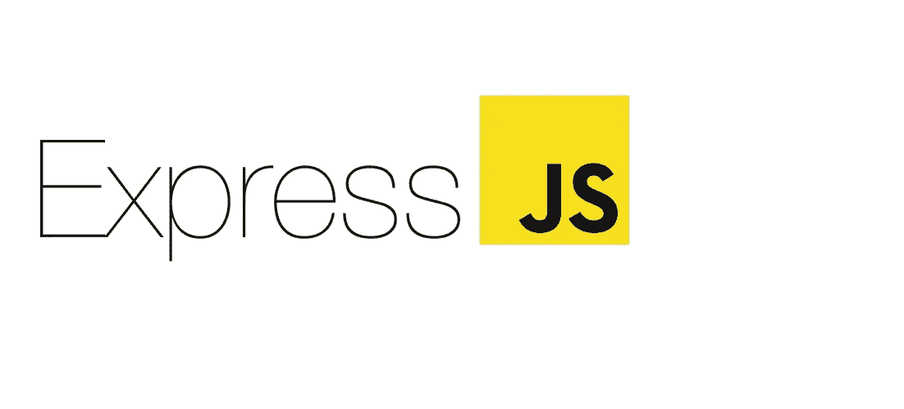

# 如何用 NodeJS 和 Express 构建 RESTFul APIs

> 原文：<https://levelup.gitconnected.com/how-to-build-restful-api-with-nodejs-and-express-475bfb6bedff>

## 学习如何用 Node 和 **Express** 构建一个 **REST API**



图片由 Expressjs.com 拍摄

REST(表述性状态转移)是一种软件架构风格，被创建来指导万维网架构的设计和开发。REST 为互联网规模的分布式超媒体系统(如 Web)的架构应该如何表现定义了一组约束。

简单来说，REST 允许两个计算机系统通过 HTTP web 协议进行通信。REST 非常方便，尤其是当我们想要构建 RESTFul 的 API 时。

## **入门**

要启动并运行，您需要在开发环境中安装 NodeJS。Nodejs 将使我们能够在服务器上编写和执行 JavaScript 代码。

对于本文，我们将使用一个称为 Expressjs 的 Nodejs 框架。Express 是一个简单的、极简的框架，但在用 Nodejs 构建应用程序时功能强大。

## **初始化项目**

首先，我们需要初始化一个新项目，我们的开发环境将在这里运行。导航到您想要作为您的开发服务器的目录，并运行下面的命令。

**NPM**

```
npm init
```

根据您的工作环境和偏好，系统会提示您输入一些信息。

如果您想跳过初始化过程，您可以提供如下所示的`-y`标志。

NPM

```
npm init -y
```

## **安装 Expressjs**

现在我们有了我们的应用程序框架，我们需要安装和配置 express。根据您首选的软件包管理器，您可以使用以下命令安装 Express。

**NPM**

```
npm i express
```

**纱线**

```
yarn add express
```

上面的命令将在我们的开发环境中安装 express。

## **配置 Expressjs**

现在我们已经在开发系统中安装了 expressjs，现在我们想要配置它来开始开发我们的 RESTFul API。

在你的根目录下，创建一个文件夹，命名为 ***src*** 。在 ***src*** 文件夹内，创建一个文件，命名为 index.js，这将是我们应用实例的入口点。

在 ***index.js*** 文件内部，包含以下代码。

代码上的注释解释了正在发生的事情。

现在，要运行您的应用程序，您需要打开您的开发终端并运行命令。

```
node src/index.js
```

现在，在您的浏览器上导航到***http://localhost:3000/***，您将看到我们的应用程序显示。

我们将在根目录中包含入口点文件 index.js，但是为了对我们的逻辑和关注点进行分组，我们将它放在了 ***src*** 文件夹中。

## **发送 JSON 响应**

到目前为止，我们已经看到了如何向客户机发送普通的字符串信息。当我们想发送一个 JSON 类型的响应给客户端时呢？

这也很方便，尤其是当我们希望用户获取信息并将其显示在各种应用程序实例上时。如果您曾经在构建应用程序时使用过 API，那么这对您来说可能非常简单。

Express 使我们能够通过 JSON (data)方法发送 JSON 数据。它接受数组或对象形式的数据，并将其转换成 JSON 数据。

**简单的例子**

假设我们有一些与各个国家相关的数据，我们想将这些数据以 JSON 格式发送给客户机。

我们可以利用这一点，如下面的代码片段所示。

现在，当我们的客户机对 home 端点执行 get 请求时，他将获得我们提供的数据的 JSON 信息。您可以通过重启您的开发服务器并检查您的 [http://localhost:3000/](http://localhost:3000/) 来测试这一点。

## **配置 CORS(跨源资源共享)**

现在我们的应用程序已经启动并运行，客户端可以执行 get 请求并获得数据的 JSON 响应。需要注意的是，不是每个人都能访问 JSON 响应信息。我们的服务器可能会阻止一些人获取信息。

为了管理它并允许任何系统上的每个人访问信息，我们需要设置 CORS 来允许来自任何域或服务器的请求。

我们将利用一个叫做 CORS 的方案。

在您的开发终端上，运行以下命令来安装 cors。

```
npm i cors
```

## **配置 CORS**

现在，我们的请求可以不受限制地提供给任何域或服务器上的任何人。

## **结论**

Express 为构建应用程序提供了一个简单的设置。它的另一面也很强大，有一个很棒的社区随时准备加入并帮助我们。

感谢您花时间通读这篇文章。

## **更多阅读量**

[](/how-to-add-dark-mode-to-your-nuxtjs-project-d8f016c2211f) [## 如何在你的 NuxtJS 项目中加入黑暗模式

### 如何用@nuxtjs/color-mode 和 tailwindCSS 给一个 Nuxt.js 网站添加黑暗模式

levelup.gitconnected.com](/how-to-add-dark-mode-to-your-nuxtjs-project-d8f016c2211f) [](/my-struggles-as-a-programmer-7bf1e1bf344d) [## 我作为程序员的挣扎。

### 一个程序员的日常生活奋斗。

levelup.gitconnected.com](/my-struggles-as-a-programmer-7bf1e1bf344d)